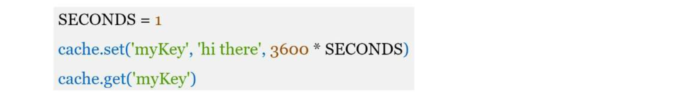
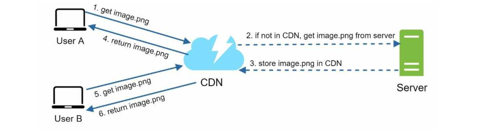
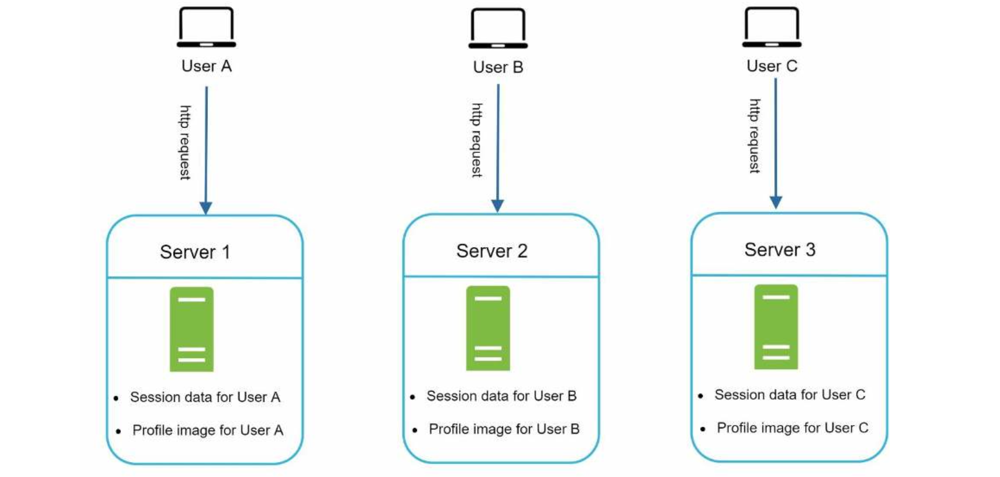

| English | Vietnamese |
|---------|------------|
| **CHAPTER 1: SCALE FROM ZERO TO MILLIONS OF USERS** | **CHƯƠNG 1: MỞ RỘNG TỪ ZERO ĐẾN HÀNG TRIỆU NGƯỜI DÙNG** |
| Designing a system that supports millions of users is challenging, and it is a journey that requires continuous refinement and endless improvement. | Việc thiết kế một hệ thống hỗ trợ hàng triệu người dùng là một thách thức, và đó là một hành trình đòi hỏi sự tinh chỉnh liên tục và cải tiến không ngừng. |
| In this chapter, we build a system that supports a single user and gradually scale it up to serve millions of users. | Trong chương này, chúng ta sẽ xây dựng một hệ thống hỗ trợ một người dùng duy nhất và dần dần mở rộng để phục vụ hàng triệu người dùng. |
| After reading this chapter, you will master a handful of techniques that will help you to crack the system design interview questions. | Sau khi đọc chương này, bạn sẽ nắm vững một số kỹ thuật giúp bạn chinh phục các câu hỏi phỏng vấn thiết kế hệ thống. |
| English | Vietnamese |
|---------|------------|
| **Single server setup** | **Cấu hình máy chủ đơn** |
| A journey of a thousand miles begins with a single step, and building a complex system is no different. | Hành trình ngàn dặm bắt đầu từ một bước đi nhỏ, và việc xây dựng một hệ thống phức tạp cũng không khác gì. |
| To start with something simple, everything is running on a single server. | Để bắt đầu với điều gì đó đơn giản, mọi thứ sẽ chạy trên một máy chủ duy nhất. |
| Figure 1-1 shows the illustration of a single server setup where everything is running on one server: web app, database, cache, etc. | Hình 1-1 minh họa cấu hình máy chủ đơn, nơi mọi thứ đều chạy trên một máy chủ: ứng dụng web, cơ sở dữ liệu, bộ nhớ đệm, v.v. |

| English | Vietnamese |
|---------|------------|
| To understand this setup, it is helpful to investigate the request flow and traffic source. | Để hiểu cấu hình này, sẽ hữu ích nếu tìm hiểu luồng yêu cầu và nguồn lưu lượng truy cập. |
| Let us first look at the request flow (Figure 1-2)

| English | Vietnamese |
|---------|------------|
| 1. Users access websites through domain names, such as api.mysite.com. Usually, the Domain Name System (DNS) is a paid service provided by 3rd parties and not hosted by our servers. | 1. Người dùng truy cập các trang web thông qua tên miền, chẳng hạn như api.mysite.com. Thông thường, Hệ thống Tên miền (DNS) là một dịch vụ trả phí do bên thứ ba cung cấp và không được lưu trữ trên máy chủ của chúng ta. |
| 2. Internet Protocol (IP) address is returned to the browser or mobile app. In the example, IP address 15.125.23.214 is returned. | 2. Địa chỉ Giao thức Internet (IP) được trả về cho trình duyệt hoặc ứng dụng di động. Trong ví dụ, địa chỉ IP 15.125.23.214 được trả về. |
| 3. Once the IP address is obtained, Hypertext Transfer Protocol (HTTP) [1] requests are sent directly to your web server. | 3. Sau khi có được địa chỉ IP, các yêu cầu Giao thức Truyền tải Siêu văn bản (HTTP) [1] sẽ được gửi trực tiếp đến máy chủ web của bạn. |
| 4. The web server returns HTML pages or JSON response for rendering. | 4. Máy chủ web trả về các trang HTML hoặc phản hồi JSON để hiển thị. |
| Next, let us examine the traffic source. The traffic to your web server comes from two sources: web application and mobile application. | Tiếp theo, hãy xem xét nguồn lưu lượng. Lưu lượng truy cập vào máy chủ web của bạn đến từ hai nguồn: ứng dụng web và ứng dụng di động. |
| • Web application: it uses a combination of server-side languages (Java, Python, etc.) to handle business logic, storage, etc., and client-side languages (HTML and JavaScript) for presentation. | • Ứng dụng web: nó sử dụng kết hợp các ngôn ngữ phía máy chủ (Java, Python, v.v.) để xử lý logic nghiệp vụ, lưu trữ, v.v., và các ngôn ngữ phía khách (HTML và JavaScript) cho việc trình bày. |
| • Mobile application: HTTP protocol is the communication protocol between the mobile app and the web server. JavaScript Object Notation (JSON) is commonly used API response format to transfer data due to its simplicity. An example of the API response in JSON format is shown below: | • Ứng dụng di động: giao thức HTTP là giao thức giao tiếp giữa ứng dụng di động và máy chủ web. Định dạng Ghi chú Đối tượng JavaScript (JSON) thường được sử dụng làm định dạng phản hồi API để truyền dữ liệu vì tính đơn giản của nó. Một ví dụ về phản hồi API ở định dạng JSON được hiển thị bên dưới: |
| GET /users/12 – Retrieve user object for id = 12 | GET /users/12 – Lấy đối tượng người dùng với id = 12 |

| English | Vietnamese |
|---------|------------|
| **Database** | **Cơ sở dữ liệu** |
| With the growth of the user base, one server is not enough, and we need multiple servers: one for web/mobile traffic, the other for the database (Figure 1-3). | Với sự gia tăng của số lượng người dùng, một máy chủ là không đủ, và chúng ta cần nhiều máy chủ: một cho lưu lượng web/di động, và một cho cơ sở dữ liệu (Hình 1-3). |
| Separating web/mobile traffic (web tier) and database (data tier) servers allows them to be scaled independently. | Việc tách biệt máy chủ xử lý lưu lượng web/di động (tầng web) và máy chủ cơ sở dữ liệu (tầng dữ liệu) cho phép chúng có thể mở rộng một cách độc lập. |

| English | Vietnamese |
|---------|------------|
| Which databases to use? You can choose between a traditional relational database and a non-relational database. Let us examine their differences. | Nên sử dụng cơ sở dữ liệu nào? Bạn có thể chọn giữa cơ sở dữ liệu quan hệ truyền thống và cơ sở dữ liệu phi quan hệ. Hãy cùng xem xét sự khác biệt của chúng. |
| Relational databases are also called a relational database management system (RDBMS) or SQL database. The most popular ones are MySQL, Oracle database, PostgreSQL, etc. | Cơ sở dữ liệu quan hệ còn được gọi là hệ quản trị cơ sở dữ liệu quan hệ (RDBMS) hoặc cơ sở dữ liệu SQL. Những hệ thống phổ biến nhất là MySQL, Oracle Database, PostgreSQL, v.v. |
| Relational databases represent and store data in tables and rows. You can perform join operations using SQL across different database tables. | Cơ sở dữ liệu quan hệ biểu diễn và lưu trữ dữ liệu trong các bảng và hàng. Bạn có thể thực hiện các phép nối (join) bằng SQL giữa các bảng dữ liệu khác nhau. |
| Non-Relational databases are also called NoSQL databases. Popular ones are CouchDB, Neo4j, Cassandra, HBase, Amazon DynamoDB, etc. These databases are grouped into four categories: key-value stores, graph stores, column stores, and document stores. Join operations are generally not supported in non-relational databases. | Cơ sở dữ liệu phi quan hệ còn được gọi là cơ sở dữ liệu NoSQL. Các hệ thống phổ biến gồm CouchDB, Neo4j, Cassandra, HBase, Amazon DynamoDB, v.v. Những cơ sở dữ liệu này được chia thành bốn loại: lưu trữ key-value, lưu trữ đồ thị, lưu trữ dạng cột và lưu trữ tài liệu. Thông thường, cơ sở dữ liệu phi quan hệ không hỗ trợ các phép nối (join). |
| For most developers, relational databases are the best option because they have been around for over 40 years and historically, they have worked well. However, if relational databases are not suitable for your specific use cases, it is critical to explore beyond relational databases. | Đối với hầu hết các nhà phát triển, cơ sở dữ liệu quan hệ là lựa chọn tốt nhất vì chúng đã tồn tại hơn 40 năm và trong lịch sử hoạt động rất hiệu quả. Tuy nhiên, nếu cơ sở dữ liệu quan hệ không phù hợp với các trường hợp sử dụng cụ thể của bạn, điều quan trọng là phải khám phá các lựa chọn ngoài cơ sở dữ liệu quan hệ. |
| Non-relational databases might be the right choice if: | Cơ sở dữ liệu phi quan hệ có thể là lựa chọn phù hợp nếu: |
| • Your application requires super-low latency. | • Ứng dụng của bạn yêu cầu độ trễ cực thấp. |
| • Your data are unstructured, or you do not have any relational data. | • Dữ liệu của bạn không có cấu trúc, hoặc bạn không có dữ liệu quan hệ. |
| • You only need to serialize and deserialize data (JSON, XML, YAML, etc.). | • Bạn chỉ cần tuần tự hóa và giải tuần tự dữ liệu (JSON, XML, YAML, v.v.). |
| • You need to store a massive amount of data. | • Bạn cần lưu trữ một lượng dữ liệu khổng lồ. |

| English | Vietnamese |
|---------|------------|
| Vertical scaling vs horizontal scaling | Mở rộng theo chiều dọc so với mở rộng theo chiều ngang |
| Vertical scaling, referred to as “scale up”, means the process of adding more power (CPU, RAM, etc.) to your servers. Horizontal scaling, referred to as “scale-out”, allows you to scale by adding more servers into your pool of resources. | Mở rộng theo chiều dọc, được gọi là “scale up”, có nghĩa là quá trình bổ sung thêm sức mạnh (CPU, RAM, v.v.) cho máy chủ của bạn. Mở rộng theo chiều ngang, được gọi là “scale-out”, cho phép bạn mở rộng bằng cách thêm nhiều máy chủ hơn vào nhóm tài nguyên của mình. |
| When traffic is low, vertical scaling is a great option, and the simplicity of vertical scaling is its main advantage. Unfortunately, it comes with serious limitations. | Khi lưu lượng thấp, mở rộng theo chiều dọc là một lựa chọn tuyệt vời, và sự đơn giản của nó là ưu điểm chính. Tuy nhiên, nó đi kèm với những hạn chế nghiêm trọng. |
| • Vertical scaling has a hard limit. It is impossible to add unlimited CPU and memory to a single server. | • Mở rộng theo chiều dọc có một giới hạn cứng. Không thể thêm vô hạn CPU và bộ nhớ vào một máy chủ duy nhất. |
| • Vertical scaling does not have failover and redundancy. If one server goes down, the website/app goes down with it completely. | • Mở rộng theo chiều dọc không có tính năng dự phòng và chuyển đổi khi lỗi xảy ra. Nếu một máy chủ gặp sự cố, trang web/ứng dụng sẽ ngừng hoạt động hoàn toàn theo. |
| Horizontal scaling is more desirable for large scale applications due to the limitations of vertical scaling. | Do những hạn chế của mở rộng theo chiều dọc, mở rộng theo chiều ngang là lựa chọn phù hợp hơn cho các ứng dụng quy mô lớn. |
| In the previous design, users are connected to the web server directly. Users will unable to access the website if the web server is offline. In another scenario, if many users access the web server simultaneously and it reaches the web server’s load limit, users generally experience slower response or fail to connect to the server. A load balancer is the best technique to address these problems. | Trong thiết kế trước đây, người dùng kết nối trực tiếp với máy chủ web. Người dùng sẽ không thể truy cập vào trang web nếu máy chủ web ngoại tuyến. Trong một tình huống khác, nếu nhiều người dùng truy cập máy chủ web đồng thời và nó đạt đến giới hạn tải của máy chủ, người dùng thường gặp phải phản hồi chậm hoặc không thể kết nối với máy chủ. Bộ cân bằng tải là kỹ thuật tốt nhất để giải quyết những vấn đề này. |
| English | Vietnamese |
|---------|------------|
| Load balancer | Bộ cân bằng tải |
| A load balancer evenly distributes incoming traffic among web servers that are defined in a load-balanced set. | Bộ cân bằng tải phân phối đều lưu lượng truy cập đến giữa các máy chủ web được định nghĩa trong một tập hợp cân bằng tải. |
| Figure 1-4 shows how a load balancer works. | Hình 1-4 minh họa cách một bộ cân bằng tải hoạt động. |

| English | Vietnamese |
|---------|------------|
| As shown in Figure 1-4, users connect to the public IP of the load balancer directly. With this setup, web servers are unreachable directly by clients anymore. For better security, private IPs are used for communication between servers. A private IP is an IP address reachable only between servers in the same network; however, it is unreachable over the internet. The load balancer communicates with web servers through private IPs. | Như được minh họa trong Hình 1-4, người dùng kết nối trực tiếp đến địa chỉ IP công khai của bộ cân bằng tải. Với cách thiết lập này, các máy chủ web không còn có thể được truy cập trực tiếp bởi khách hàng nữa. Để bảo mật tốt hơn, các địa chỉ IP riêng được sử dụng để giao tiếp giữa các máy chủ. Địa chỉ IP riêng là một địa chỉ chỉ có thể truy cập giữa các máy chủ trong cùng một mạng; tuy nhiên, nó không thể truy cập từ internet. Bộ cân bằng tải giao tiếp với các máy chủ web thông qua các địa chỉ IP riêng. |
| In Figure 1-4, after a load balancer and a second web server are added, we successfully solved no failover issue and improved the availability of the web tier. Details are explained below: | Trong Hình 1-4, sau khi thêm một bộ cân bằng tải và một máy chủ web thứ hai, chúng ta đã giải quyết thành công vấn đề không có cơ chế dự phòng và cải thiện tính khả dụng của tầng web. Chi tiết được giải thích bên dưới: |
| • If server 1 goes offline, all the traffic will be routed to server 2. This prevents the website from going offline. We will also add a new healthy web server to the server pool to balance the load. | • Nếu máy chủ 1 ngừng hoạt động, toàn bộ lưu lượng sẽ được chuyển hướng sang máy chủ 2. Điều này ngăn trang web bị ngừng hoạt động. Chúng ta cũng sẽ thêm một máy chủ web khỏe mạnh mới vào nhóm máy chủ để cân bằng tải. |
| • If the website traffic grows rapidly, and two servers are not enough to handle the traffic, the load balancer can handle this problem gracefully. You only need to add more servers to the web server pool, and the load balancer automatically starts to send requests to them. | • Nếu lưu lượng truy cập trang web tăng nhanh và hai máy chủ không đủ để xử lý, bộ cân bằng tải có thể giải quyết vấn đề này một cách linh hoạt. Bạn chỉ cần thêm nhiều máy chủ hơn vào nhóm máy chủ web, và bộ cân bằng tải sẽ tự động bắt đầu gửi yêu cầu đến chúng. |
| Now the web tier looks good, what about the data tier? The current design has one database, so it does not support failover and redundancy. Database replication is a common technique to address those problems. Let us take a look. | Giờ đây tầng web đã ổn, vậy còn tầng dữ liệu thì sao? Thiết kế hiện tại chỉ có một cơ sở dữ liệu, vì vậy nó không hỗ trợ dự phòng và tính thừa. Sao chép cơ sở dữ liệu là một kỹ thuật phổ biến để giải quyết những vấn đề đó. Hãy cùng xem xét. |
| English | Vietnamese |
|---------|------------|
| Database Replication | Sao chép cơ sở dữ liệu |
| Quoted from Wikipedia: “Database replication can be used in many database management systems, usually with a master/slave relationship between the original (master) and the copies (slaves)” [3]. | Trích từ Wikipedia: “Sao chép cơ sở dữ liệu có thể được sử dụng trong nhiều hệ quản trị cơ sở dữ liệu, thường với mối quan hệ chủ/tớ giữa cơ sở dữ liệu gốc (chủ) và các bản sao (tớ)” [3]. |
| A master database generally only supports write operations. | Một cơ sở dữ liệu chủ thường chỉ hỗ trợ các thao tác ghi. |
| A slave database gets copies of the data from the master database and only supports read operations. | Một cơ sở dữ liệu tớ nhận các bản sao dữ liệu từ cơ sở dữ liệu chủ và chỉ hỗ trợ các thao tác đọc. |
| All the data-modifying commands like insert, delete, or update must be sent to the master database. | Tất cả các lệnh thay đổi dữ liệu như chèn, xóa hoặc cập nhật phải được gửi đến cơ sở dữ liệu chủ. |
| Most applications require a much higher ratio of reads to writes; thus, the number of slave databases in a system is usually larger than the number of master databases. | Hầu hết các ứng dụng yêu cầu tỷ lệ đọc so với ghi cao hơn nhiều; do đó, số lượng cơ sở dữ liệu tớ trong một hệ thống thường lớn hơn số lượng cơ sở dữ liệu chủ. |
| Figure 1-5 shows a master database with multiple slave databases. | Hình 1-5 minh họa một cơ sở dữ liệu chủ với nhiều cơ sở dữ liệu tớ. |

| English | Vietnamese |
|---------|------------|
| Advantages of database replication: | Ưu điểm của sao chép cơ sở dữ liệu: |
| • Better performance: In the master-slave model, all writes and updates happen in master nodes; whereas, read operations are distributed across slave nodes. This model improves performance because it allows more queries to be processed in parallel. | • Hiệu năng tốt hơn: Trong mô hình chủ-tớ, tất cả các thao tác ghi và cập nhật diễn ra trên các nút chủ; trong khi đó, các thao tác đọc được phân phối trên các nút tớ. Mô hình này cải thiện hiệu năng vì cho phép nhiều truy vấn được xử lý song song. |
| • Reliability: If one of your database servers is destroyed by a natural disaster, such as a typhoon or an earthquake, data is still preserved. You do not need to worry about data loss because data is replicated across multiple locations. | • Độ tin cậy: Nếu một trong các máy chủ cơ sở dữ liệu bị hủy hoại bởi thiên tai, chẳng hạn như bão hoặc động đất, dữ liệu vẫn được bảo toàn. Bạn không cần lo lắng về mất dữ liệu vì dữ liệu được sao chép trên nhiều vị trí. |
| • High availability: By replicating data across different locations, your website remains in operation even if a database is offline as you can access data stored in another database server. | • Khả dụng cao: Bằng cách sao chép dữ liệu qua nhiều vị trí khác nhau, trang web của bạn vẫn hoạt động ngay cả khi một cơ sở dữ liệu ngoại tuyến vì bạn có thể truy cập dữ liệu được lưu trong một máy chủ cơ sở dữ liệu khác. |
| In the previous section, we discussed how a load balancer helped to improve system availability. We ask the same question here: what if one of the databases goes offline? The architectural design discussed in Figure 1-5 can handle this case: | Trong phần trước, chúng ta đã thảo luận về cách bộ cân bằng tải giúp cải thiện tính khả dụng của hệ thống. Chúng ta đặt câu hỏi tương tự ở đây: nếu một trong các cơ sở dữ liệu ngoại tuyến thì sao? Thiết kế kiến trúc được thảo luận trong Hình 1-5 có thể xử lý trường hợp này: |
| • If only one slave database is available and it goes offline, read operations will be directed to the master database temporarily. As soon as the issue is found, a new slave database will replace the old one. In case multiple slave databases are available, read operations are redirected to other healthy slave databases. A new database server will replace the old one. | • Nếu chỉ có một cơ sở dữ liệu tớ khả dụng và nó ngoại tuyến, các thao tác đọc sẽ tạm thời được chuyển hướng tới cơ sở dữ liệu chủ. Ngay khi vấn đề được phát hiện, một cơ sở dữ liệu tớ mới sẽ thay thế cơ sở dữ liệu cũ. Trong trường hợp có nhiều cơ sở dữ liệu tớ khả dụng, các thao tác đọc sẽ được chuyển hướng tới các cơ sở dữ liệu tớ còn khỏe mạnh khác. Một máy chủ cơ sở dữ liệu mới sẽ thay thế máy cũ. |
| • If the master database goes offline, a slave database will be promoted to be the new master. All the database operations will be temporarily executed on the new master database. A new slave database will replace the old one for data replication immediately. | • Nếu cơ sở dữ liệu chủ ngoại tuyến, một cơ sở dữ liệu tớ sẽ được thăng hạng trở thành cơ sở dữ liệu chủ mới. Tất cả các thao tác cơ sở dữ liệu sẽ tạm thời được thực hiện trên cơ sở dữ liệu chủ mới. Một cơ sở dữ liệu tớ mới sẽ ngay lập tức thay thế cơ sở dữ liệu cũ để sao chép dữ liệu. |
| In production systems, promoting a new master is more complicated as the data in a slave database might not be up to date. The missing data needs to be updated by running data recovery scripts. Although some other replication methods like multi-masters and circular replication could help, those setups are more complicated; and their discussions are beyond the scope of this book. Interested readers should refer to the listed reference materials [4] [5]. | Trong các hệ thống sản xuất, việc thăng hạng một cơ sở dữ liệu chủ mới phức tạp hơn vì dữ liệu trong cơ sở dữ liệu tớ có thể không được cập nhật đầy đủ. Dữ liệu thiếu cần được cập nhật bằng cách chạy các script phục hồi dữ liệu. Mặc dù một số phương pháp sao chép khác như đa chủ và sao chép vòng tròn có thể hữu ích, nhưng các thiết lập đó phức tạp hơn; và việc thảo luận về chúng nằm ngoài phạm vi của cuốn sách này. Độc giả quan tâm nên tham khảo các tài liệu tham khảo được liệt kê [4] [5]. |
| Figure 1-6 shows the system design after adding the load balancer and database replication. | Hình 1-6 minh họa thiết kế hệ thống sau khi thêm bộ cân bằng tải và sao chép cơ sở dữ liệu. |

| English | Vietnamese |
|---------|------------|
| Let us take a look at the design: | Hãy cùng xem xét thiết kế: |
| • A user gets the IP address of the load balancer from DNS. | • Người dùng nhận địa chỉ IP của bộ cân bằng tải từ DNS. |
| • A user connects the load balancer with this IP address. | • Người dùng kết nối với bộ cân bằng tải bằng địa chỉ IP này. |
| • The HTTP request is routed to either Server 1 or Server 2. | • Yêu cầu HTTP được định tuyến đến Server 1 hoặc Server 2. |
| • A web server reads user data from a slave database. | • Máy chủ web đọc dữ liệu người dùng từ cơ sở dữ liệu tớ. |
| • A web server routes any data-modifying operations to the master database. This includes write, update, and delete operations. | • Máy chủ web định tuyến bất kỳ thao tác thay đổi dữ liệu nào đến cơ sở dữ liệu chủ. Điều này bao gồm các thao tác ghi, cập nhật và xóa. |
| Now, you have a solid understanding of the web and data tiers, it is time to improve the load/response time. This can be done by adding a cache layer and shifting static content (JavaScript/CSS/image/video files) to the content delivery network (CDN). | Bây giờ, bạn đã có hiểu biết vững chắc về tầng web và tầng dữ liệu, đã đến lúc cải thiện thời gian tải/phản hồi. Điều này có thể thực hiện bằng cách thêm một lớp bộ nhớ đệm và chuyển nội dung tĩnh (JavaScript/CSS/hình ảnh/tệp video) lên mạng phân phối nội dung (CDN). |

| English | Vietnamese |
|---------|------------|
| Cache | Bộ nhớ đệm (Cache) |
| A cache is a temporary storage area that stores the result of expensive responses or frequently accessed data in memory so that subsequent requests are served more quickly. | Bộ nhớ đệm là một khu vực lưu trữ tạm thời lưu kết quả của các phản hồi tốn kém hoặc dữ liệu được truy cập thường xuyên trong bộ nhớ, để các yêu cầu tiếp theo được phục vụ nhanh hơn. |
| As illustrated in Figure 1-6, every time a new web page loads, one or more database calls are executed to fetch data. The application performance is greatly affected by calling the database repeatedly. The cache can mitigate this problem. | Như minh họa trong Hình 1-6, mỗi lần một trang web mới tải, một hoặc nhiều cuộc gọi cơ sở dữ liệu được thực hiện để lấy dữ liệu. Hiệu năng ứng dụng bị ảnh hưởng nghiêm trọng khi gọi cơ sở dữ liệu nhiều lần. Bộ nhớ đệm có thể giảm thiểu vấn đề này. |
| Cache tier | Tầng bộ nhớ đệm |
| The cache tier is a temporary data store layer, much faster than the database. | Tầng bộ nhớ đệm là một lớp lưu trữ dữ liệu tạm thời, nhanh hơn nhiều so với cơ sở dữ liệu. |
| The benefits of having a separate cache tier include better system performance, ability to reduce database workloads, and the ability to scale the cache tier independently. | Lợi ích của việc có một tầng bộ nhớ đệm riêng bao gồm cải thiện hiệu năng hệ thống, giảm tải cho cơ sở dữ liệu và khả năng mở rộng tầng bộ nhớ đệm một cách độc lập. |
| Figure 1-7 shows a possible setup of a cache server: | Hình 1-7 minh họa một cấu hình có thể của máy chủ bộ nhớ đệm: |

| English | Vietnamese |
|---------|------------|
| After receiving a request, a web server first checks if the cache has the available response. If it has, it sends data back to the client. If not, it queries the database, stores the response in cache, and sends it back to the client. This caching strategy is called a read-through cache. | Sau khi nhận được một yêu cầu, máy chủ web trước tiên kiểm tra xem bộ nhớ đệm có phản hồi có sẵn hay không. Nếu có, nó gửi dữ liệu trở lại cho khách hàng. Nếu không, nó truy vấn cơ sở dữ liệu, lưu phản hồi vào bộ nhớ đệm và gửi lại cho khách hàng. Chiến lược bộ nhớ đệm này được gọi là read-through cache (bộ nhớ đệm đọc-thông qua). |
| Other caching strategies are available depending on the data type, size, and access patterns. A previous study explains how different caching strategies work [6]. | Các chiến lược bộ nhớ đệm khác có sẵn tùy thuộc vào loại dữ liệu, kích thước và mô hình truy cập. Một nghiên cứu trước đây giải thích cách các chiến lược bộ nhớ đệm khác nhau hoạt động [6]. |
| Interacting with cache servers is simple because most cache servers provide APIs for common programming languages. The following code snippet shows typical Memcached APIs: | Tương tác với các máy chủ bộ nhớ đệm rất đơn giản vì hầu hết các máy chủ bộ nhớ đệm cung cấp API cho các ngôn ngữ lập trình phổ biến. Đoạn mã sau đây minh họa các API điển hình của Memcached: |

| English | Vietnamese |
|---------|------------|
| Considerations for using cache | Những lưu ý khi sử dụng bộ nhớ đệm |
| Here are a few considerations for using a cache system: | Dưới đây là một số lưu ý khi sử dụng hệ thống bộ nhớ đệm: |
| • Decide when to use cache. Consider using cache when data is read frequently but modified infrequently. Since cached data is stored in volatile memory, a cache server is not ideal for persisting data. For instance, if a cache server restarts, all the data in memory is lost. Thus, important data should be saved in persistent data stores. | • Quyết định khi nào nên sử dụng bộ nhớ đệm. Hãy cân nhắc sử dụng bộ nhớ đệm khi dữ liệu được đọc thường xuyên nhưng ít thay đổi. Vì dữ liệu trong bộ nhớ đệm được lưu trong bộ nhớ dễ bay hơi, máy chủ bộ nhớ đệm không thích hợp để lưu dữ liệu lâu dài. Ví dụ, nếu máy chủ bộ nhớ đệm khởi động lại, tất cả dữ liệu trong bộ nhớ sẽ bị mất. Do đó, dữ liệu quan trọng nên được lưu trong các kho dữ liệu bền vững. |
| • Expiration policy. It is a good practice to implement an expiration policy. Once cached data is expired, it is removed from the cache. When there is no expiration policy, cached data will be stored in the memory permanently. It is advisable not to make the expiration date too short as this will cause the system to reload data from the database too frequently. Meanwhile, it is advisable not to make the expiration date too long as the data can become stale. | • Chính sách hết hạn. Thực hiện một chính sách hết hạn là một thực hành tốt. Khi dữ liệu trong bộ nhớ đệm hết hạn, nó sẽ bị xóa khỏi bộ nhớ đệm. Khi không có chính sách hết hạn, dữ liệu trong bộ nhớ đệm sẽ được lưu trữ trong bộ nhớ vĩnh viễn. Không nên đặt thời gian hết hạn quá ngắn vì điều này sẽ khiến hệ thống tải lại dữ liệu từ cơ sở dữ liệu quá thường xuyên. Ngược lại, không nên đặt thời gian hết hạn quá dài vì dữ liệu có thể trở nên lỗi thời. |
| • Consistency: This involves keeping the data store and the cache in sync. Inconsistency can happen because data-modifying operations on the data store and cache are not in a single transaction. When scaling across multiple regions, maintaining consistency between the data store and cache is challenging. For further details, refer to the paper titled “Scaling Memcache at Facebook” published by Facebook [7]. | • Tính nhất quán: Điều này liên quan đến việc giữ cho kho dữ liệu và bộ nhớ đệm đồng bộ. Sự không nhất quán có thể xảy ra vì các thao tác thay đổi dữ liệu trên kho dữ liệu và bộ nhớ đệm không nằm trong cùng một giao dịch. Khi mở rộng trên nhiều khu vực, việc duy trì tính nhất quán giữa kho dữ liệu và bộ nhớ đệm là thách thức. Để biết thêm chi tiết, tham khảo bài báo có tiêu đề “Scaling Memcache at Facebook” được Facebook xuất bản [7]. |
| • Mitigating failures: A single cache server represents a potential single point of failure (SPOF), defined in Wikipedia as follows: “A single point of failure (SPOF) is a part of a system that, if it fails, will stop the entire system from working” [8]. As a result, multiple cache servers across different data centers are recommended to avoid SPOF. Another recommended approach is to overprovision the required memory by certain percentages. This provides a buffer as the memory usage increases. | • Giảm thiểu sự cố: Một máy chủ bộ nhớ đệm duy nhất đại diện cho một điểm lỗi tiềm ẩn (SPOF), được định nghĩa trong Wikipedia như sau: “Một điểm lỗi duy nhất (SPOF) là một phần của hệ thống mà nếu nó bị lỗi, sẽ khiến toàn bộ hệ thống ngừng hoạt động” [8]. Do đó, nên sử dụng nhiều máy chủ bộ nhớ đệm tại các trung tâm dữ liệu khác nhau để tránh SPOF. Một phương pháp được khuyến nghị khác là cấp phát bộ nhớ vượt mức cần thiết theo một tỷ lệ nhất định. Điều này cung cấp bộ đệm khi mức sử dụng bộ nhớ tăng. |

| English | Vietnamese |
|---------|------------|
| • Eviction Policy: Once the cache is full, any requests to add items to the cache might cause existing items to be removed. This is called cache eviction. | • Chính sách loại bỏ: Khi bộ nhớ đệm đầy, bất kỳ yêu cầu nào để thêm mục vào bộ nhớ đệm có thể khiến các mục hiện có bị xóa. Điều này được gọi là loại bỏ bộ nhớ đệm. |
| Least-recently-used (LRU) is the most popular cache eviction policy. Other eviction policies, such as the Least Frequently Used (LFU) or First in First Out (FIFO), can be adopted to satisfy different use cases. | Least-recently-used (LRU) là chính sách loại bỏ bộ nhớ đệm phổ biến nhất. Các chính sách loại bỏ khác, chẳng hạn như Least Frequently Used (LFU) hoặc First in First Out (FIFO), có thể được áp dụng để đáp ứng các trường hợp sử dụng khác nhau. |

| English | Vietnamese |
|---------|------------|
| Content delivery network (CDN) | Mạng phân phối nội dung (CDN) |
| A CDN is a network of geographically dispersed servers used to deliver static content. CDN servers cache static content like images, videos, CSS, JavaScript files, etc. | CDN là một mạng lưới các máy chủ phân tán về mặt địa lý được sử dụng để phân phối nội dung tĩnh. Các máy chủ CDN lưu trữ bộ nhớ đệm các nội dung tĩnh như hình ảnh, video, CSS, các tệp JavaScript, v.v. |
| Dynamic content caching is a relatively new concept and beyond the scope of this book. It enables the caching of HTML pages that are based on request path, query strings, cookies, and request headers. Refer to the article mentioned in reference material [9] for more about this. This book focuses on how to use CDN to cache static content. | Bộ nhớ đệm nội dung động là một khái niệm tương đối mới và nằm ngoài phạm vi của cuốn sách này. Nó cho phép lưu bộ nhớ đệm các trang HTML dựa trên đường dẫn yêu cầu, chuỗi truy vấn, cookie và header yêu cầu. Tham khảo bài viết được đề cập trong tài liệu tham khảo [9] để biết thêm về vấn đề này. Cuốn sách này tập trung vào cách sử dụng CDN để lưu bộ nhớ đệm nội dung tĩnh. |
| Here is how CDN works at the high-level: when a user visits a website, a CDN server closest to the user will deliver static content. Intuitively, the further users are from CDN servers, the slower the website loads. For example, if CDN servers are in San Francisco, users in Los Angeles will get content faster than users in Europe. Figure 1-9 is a great example that shows how CDN improves load time. | Dưới đây là cách CDN hoạt động ở mức cao: khi người dùng truy cập một trang web, máy chủ CDN gần người dùng nhất sẽ phân phối nội dung tĩnh. Trực quan mà nói, người dùng càng ở xa các máy chủ CDN, trang web tải càng chậm. Ví dụ, nếu các máy chủ CDN đặt ở San Francisco, người dùng ở Los Angeles sẽ nhận nội dung nhanh hơn người dùng ở châu Âu. Hình 1-9 là một ví dụ minh họa cách CDN cải thiện thời gian tải. |

| English | Vietnamese |
|---------|------------|
| Figure 1-10 demonstrates the CDN workflow. | Hình 1-10 minh họa luồng công việc của CDN. |

| English | Vietnamese |
|---------|------------|
| 1. User A tries to get image.png by using an image URL. The URL’s domain is provided by the CDN provider. The following two image URLs are samples used to demonstrate what image URLs look like on Amazon and Akamai CDNs: | 1. Người dùng A cố gắng lấy image.png bằng cách sử dụng URL hình ảnh. Tên miền của URL được cung cấp bởi nhà cung cấp CDN. Hai URL hình ảnh sau là ví dụ minh họa URL hình ảnh trên Amazon và Akamai CDN: |
| • https://mysite.cloudfront.net/logo.jpg | • https://mysite.cloudfront.net/logo.jpg |
| • https://mysite.akamai.com/image-manager/img/logo.jpg | • https://mysite.akamai.com/image-manager/img/logo.jpg |
| 2. If the CDN server does not have image.png in the cache, the CDN server requests the file from the origin, which can be a web server or online storage like Amazon S3. | 2. Nếu máy chủ CDN không có image.png trong bộ nhớ đệm, máy chủ CDN sẽ yêu cầu tệp từ nguồn gốc, có thể là máy chủ web hoặc kho lưu trữ trực tuyến như Amazon S3. |
| 3. The origin returns image.png to the CDN server, which includes optional HTTP header Time-to-Live (TTL) which describes how long the image is cached. | 3. Nguồn gốc trả về image.png cho máy chủ CDN, kèm theo header HTTP tùy chọn Time-to-Live (TTL) mô tả thời gian hình ảnh được lưu trong bộ nhớ đệm. |
| 4. The CDN caches the image and returns it to User A. The image remains cached in the CDN until the TTL expires. | 4. CDN lưu hình ảnh vào bộ nhớ đệm và trả lại cho Người dùng A. Hình ảnh sẽ được lưu trong bộ nhớ đệm của CDN cho đến khi TTL hết hạn. |
| 5. User B sends a request to get the same image. | 5. Người dùng B gửi yêu cầu lấy cùng một hình ảnh. |
| 6. The image is returned from the cache as long as the TTL has not expired. | 6. Hình ảnh được trả từ bộ nhớ đệm miễn là TTL chưa hết hạn. |

| English | Vietnamese |
|---------|------------|
| Considerations of using a CDN | Những lưu ý khi sử dụng CDN |
| • Cost: CDNs are run by third-party providers, and you are charged for data transfers in and out of the CDN. Caching infrequently used assets provides no significant benefits so you should consider moving them out of the CDN. | • Chi phí: CDN được vận hành bởi các nhà cung cấp bên thứ ba, và bạn sẽ bị tính phí cho việc truyền dữ liệu vào và ra khỏi CDN. Lưu trữ các tài nguyên ít được sử dụng trong bộ nhớ đệm không mang lại lợi ích đáng kể, vì vậy bạn nên cân nhắc di chuyển chúng ra khỏi CDN. |
| • Setting an appropriate cache expiry: For time-sensitive content, setting a cache expiry time is important. The cache expiry time should neither be too long nor too short. If it is too long, the content might no longer be fresh. If it is too short, it can cause repeat reloading of content from origin servers to the CDN. | • Đặt thời gian hết hạn bộ nhớ đệm phù hợp: Đối với nội dung nhạy cảm về thời gian, việc đặt thời gian hết hạn bộ nhớ đệm là quan trọng. Thời gian hết hạn bộ nhớ đệm không nên quá dài cũng không quá ngắn. Nếu quá dài, nội dung có thể không còn mới. Nếu quá ngắn, nó có thể gây ra việc tải lại nội dung nhiều lần từ máy chủ gốc lên CDN. |
| • CDN fallback: You should consider how your website/application copes with CDN failure. If there is a temporary CDN outage, clients should be able to detect the problem and request resources from the origin. | • Phương án dự phòng CDN: Bạn nên cân nhắc cách website/ứng dụng của mình xử lý khi CDN gặp sự cố. Nếu có sự cố tạm thời với CDN, khách hàng nên có khả năng phát hiện vấn đề và yêu cầu tài nguyên từ máy chủ gốc. |
| • Invalidating files: You can remove a file from the CDN before it expires by performing one of the following operations: | • Loại bỏ tệp: Bạn có thể xóa một tệp khỏi CDN trước khi nó hết hạn bằng cách thực hiện một trong các thao tác sau: |
| • Invalidate the CDN object using APIs provided by CDN vendors. | • Hủy đối tượng CDN bằng cách sử dụng API do nhà cung cấp CDN cung cấp. |
| • Use object versioning to serve a different version of the object. To version an object, you can add a parameter to the URL, such as a version number. For example, version number 2 is added to the query string: image.png?v=2. | • Sử dụng phân phiên bản đối tượng để phục vụ một phiên bản khác của đối tượng. Để phân phiên bản đối tượng, bạn có thể thêm một tham số vào URL, chẳng hạn như số phiên bản. Ví dụ, số phiên bản 2 được thêm vào chuỗi truy vấn: image.png?v=2. |
| Figure 1-11 shows the design after the CDN and cache are added. | Hình 1-11 minh họa thiết kế sau khi thêm CDN và bộ nhớ đệm. |

| English | Vietnamese |
|---------|------------|
| 1. Static assets (JS, CSS, images, etc.,) are no longer served by web servers. They are fetched from the CDN for better performance. | 1. Các tài nguyên tĩnh (JS, CSS, hình ảnh, v.v.) không còn được phục vụ bởi máy chủ web. Chúng được lấy từ CDN để cải thiện hiệu suất. |
| 2. The database load is lightened by caching data. | 2. Tải cơ sở dữ liệu được giảm bớt nhờ việc lưu trữ dữ liệu vào bộ nhớ đệm. |

| English | Vietnamese |
|---------|------------|
| Stateless web tier | Tầng web không trạng thái |
| Now it is time to consider scaling the web tier horizontally. For this, we need to move state (for instance user session data) out of the web tier. A good practice is to store session data in the persistent storage such as relational database or NoSQL. Each web server in the cluster can access state data from databases. This is called stateless web tier. | Bây giờ là lúc xem xét việc mở rộng tầng web theo chiều ngang. Để làm điều này, chúng ta cần chuyển trạng thái (ví dụ dữ liệu phiên người dùng) ra khỏi tầng web. Một thực hành tốt là lưu dữ liệu phiên trong kho lưu trữ bền vững như cơ sở dữ liệu quan hệ hoặc NoSQL. Mỗi máy chủ web trong cụm có thể truy cập dữ liệu trạng thái từ cơ sở dữ liệu. Điều này được gọi là tầng web không trạng thái. |
| Stateful architecture | Kiến trúc có trạng thái |
| A stateful server and stateless server has some key differences. A stateful server remembers client data (state) from one request to the next. A stateless server keeps no state information. Figure 1-12 shows an example of a stateful architecture. | Máy chủ có trạng thái và máy chủ không trạng thái có một số khác biệt chính. Máy chủ có trạng thái ghi nhớ dữ liệu của khách hàng (trạng thái) từ yêu cầu này sang yêu cầu khác. Máy chủ không trạng thái không giữ thông tin trạng thái nào. Hình 1-12 minh họa một ví dụ về kiến trúc có trạng thái. |

| English | Vietnamese |
|---------|------------|
| In Figure 1-12, user A’s session data and profile image are stored in Server 1. To authenticate User A, HTTP requests must be routed to Server 1. If a request is sent to other servers like Server 2, authentication would fail because Server 2 does not contain User A’s session data. Similarly, all HTTP requests from User B must be routed to Server 2; all requests from User C must be sent to Server 3. | Trong Hình 1-12, dữ liệu phiên và hình ảnh hồ sơ của người dùng A được lưu trữ trên Server 1. Để xác thực Người dùng A, các yêu cầu HTTP phải được định tuyến đến Server 1. Nếu một yêu cầu được gửi đến các máy chủ khác như Server 2, việc xác thực sẽ thất bại vì Server 2 không chứa dữ liệu phiên của Người dùng A. Tương tự, tất cả các yêu cầu HTTP từ Người dùng B phải được định tuyến đến Server 2; tất cả các yêu cầu từ Người dùng C phải được gửi đến Server 3. |
| The issue is that every request from the same client must be routed to the same server. This can be done with sticky sessions in most load balancers [10]; however, this adds the overhead. Adding or removing servers is much more difficult with this approach. It is also challenging to handle server failures. | Vấn đề là mọi yêu cầu từ cùng một khách hàng phải được định tuyến đến cùng một máy chủ. Điều này có thể thực hiện bằng sticky sessions trên hầu hết các load balancer [10]; tuy nhiên, cách này sẽ làm tăng chi phí vận hành. Việc thêm hoặc loại bỏ máy chủ trở nên khó khăn hơn với phương pháp này. Đồng thời, việc xử lý sự cố máy chủ cũng gặp nhiều thách thức. |
| Stateless architecture | Kiến trúc không trạng thái |
| Figure 1-13 shows the stateless architecture. | Hình 1-13 minh họa kiến trúc không trạng thái. |

| English | Vietnamese |
|---------|------------|
| In this stateless architecture, HTTP requests from users can be sent to any web servers, which fetch state data from a shared data store. State data is stored in a shared data store and kept out of web servers. A stateless system is simpler, more robust, and scalable. | Trong kiến trúc không trạng thái này, các yêu cầu HTTP từ người dùng có thể được gửi đến bất kỳ máy chủ web nào, các máy chủ này sẽ lấy dữ liệu trạng thái từ kho dữ liệu chia sẻ. Dữ liệu trạng thái được lưu trong kho dữ liệu chia sẻ và không được giữ trên các máy chủ web. Hệ thống không trạng thái đơn giản hơn, mạnh mẽ hơn và dễ mở rộng hơn. |
| Figure 1-14 shows the updated design with a stateless web tier. | Hình 1-14 minh họa thiết kế cập nhật với tầng web không trạng thái. |

| English | Vietnamese |
|---------|------------|
| In Figure 1-14, we move the session data out of the web tier and store them in the persistent data store. The shared data store could be a relational database, Memcached/Redis, NoSQL, etc. The NoSQL data store is chosen as it is easy to scale. Autoscaling means adding or removing web servers automatically based on the traffic load. After the state data is removed out of web servers, auto-scaling of the web tier is easily achieved by adding or removing servers based on traffic load. | Trong Hình 1-14, chúng ta chuyển dữ liệu phiên ra khỏi tầng web và lưu chúng trong kho dữ liệu bền vững. Kho dữ liệu chia sẻ có thể là cơ sở dữ liệu quan hệ, Memcached/Redis, NoSQL, v.v. Kho dữ liệu NoSQL được chọn vì dễ mở rộng. Tự động mở rộng (Autoscaling) nghĩa là tự động thêm hoặc loại bỏ các máy chủ web dựa trên tải lưu lượng. Sau khi dữ liệu trạng thái được loại bỏ khỏi các máy chủ web, việc tự động mở rộng tầng web dễ dàng thực hiện bằng cách thêm hoặc loại bỏ máy chủ dựa trên tải lưu lượng. |
| Your website grows rapidly and attracts a significant number of users internationally. To improve availability and provide a better user experience across wider geographical areas, supporting multiple data centers is crucial. | Website của bạn phát triển nhanh chóng và thu hút một lượng lớn người dùng quốc tế. Để cải thiện khả năng sẵn sàng và cung cấp trải nghiệm người dùng tốt hơn trên khu vực địa lý rộng hơn, việc hỗ trợ nhiều trung tâm dữ liệu là rất quan trọng. |
| Data centers | Trung tâm dữ liệu |
| Figure 1-15 shows an example setup with two data centers. In normal operation, users are geoDNS-routed, also known as geo-routed, to the closest data center, with a split traffic of x% in US-East and (100 – x)% in US-West. geoDNS is a DNS service that allows domain names to be resolved to IP addresses based on the location of a user. | Hình 1-15 minh họa một thiết lập ví dụ với hai trung tâm dữ liệu. Trong hoạt động bình thường, người dùng được định tuyến geoDNS, còn được gọi là định tuyến theo địa lý, tới trung tâm dữ liệu gần nhất, với lưu lượng chia x% ở US-East và (100 – x)% ở US-West. geoDNS là dịch vụ DNS cho phép tên miền được phân giải thành địa chỉ IP dựa trên vị trí của người dùng. |

| English | Vietnamese |
|---------|------------|
| In the event of any significant data center outage, we direct all traffic to a healthy data center. | Trong trường hợp có sự cố lớn ở trung tâm dữ liệu, chúng ta sẽ chuyển toàn bộ lưu lượng đến trung tâm dữ liệu còn hoạt động. |
| In Figure 1-16, data center 2 (US-West) is offline, and 100% of the traffic is routed to data center 1 (US-East). | Trong Hình 1-16, trung tâm dữ liệu 2 (US-West) ngừng hoạt động, và 100% lưu lượng được định tuyến đến trung tâm dữ liệu 1 (US-East). |

| English | Vietnamese |
|---------|------------|
| Several technical challenges must be resolved to achieve multi-data center setup: | Một số thách thức kỹ thuật cần được giải quyết để thiết lập nhiều trung tâm dữ liệu: |
| • Traffic redirection: Effective tools are needed to direct traffic to the correct data center. GeoDNS can be used to direct traffic to the nearest data center depending on where a user is located. | • Chuyển hướng lưu lượng: Cần có các công cụ hiệu quả để định tuyến lưu lượng đến trung tâm dữ liệu chính xác. GeoDNS có thể được sử dụng để định tuyến lưu lượng đến trung tâm dữ liệu gần nhất tùy theo vị trí người dùng. |
| • Data synchronization: Users from different regions could use different local databases or caches. In failover cases, traffic might be routed to a data center where data is unavailable. A common strategy is to replicate data across multiple data centers. A previous study shows how Netflix implements asynchronous multi-data center replication [11]. | • Đồng bộ dữ liệu: Người dùng từ các khu vực khác nhau có thể sử dụng các cơ sở dữ liệu hoặc bộ nhớ đệm cục bộ khác nhau. Trong trường hợp dự phòng, lưu lượng có thể được định tuyến đến trung tâm dữ liệu mà dữ liệu không có sẵn. Một chiến lược phổ biến là sao chép dữ liệu giữa nhiều trung tâm dữ liệu. Một nghiên cứu trước đây cho thấy cách Netflix triển khai sao chép bất đồng bộ giữa nhiều trung tâm dữ liệu [11]. |
| • Test and deployment: With multi-data center setup, it is important to test your website/application at different locations. Automated deployment tools are vital to keep services consistent through all the data centers [11]. | • Kiểm thử và triển khai: Với thiết lập nhiều trung tâm dữ liệu, việc kiểm thử website/ứng dụng tại các vị trí khác nhau là quan trọng. Các công cụ triển khai tự động rất cần thiết để giữ dịch vụ nhất quán qua tất cả các trung tâm dữ liệu [11]. |
| To further scale our system, we need to decouple different components of the system so they can be scaled independently. Messaging queue is a key strategy employed by many real-world distributed systems to solve this problem. | Để mở rộng hệ thống hơn nữa, chúng ta cần tách rời các thành phần khác nhau của hệ thống để chúng có thể mở rộng độc lập. Hàng đợi thông điệp là một chiến lược quan trọng được nhiều hệ thống phân tán thực tế sử dụng để giải quyết vấn đề này. |
| Message queue | Hàng đợi thông điệp |
| A message queue is a durable component, stored in memory, that supports asynchronous communication. It serves as a buffer and distributes asynchronous requests. The basic architecture of a message queue is simple. Input services, called producers/publishers, create messages, and publish them to a message queue. Other services or servers, called consumers/subscribers, connect to the queue, and perform actions defined by the messages. The model is shown in Figure 1-17. | Hàng đợi thông điệp là một thành phần bền vững, lưu trữ trong bộ nhớ, hỗ trợ giao tiếp bất đồng bộ. Nó đóng vai trò như một bộ đệm và phân phối các yêu cầu bất đồng bộ. Kiến trúc cơ bản của hàng đợi thông điệp rất đơn giản. Các dịch vụ đầu vào, gọi là producers/publishers, tạo thông điệp và gửi chúng vào hàng đợi. Các dịch vụ hoặc máy chủ khác, gọi là consumers/subscribers, kết nối với hàng đợi và thực hiện các hành động được định nghĩa trong thông điệp. Mô hình được minh họa trong Hình 1-17. |

| English | Vietnamese |
|---------|------------|
| Decoupling makes the message queue a preferred architecture for building a scalable and reliable application. With the message queue, the producer can post a message to the queue when the consumer is unavailable to process it. The consumer can read messages from the queue even when the producer is unavailable. | Việc tách rời các thành phần làm cho hàng đợi thông điệp trở thành kiến trúc ưu tiên để xây dựng ứng dụng có khả năng mở rộng và đáng tin cậy. Với hàng đợi thông điệp, producer có thể gửi thông điệp vào hàng đợi khi consumer không thể xử lý. Consumer vẫn có thể đọc thông điệp từ hàng đợi ngay cả khi producer không khả dụng. |
| Consider the following use case: your application supports photo customization, including cropping, sharpening, blurring, etc. Those customization tasks take time to complete. In Figure 1-18, web servers publish photo processing jobs to the message queue. Photo processing workers pick up jobs from the message queue and asynchronously perform photo customization tasks. The producer and the consumer can be scaled independently. When the size of the queue becomes large, more workers are added to reduce the processing time. However, if the queue is empty most of the time, the number of workers can be reduced. | Xem xét ví dụ sau: ứng dụng của bạn hỗ trợ tùy chỉnh ảnh, bao gồm cắt, làm sắc nét, làm mờ, v.v. Các tác vụ tùy chỉnh này mất thời gian để hoàn thành. Trong Hình 1-18, các máy chủ web gửi các công việc xử lý ảnh vào hàng đợi thông điệp. Các worker xử lý ảnh lấy công việc từ hàng đợi và thực hiện các tác vụ tùy chỉnh ảnh một cách bất đồng bộ. Producer và consumer có thể mở rộng độc lập. Khi kích thước hàng đợi trở nên lớn, nhiều worker được thêm vào để giảm thời gian xử lý. Tuy nhiên, nếu hàng đợi thường xuyên trống, số lượng worker có thể giảm bớt. |

| English | Vietnamese |
|---------|------------|
| Logging, metrics, automation | Ghi log, đo lường, tự động hóa |
| When working with a small website that runs on a few servers, logging, metrics, and automation support are good practices but not a necessity. However, now that your site has grown to serve a large business, investing in those tools is essential. | Khi làm việc với một website nhỏ chạy trên vài máy chủ, việc hỗ trợ ghi log, đo lường và tự động hóa là các thực hành tốt nhưng không bắt buộc. Tuy nhiên, khi trang web của bạn đã phát triển để phục vụ doanh nghiệp lớn, việc đầu tư vào những công cụ này là cần thiết. |
| Logging: Monitoring error logs is important because it helps to identify errors and problems in the system. You can monitor error logs at per server level or use tools to aggregate them to a centralized service for easy search and viewing. | Ghi log: Giám sát các lỗi là quan trọng vì giúp xác định các lỗi và vấn đề trong hệ thống. Bạn có thể giám sát lỗi ở mức từng máy chủ hoặc sử dụng công cụ để tổng hợp chúng vào dịch vụ tập trung để dễ tìm kiếm và xem. |
| Metrics: Collecting different types of metrics help us to gain business insights and understand the health status of the system. Some of the following metrics are useful: | Đo lường: Thu thập các loại số liệu khác nhau giúp chúng ta có được thông tin kinh doanh và hiểu trạng thái sức khỏe của hệ thống. Một số số liệu sau đây hữu ích: |
| • Host level metrics: CPU, Memory, disk I/O, etc. | • Số liệu mức máy chủ: CPU, bộ nhớ, I/O đĩa, v.v. |
| • Aggregated level metrics: for example, the performance of the entire database tier, cache tier, etc. | • Số liệu tổng hợp: ví dụ, hiệu suất của toàn bộ tầng cơ sở dữ liệu, tầng cache, v.v. |
| • Key business metrics: daily active users, retention, revenue, etc. | • Các số liệu kinh doanh quan trọng: người dùng hoạt động hàng ngày, tỷ lệ giữ chân, doanh thu, v.v. |
| Automation: When a system gets big and complex, we need to build or leverage automation tools to improve productivity. Continuous integration is a good practice, in which each code check-in is verified through automation, allowing teams to detect problems early. Besides, automating your build, test, deploy process, etc. could improve developer productivity significantly. | Tự động hóa: Khi hệ thống trở nên lớn và phức tạp, chúng ta cần xây dựng hoặc sử dụng công cụ tự động hóa để cải thiện năng suất. Tích hợp liên tục là một thực hành tốt, trong đó mỗi lần check-in mã được kiểm tra thông qua tự động hóa, giúp các nhóm phát hiện vấn đề sớm. Bên cạnh đó, tự động hóa quá trình build, test, deploy, v.v. có thể cải thiện đáng kể năng suất của nhà phát triển. |
| Adding message queues and different tools | Thêm hàng đợi thông điệp và các công cụ khác |
| Figure 1-19 shows the updated design. Due to the space constraint, only one data center is shown in the figure. | Hình 1-19 minh họa thiết kế cập nhật. Do giới hạn không gian, chỉ hiển thị một trung tâm dữ liệu trong hình. |
| 1. The design includes a message queue, which helps to make the system more loosely coupled and failure resilient. | 1. Thiết kế bao gồm một hàng đợi thông điệp, giúp hệ thống trở nên lỏng lẻo hơn và chịu lỗi tốt hơn. |
| 2. Logging, monitoring, metrics, and automation tools are included. | 2. Bao gồm các công cụ ghi log, giám sát, đo lường và tự động hóa. |

| English | Vietnamese |
|---------|------------|
| As the data grows every day, your database gets more overloaded. It is time to scale the data tier. | Khi dữ liệu tăng lên mỗi ngày, cơ sở dữ liệu của bạn trở nên quá tải hơn. Đã đến lúc mở rộng tầng dữ liệu. |
| Database scaling | Mở rộng cơ sở dữ liệu |
| There are two broad approaches for database scaling: vertical scaling and horizontal scaling. | Có hai cách tiếp cận chính để mở rộng cơ sở dữ liệu: mở rộng theo chiều dọc và mở rộng theo chiều ngang. |
| Vertical scaling | Mở rộng theo chiều dọc |
| Vertical scaling, also known as scaling up, is the scaling by adding more power (CPU, RAM, DISK, etc.) to an existing machine. There are some powerful database servers. According to Amazon Relational Database Service (RDS) [12], you can get a database server with 24 TB of RAM. This kind of powerful database server could store and handle lots of data. For example, stackoverflow.com in 2013 had over 10 million monthly unique visitors, but it only had 1 master database [13]. However, vertical scaling comes with some serious drawbacks: | Mở rộng theo chiều dọc, còn gọi là scale-up, là việc mở rộng bằng cách tăng thêm sức mạnh (CPU, RAM, DISK, v.v.) cho một máy hiện có. Có những máy chủ cơ sở dữ liệu rất mạnh. Theo Amazon Relational Database Service (RDS) [12], bạn có thể có một máy chủ cơ sở dữ liệu với 24 TB RAM. Máy chủ cơ sở dữ liệu mạnh như vậy có thể lưu trữ và xử lý nhiều dữ liệu. Ví dụ, stackoverflow.com năm 2013 có hơn 10 triệu người dùng duy nhất hàng tháng, nhưng chỉ có 1 cơ sở dữ liệu master [13]. Tuy nhiên, mở rộng theo chiều dọc có một số nhược điểm nghiêm trọng: |
| • You can add more CPU, RAM, etc. to your database server, but there are hardware limits. If you have a large user base, a single server is not enough. | • Bạn có thể thêm CPU, RAM, v.v. vào máy chủ cơ sở dữ liệu, nhưng có giới hạn phần cứng. Nếu bạn có lượng người dùng lớn, một máy chủ đơn là không đủ. |
| • Greater risk of single point of failures. | • Nguy cơ điểm thất bại duy nhất cao hơn. |
| • The overall cost of vertical scaling is high. Powerful servers are much more expensive. | • Chi phí tổng thể của mở rộng theo chiều dọc cao. Máy chủ mạnh tốn kém hơn nhiều. |
| Horizontal scaling | Mở rộng theo chiều ngang |
| Horizontal scaling, also known as sharding, is the practice of adding more servers. Figure 1-20 compares vertical scaling with horizontal scaling. | Mở rộng theo chiều ngang, còn gọi là sharding, là thực hành thêm nhiều máy chủ. Hình 1-20 so sánh mở rộng theo chiều dọc với mở rộng theo chiều ngang. |

| English | Vietnamese |
|---------|------------|
| Sharding separates large databases into smaller, more easily managed parts called shards. Each shard shares the same schema, though the actual data on each shard is unique to the shard. | Sharding tách các cơ sở dữ liệu lớn thành các phần nhỏ hơn, dễ quản lý hơn gọi là shard. Mỗi shard chia sẻ cùng một schema, mặc dù dữ liệu thực tế trên mỗi shard là duy nhất cho shard đó. |
| Figure 1-21 shows an example of sharded databases. User data is allocated to a database server based on user IDs. Anytime you access data, a hash function is used to find the corresponding shard. In our example, user_id % 4 is used as the hash function. If the result equals to 0, shard 0 is used to store and fetch data. If the result equals to 1, shard 1 is used. The same logic applies to other shards. | Hình 1-21 minh họa một ví dụ về cơ sở dữ liệu đã được sharding. Dữ liệu người dùng được phân bổ đến một máy chủ cơ sở dữ liệu dựa trên user ID. Mỗi lần truy cập dữ liệu, một hàm băm được sử dụng để tìm shard tương ứng. Trong ví dụ của chúng ta, user_id % 4 được dùng làm hàm băm. Nếu kết quả bằng 0, shard 0 được sử dụng để lưu trữ và truy xuất dữ liệu. Nếu kết quả bằng 1, shard 1 được sử dụng. Nguyên lý tương tự áp dụng cho các shard khác. |

| English | Vietnamese |
|---------|------------|
| Figure 1-22 shows the user table in sharded databases. | Hình 1-22 minh họa bảng người dùng trong cơ sở dữ liệu đã được sharding. |

| English | Vietnamese |
|---------|------------|
| The most important factor to consider when implementing a sharding strategy is the choice of the sharding key. Sharding key (known as a partition key) consists of one or more columns that determine how data is distributed. As shown in Figure 1-22, “user_id” is the sharding key. A sharding key allows you to retrieve and modify data efficiently by routing database queries to the correct database. When choosing a sharding key, one of the most important criteria is to choose a key that can evenly distributed data. | Yếu tố quan trọng nhất cần xem xét khi triển khai chiến lược sharding là việc lựa chọn khóa sharding. Khóa sharding (còn gọi là partition key) bao gồm một hoặc nhiều cột quyết định cách dữ liệu được phân phối. Như minh họa trong Hình 1-22, “user_id” là khóa sharding. Khóa sharding cho phép bạn truy xuất và chỉnh sửa dữ liệu hiệu quả bằng cách định tuyến các truy vấn cơ sở dữ liệu đến đúng cơ sở dữ liệu. Khi chọn khóa sharding, một trong những tiêu chí quan trọng nhất là chọn khóa có thể phân phối dữ liệu đồng đều. |
| Sharding is a great technique to scale the database but it is far from a perfect solution. It introduces complexities and new challenges to the system: | Sharding là một kỹ thuật tuyệt vời để mở rộng cơ sở dữ liệu nhưng nó không phải là giải pháp hoàn hảo. Nó đưa ra những phức tạp và thách thức mới cho hệ thống: |
| Resharding data: Resharding data is needed when 1) a single shard could no longer hold more data due to rapid growth. 2) Certain shards might experience shard exhaustion faster than others due to uneven data distribution. When shard exhaustion happens, it requires updating the sharding function and moving data around. Consistent hashing, which will be discussed in Chapter 5, is a commonly used technique to solve this problem. | Resharding dữ liệu: Resharding dữ liệu cần thiết khi 1) một shard đơn không còn đủ khả năng lưu trữ dữ liệu do tăng trưởng nhanh. 2) Một số shard có thể gặp tình trạng hết dung lượng nhanh hơn các shard khác do phân phối dữ liệu không đồng đều. Khi shard bị hết dung lượng, cần cập nhật hàm sharding và di chuyển dữ liệu. Consistent hashing, sẽ được thảo luận trong Chương 5, là kỹ thuật thường được sử dụng để giải quyết vấn đề này. |
| Celebrity problem: This is also called a hotspot key problem. Excessive access to a specific shard could cause server overload. Imagine data for Katy Perry, Justin Bieber, and Lady Gaga all end up on the same shard. For social applications, that shard will be overwhelmed with read operations. To solve this problem, we may need to allocate a shard for each celebrity. Each shard might even require further partition. | Vấn đề Celebrity: Đây còn được gọi là vấn đề khóa hotspot. Truy cập quá mức vào một shard cụ thể có thể gây quá tải máy chủ. Hãy tưởng tượng dữ liệu của Katy Perry, Justin Bieber và Lady Gaga đều rơi vào cùng một shard. Đối với các ứng dụng xã hội, shard đó sẽ bị quá tải với các thao tác đọc. Để giải quyết vấn đề này, chúng ta có thể cần phân bổ một shard cho mỗi celebrity. Mỗi shard thậm chí có thể cần phân vùng thêm. |
| Join and de-normalization: Once a database has been sharded across multiple servers, it is hard to perform join operations across database shards. A common workaround is to de-normalize the database so that queries can be performed in a single table. | Join và de-normalization: Khi một cơ sở dữ liệu đã được sharding trên nhiều máy chủ, việc thực hiện các thao tác join giữa các shard trở nên khó khăn. Một giải pháp thường dùng là de-normalize cơ sở dữ liệu để các truy vấn có thể thực hiện trên một bảng duy nhất. |
| In Figure 1-23, we shard databases to support rapidly increasing data traffic. At the same time, some of the non-relational functionalities are moved to a NoSQL data store to reduce the database load. Here is an article that covers many use cases of NoSQL [14]. | Trong Hình 1-23, chúng ta sharding cơ sở dữ liệu để hỗ trợ lưu lượng dữ liệu tăng nhanh. Đồng thời, một số chức năng phi quan hệ được chuyển sang kho dữ liệu NoSQL để giảm tải cơ sở dữ liệu. Đây là một bài viết đề cập nhiều trường hợp sử dụng của NoSQL [14]. |

| English | Vietnamese |
|---------|------------|
| Millions of users and beyond | Hàng triệu người dùng và xa hơn |
| Scaling a system is an iterative process. Iterating on what we have learned in this chapter could get us far. More fine-tuning and new strategies are needed to scale beyond millions of users. For example, you might need to optimize your system and decouple the system to even smaller services. All the techniques learned in this chapter should provide a good foundation to tackle new challenges. | Mở rộng một hệ thống là một quá trình lặp đi lặp lại. Việc áp dụng những gì chúng ta đã học trong chương này có thể đưa chúng ta đi rất xa. Cần nhiều điều chỉnh tinh vi và các chiến lược mới để mở rộng vượt quá hàng triệu người dùng. Ví dụ, bạn có thể cần tối ưu hóa hệ thống và tách hệ thống thành các dịch vụ nhỏ hơn. Tất cả các kỹ thuật học được trong chương này sẽ cung cấp nền tảng tốt để giải quyết các thách thức mới. |
| To conclude this chapter, we provide a summary of how we scale our system to support millions of users: | Để kết thúc chương này, chúng tôi cung cấp bản tóm tắt về cách chúng tôi mở rộng hệ thống để hỗ trợ hàng triệu người dùng: |
| • Keep web tier stateless | • Giữ tầng web không trạng thái |
| • Build redundancy at every tier | • Xây dựng dự phòng ở mọi tầng |
| • Cache data as much as you can | • Lưu trữ tạm thời dữ liệu (cache) càng nhiều càng tốt |
| • Support multiple data centers | • Hỗ trợ nhiều trung tâm dữ liệu |
| • Host static assets in CDN | • Lưu trữ các tài nguyên tĩnh trên CDN |
| • Scale your data tier by sharding | • Mở rộng tầng dữ liệu bằng sharding |
| • Split tiers into individual services | • Tách các tầng thành các dịch vụ riêng lẻ |
| • Monitor your system and use automation tools | • Giám sát hệ thống và sử dụng các công cụ tự động hóa |
| Congratulations on getting this far! Now give yourself a pat on the back. Good job! | Chúc mừng bạn đã đi được đến đây! Hãy tự vỗ vai khen ngợi bản thân. Làm tốt lắm! |
| Reference materials | Tài liệu tham khảo |
| [1] Hypertext Transfer Protocol: https://en.wikipedia.org/wiki/Hypertext_Transfer_Protocol | [1] Giao thức Truyền tải Siêu văn bản: https://en.wikipedia.org/wiki/Hypertext_Transfer_Protocol |
| [2] Should you go Beyond Relational Databases?: https://blog.teamtreehouse.com/should-you-go-beyond-relational-databases | [2] Bạn có nên vượt ra ngoài cơ sở dữ liệu quan hệ?: https://blog.teamtreehouse.com/should-you-go-beyond-relational-databases |
| [3] Replication: https://en.wikipedia.org/wiki/Replication_(computing) | [3] Nhân bản: https://en.wikipedia.org/wiki/Replication_(computing) |
| [4] Multi-master replication: https://en.wikipedia.org/wiki/Multi-master_replication | [4] Nhân bản đa-master: https://en.wikipedia.org/wiki/Multi-master_replication |
| [5] NDB Cluster Replication: Multi-Master and Circular Replication: https://dev.mysql.com/doc/refman/5.7/en/mysql-cluster-replication-multi-master.html | [5] Nhân bản NDB Cluster: Multi-Master và Circular Replication: https://dev.mysql.com/doc/refman/5.7/en/mysql-cluster-replication-multi-master.html |
| [6] Caching Strategies and How to Choose the Right One: https://codeahoy.com/2017/08/11/caching-strategies-and-how-to-choose-the-right-one/ | [6] Chiến lược Cache và cách chọn chiến lược phù hợp: https://codeahoy.com/2017/08/11/caching-strategies-and-how-to-choose-the-right-one/ |
| [7] R. Nishtala, "Facebook, Scaling Memcache at," 10th USENIX Symposium on Networked Systems Design and Implementation (NSDI ’13). | [7] R. Nishtala, "Facebook, Scaling Memcache at," Hội nghị lần thứ 10 USENI
