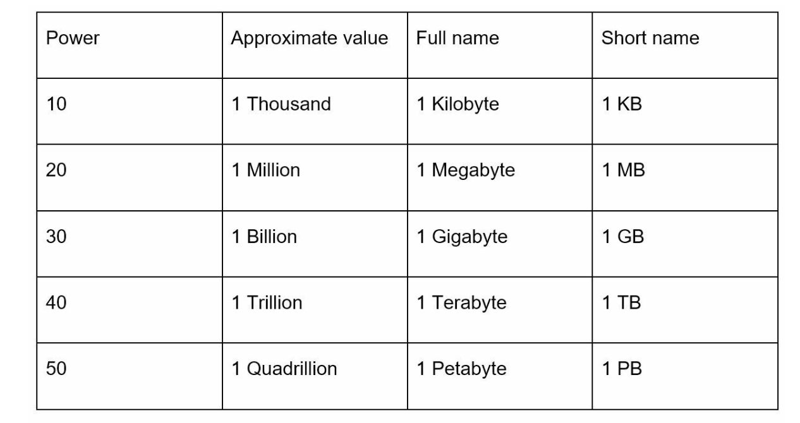
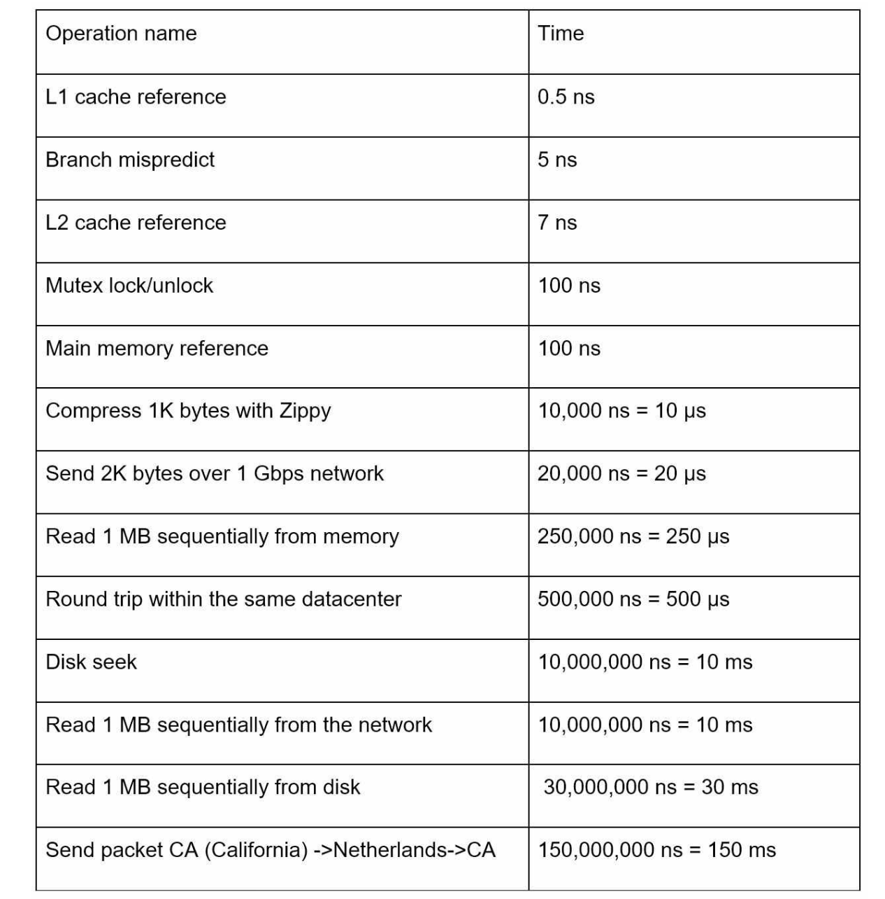
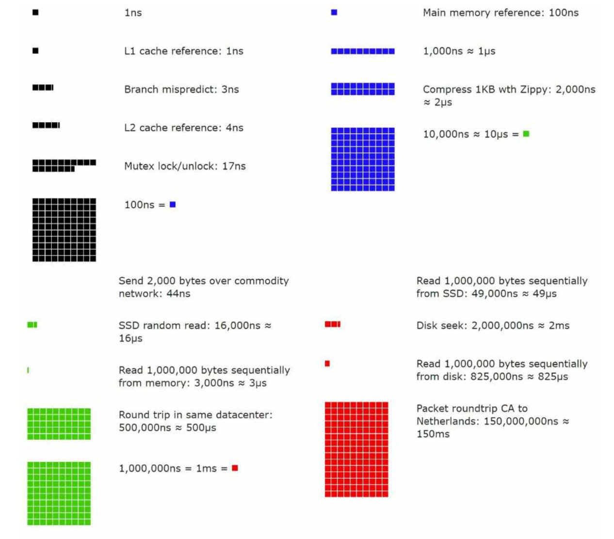
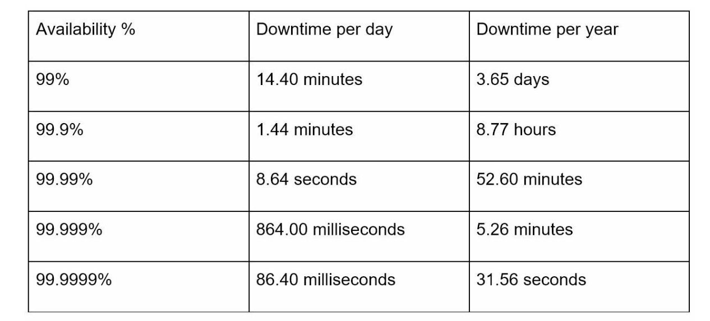

| English | Vietnamese |
|---------|------------|
| CHAPTER 2: BACK-OF-THE-ENVELOPE ESTIMATION | CHƯƠNG 2: ƯỚC LƯỢNG NHANH |
| In a system design interview, sometimes you are asked to estimate system capacity or performance requirements using a back-of-the-envelope estimation. According to Jeff Dean, Google Senior Fellow, “back-of-the-envelope calculations are estimates you create using a combination of thought experiments and common performance numbers to get a good feel for which designs will meet your requirements” [1]. | Trong một buổi phỏng vấn thiết kế hệ thống, đôi khi bạn được yêu cầu ước lượng khả năng hoặc yêu cầu hiệu suất của hệ thống bằng cách sử dụng ước lượng nhanh. Theo Jeff Dean, Google Senior Fellow, “ước lượng nhanh là các ước lượng bạn tạo ra bằng cách kết hợp các thí nghiệm suy nghĩ và các con số hiệu suất phổ biến để có cảm giác tốt về thiết kế nào sẽ đáp ứng yêu cầu của bạn” [1]. |
| You need to have a good sense of scalability basics to effectively carry out back-of-the-envelope estimation. The following concepts should be well understood: power of two [2], latency numbers every programmer should know, and availability numbers. | Bạn cần có hiểu biết cơ bản về khả năng mở rộng để thực hiện hiệu quả ước lượng nhanh. Các khái niệm sau nên được hiểu rõ: lũy thừa của 2 [2], các con số độ trễ mà mọi lập trình viên nên biết, và các con số về độ khả dụng. |
| Power of two | Lũy thừa của 2 |
| Although data volume can become enormous when dealing with distributed systems, calculation all boils down to the basics. To obtain correct calculations, it is critical to know the data volume unit using the power of 2. A byte is a sequence of 8 bits. An ASCII character uses one byte of memory (8 bits). Below is a table explaining the data volume unit (Table 2-1). | Mặc dù khối lượng dữ liệu có thể trở nên khổng lồ khi làm việc với hệ thống phân tán, mọi phép tính đều dựa trên những điều cơ bản. Để tính toán chính xác, điều quan trọng là phải biết đơn vị khối lượng dữ liệu sử dụng lũy thừa của 2. Một byte là một chuỗi gồm 8 bit. Một ký tự ASCII sử dụng một byte bộ nhớ (8 bit). Dưới đây là bảng giải thích đơn vị khối lượng dữ liệu (Bảng 2-1). |

| English | Vietnamese |
|---------|------------|
| Latency numbers every programmer should know | Các con số độ trễ mà mọi lập trình viên nên biết |
| Dr. Dean from Google reveals the length of typical computer operations in 2010 [1]. Some numbers are outdated as computers become faster and more powerful. However, those numbers should still be able to give us an idea of the fastness and slowness of different computer operations. | Tiến sĩ Dean từ Google tiết lộ thời gian thực hiện các thao tác máy tính điển hình vào năm 2010 [1]. Một số con số đã lỗi thời khi máy tính ngày càng nhanh và mạnh hơn. Tuy nhiên, những con số đó vẫn có thể cho chúng ta ý tưởng về tốc độ và độ chậm của các thao tác máy tính khác nhau. |

# Notes

ns = nanosecond, µs = microsecond, ms = millisecond

1 ns = 10^-9 seconds  
1 µs = 10^-6 seconds = 1,000 ns  
1 ms = 10^-3 seconds = 1,000 µs = 1,000,000 ns
| English | Vietnamese |
|---------|------------|
| A Google software engineer built a tool to visualize Dr. Dean’s numbers. The tool also takes the time factor into consideration. Figures 2-1 shows the visualized latency numbers as of 2020 (source of figures: reference material [3]). | Một kỹ sư phần mềm của Google đã xây dựng một công cụ để trực quan hóa các con số của Tiến sĩ Dean. Công cụ này cũng tính đến yếu tố thời gian. Hình 2-1 hiển thị các con số độ trễ được trực quan hóa tính đến năm 2020 (nguồn hình: tài liệu tham khảo [3]). |

| English | Vietnamese |
|---------|------------|
| By analyzing the numbers in Figure 2-1, we get the following conclusions: | Bằng cách phân tích các con số trong Hình 2-1, chúng ta rút ra các kết luận sau: |
| • Memory is fast but the disk is slow. | • Bộ nhớ nhanh nhưng ổ đĩa chậm. |
| • Avoid disk seeks if possible. | • Tránh tìm kiếm trên đĩa nếu có thể. |
| • Simple compression algorithms are fast. | • Các thuật toán nén đơn giản nhanh. |
| • Compress data before sending it over the internet if possible. | • Nén dữ liệu trước khi gửi qua internet nếu có thể. |
| • Data centers are usually in different regions, and it takes time to send data between them. | • Các trung tâm dữ liệu thường ở các khu vực khác nhau và việc gửi dữ liệu giữa chúng mất thời gian. |
| Availability numbers | Các con số về khả năng sẵn sàng |
| High availability is the ability of a system to be continuously operational for a desirably long period of time. High availability is measured as a percentage, with 100% means a service that has 0 downtime. Most services fall between 99% and 100%. | Khả năng sẵn sàng cao là khả năng một hệ thống hoạt động liên tục trong một khoảng thời gian dài mong muốn. Khả năng sẵn sàng cao được đo bằng phần trăm, với 100% nghĩa là dịch vụ không có thời gian ngừng hoạt động. Hầu hết các dịch vụ nằm trong khoảng 99% đến 100%. |
| A service level agreement (SLA) is a commonly used term for service providers. This is an agreement between you (the service provider) and your customer, and this agreement formally defines the level of uptime your service will deliver. Cloud providers Amazon [4], Google [5] and Microsoft [6] set their SLAs at 99.9% or above. Uptime is traditionally measured in nines. The more the nines, the better. As shown in Table 2-3, the number of nines correlate to the expected system downtime. | Thỏa thuận mức dịch vụ (SLA) là một thuật ngữ phổ biến cho các nhà cung cấp dịch vụ. Đây là thỏa thuận giữa bạn (nhà cung cấp dịch vụ) và khách hàng, và thỏa thuận này xác định chính thức mức thời gian hoạt động mà dịch vụ của bạn sẽ cung cấp. Các nhà cung cấp đám mây như Amazon [4], Google [5] và Microsoft [6] đặt SLA của họ ở mức 99,9% trở lên. Thời gian hoạt động thường được đo bằng số chín. Số chín càng nhiều, càng tốt. Như được hiển thị trong Bảng 2-3, số chín tương quan với thời gian ngừng hoạt động dự kiến của hệ thống. |

| English | Vietnamese |
|---------|------------|
| Example: Estimate Twitter QPS and storage requirements | Ví dụ: Ước lượng QPS và yêu cầu lưu trữ của Twitter |
| Please note the following numbers are for this exercise only as they are not real numbers from Twitter. | Xin lưu ý các con số sau chỉ dành cho bài tập này và không phải là số thực từ Twitter. |
| Assumptions: | Giả định: |
| • 300 million monthly active users. | • 300 triệu người dùng hoạt động hàng tháng. |
| • 50% of users use Twitter daily. | • 50% người dùng sử dụng Twitter hàng ngày. |
| • Users post 2 tweets per day on average. | • Người dùng đăng trung bình 2 tweet mỗi ngày. |
| • 10% of tweets contain media. | • 10% tweet có chứa phương tiện (media). |
| • Data is stored for 5 years. | • Dữ liệu được lưu trữ trong 5 năm. |
| Estimations: | Ước lượng: |
| Query per second (QPS) estimate: | Ước lượng truy vấn trên giây (QPS): |
| • Daily active users (DAU) = 300 million * 50% = 150 million | • Người dùng hoạt động hàng ngày (DAU) = 300 triệu * 50% = 150 triệu |
| • Tweets QPS = 150 million * 2 tweets / 24 hour / 3600 seconds = ~3500 | • QPS tweet = 150 triệu * 2 tweet / 24 giờ / 3600 giây = ~3500 |
| • Peek QPS = 2 * QPS = ~7000 | • QPS cao nhất = 2 * QPS = ~7000 |
| We will only estimate media storage here. | Ở đây, chúng ta chỉ ước lượng lưu trữ media. |
| • Average tweet size: | • Kích thước trung bình của một tweet: |
| • tweet_id 64 bytes | • tweet_id 64 bytes |
| • text 140 bytes | • text 140 bytes |
| • media 1 MB | • media 1 MB |
| • Media storage: 150 million * 2 * 10% * 1 MB = 30 TB per day | • Lưu trữ media: 150 triệu * 2 * 10% * 1 MB = 30 TB mỗi ngày |
| • 5-year media storage: 30 TB * 365 * 5 = ~55 PB | • Lưu trữ media 5 năm: 30 TB * 365 * 5 = ~55 PB |
| Tips | Mẹo |
| Back-of-the-envelope estimation is all about the process. Solving the problem is more important than obtaining results. Interviewers may test your problem-solving skills. | Ước lượng sơ bộ (back-of-the-envelope) tập trung vào quá trình. Giải quyết vấn đề quan trọng hơn là có được kết quả chính xác. Người phỏng vấn có thể kiểm tra kỹ năng giải quyết vấn đề của bạn. |
| • Rounding and Approximation. It is difficult to perform complicated math operations during the interview. For example, what is the result of “99987 / 9.1”? There is no need to spend valuable time to solve complicated math problems. Precision is not expected. Use round numbers and approximation to your advantage. The division question can be simplified as follows: “100,000 / 10”. | • Làm tròn và xấp xỉ. Thực hiện các phép toán phức tạp trong phỏng vấn là khó. Ví dụ, kết quả của “99987 / 9.1” là gì? Không cần dành thời gian quý giá để giải các bài toán phức tạp. Không yêu cầu độ chính xác tuyệt đối. Sử dụng số làm tròn và xấp xỉ có lợi cho bạn. Phép chia có thể đơn giản hóa: “100,000 / 10”. |
| • Write down your assumptions. It is a good idea to write down your assumptions to be referenced later. | • Ghi lại các giả định của bạn. Việc ghi lại giả định để tham khảo sau là một ý tưởng tốt. |
| • Label your units. When you write down “5”, does it mean 5 KB or 5 MB? You might confuse yourself with this. Write down the units because “5 MB” helps to remove ambiguity. | • Ghi đơn vị. Khi bạn viết “5”, liệu đó là 5 KB hay 5 MB? Bạn có thể bị nhầm lẫn. Ghi rõ đơn vị, ví dụ “5 MB” giúp loại bỏ sự mơ hồ. |
| • Commonly asked back-of-the-envelope estimations: QPS, peak QPS, storage, cache, number of servers, etc. You can practice these calculations when preparing for an interview. Practice makes perfect. | • Các phép ước lượng sơ bộ thường gặp: QPS, QPS cao nhất, lưu trữ, cache, số lượng máy chủ, v.v. Bạn có thể luyện tập các phép tính này khi chuẩn bị phỏng vấn. Luyện tập sẽ làm bạn thành thạo. |
| Congratulations on getting this far! Now give yourself a pat on the back. Good job! | Chúc mừng bạn đã đi đến đây! Hãy tự vỗ vai mình một cái. Làm tốt lắm! |
