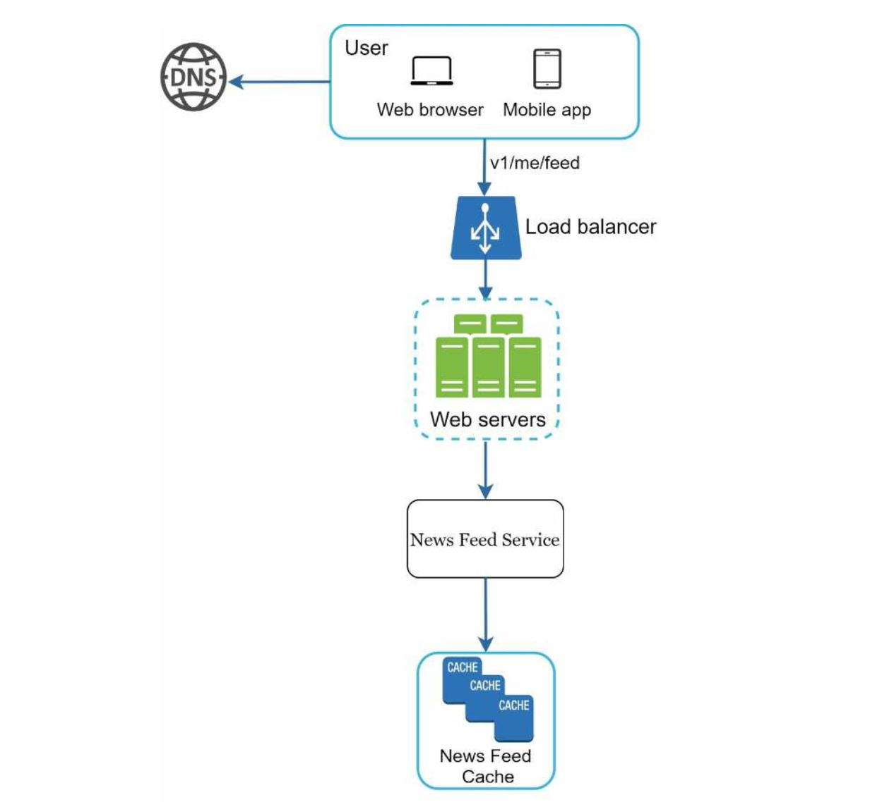

| English | Vietnamese |
|---------|------------|
| CHAPTER 3: A FRAMEWORK FOR SYSTEM DESIGN INTERVIEWS | CHƯƠNG 3: MỘT KHUÔN KHỔ CHO PHỎNG VẤN THIẾT KẾ HỆ THỐNG |
| You have just landed a coveted on-site interview at your dream company. The hiring coordinator sends you a schedule for that day. Scanning down the list, you feel pretty good about it until your eyes land on this interview session - System Design Interview. | Bạn vừa có cơ hội tham gia phỏng vấn trực tiếp tại công ty mơ ước. Điều phối viên tuyển dụng gửi cho bạn lịch trình trong ngày đó. Khi xem qua danh sách, bạn cảm thấy khá ổn cho đến khi nhìn thấy phiên phỏng vấn này - Phỏng vấn Thiết kế Hệ thống. |
| System design interviews are often intimidating. It could be as vague as “designing a well-known product X?”. The questions are ambiguous and seem unreasonably broad. Your weariness is understandable. After all, how could anyone design a popular product in an hour that has taken hundreds if not thousands of engineers to build? | Phỏng vấn thiết kế hệ thống thường gây áp lực. Nó có thể mơ hồ như “thiết kế một sản phẩm nổi tiếng X?”. Các câu hỏi mơ hồ và có vẻ quá rộng. Sự mệt mỏi của bạn là điều dễ hiểu. Rốt cuộc, làm sao ai có thể thiết kế một sản phẩm phổ biến trong một giờ, trong khi hàng trăm hoặc hàng nghìn kỹ sư đã xây dựng nó? |
| The good news is that no one expects you to. Real-world system design is extremely complicated. For example, Google search is deceptively simple; however, the amount of technology that underpins that simplicity is truly astonishing. | Tin tốt là không ai mong bạn làm được điều đó. Thiết kế hệ thống thực tế rất phức tạp. Ví dụ, Google Search có vẻ đơn giản; tuy nhiên, lượng công nghệ hỗ trợ sự đơn giản đó thật đáng kinh ngạc. |
| If no one expects you to design a real-world system in an hour, what is the benefit of a system design interview? | Nếu không ai mong bạn thiết kế một hệ thống thực tế trong một giờ, thì lợi ích của phỏng vấn thiết kế hệ thống là gì? |
| The system design interview simulates real-life problem solving where two co-workers collaborate on an ambiguous problem and come up with a solution that meets their goals. | Phỏng vấn thiết kế hệ thống mô phỏng quá trình giải quyết vấn đề thực tế, nơi hai đồng nghiệp hợp tác giải quyết một vấn đề mơ hồ và đưa ra giải pháp đáp ứng mục tiêu. |
| The problem is open-ended, and there is no perfect answer. The final design is less important compared to the work you put in the design process. | Vấn đề là mở và không có câu trả lời hoàn hảo. Thiết kế cuối cùng ít quan trọng hơn so với quá trình bạn đầu tư vào việc thiết kế. |
| This allows you to demonstrate your design skill, defend your design choices, and respond to feedback in a constructive manner. | Điều này cho phép bạn thể hiện kỹ năng thiết kế, bảo vệ các lựa chọn thiết kế của mình và phản hồi ý kiến một cách xây dựng. |
| Let us flip the table and consider what goes through the interviewer’s head as she walks into the conference room to meet you. | Hãy đảo ngược tình thế và xem xét suy nghĩ của người phỏng vấn khi họ bước vào phòng họp để gặp bạn. |
| The primary goal of the interviewer is to accurately assess your abilities. The last thing she wants is to give an inconclusive evaluation because the session has gone poorly and there are not enough signals. | Mục tiêu chính của người phỏng vấn là đánh giá chính xác năng lực của bạn. Điều cuối cùng họ muốn là đưa ra đánh giá không rõ ràng vì buổi phỏng vấn diễn ra kém và thiếu tín hiệu đánh giá. |
| What is an interviewer looking for in a system design interview? | Người phỏng vấn tìm gì trong một buổi phỏng vấn thiết kế hệ thống? |
| Many think that system design interview is all about a person's technical design skills. It is much more than that. | Nhiều người nghĩ rằng phỏng vấn thiết kế hệ thống chỉ liên quan đến kỹ năng thiết kế kỹ thuật của một người. Thực tế còn nhiều hơn thế. |
| An effective system design interview gives strong signals about a person's ability to collaborate, to work under pressure, and to resolve ambiguity constructively. | Một buổi phỏng vấn thiết kế hệ thống hiệu quả cung cấp tín hiệu rõ ràng về khả năng hợp tác, làm việc dưới áp lực và giải quyết mơ hồ một cách xây dựng của một người. |
| The ability to ask good questions is also an essential skill, and many interviewers specifically look for this skill. | Khả năng đặt câu hỏi hay cũng là một kỹ năng quan trọng, và nhiều người phỏng vấn đặc biệt chú ý đến kỹ năng này. |
| A good interviewer also looks for red flags. Over-engineering is a real disease of many engineers as they delight in design purity and ignore tradeoffs. | Người phỏng vấn giỏi cũng tìm kiếm các dấu hiệu cảnh báo. Thiết kế quá mức là vấn đề phổ biến của nhiều kỹ sư khi họ ham thích sự hoàn hảo trong thiết kế và bỏ qua các đánh đổi. |
| They are often unaware of the compounding costs of over-engineered systems, and many companies pay a high price for that ignorance. | Họ thường không nhận ra chi phí cộng dồn của các hệ thống thiết kế quá mức, và nhiều công ty phải trả giá cao cho sự thiếu hiểu biết đó. |
| You certainly do not want to demonstrate this tendency in a system design interview. Other red flags include narrow mindedness, stubbornness, etc. | Bạn chắc chắn không muốn thể hiện xu hướng này trong phỏng vấn thiết kế hệ thống. Các dấu hiệu cảnh báo khác bao gồm tư duy hẹp, bướng bỉnh, v.v. |
| In this chapter, we will go over some useful tips and introduce a simple and effective framework to solve system design interview problems. | Trong chương này, chúng ta sẽ xem xét một số mẹo hữu ích và giới thiệu một khuôn khổ đơn giản và hiệu quả để giải quyết các vấn đề trong phỏng vấn thiết kế hệ thống. |
| English | Vietnamese |
|---------|------------|
| A 4-step process for effective system design interview | Quy trình 4 bước cho phỏng vấn thiết kế hệ thống hiệu quả |
| Every system design interview is different. A great system design interview is open-ended and there is no one-size-fits-all solution. | Mỗi buổi phỏng vấn thiết kế hệ thống đều khác nhau. Một buổi phỏng vấn thiết kế hệ thống tốt là mở và không có giải pháp chung cho tất cả. |
| However, there are steps and common ground to cover in every system design interview. | Tuy nhiên, có những bước và điểm chung cần bao quát trong mỗi buổi phỏng vấn thiết kế hệ thống. |
| Step 1 - Understand the problem and establish design scope | Bước 1 - Hiểu vấn đề và xác định phạm vi thiết kế |
| "Why did the tiger roar?" A hand shot up in the back of the class. "Yes, Jimmy?", the teacher responded. "Because he was HUNGRY". "Very good Jimmy." | "Tại sao con hổ gầm?" Một bàn tay giơ lên ở cuối lớp. "Vâng, Jimmy?", giáo viên trả lời. "Bởi vì nó ĐÓI." "Rất tốt, Jimmy." |
| DON'T be like Jimmy. | ĐỪNG giống Jimmy. |
| In a system design interview, giving out an answer quickly without thinking gives you no bonus points. Answering without a thorough understanding of the requirements is a huge red flag as the interview is not a trivia contest. There is no right answer. | Trong phỏng vấn thiết kế hệ thống, đưa ra câu trả lời nhanh mà không suy nghĩ sẽ không được điểm thưởng. Trả lời mà không hiểu kỹ yêu cầu là một dấu hiệu cảnh báo lớn vì buổi phỏng vấn không phải là cuộc thi đố. Không có câu trả lời đúng tuyệt đối. |
| So, do not jump right in to give a solution. Slow down. Think deeply and ask questions to clarify requirements and assumptions. This is extremely important. | Vì vậy, đừng vội vàng đưa ra giải pháp. Hãy chậm lại, suy nghĩ kỹ và đặt câu hỏi để làm rõ yêu cầu và giả định. Điều này cực kỳ quan trọng. |
| As an engineer, we like to solve hard problems and jump into the final design; however, this approach is likely to lead you to design the wrong system. | Là kỹ sư, chúng ta thích giải quyết các vấn đề khó và nhảy ngay vào thiết kế cuối cùng; tuy nhiên, cách tiếp cận này có thể dẫn đến việc thiết kế sai hệ thống. |
| One of the most important skills as an engineer is to ask the right questions, make the proper assumptions, and gather all the information needed to build a system. So, do not be afraid to ask questions. | Một trong những kỹ năng quan trọng nhất của kỹ sư là đặt đúng câu hỏi, đưa ra giả định chính xác và thu thập tất cả thông tin cần thiết để xây dựng hệ thống. Vì vậy, đừng ngại đặt câu hỏi. |
| When you ask a question, the interviewer either answers your question directly or asks you to make your assumptions. If the latter happens, write down your assumptions on the whiteboard or paper. You might need them later. | Khi bạn đặt câu hỏi, người phỏng vấn sẽ trả lời trực tiếp hoặc yêu cầu bạn đưa ra giả định của mình. Nếu trường hợp sau xảy ra, hãy viết giả định của bạn trên bảng trắng hoặc giấy. Bạn có thể cần chúng sau này. |
| What kind of questions to ask? Ask questions to understand the exact requirements. Here is a list of questions to help you get started: | Nên đặt những câu hỏi nào? Hãy đặt câu hỏi để hiểu rõ yêu cầu chính xác. Dưới đây là danh sách câu hỏi giúp bạn bắt đầu: |
| • What specific features are we going to build? | • Chúng ta sẽ xây dựng những tính năng cụ thể nào? |
| • How many users does the product have? | • Sản phẩm có bao nhiêu người dùng? |
| • How fast does the company anticipate to scale up? What are the anticipated scales in 3 months, 6 months, and a year? | • Công ty dự đoán tốc độ mở rộng nhanh như thế nào? Quy mô dự kiến trong 3 tháng, 6 tháng và một năm là gì? |
| • What is the company’s technology stack? What existing services you might leverage to simplify the design? | • Ngăn xếp công nghệ của công ty là gì? Những dịch vụ hiện có nào bạn có thể tận dụng để đơn giản hóa thiết kế? |
| Example | Ví dụ |
| If you are asked to design a news feed system, you want to ask questions that help you clarify the requirements. | Nếu bạn được yêu cầu thiết kế một hệ thống news feed, bạn nên đặt câu hỏi giúp làm rõ các yêu cầu. |
| Candidate: Is this a mobile app? Or a web app? Or both? | Ứng viên: Đây là ứng dụng di động, web hay cả hai? |
| Interviewer: Both. | Người phỏng vấn: Cả hai. |
| Candidate: What are the most important features for the product? | Ứng viên: Những tính năng quan trọng nhất của sản phẩm là gì? |
| Interviewer: Ability to make a post and see friends’ news feed. | Người phỏng vấn: Có thể đăng bài và xem news feed của bạn bè. |
| Candidate: Is the news feed sorted in reverse chronological order or a particular order? The particular order means each post is given a different weight. For instance, posts from your close friends are more important than posts from a group. | Ứng viên: News feed được sắp xếp theo thứ tự ngược thời gian hay theo thứ tự đặc biệt? Thứ tự đặc biệt nghĩa là mỗi bài đăng được gán trọng số khác nhau. Ví dụ, bài từ bạn thân quan trọng hơn bài từ nhóm. |
| Interviewer: To keep things simple, let us assume the feed is sorted by reverse chronological order. | Người phỏng vấn: Để đơn giản, giả sử feed được sắp xếp theo thứ tự ngược thời gian. |
| Candidate: How many friends can a user have? | Ứng viên: Một người dùng có thể có bao nhiêu bạn bè? |
| Interviewer: 5000 | Người phỏng vấn: 5000 |
| Candidate: What is the traffic volume? | Ứng viên: Lưu lượng truy cập là bao nhiêu? |
| Interviewer: 10 million daily active users (DAU) | Người phỏng vấn: 10 triệu người dùng hoạt động hàng ngày (DAU) |
| Candidate: Can feed contain images, videos, or just text? | Ứng viên: Feed có thể chứa hình ảnh, video hay chỉ văn bản? |
| Interviewer: It can contain media files, including both images and videos. | Người phỏng vấn: Nó có thể chứa file media, bao gồm cả hình ảnh và video. |
| Above are some sample questions that you can ask your interviewer. It is important to understand the requirements and clarify ambiguities | Trên là một số câu hỏi mẫu bạn có thể hỏi người phỏng vấn. Việc hiểu yêu cầu và làm rõ sự mơ hồ là rất quan trọng. |
| Step 2 - Propose high-level design and get buy-in | Bước 2 - Đề xuất thiết kế tổng thể và nhận sự đồng thuận |
| In this step, we aim to develop a high-level design and reach an agreement with the interviewer on the design. It is a great idea to collaborate with the interviewer during the process. | Trong bước này, chúng ta hướng đến phát triển thiết kế tổng thể và đạt được sự đồng thuận với người phỏng vấn. Việc hợp tác với người phỏng vấn trong quá trình này là một ý tưởng hay. |
| • Come up with an initial blueprint for the design. Ask for feedback. Treat your interviewer as a teammate and work together. Many good interviewers love to talk and get involved. | • Lên kế hoạch sơ bộ cho thiết kế. Yêu cầu phản hồi. Xem người phỏng vấn như đồng đội và cùng làm việc. Nhiều người phỏng vấn tốt thích trao đổi và tham gia. |
| • Draw box diagrams with key components on the whiteboard or paper. This might include clients (mobile/web), APIs, web servers, data stores, cache, CDN, message queue, etc. | • Vẽ sơ đồ hộp với các thành phần chính trên bảng trắng hoặc giấy. Có thể bao gồm client (mobile/web), API, web server, kho dữ liệu, cache, CDN, message queue, v.v. |
| • Do back-of-the-envelope calculations to evaluate if your blueprint fits the scale constraints. Think out loud. Communicate with your interviewer if back-of-the-envelope is necessary before diving into it. | • Thực hiện tính toán nhanh để đánh giá sơ đồ có phù hợp với yêu cầu về quy mô không. Nghĩ to thành lời. Thông báo với người phỏng vấn nếu tính toán sơ bộ là cần thiết trước khi đi sâu vào chi tiết. |
| If possible, go through a few concrete use cases. This will help you frame the high-level design. It is also likely that the use cases would help you discover edge cases you have not yet considered. | Nếu có thể, hãy xem qua một vài trường hợp sử dụng cụ thể. Điều này sẽ giúp bạn định hình thiết kế tổng thể và có thể phát hiện các trường hợp biên mà bạn chưa nghĩ đến. |
| Should we include API endpoints and database schema here? This depends on the problem. | Chúng ta có nên bao gồm API endpoints và cấu trúc cơ sở dữ liệu ở đây không? Điều này phụ thuộc vào vấn đề. |
| For large design problems like “Design Google search engine”, this is a bit too low level. | Với các vấn đề thiết kế lớn như "Thiết kế công cụ tìm kiếm Google", đây là mức quá chi tiết. |
| For a problem like designing the backend for a multi-player poker game, this is a fair game. | Với vấn đề như thiết kế backend cho trò chơi poker nhiều người chơi, đây là mức chi tiết hợp lý. |
| Communicate with your interviewer. | Trao đổi với người phỏng vấn. |
| Example | Ví dụ |
| Let us use “Design a news feed system” to demonstrate how to approach the high-level design. | Hãy sử dụng "Thiết kế hệ thống news feed" để minh họa cách tiếp cận thiết kế tổng thể. |
| Here you are not required to understand how the system actually works. All the details will be explained in Chapter 11. | Ở đây bạn không cần hiểu cách hệ thống thực sự hoạt động. Tất cả chi tiết sẽ được giải thích ở Chương 11. |
| At the high level, the design is divided into two flows: feed publishing and news feed building. | Ở mức tổng thể, thiết kế được chia thành hai luồng: đăng bài (feed publishing) và xây dựng news feed. |
| • Feed publishing: when a user publishes a post, corresponding data is written into cache/database, and the post will be populated into friends’ news feed. | • Đăng bài: khi người dùng đăng bài, dữ liệu tương ứng được ghi vào cache/cơ sở dữ liệu và bài đăng sẽ xuất hiện trên news feed của bạn bè. |
| • Newsfeed building: the news feed is built by aggregating friends’ posts in a reverse chronological order. | • Xây dựng news feed: news feed được xây dựng bằng cách tổng hợp các bài đăng của bạn bè theo thứ tự ngược thời gian. |
| Figure 3-1 and Figure 3-2 present high-level designs for feed publishing and news feed building flows, respectively. | Hình 3-1 và Hình 3-2 trình bày thiết kế tổng thể cho luồng đăng bài và xây dựng news feed, tương ứng. |

| English | Vietnamese |
|---------|------------|
| Step 3 - Design deep dive | Bước 3 - Đi sâu vào thiết kế |
| At this step, you and your interviewer should have already achieved the following objectives: | Ở bước này, bạn và nhà phỏng vấn nên đã đạt được các mục tiêu sau: |
| • Agreed on the overall goals and feature scope | • Đồng ý về mục tiêu tổng thể và phạm vi tính năng |
| • Sketched out a high-level blueprint for the overall design | • Phác thảo sơ đồ tổng thể cho thiết kế tổng thể |
| • Obtained feedback from your interviewer on the high-level design | • Nhận phản hồi từ nhà phỏng vấn về thiết kế tổng thể |
| • Had some initial ideas about areas to focus on in deep dive based on her feedback | • Có một số ý tưởng ban đầu về các khu vực cần tập trung khi đi sâu dựa trên phản hồi của cô ấy |
| You shall work with the interviewer to identify and prioritize components in the architecture. | Bạn sẽ làm việc với nhà phỏng vấn để xác định và ưu tiên các thành phần trong kiến trúc. |
| It is worth stressing that every interview is different. Sometimes, the interviewer may give off hints that she likes focusing on high-level design. Sometimes, for a senior candidate interview, the discussion could be on the system performance characteristics, likely focusing on the bottlenecks and resource estimations. | Cần nhấn mạnh rằng mỗi buổi phỏng vấn là khác nhau. Đôi khi, nhà phỏng vấn có thể gợi ý rằng cô ấy thích tập trung vào thiết kế tổng thể. Đôi khi, đối với buổi phỏng vấn ứng viên cao cấp, cuộc thảo luận có thể xoay quanh đặc điểm hiệu năng của hệ thống, có khả năng tập trung vào các nút thắt cổ chai và ước lượng tài nguyên. |
| In most cases, the interviewer may want you to dig into details of some system components. For URL shortener, it is interesting to dive into the hash function design that converts a long URL to a short one. For a chat system, how to reduce latency and how to support online/offline status are two interesting topics. | Trong hầu hết các trường hợp, nhà phỏng vấn có thể muốn bạn đi sâu vào chi tiết của một số thành phần hệ thống. Đối với hệ thống rút gọn URL, việc đi sâu vào thiết kế hàm băm chuyển đổi URL dài thành URL ngắn là thú vị. Đối với hệ thống chat, cách giảm độ trễ và cách hỗ trợ trạng thái trực tuyến/ngoại tuyến là hai chủ đề thú vị. |
| Time management is essential as it is easy to get carried away with minute details that do not demonstrate your abilities. You must be armed with signals to show your interviewer. Try not to get into unnecessary details. For example, talking about the EdgeRank algorithm of Facebook feed ranking in detail is not ideal during a system design interview as this takes much precious time and does not prove your ability in designing a scalable system. | Quản lý thời gian là điều thiết yếu vì dễ bị cuốn vào những chi tiết nhỏ mà không thể hiện được khả năng của bạn. Bạn phải chuẩn bị các tín hiệu để trình bày với nhà phỏng vấn. Cố gắng không đi vào những chi tiết không cần thiết. Ví dụ, nói chi tiết về thuật toán EdgeRank của việc xếp hạng feed trên Facebook không lý tưởng trong phỏng vấn thiết kế hệ thống vì điều này tốn nhiều thời gian quý giá và không chứng minh được khả năng thiết kế hệ thống có thể mở rộng của bạn. |
| Example | Ví dụ |
| At this point, we have discussed the high-level design for a news feed system, and the interviewer is happy with your proposal. Next, we will investigate two of the most important use cases: | Tại thời điểm này, chúng ta đã thảo luận về thiết kế tổng thể cho hệ thống news feed, và nhà phỏng vấn hài lòng với đề xuất của bạn. Tiếp theo, chúng ta sẽ xem xét hai trường hợp sử dụng quan trọng nhất: |
| 1. Feed publishing | 1. Xuất bản feed |
| 2. News feed retrieval | 2. Truy xuất news feed |
| Figure 3-3 and Figure 3-4 show the detailed design for the two use cases, which will be explained in detail in Chapter 11. | Hình 3-3 và Hình 3-4 minh họa thiết kế chi tiết cho hai trường hợp sử dụng này, sẽ được giải thích chi tiết trong Chương 11. |

| English | Vietnamese |
|---------|------------|
| Step 4 - Wrap up | Bước 4 - Kết thúc |
| In this final step, the interviewer might ask you a few follow-up questions or give you the freedom to discuss other additional points. Here are a few directions to follow: | Ở bước cuối cùng này, nhà phỏng vấn có thể hỏi bạn một vài câu hỏi tiếp theo hoặc cho bạn tự do thảo luận về các điểm bổ sung khác. Dưới đây là một vài hướng dẫn cần theo: |
| • The interviewer might want you to identify the system bottlenecks and discuss potential improvements. Never say your design is perfect and nothing can be improved. There is always something to improve upon. This is a great opportunity to show your critical thinking and leave a good final impression. | • Nhà phỏng vấn có thể muốn bạn xác định các nút thắt cổ chai của hệ thống và thảo luận về các cải tiến tiềm năng. Không bao giờ nói thiết kế của bạn hoàn hảo và không thể cải thiện gì. Luôn có điều gì đó để cải thiện. Đây là cơ hội tuyệt vời để thể hiện tư duy phản biện và để lại ấn tượng cuối cùng tốt. |
| • It could be useful to give the interviewer a recap of your design. This is particularly important if you suggested a few solutions. Refreshing your interviewer’s memory can be helpful after a long session. | • Việc tóm tắt thiết kế của bạn cho nhà phỏng vấn có thể hữu ích. Điều này đặc biệt quan trọng nếu bạn đề xuất nhiều giải pháp. Làm mới trí nhớ của nhà phỏng vấn có thể hữu ích sau một buổi dài. |
| • Error cases (server failure, network loss, etc.) are interesting to talk about. | • Các trường hợp lỗi (server bị lỗi, mất mạng, v.v.) là những chủ đề thú vị để thảo luận. |
| • Operation issues are worth mentioning. How do you monitor metrics and error logs? How to roll out the system? | • Các vấn đề vận hành cũng đáng được đề cập. Bạn theo dõi các chỉ số và nhật ký lỗi như thế nào? Làm thế nào để triển khai hệ thống? |
| • How to handle the next scale curve is also an interesting topic. For example, if your current design supports 1 million users, what changes do you need to make to support 10 million users? | • Cách xử lý các bước tăng trưởng tiếp theo cũng là một chủ đề thú vị. Ví dụ, nếu thiết kế hiện tại của bạn hỗ trợ 1 triệu người dùng, bạn cần thay đổi gì để hỗ trợ 10 triệu người dùng? |
| • Propose other refinements you need if you had more time. | • Đề xuất các cải tiến khác nếu bạn có thêm thời gian. |
| To wrap up, we summarize a list of the Dos and Don’ts. | Để kết thúc, chúng tôi tóm tắt danh sách những việc nên làm và không nên làm. |
| Dos | Những việc nên làm |
| • Always ask for clarification. Do not assume your assumption is correct. | • Luôn hỏi để làm rõ. Đừng cho rằng giả định của bạn là đúng. |
| • Understand the requirements of the problem. | • Hiểu yêu cầu của vấn đề. |
| • There is neither the right answer nor the best answer. A solution designed to solve the problems of a young startup is different from that of an established company with millions of users. Make sure you understand the requirements. | • Không có câu trả lời đúng hay tốt nhất. Một giải pháp thiết kế cho startup trẻ khác với một công ty đã có hàng triệu người dùng. Hãy chắc chắn rằng bạn hiểu các yêu cầu. |
| • Let the interviewer know what you are thinking. Communicate with your interview. | • Cho nhà phỏng vấn biết bạn đang nghĩ gì. Giao tiếp với nhà phỏng vấn. |
| • Suggest multiple approaches if possible. | • Đề xuất nhiều cách tiếp cận nếu có thể. |
| • Once you agree with your interviewer on the blueprint, go into details on each component. Design the most critical components first. | • Khi bạn đồng ý với nhà phỏng vấn về sơ đồ tổng thể, đi vào chi tiết từng thành phần. Thiết kế các thành phần quan trọng nhất trước. |
| • Bounce ideas off the interviewer. A good interviewer works with you as a teammate. | • Trao đổi ý tưởng với nhà phỏng vấn. Một nhà phỏng vấn tốt sẽ làm việc cùng bạn như một đồng đội. |
| • Never give up. | • Không bao giờ bỏ cuộc. |
| Don’ts | Những việc không nên làm |
| • Don't be unprepared for typical interview questions. | • Không chuẩn bị cho các câu hỏi phỏng vấn thông thường. |
| • Don’t jump into a solution without clarifying the requirements and assumptions. | • Đừng nhảy vào giải pháp mà chưa làm rõ yêu cầu và giả định. |
| • Don’t go into too much detail on a single component in the beginning. Give the high-level design first then drills down. | • Đừng đi quá sâu vào chi tiết một thành phần ngay từ đầu. Trình bày thiết kế tổng thể trước rồi mới đi vào chi tiết. |
| • If you get stuck, don't hesitate to ask for hints. | • Nếu bị kẹt, đừng ngần ngại yêu cầu gợi ý. |
| • Again, communicate. Don't think in silence. | • Một lần nữa, hãy giao tiếp. Đừng im lặng suy nghĩ. |
| • Don’t think your interview is done once you give the design. You are not done until your interviewer says you are done. Ask for feedback early and often. | • Đừng nghĩ rằng phỏng vấn đã xong khi bạn đưa ra thiết kế. Bạn chưa xong cho đến khi nhà phỏng vấn nói bạn xong. Hãy yêu cầu phản hồi sớm và thường xuyên. |
| Time allocation on each step | Phân bổ thời gian cho mỗi bước |
| System design interview questions are usually very broad, and 45 minutes or an hour is not enough to cover the entire design. Time management is essential. How much time should you spend on each step? The following is a very rough guide on distributing your time in a 45-minute interview session. Please remember this is a rough estimate, and the actual time distribution depends on the scope of the problem and the requirements from the interviewer. | Các câu hỏi phỏng vấn thiết kế hệ thống thường rất rộng, và 45 phút hoặc một giờ là không đủ để bao quát toàn bộ thiết kế. Quản lý thời gian là điều thiết yếu. Bạn nên dành bao nhiêu thời gian cho mỗi bước? Dưới đây là hướng dẫn sơ bộ về phân bổ thời gian trong buổi phỏng vấn 45 phút. Hãy nhớ rằng đây chỉ là ước lượng sơ bộ, và phân bổ thực tế phụ thuộc vào phạm vi vấn đề và yêu cầu của nhà phỏng vấn. |
| Step 1 Understand the problem and establish design scope: 3 - 10 minutes | Bước 1 Hiểu vấn đề và xác định phạm vi thiết kế: 3 - 10 phút |
| Step 2 Propose high-level design and get buy-in: 10 - 15 minutes | Bước 2 Đề xuất thiết kế tổng thể và nhận đồng thuận: 10 - 15 phút |
| Step 3 Design deep dive: 10 - 25 minutes | Bước 3 Đi sâu vào thiết kế: 10 - 25 phút |
| Step 4 Wrap: 3 - 5 minutes | Bước 4 Kết thúc: 3 - 5 phút |
