| English | Vietnamese |
|---------|------------|
| CHAPTER 4: DESIGN A RATE LIMITER | CHƯƠNG 4: THIẾT KẾ RATE LIMITER |
| In a network system, a rate limiter is used to control the rate of traffic sent by a client or a service. In the HTTP world, a rate limiter limits the number of client requests allowed to be sent over a specified period. If the API request count exceeds the threshold defined by the rate limiter, all the excess calls are blocked. | Trong một hệ thống mạng, rate limiter được sử dụng để kiểm soát tốc độ lưu lượng được gửi bởi một client hoặc một dịch vụ. Trong thế giới HTTP, rate limiter giới hạn số lượng yêu cầu từ client được phép gửi trong một khoảng thời gian xác định. Nếu số lượng yêu cầu API vượt quá ngưỡng do rate limiter định nghĩa, tất cả các yêu cầu dư thừa sẽ bị chặn. |
| Here are a few examples: | Dưới đây là một vài ví dụ: |
| • A user can write no more than 2 posts per second. | • Một người dùng không thể viết quá 2 bài đăng mỗi giây. |
| • You can create a maximum of 10 accounts per day from the same IP address. | • Bạn có thể tạo tối đa 10 tài khoản mỗi ngày từ cùng một địa chỉ IP. |
| • You can claim rewards no more than 5 times per week from the same device. | • Bạn có thể nhận thưởng không quá 5 lần mỗi tuần từ cùng một thiết bị. |
| In this chapter, you are asked to design a rate limiter. Before starting the design, we first look at the benefits of using an API rate limiter: | Trong chương này, bạn được yêu cầu thiết kế một rate limiter. Trước khi bắt đầu thiết kế, chúng ta sẽ xem xét các lợi ích của việc sử dụng rate limiter cho API: |
| • Prevent resource starvation caused by Denial of Service (DoS) attack [1]. Almost all APIs published by large tech companies enforce some form of rate limiting. For example, Twitter limits the number of tweets to 300 per 3 hours [2]. Google docs APIs have the following default limit: 300 per user per 60 seconds for read requests [3]. A rate limiter prevents DoS attacks, either intentional or unintentional, by blocking the excess calls. | • Ngăn chặn tình trạng thiếu hụt tài nguyên do tấn công từ chối dịch vụ (DoS) [1]. Hầu hết các API được các công ty công nghệ lớn phát hành đều áp dụng một hình thức giới hạn tốc độ. Ví dụ, Twitter giới hạn số tweet là 300 mỗi 3 giờ [2]. API của Google Docs có giới hạn mặc định như sau: 300 lần đọc mỗi người dùng trong 60 giây [3]. Rate limiter ngăn chặn các cuộc tấn công DoS, dù cố ý hay vô tình, bằng cách chặn các yêu cầu vượt quá. |
| • Reduce cost. Limiting excess requests means fewer servers and allocating more resources to high priority APIs. Rate limiting is extremely important for companies that use paid third party APIs. For example, you are charged on a per-call basis for the following external APIs: check credit, make a payment, retrieve health records, etc. Limiting the number of calls is essential to reduce costs. | • Giảm chi phí. Giới hạn các yêu cầu dư thừa đồng nghĩa với việc cần ít máy chủ hơn và phân bổ nhiều tài nguyên hơn cho các API ưu tiên cao. Rate limiting đặc biệt quan trọng đối với các công ty sử dụng API bên thứ ba trả phí. Ví dụ, bạn bị tính phí theo mỗi lần gọi đối với các API bên ngoài sau: kiểm tra tín dụng, thực hiện thanh toán, truy xuất hồ sơ y tế, v.v. Giới hạn số lần gọi là điều cần thiết để giảm chi phí. |
| • Prevent servers from being overloaded. To reduce server load, a rate limiter is used to filter out excess requests caused by bots or users’ misbehavior. | • Ngăn ngừa quá tải máy chủ. Để giảm tải cho máy chủ, rate limiter được sử dụng để lọc các yêu cầu dư thừa gây ra bởi bot hoặc hành vi sai lệch của người dùng. |
| English | Vietnamese |
|---------|------------|
| Step 1 - Understand the problem and establish design scope | Bước 1 - Hiểu vấn đề và xác định phạm vi thiết kế |
| Rate limiting can be implemented using different algorithms, each with its pros and cons. The interactions between an interviewer and a candidate help to clarify the type of rate limiters we are trying to build. | Giới hạn tốc độ (rate limiting) có thể được triển khai bằng nhiều thuật toán khác nhau, mỗi thuật toán có ưu điểm và nhược điểm riêng. Sự tương tác giữa người phỏng vấn và ứng viên giúp làm rõ loại rate limiter mà chúng ta đang cố gắng xây dựng. |
| Candidate: What kind of rate limiter are we going to design? Is it a client-side rate limiter or server-side API rate limiter? | Ứng viên: Chúng ta sẽ thiết kế loại rate limiter nào? Là rate limiter phía client hay rate limiter API phía server? |
| Interviewer: Great question. We focus on the server-side API rate limiter. | Người phỏng vấn: Câu hỏi hay. Chúng ta sẽ tập trung vào rate limiter API phía server. |
| Candidate: Does the rate limiter throttle API requests based on IP, the user ID, or other properties? | Ứng viên: Rate limiter có giới hạn các yêu cầu API dựa trên IP, user ID hay các thuộc tính khác không? |
| Interviewer: The rate limiter should be flexible enough to support different sets of throttle rules. | Người phỏng vấn: Rate limiter nên đủ linh hoạt để hỗ trợ các bộ quy tắc giới hạn khác nhau. |
| Candidate: What is the scale of the system? Is it built for a startup or a big company with a large user base? | Ứng viên: Quy mô của hệ thống là gì? Nó được xây dựng cho một startup hay một công ty lớn với cơ sở người dùng lớn? |
| Interviewer: The system must be able to handle a large number of requests. | Người phỏng vấn: Hệ thống phải có khả năng xử lý một lượng lớn yêu cầu. |
| Candidate: Will the system work in a distributed environment? | Ứng viên: Hệ thống có hoạt động trong môi trường phân tán không? |
| Interviewer: Yes. | Người phỏng vấn: Có. |
| Candidate: Is the rate limiter a separate service or should it be implemented in application code? | Ứng viên: Rate limiter có phải là một dịch vụ riêng biệt hay nên được triển khai trong code ứng dụng? |
| Interviewer: It is a design decision up to you. | Người phỏng vấn: Đây là quyết định thiết kế do bạn lựa chọn. |
| Candidate: Do we need to inform users who are throttled? | Ứng viên: Chúng ta có cần thông báo cho người dùng khi họ bị giới hạn không? |
| Interviewer: Yes. | Người phỏng vấn: Có. |
| Requirements | Yêu cầu |
| Here is a summary of the requirements for the system: | Dưới đây là tóm tắt các yêu cầu cho hệ thống: |
| • Accurately limit excessive requests. | • Giới hạn chính xác các yêu cầu vượt mức. |
| • Low latency. The rate limiter should not slow down HTTP response time. | • Độ trễ thấp. Rate limiter không nên làm chậm thời gian phản hồi HTTP. |
| • Use as little memory as possible. | • Sử dụng bộ nhớ càng ít càng tốt. |
| • Distributed rate limiting. The rate limiter can be shared across multiple servers or processes. | • Giới hạn tốc độ phân tán. Rate limiter có thể được chia sẻ giữa nhiều máy chủ hoặc tiến trình. |
| • Exception handling. Show clear exceptions to users when their requests are throttled. | • Xử lý ngoại lệ. Hiển thị thông báo rõ ràng cho người dùng khi yêu cầu của họ bị giới hạn. |
| • High fault tolerance. If there are any problems with the rate limiter (for example, a cache server goes offline), it does not affect the entire system. | • Khả năng chịu lỗi cao. Nếu có bất kỳ vấn đề nào với rate limiter (ví dụ: một máy chủ cache bị offline), nó không ảnh hưởng đến toàn bộ hệ thống. |

| English | Vietnamese |
|---------|------------|
| Step 2 - Propose high-level design and get buy-in | Bước 2 - Đề xuất thiết kế tổng thể và nhận sự đồng thuận |
| Let us keep things simple and use a basic client and server model for communication. | Hãy giữ mọi thứ đơn giản và sử dụng mô hình client-server cơ bản để giao tiếp. |
| Where to put the rate limiter? | Nên đặt rate limiter ở đâu? |
| Intuitively, you can implement a rate limiter at either the client or server-side. | Một cách trực quan, bạn có thể triển khai rate limiter ở phía client hoặc phía server. |
| • Client-side implementation. Generally speaking, client is an unreliable place to enforce rate limiting because client requests can easily be forged by malicious actors. Moreover, we might not have control over the client implementation. | • Triển khai phía client. Nói chung, client là nơi không đáng tin cậy để thực thi giới hạn tốc độ vì các yêu cầu từ client có thể dễ dàng bị giả mạo bởi kẻ xấu. Hơn nữa, chúng ta có thể không kiểm soát được cách triển khai client. |
| • Server-side implementation. Figure 4-1 shows a rate limiter that is placed on the server-side. | • Triển khai phía server. Hình 4-1 minh họa rate limiter được đặt ở phía server. |

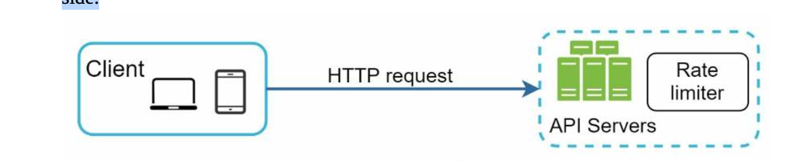

| English | Vietnamese |
|---------|------------|
| Besides the client and server-side implementations, there is an alternative way. | Bên cạnh việc triển khai phía client và server, còn có một cách khác. |
| Instead of putting a rate limiter at the API servers, we create a rate limiter middleware, which throttles requests to your APIs as shown in Figure 4-2. | Thay vì đặt rate limiter trên các server API, chúng ta tạo một middleware rate limiter, nó sẽ giới hạn các yêu cầu gửi tới API của bạn như minh họa trong Hình 4-2. |

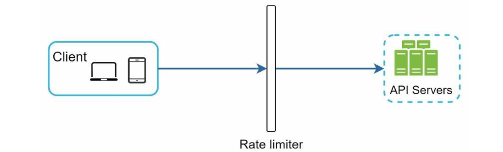

| English | Vietnamese |
|---------|------------|
| Let us use an example in Figure 4-3 to illustrate how rate limiting works in this design. | Hãy sử dụng một ví dụ trong Hình 4-3 để minh họa cách hoạt động của rate limiting trong thiết kế này. |
| Assume our API allows 2 requests per second, and a client sends 3 requests to the server within a second. | Giả sử API của chúng ta cho phép 2 yêu cầu mỗi giây, và một client gửi 3 yêu cầu đến server trong vòng một giây. |
| The first two requests are routed to API servers. However, the rate limiter middleware throttles the third request and returns a HTTP status code 429. | Hai yêu cầu đầu tiên được gửi đến các server API. Tuy nhiên, middleware rate limiter giới hạn yêu cầu thứ ba và trả về mã trạng thái HTTP 429. |
| The HTTP 429 response status code indicates a user has sent too many requests. | Mã trạng thái phản hồi HTTP 429 cho biết người dùng đã gửi quá nhiều yêu cầu. |

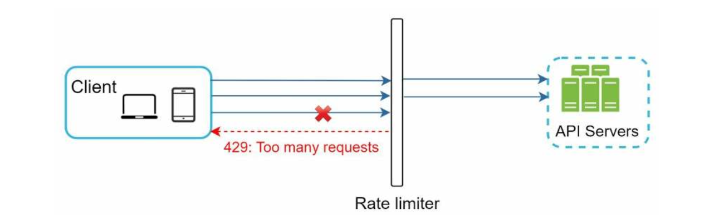

| English | Vietnamese |
|---------|------------|
| Cloud microservices [4] have become widely popular and rate limiting is usually implemented within a component called API gateway. | Các microservices trên cloud [4] đã trở nên phổ biến rộng rãi và rate limiting thường được triển khai trong một thành phần gọi là API gateway. |
| API gateway is a fully managed service that supports rate limiting, SSL termination, authentication, IP whitelisting, servicing static content, etc. | API gateway là một dịch vụ được quản lý toàn diện, hỗ trợ rate limiting, kết thúc SSL, xác thực, danh sách trắng IP, phục vụ nội dung tĩnh, v.v. |
| For now, we only need to know that the API gateway is a middleware that supports rate limiting. | Hiện tại, chúng ta chỉ cần biết rằng API gateway là một middleware hỗ trợ rate limiting. |
| While designing a rate limiter, an important question to ask ourselves is: where should the rate limiter be implemented, on the server-side or in a gateway? | Khi thiết kế một rate limiter, một câu hỏi quan trọng cần tự hỏi là: rate limiter nên được triển khai ở phía server hay trong gateway? |
| There is no absolute answer. It depends on your company’s current technology stack, engineering resources, priorities, goals, etc. | Không có câu trả lời tuyệt đối. Nó phụ thuộc vào stack công nghệ hiện tại của công ty, nguồn lực kỹ thuật, ưu tiên, mục tiêu, v.v. |
| Here are a few general guidelines: | Dưới đây là một số hướng dẫn chung: |
| Evaluate your current technology stack, such as programming language, cache service, etc. Make sure your current programming language is efficient to implement rate limiting on the server-side. | Đánh giá stack công nghệ hiện tại, chẳng hạn như ngôn ngữ lập trình, dịch vụ cache, v.v. Đảm bảo ngôn ngữ lập trình hiện tại đủ hiệu quả để triển khai rate limiting phía server. |
| Identify the rate limiting algorithm that fits your business needs. When you implement everything on the server-side, you have full control of the algorithm. However, your choice might be limited if you use a third-party gateway. | Xác định thuật toán rate limiting phù hợp với nhu cầu kinh doanh. Khi triển khai mọi thứ phía server, bạn có toàn quyền kiểm soát thuật toán. Tuy nhiên, lựa chọn có thể bị hạn chế nếu bạn sử dụng gateway của bên thứ ba. |
| If you have already used microservice architecture and included an API gateway in the design to perform authentication, IP whitelisting, etc., you may add a rate limiter to the API gateway. | Nếu bạn đã sử dụng kiến trúc microservice và bao gồm API gateway trong thiết kế để thực hiện xác thực, danh sách trắng IP, v.v., bạn có thể thêm rate limiter vào API gateway. |
| Building your own rate limiting service takes time. If you do not have enough engineering resources to implement a rate limiter, a commercial API gateway is a better option. | Xây dựng dịch vụ rate limiting riêng tốn thời gian. Nếu bạn không có đủ nguồn lực kỹ thuật để triển khai rate limiter, một API gateway thương mại là lựa chọn tốt hơn. |
| Algorithms for rate limiting | Thuật toán cho rate limiting |
| Rate limiting can be implemented using different algorithms, and each of them has distinct pros and cons. | Rate limiting có thể được triển khai bằng các thuật toán khác nhau, và mỗi thuật toán đều có ưu nhược điểm riêng. |
| Even though this chapter does not focus on algorithms, understanding them at high-level helps to choose the right algorithm or combination of algorithms to fit our use cases. | Mặc dù chương này không tập trung vào thuật toán, nhưng hiểu chúng ở mức tổng quan sẽ giúp chọn đúng thuật toán hoặc kết hợp thuật toán phù hợp với trường hợp sử dụng. |
| Here is a list of popular algorithms: | Dưới đây là danh sách các thuật toán phổ biến: |
| • Token bucket | • Token bucket |
| • Leaking bucket | • Leaking bucket |
| • Fixed window counter | • Fixed window counter |
| • Sliding window log | • Sliding window log |
| • Sliding window counter | • Sliding window counter |
| Token bucket algorithm | Thuật toán token bucket |
| The token bucket algorithm is widely used for rate limiting. It is simple, well understood and commonly used by internet companies. | Thuật toán token bucket được sử dụng rộng rãi cho rate limiting. Nó đơn giản, dễ hiểu và thường được các công ty internet sử dụng. |
| Both Amazon [5] and Stripe [6] use this algorithm to throttle their API requests. | Cả Amazon [5] và Stripe [6] đều sử dụng thuật toán này để điều chỉnh tốc độ các yêu cầu API của họ. |
| The token bucket algorithm works as follows: | Thuật toán token bucket hoạt động như sau: |
| • A token bucket is a container that has pre-defined capacity. Tokens are put in the bucket at preset rates periodically. Once the bucket is full, no more tokens are added. | • Token bucket là một container có dung lượng định sẵn. Các token được thêm vào bucket theo tỷ lệ định trước theo thời gian. Khi bucket đầy, không thêm token nữa. |
| As shown in Figure 4-4, the token bucket capacity is 4. The refiller puts 2 tokens into the bucket every second. Once the bucket is full, extra tokens will overflow. | Như minh họa trong Hình 4-4, dung lượng token bucket là 4. Bộ nạp thêm đưa 2 token vào bucket mỗi giây. Khi bucket đầy, các token dư sẽ tràn ra ngoài. |

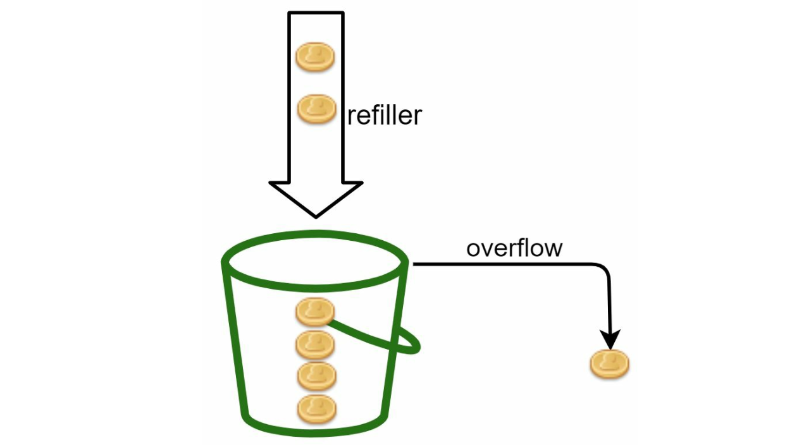

| English | Vietnamese |
|---------|------------|
| • Each request consumes one token. When a request arrives, we check if there are enough tokens in the bucket. Figure 4-5 explains how it works. | • Mỗi yêu cầu tiêu thụ một token. Khi một yêu cầu đến, chúng ta kiểm tra xem có đủ token trong bucket không. Hình 4-5 giải thích cách hoạt động. |
| • If there are enough tokens, we take one token out for each request, and the request goes through. | • Nếu có đủ token, chúng ta lấy ra một token cho mỗi yêu cầu và yêu cầu được thực hiện. |
| • If there are not enough tokens, the request is dropped. | • Nếu không đủ token, yêu cầu sẽ bị loại bỏ. |

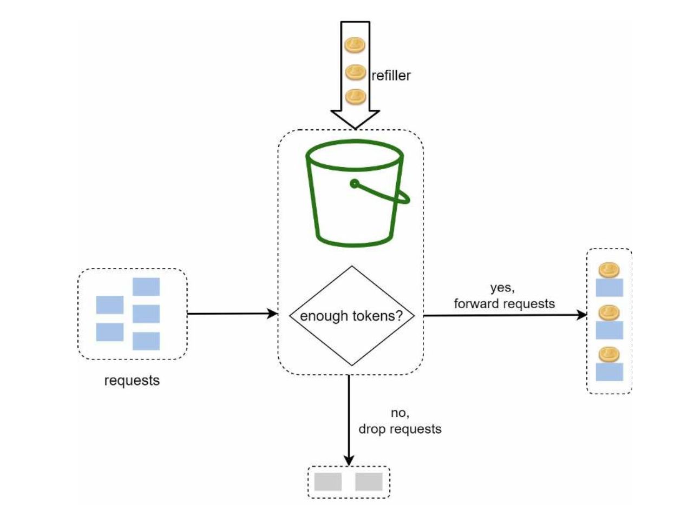

| English | Vietnamese |
|---------|------------|
| Figure 4-6 illustrates how token consumption, refill, and rate limiting logic work. In this example, the token bucket size is 4, and the refill rate is 4 per 1 minute. | Hình 4-6 minh họa cách hoạt động của việc tiêu thụ token, nạp lại và logic giới hạn tốc độ. Trong ví dụ này, kích thước bucket là 4 và tốc độ nạp lại là 4 mỗi 1 phút. |

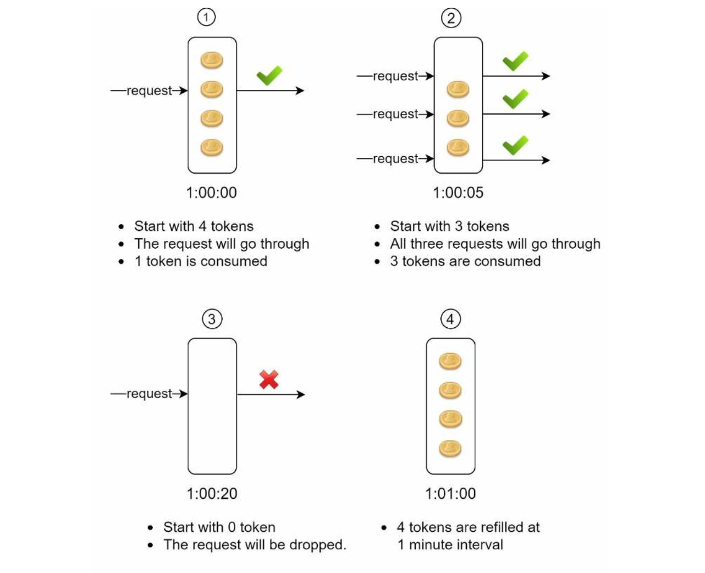

| English | Vietnamese |
|---------|------------|
| The token bucket algorithm takes two parameters: | Thuật toán token bucket có hai tham số: |
| • Bucket size: the maximum number of tokens allowed in the bucket | • Kích thước bucket: số lượng token tối đa được phép trong bucket |
| • Refill rate: number of tokens put into the bucket every second | • Tốc độ nạp lại: số token được thêm vào bucket mỗi giây |
| How many buckets do we need? This varies, and it depends on the rate-limiting rules. Here are a few examples. | Chúng ta cần bao nhiêu bucket? Điều này thay đổi và phụ thuộc vào quy tắc giới hạn tốc độ. Dưới đây là một vài ví dụ. |
| • It is usually necessary to have different buckets for different API endpoints. For instance, if a user is allowed to make 1 post per second, add 150 friends per day, and like 5 posts per second, 3 buckets are required for each user. | • Thông thường cần có các bucket khác nhau cho từng API endpoint. Ví dụ, nếu một người dùng được phép đăng 1 bài mỗi giây, thêm 150 bạn mỗi ngày và thích 5 bài mỗi giây, thì cần 3 bucket cho mỗi người dùng. |
| • If we need to throttle requests based on IP addresses, each IP address requires a bucket. | • Nếu cần giới hạn các yêu cầu dựa trên địa chỉ IP, mỗi địa chỉ IP sẽ cần một bucket. |
| • If the system allows a maximum of 10,000 requests per second, it makes sense to have a global bucket shared by all requests. | • Nếu hệ thống cho phép tối đa 10.000 yêu cầu mỗi giây, thì có một bucket toàn cục dùng chung cho tất cả các yêu cầu là hợp lý. |
| Pros: | Ưu điểm: |
| • The algorithm is easy to implement. | • Thuật toán dễ triển khai. |
| • Memory efficient. | • Tiết kiệm bộ nhớ. |
| • Token bucket allows a burst of traffic for short periods. A request can go through as long as there are tokens left. | • Token bucket cho phép một đợt bùng nổ lưu lượng trong thời gian ngắn. Một yêu cầu có thể đi qua miễn là còn token. |
| Cons: | Nhược điểm: |
| • Two parameters in the algorithm are bucket size and token refill rate. However, it might be challenging to tune them properly. | • Hai tham số trong thuật toán là kích thước bucket và tốc độ nạp token. Tuy nhiên, việc điều chỉnh chúng có thể khó khăn. |
| Leaking bucket algorithm | Thuật toán leaking bucket |
| The leaking bucket algorithm is similar to the token bucket except that requests are processed at a fixed rate. It is usually implemented with a first-in-first-out (FIFO) queue. The algorithm works as follows: | Thuật toán leaking bucket tương tự token bucket nhưng các yêu cầu được xử lý với tốc độ cố định. Nó thường được triển khai bằng hàng đợi FIFO (vào trước ra trước). Thuật toán hoạt động như sau: |
| • When a request arrives, the system checks if the queue is full. If it is not full, the request is added to the queue. | • Khi một yêu cầu đến, hệ thống kiểm tra xem hàng đợi có đầy không. Nếu không đầy, yêu cầu được thêm vào hàng đợi. |
| • Otherwise, the request is dropped. | • Ngược lại, yêu cầu sẽ bị từ chối. |
| • Requests are pulled from the queue and processed at regular intervals. | • Các yêu cầu được lấy ra từ hàng đợi và xử lý theo khoảng thời gian đều đặn. |
| Figure 4-7 explains how the algorithm works. | Hình 4-7 giải thích cách thuật toán hoạt động. |

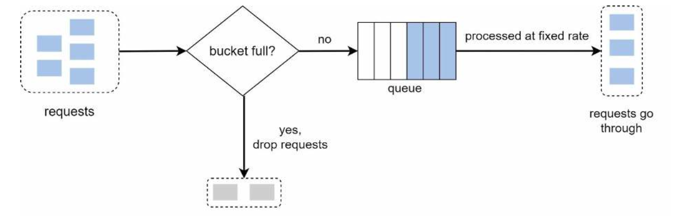

| English | Vietnamese |
|---------|------------|
| Leaking bucket algorithm takes the following two parameters: | Thuật toán leaking bucket có hai tham số sau: |
| • Bucket size: it is equal to the queue size. The queue holds the requests to be processed at a fixed rate. | • Kích thước bucket: bằng kích thước hàng đợi. Hàng đợi giữ các yêu cầu để xử lý với tốc độ cố định. |
| • Outflow rate: it defines how many requests can be processed at a fixed rate, usually in seconds. | • Tốc độ ra: xác định bao nhiêu yêu cầu có thể được xử lý theo tốc độ cố định, thường tính theo giây. |
| Shopify, an ecommerce company, uses leaky buckets for rate-limiting [7]. | Shopify, một công ty thương mại điện tử, sử dụng leaky bucket để giới hạn tốc độ [7]. |
| Pros: | Ưu điểm: |
| • Memory efficient given the limited queue size. | • Tiết kiệm bộ nhớ nhờ hàng đợi có kích thước giới hạn. |
| • Requests are processed at a fixed rate therefore it is suitable for use cases that a stable outflow rate is needed. | • Các yêu cầu được xử lý với tốc độ cố định, phù hợp cho các trường hợp cần tốc độ xử lý ổn định. |
| Cons: | Nhược điểm: |
| • A burst of traffic fills up the queue with old requests, and if they are not processed in time, recent requests will be rate limited. | • Một đợt bùng nổ lưu lượng sẽ làm đầy hàng đợi với các yêu cầu cũ, và nếu chúng không được xử lý kịp thời, các yêu cầu mới sẽ bị giới hạn tốc độ. |
| • There are two parameters in the algorithm. It might not be easy to tune them properly. | • Thuật toán có hai tham số, việc điều chỉnh chúng có thể không dễ dàng. |
| Fixed window counter algorithm | Thuật toán Fixed Window Counter |
| Fixed window counter algorithm works as follows: | Thuật toán Fixed Window Counter hoạt động như sau: |
| • The algorithm divides the timeline into fix-sized time windows and assign a counter for each window. | • Thuật toán chia dòng thời gian thành các cửa sổ thời gian cố định và gán một bộ đếm cho mỗi cửa sổ. |
| • Each request increments the counter by one. | • Mỗi yêu cầu làm tăng bộ đếm lên một đơn vị. |
| • Once the counter reaches the pre-defined threshold, new requests are dropped until a new time window starts. | • Khi bộ đếm đạt ngưỡng định trước, các yêu cầu mới sẽ bị loại bỏ cho đến khi cửa sổ thời gian mới bắt đầu. |
| Let us use a concrete example to see how it works. In Figure 4-8, the time unit is 1 second and the system allows a maximum of 3 requests per second. In each second window, if more than 3 requests are received, extra requests are dropped as shown in Figure 4-8. | Hãy xem một ví dụ cụ thể để hiểu cách hoạt động. Trong Hình 4-8, đơn vị thời gian là 1 giây và hệ thống cho phép tối đa 3 yêu cầu mỗi giây. Trong mỗi cửa sổ 1 giây, nếu nhận hơn 3 yêu cầu, các yêu cầu thừa sẽ bị loại bỏ như minh họa trong Hình 4-8. |

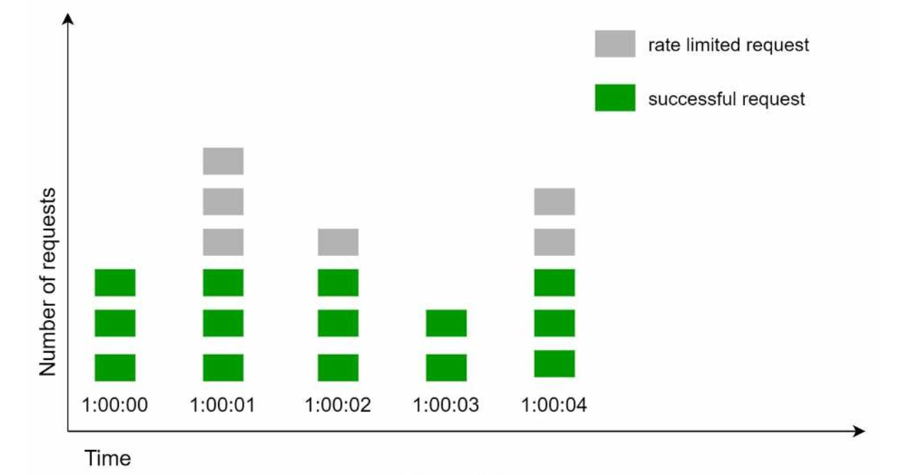

| English | Vietnamese |
|---------|------------|
| A major problem with this algorithm is that a burst of traffic at the edges of time windows could cause more requests than allowed quota to go through. | Một vấn đề lớn của thuật toán này là khi có đợt bùng nổ lưu lượng ở rìa các cửa sổ thời gian, có thể dẫn đến nhiều yêu cầu vượt quá hạn mức được phép. |
| Consider the following case | Xem xét trường hợp sau |

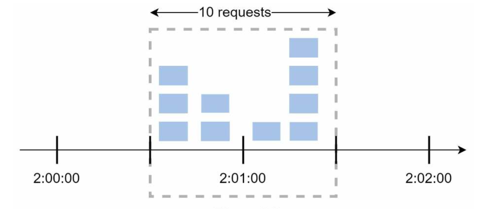

| English | Vietnamese |
|---------|------------|
| In Figure 4-9, the system allows a maximum of 5 requests per minute, and the available quota resets at the human-friendly round minute. | Trong Hình 4-9, hệ thống cho phép tối đa 5 yêu cầu mỗi phút, và hạn mức khả dụng được đặt lại vào phút tròn dễ hiểu với con người. |
| As seen, there are five requests between 2:00:00 and 2:01:00 and five more requests between 2:01:00 and 2:02:00. | Như thấy, có năm yêu cầu giữa 2:00:00 và 2:01:00 và thêm năm yêu cầu nữa giữa 2:01:00 và 2:02:00. |
| For the one-minute window between 2:00:30 and 2:01:30, 10 requests go through. That is twice as many as allowed requests. | Trong cửa sổ một phút giữa 2:00:30 và 2:01:30, có 10 yêu cầu đi qua. Con số này gấp đôi so với số yêu cầu được phép. |
| Pros: | Ưu điểm: |
| • Memory efficient. | • Tiết kiệm bộ nhớ. |
| • Easy to understand. | • Dễ hiểu. |
| • Resetting available quota at the end of a unit time window fits certain use cases. | • Đặt lại hạn mức khả dụng vào cuối mỗi cửa sổ thời gian phù hợp với một số trường hợp sử dụng. |
| Cons: | Nhược điểm: |
| • Spike in traffic at the edges of a window could cause more requests than the allowed quota to go through. | • Đột biến lưu lượng ở rìa cửa sổ có thể khiến nhiều yêu cầu vượt quá hạn mức cho phép. |
| Sliding window log algorithm | Thuật toán nhật ký cửa sổ trượt |
| As discussed previously, the fixed window counter algorithm has a major issue: it allows more requests to go through at the edges of a window. | Như đã thảo luận trước đó, thuật toán bộ đếm cửa sổ cố định có một vấn đề lớn: nó cho phép nhiều yêu cầu vượt quá đi qua ở rìa cửa sổ. |
| The sliding window log algorithm fixes the issue. It works as follows: | Thuật toán nhật ký cửa sổ trượt khắc phục vấn đề này. Nó hoạt động như sau: |
| • The algorithm keeps track of request timestamps. Timestamp data is usually kept in cache, such as sorted sets of Redis [8]. | • Thuật toán theo dõi dấu thời gian của các yêu cầu. Dữ liệu dấu thời gian thường được lưu trong bộ nhớ đệm, chẳng hạn như các tập hợp có thứ tự của Redis [8]. |
| • When a new request comes in, remove all the outdated timestamps. Outdated timestamps are defined as those older than the start of the current time window. | • Khi có yêu cầu mới, loại bỏ tất cả các dấu thời gian đã lỗi thời. Dấu thời gian lỗi thời được định nghĩa là các dấu thời gian cũ hơn so với bắt đầu của cửa sổ thời gian hiện tại. |
| • Add timestamp of the new request to the log. | • Thêm dấu thời gian của yêu cầu mới vào nhật ký. |
| • If the log size is the same or lower than the allowed count, a request is accepted. Otherwise, it is rejected. | • Nếu kích thước nhật ký bằng hoặc nhỏ hơn số lượng được phép, yêu cầu sẽ được chấp nhận. Ngược lại, nó bị từ chối. |
| We explain the algorithm with an example as revealed in Figure 4-10. | Chúng tôi giải thích thuật toán bằng một ví dụ như minh họa trong Hình 4-10. |

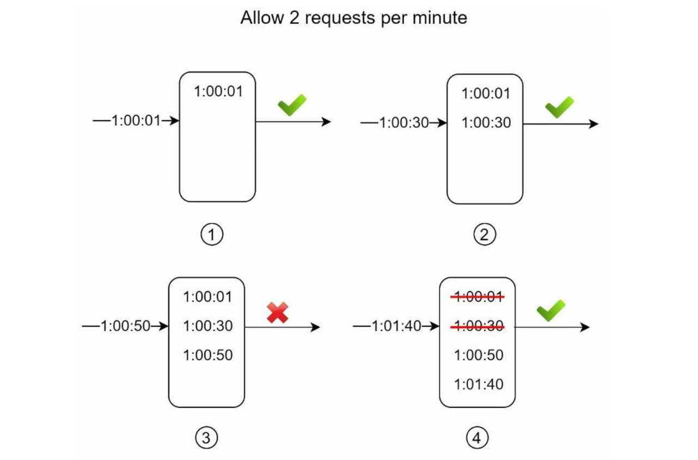

| English | Vietnamese |
|---------|------------|
| In this example, the rate limiter allows 2 requests per minute. Usually, Linux timestamps are stored in the log. However, human-readable representation of time is used in our example for better readability. | Trong ví dụ này, bộ giới hạn tốc độ cho phép 2 yêu cầu mỗi phút. Thông thường, dấu thời gian của Linux được lưu trong nhật ký. Tuy nhiên, chúng tôi sử dụng định dạng thời gian dễ đọc cho con người trong ví dụ này để dễ hiểu hơn. |
| • The log is empty when a new request arrives at 1:00:01. Thus, the request is allowed. | • Nhật ký trống khi một yêu cầu mới đến lúc 1:00:01. Do đó, yêu cầu được chấp nhận. |
| • A new request arrives at 1:00:30, the timestamp 1:00:30 is inserted into the log. After the insertion, the log size is 2, not larger than the allowed count. Thus, the request is allowed. | • Một yêu cầu mới đến lúc 1:00:30, dấu thời gian 1:00:30 được thêm vào nhật ký. Sau khi chèn, kích thước nhật ký là 2, không vượt quá số lượng cho phép. Do đó, yêu cầu được chấp nhận. |
| • A new request arrives at 1:00:50, and the timestamp is inserted into the log. After the insertion, the log size is 3, larger than the allowed size 2. Therefore, this request is rejected even though the timestamp remains in the log. | • Một yêu cầu mới đến lúc 1:00:50, và dấu thời gian được thêm vào nhật ký. Sau khi chèn, kích thước nhật ký là 3, lớn hơn kích thước cho phép là 2. Do đó, yêu cầu này bị từ chối mặc dù dấu thời gian vẫn còn trong nhật ký. |
| • A new request arrives at 1:01:40. Requests in the range [1:00:40,1:01:40) are within the latest time frame, but requests sent before 1:00:40 are outdated. Two outdated timestamps, 1:00:01 and 1:00:30, are removed from the log. After the remove operation, the log size becomes 2; therefore, the request is accepted. | • Một yêu cầu mới đến lúc 1:01:40. Các yêu cầu trong phạm vi [1:00:40,1:01:40) nằm trong khung thời gian mới nhất, nhưng các yêu cầu gửi trước 1:00:40 đã lỗi thời. Hai dấu thời gian lỗi thời, 1:00:01 và 1:00:30, được loại bỏ khỏi nhật ký. Sau khi loại bỏ, kích thước nhật ký trở thành 2; do đó, yêu cầu được chấp nhận. |
| Pros: | Ưu điểm: |
| • Rate limiting implemented by this algorithm is very accurate. In any rolling window, requests will not exceed the rate limit. | • Giới hạn tốc độ được thực hiện bởi thuật toán này rất chính xác. Trong bất kỳ cửa sổ trượt nào, các yêu cầu sẽ không vượt quá giới hạn tốc độ. |
| Cons: | Nhược điểm: |
| • The algorithm consumes a lot of memory because even if a request is rejected, its timestamp might still be stored in memory. | • Thuật toán tiêu tốn nhiều bộ nhớ vì ngay cả khi một yêu cầu bị từ chối, dấu thời gian của nó vẫn có thể được lưu trong bộ nhớ. |
| Sliding window counter algorithm | Thuật toán bộ đếm cửa sổ trượt |
| The sliding window counter algorithm is a hybrid approach that combines the fixed window counter and sliding window log. | Thuật toán bộ đếm cửa sổ trượt là một phương pháp kết hợp giữa bộ đếm cửa sổ cố định và nhật ký cửa sổ trượt. |
| The algorithm can be implemented by two different approaches. We will explain one implementation in this section and provide reference for the other implementation at the end of the section. | Thuật toán có thể được triển khai bằng hai cách khác nhau. Chúng tôi sẽ giải thích một triển khai trong phần này và cung cấp tham khảo cho cách triển khai khác ở cuối phần. |
| Figure 4-11 illustrates how this algorithm works. | Hình 4-11 minh họa cách thuật toán này hoạt động. |

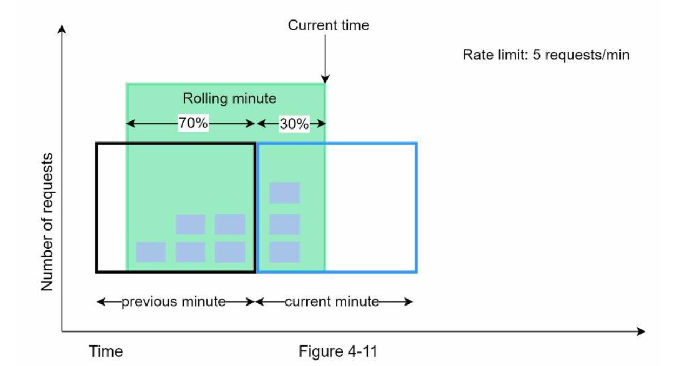

| English | Vietnamese |
|---------|------------|
| Assume the rate limiter allows a maximum of 7 requests per minute, and there are 5 requests in the previous minute and 3 in the current minute. For a new request that arrives at a 30% position in the current minute, the number of requests in the rolling window is calculated using the following formula: | Giả sử bộ giới hạn tốc độ cho phép tối đa 7 yêu cầu mỗi phút, và có 5 yêu cầu trong phút trước và 3 yêu cầu trong phút hiện tại. Đối với một yêu cầu mới đến tại vị trí 30% trong phút hiện tại, số lượng yêu cầu trong cửa sổ trượt được tính theo công thức sau: |
| • Requests in current window + requests in the previous window * overlap percentage of the rolling window and previous window | • Số yêu cầu trong cửa sổ hiện tại + số yêu cầu trong cửa sổ trước * tỷ lệ phần trăm chồng lấp giữa cửa sổ trượt và cửa sổ trước |
| • Using this formula, we get 3 + 5 * 0.7% = 6.5 request. Depending on the use case, the number can either be rounded up or down. In our example, it is rounded down to 6. | • Sử dụng công thức này, ta có 3 + 5 * 0.7 = 6.5 yêu cầu. Tùy theo trường hợp sử dụng, số này có thể được làm tròn lên hoặc xuống. Trong ví dụ của chúng tôi, nó được làm tròn xuống thành 6. |
| Since the rate limiter allows a maximum of 7 requests per minute, the current request can go through. However, the limit will be reached after receiving one more request. | Vì bộ giới hạn tốc độ cho phép tối đa 7 yêu cầu mỗi phút, yêu cầu hiện tại có thể được chấp nhận. Tuy nhiên, giới hạn sẽ đạt tối đa sau khi nhận thêm một yêu cầu nữa. |
| Due to the space limitation, we will not discuss the other implementation here. Interested readers should refer to the reference material [9]. | Do giới hạn về không gian, chúng tôi sẽ không thảo luận triển khai khác ở đây. Người đọc quan tâm có thể tham khảo tài liệu tham khảo [9]. |
| This algorithm is not perfect. It has pros and cons. | Thuật toán này không hoàn hảo. Nó có ưu và nhược điểm. |
| Pros | Ưu điểm |
| • It smooths out spikes in traffic because the rate is based on the average rate of the previous window. | • Nó làm mượt các đỉnh lưu lượng vì tốc độ dựa trên tốc độ trung bình của cửa sổ trước. |
| • Memory efficient. | • Tiết kiệm bộ nhớ. |
| Cons | Nhược điểm |
| • It only works for not-so-strict look back window. It is an approximation of the actual rate because it assumes requests in the previous window are evenly distributed. However, this problem may not be as bad as it seems. According to experiments done by Cloudflare [10], only 0.003% of requests are wrongly allowed or rate limited among 400 million requests. | • Nó chỉ hoạt động cho các cửa sổ nhìn lại không quá nghiêm ngặt. Đây là xấp xỉ của tốc độ thực tế vì giả sử các yêu cầu trong cửa sổ trước được phân bổ đều. Tuy nhiên, vấn đề này có thể không tệ như nó có vẻ. Theo thử nghiệm của Cloudflare [10], chỉ 0.003% yêu cầu bị cho phép hoặc giới hạn sai trong tổng số 400 triệu yêu cầu. |
| High-level architecture | Kiến trúc tổng thể |
| The basic idea of rate limiting algorithms is simple. At the high-level, we need a counter to keep track of how many requests are sent from the same user, IP address, etc. If the counter is larger than the limit, the request is disallowed. | Ý tưởng cơ bản của các thuật toán giới hạn tốc độ là đơn giản. Ở cấp cao, chúng ta cần một bộ đếm để theo dõi có bao nhiêu yêu cầu được gửi từ cùng một người dùng, địa chỉ IP, v.v. Nếu bộ đếm vượt quá giới hạn, yêu cầu sẽ bị từ chối. |
| Where shall we store counters? Using the database is not a good idea due to slowness of disk access. In-memory cache is chosen because it is fast and supports time-based expiration strategy. For instance, Redis [11] is a popular option to implement rate limiting. It is an in-memory store that offers two commands: INCR and EXPIRE. | Chúng ta nên lưu trữ bộ đếm ở đâu? Sử dụng cơ sở dữ liệu không phải là ý tưởng tốt do truy cập đĩa chậm. Bộ nhớ đệm trong RAM được chọn vì nó nhanh và hỗ trợ chiến lược hết hạn dựa trên thời gian. Ví dụ, Redis [11] là một lựa chọn phổ biến để triển khai giới hạn tốc độ. Nó là bộ lưu trữ trong RAM cung cấp hai lệnh: INCR và EXPIRE. |
| • INCR: It increases the stored counter by 1. | • INCR: Tăng giá trị bộ đếm lưu trữ lên 1. |
| • EXPIRE: It sets a timeout for the counter. If the timeout expires, the counter is automatically deleted. | • EXPIRE: Đặt thời gian hết hạn cho bộ đếm. Nếu thời gian hết hạn, bộ đếm sẽ tự động bị xóa. |
| Figure 4-12 shows the high-level architecture for rate limiting, and this works as follows: | Hình 4-12 minh họa kiến trúc tổng thể cho giới hạn tốc độ, và nó hoạt động như sau: |

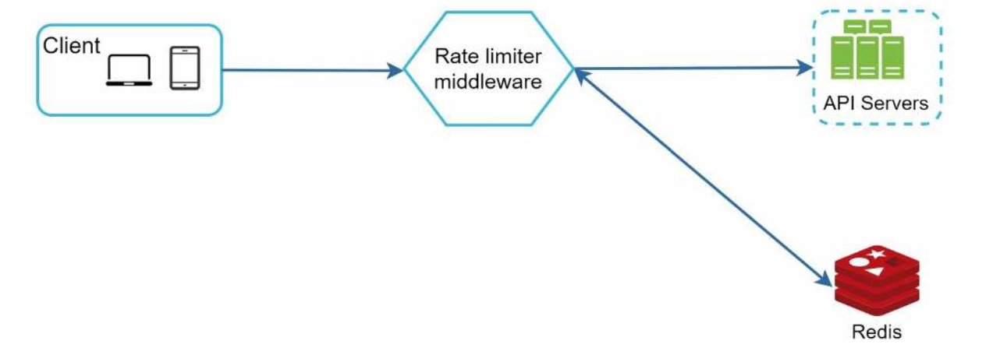

| English | Vietnamese |
|---------|------------|
| • The client sends a request to rate limiting middleware. | • Client gửi một yêu cầu tới middleware giới hạn tốc độ. |
| • Rate limiting middleware fetches the counter from the corresponding bucket in Redis and checks if the limit is reached or not. | • Middleware giới hạn tốc độ lấy bộ đếm từ bucket tương ứng trong Redis và kiểm tra xem giới hạn đã đạt chưa. |
| • If the limit is reached, the request is rejected. | • Nếu giới hạn đã đạt, yêu cầu sẽ bị từ chối. |
| • If the limit is not reached, the request is sent to API servers. Meanwhile, the system increments the counter and saves it back to Redis. | • Nếu giới hạn chưa đạt, yêu cầu được gửi tới các server API. Trong khi đó, hệ thống tăng giá trị bộ đếm và lưu lại vào Redis. |

| English | Vietnamese |
|---------|------------|
| Step 3 - Design deep dive | Bước 3 - Đi sâu vào thiết kế |
| The high-level design in Figure 4-12 does not answer the following questions: | Thiết kế cấp cao trong Hình 4-12 chưa trả lời các câu hỏi sau: |
| • How are rate limiting rules created? Where are the rules stored? | • Các quy tắc giới hạn tốc độ được tạo ra như thế nào? Chúng được lưu ở đâu? |
| • How to handle requests that are rate limited? | • Làm thế nào để xử lý các yêu cầu bị giới hạn tốc độ? |
| In this section, we will first answer the questions regarding rate limiting rules and then go over the strategies to handle rate-limited requests. Finally, we will discuss rate limiting in distributed environment, a detailed design, performance optimization and monitoring. | Trong phần này, chúng ta sẽ trả lời các câu hỏi liên quan đến quy tắc giới hạn tốc độ trước, sau đó đi qua các chiến lược xử lý các yêu cầu bị giới hạn. Cuối cùng, chúng ta sẽ thảo luận về giới hạn tốc độ trong môi trường phân tán, thiết kế chi tiết, tối ưu hiệu năng và giám sát. |
| Rate limiting rules | Quy tắc giới hạn tốc độ |
| Lyft open-sourced their rate-limiting component [12]. We will peek inside of the component and look at some examples of rate limiting rules: | Lyft đã mở mã nguồn thành phần giới hạn tốc độ của họ [12]. Chúng ta sẽ xem bên trong thành phần này và xem một số ví dụ về quy tắc giới hạn tốc độ: |

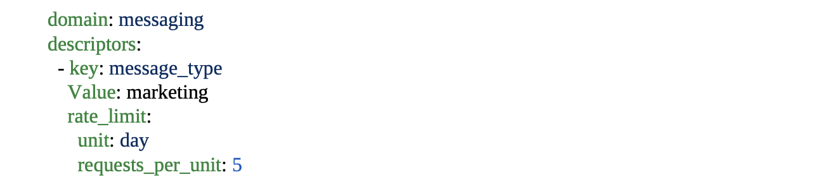

| English | Vietnamese |
|---------|------------|
| In the above example, the system is configured to allow a maximum of 5 marketing messages per day. | Trong ví dụ trên, hệ thống được cấu hình để cho phép tối đa 5 tin nhắn tiếp thị mỗi ngày. |
| Here is another example: | Đây là một ví dụ khác: |

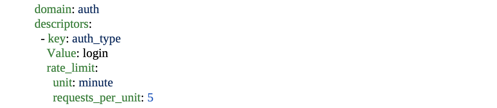

| English | Vietnamese |
|---------|------------|
| This rule shows that clients are not allowed to login more than 5 times in 1 minute. Rules are generally written in configuration files and saved on disk. | Quy tắc này cho thấy khách hàng không được phép đăng nhập quá 5 lần trong 1 phút. Các quy tắc thường được viết trong các tệp cấu hình và lưu trên đĩa. |
| Exceeding the rate limit | Vượt quá giới hạn tốc độ |
| In case a request is rate limited, APIs return a HTTP response code 429 (too many requests) to the client. Depending on the use cases, we may enqueue the rate-limited requests to be processed later. For example, if some orders are rate limited due to system overload, we may keep those orders to be processed later. | Trong trường hợp một yêu cầu bị giới hạn tốc độ, API sẽ trả về mã phản hồi HTTP 429 (quá nhiều yêu cầu) cho khách hàng. Tùy thuộc vào từng trường hợp sử dụng, chúng ta có thể đưa các yêu cầu bị giới hạn tốc độ vào hàng đợi để xử lý sau. Ví dụ, nếu một số đơn hàng bị giới hạn do hệ thống quá tải, chúng ta có thể giữ các đơn hàng đó để xử lý sau. |
| Rate limiter headers | Header của bộ giới hạn tốc độ |
| How does a client know whether it is being throttled? And how does a client know the number of allowed remaining requests before being throttled? The answer lies in HTTP response headers. The rate limiter returns the following HTTP headers to clients: | Làm thế nào để khách hàng biết họ có đang bị giới hạn tốc độ không? Và làm thế nào để khách hàng biết số lượng yêu cầu còn lại được phép trước khi bị giới hạn? Câu trả lời nằm trong header phản hồi HTTP. Bộ giới hạn tốc độ trả về các header HTTP sau cho khách hàng: |
| X-Ratelimit-Remaining: The remaining number of allowed requests within the window. | X-Ratelimit-Remaining: Số lượng yêu cầu còn lại được phép trong khoảng thời gian. |
| X-Ratelimit-Limit: It indicates how many calls the client can make per time window. | X-Ratelimit-Limit: Cho biết khách hàng có thể thực hiện bao nhiêu cuộc gọi trong mỗi khoảng thời gian. |
| X-Ratelimit-Retry-After: The number of seconds to wait until you can make a request again without being throttled. | X-Ratelimit-Retry-After: Số giây cần chờ trước khi có thể thực hiện lại một yêu cầu mà không bị giới hạn. |
| When a user has sent too many requests, a 429 too many requests error and X-Ratelimit-Retry-After header are returned to the client. | Khi người dùng gửi quá nhiều yêu cầu, lỗi 429 (quá nhiều yêu cầu) và header X-Ratelimit-Retry-After sẽ được trả về cho khách hàng. |
| Detailed design | Thiết kế chi tiết |
| Figure 4-13 presents a detailed design of the system. | Hình 4-13 trình bày thiết kế chi tiết của hệ thống. |

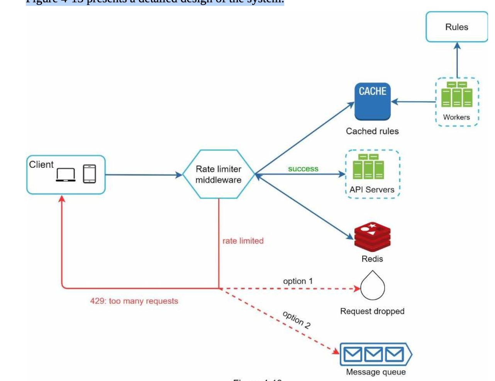

| English | Vietnamese |
|---------|------------|
| Rules are stored on the disk. Workers frequently pull rules from the disk and store them in the cache. | Các quy tắc được lưu trên đĩa. Các worker thường xuyên lấy các quy tắc từ đĩa và lưu vào bộ nhớ cache. |
| When a client sends a request to the server, the request is sent to the rate limiter middleware first. | Khi khách hàng gửi yêu cầu đến máy chủ, yêu cầu được gửi đến middleware của bộ giới hạn tốc độ trước tiên. |
| Rate limiter middleware loads rules from the cache. It fetches counters and last request timestamp from Redis cache. Based on the response, the rate limiter decides: | Middleware của bộ giới hạn tốc độ tải các quy tắc từ cache. Nó lấy giá trị bộ đếm và dấu thời gian yêu cầu cuối cùng từ cache Redis. Dựa trên kết quả, bộ giới hạn tốc độ quyết định: |
| if the request is not rate limited, it is forwarded to API servers. | Nếu yêu cầu không bị giới hạn tốc độ, nó sẽ được chuyển tiếp đến các máy chủ API. |
| if the request is rate limited, the rate limiter returns 429 too many requests error to the client. In the meantime, the request is either dropped or forwarded to the queue. | Nếu yêu cầu bị giới hạn tốc độ, bộ giới hạn tốc độ trả về lỗi 429 (quá nhiều yêu cầu) cho khách hàng. Trong khi đó, yêu cầu sẽ bị loại bỏ hoặc đưa vào hàng đợi. |
| Rate limiter in a distributed environment | Bộ giới hạn tốc độ trong môi trường phân tán |
| Building a rate limiter that works in a single server environment is not difficult. However, scaling the system to support multiple servers and concurrent threads is a different story. | Xây dựng một bộ giới hạn tốc độ hoạt động trong môi trường máy chủ đơn không khó. Tuy nhiên, mở rộng hệ thống để hỗ trợ nhiều máy chủ và các luồng đồng thời là câu chuyện khác. |
| There are two challenges: | Có hai thách thức: |
| Race condition | Điều kiện tranh chấp (Race condition) |
| Synchronization issue | Vấn đề đồng bộ hóa |
| Race condition | Điều kiện tranh chấp (Race condition) |
| As discussed earlier, rate limiter works as follows at the high-level: | Như đã thảo luận trước đó, bộ giới hạn tốc độ hoạt động ở mức cao như sau: |
| Read the counter value from Redis. | Đọc giá trị bộ đếm từ Redis. |
| Check if ( counter + 1 ) exceeds the threshold. | Kiểm tra xem (bộ đếm + 1) có vượt quá ngưỡng không. |
| If not, increment the counter value by 1 in Redis. | Nếu không, tăng giá trị bộ đếm lên 1 trong Redis. |
| Race conditions can happen in a highly concurrent environment as shown in Figure 4-14. | Điều kiện tranh chấp có thể xảy ra trong môi trường có độ đồng thời cao như minh họa trong Hình 4-14. |

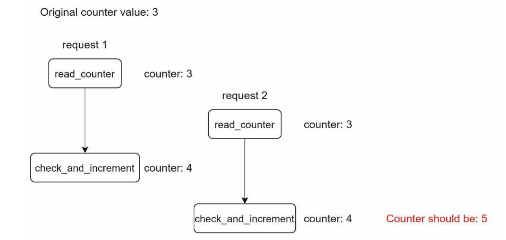

| English | Vietnamese |
|---------|------------|
| Assume the counter value in Redis is 3. If two requests concurrently read the counter value before either of them writes the value back, each will increment the counter by one and write it back without checking the other thread. Both requests (threads) believe they have the correct counter value 4. However, the correct counter value should be 5. | Giả sử giá trị bộ đếm trong Redis là 3. Nếu hai yêu cầu cùng lúc đọc giá trị bộ đếm trước khi bất kỳ yêu cầu nào ghi lại giá trị, mỗi yêu cầu sẽ tăng bộ đếm lên 1 và ghi lại mà không kiểm tra luồng còn lại. Cả hai yêu cầu (luồng) đều nghĩ rằng họ có giá trị bộ đếm đúng là 4. Tuy nhiên, giá trị đúng phải là 5. |
| Locks are the most obvious solution for solving race condition. However, locks will significantly slow down the system. Two strategies are commonly used to solve the problem: Lua script [13] and sorted sets data structure in Redis [8]. For readers interested in these strategies, refer to the corresponding reference materials [8] [13]. | Khóa (locks) là giải pháp hiển nhiên nhất để giải quyết điều kiện tranh chấp. Tuy nhiên, việc sử dụng khóa sẽ làm hệ thống chậm đi đáng kể. Hai chiến lược thường được dùng để giải quyết vấn đề này là: Lua script [13] và cấu trúc dữ liệu sorted sets trong Redis [8]. Những người đọc quan tâm đến các chiến lược này có thể tham khảo tài liệu [8] [13]. |
| Synchronization issue | Vấn đề đồng bộ hóa |
| Synchronization is another important factor to consider in a distributed environment. To support millions of users, one rate limiter server might not be enough to handle the traffic. | Đồng bộ hóa là một yếu tố quan trọng khác cần xem xét trong môi trường phân tán. Để hỗ trợ hàng triệu người dùng, một máy chủ giới hạn tốc độ có thể không đủ để xử lý lưu lượng. |
| When multiple rate limiter servers are used, synchronization is required. For example, on the left side of Figure 4-15, client 1 sends requests to rate limiter 1, and client 2 sends requests to rate limiter 2. As the web tier is stateless, clients can send requests to a different rate limiter as shown on the right side of Figure 4-15. If no synchronization happens, rate limiter 1 does not contain any data about client 2. Thus, the rate limiter cannot work properly. | Khi nhiều máy chủ giới hạn tốc độ được sử dụng, đồng bộ hóa là cần thiết. Ví dụ, ở phía bên trái Hình 4-15, client 1 gửi yêu cầu đến rate limiter 1, và client 2 gửi yêu cầu đến rate limiter 2. Vì tầng web là stateless, các client có thể gửi yêu cầu đến một rate limiter khác như minh họa ở phía bên phải Hình 4-15. Nếu không có đồng bộ hóa, rate limiter 1 sẽ không chứa bất kỳ dữ liệu nào về client 2. Do đó, bộ giới hạn tốc độ sẽ không hoạt động đúng. |

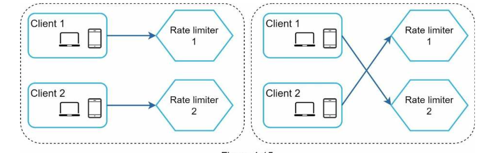

| English | Vietnamese |
|---------|------------|
| One possible solution is to use sticky sessions that allow a client to send traffic to the same rate limiter. This solution is not advisable because it is neither scalable nor flexible. | Một giải pháp có thể là sử dụng sticky sessions, cho phép client gửi lưu lượng đến cùng một rate limiter. Giải pháp này không được khuyến nghị vì nó không mở rộng được và thiếu linh hoạt. |
| A better approach is to use centralized data stores like Redis. The design is shown in Figure 4-16. | Một phương pháp tốt hơn là sử dụng kho dữ liệu tập trung như Redis. Thiết kế được minh họa trong Hình 4-16. |

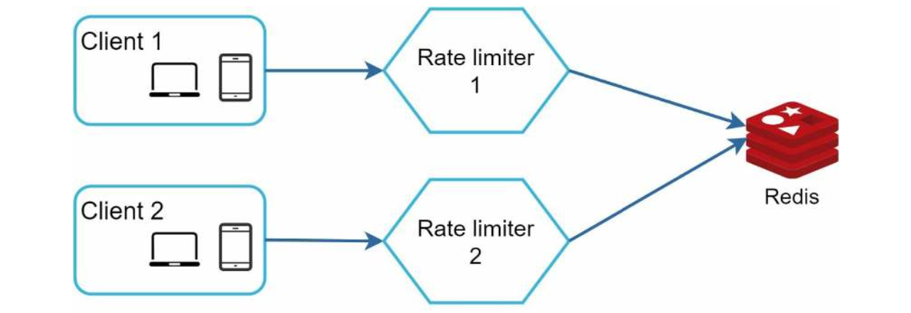

| English | Vietnamese |
|---------|------------|
| Performance optimization is a common topic in system design interviews. We will cover two areas to improve. | Tối ưu hóa hiệu năng là một chủ đề phổ biến trong các cuộc phỏng vấn thiết kế hệ thống. Chúng ta sẽ đề cập đến hai lĩnh vực cần cải thiện. |
| First, multi-data center setup is crucial for a rate limiter because latency is high for users located far away from the data center. | Đầu tiên, việc thiết lập nhiều trung tâm dữ liệu là rất quan trọng đối với bộ giới hạn tốc độ vì độ trễ cao đối với người dùng ở xa trung tâm dữ liệu. |
| Most cloud service providers build many edge server locations around the world. | Hầu hết các nhà cung cấp dịch vụ đám mây xây dựng nhiều vị trí máy chủ biên trên toàn thế giới. |
| For example, as of 5/20 2020, Cloudflare has 194 geographically distributed edge servers [14]. | Ví dụ, tính đến ngày 20/5/2020, Cloudflare có 194 máy chủ biên phân tán theo địa lý [14]. |
| Traffic is automatically routed to the closest edge server to reduce latency. | Lưu lượng được tự động định tuyến đến máy chủ biên gần nhất để giảm độ trễ. |

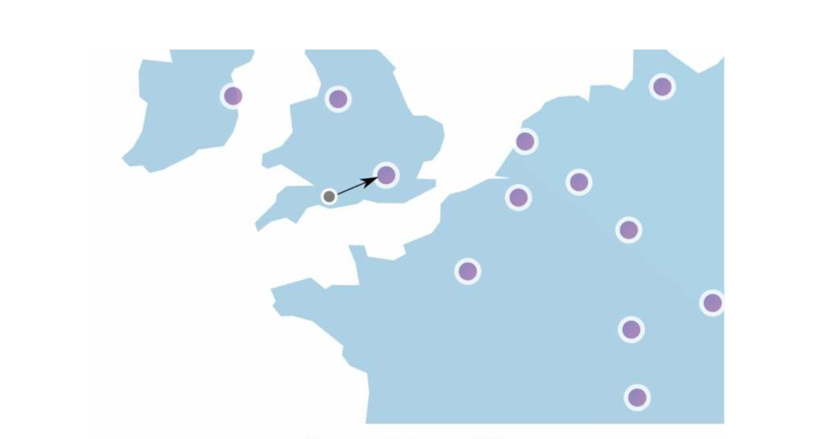

| English | Vietnamese |
|---------|------------|
| Second, synchronize data with an eventual consistency model. If you are unclear about the eventual consistency model, refer to the “Consistency” section in “Chapter 6: Design a Key-value Store.” | Thứ hai, đồng bộ dữ liệu với mô hình nhất quán cuối cùng. Nếu bạn chưa rõ về mô hình nhất quán cuối cùng, tham khảo phần “Consistency” trong “Chương 6: Thiết kế Key-value Store.” |
| Monitoring | Giám sát |
| After the rate limiter is put in place, it is important to gather analytics data to check whether the rate limiter is effective. | Sau khi bộ giới hạn tốc độ được triển khai, việc thu thập dữ liệu phân tích để kiểm tra hiệu quả của nó là rất quan trọng. |
| Primarily, we want to make sure: | Chủ yếu, chúng ta muốn đảm bảo: |
| • The rate limiting algorithm is effective. | • Thuật toán giới hạn tốc độ hoạt động hiệu quả. |
| • The rate limiting rules are effective. | • Các quy tắc giới hạn tốc độ hoạt động hiệu quả. |
| For example, if rate limiting rules are too strict, many valid requests are dropped. In this case, we want to relax the rules a little bit. | Ví dụ, nếu các quy tắc giới hạn tốc độ quá nghiêm ngặt, nhiều yêu cầu hợp lệ sẽ bị bỏ qua. Trong trường hợp này, chúng ta muốn nới lỏng quy tắc một chút. |
| In another example, we notice our rate limiter becomes ineffective when there is a sudden increase in traffic like flash sales. In this scenario, we may replace the algorithm to support burst traffic. Token bucket is a good fit here. | Trong một ví dụ khác, chúng tôi nhận thấy bộ giới hạn tốc độ trở nên không hiệu quả khi có sự tăng đột ngột về lưu lượng như các đợt flash sale. Trong tình huống này, chúng tôi có thể thay thuật toán để hỗ trợ lưu lượng đột biến. Token bucket phù hợp ở đây. |
| Step 4 - Wrap up | Bước 4 - Tổng kết |
| In this chapter, we discussed different algorithms of rate limiting and their pros/cons. | Trong chương này, chúng ta đã thảo luận về các thuật toán giới hạn tốc độ khác nhau và ưu/nhược điểm của chúng. |
| Algorithms discussed include: | Các thuật toán được thảo luận bao gồm: |
| • Token bucket | • Token bucket |
| • Leaking bucket | • Leaking bucket |
| • Fixed window | • Fixed window |
| • Sliding window log | • Sliding window log |
| • Sliding window counter | • Sliding window counter |
| Then, we discussed the system architecture, rate limiter in a distributed environment, performance optimization and monitoring. | Sau đó, chúng ta đã thảo luận về kiến trúc hệ thống, bộ giới hạn tốc độ trong môi trường phân tán, tối ưu hóa hiệu năng và giám sát. |
| Similar to any system design interview questions, there are additional talking points you can mention if time allows: | Tương tự như bất kỳ câu hỏi phỏng vấn thiết kế hệ thống nào, có những điểm thảo luận bổ sung mà bạn có thể đề cập nếu còn thời gian: |
| • Hard vs soft rate limiting. | • Giới hạn tốc độ cứng vs mềm. |
| • Hard: The number of requests cannot exceed the threshold. | • Cứng: Số lượng yêu cầu không được vượt quá ngưỡng. |
| • Soft: Requests can exceed the threshold for a short period. | • Mềm: Yêu cầu có thể vượt quá ngưỡng trong một khoảng thời gian ngắn. |
| • Rate limiting at different levels. In this chapter, we only talked about rate limiting at the application level (HTTP: layer 7). It is possible to apply rate limiting at other layers. | • Giới hạn tốc độ ở các cấp độ khác nhau. Trong chương này, chúng ta chỉ thảo luận về giới hạn tốc độ ở cấp ứng dụng (HTTP: layer 7). Có thể áp dụng giới hạn tốc độ ở các lớp khác. |
| For example, you can apply rate limiting by IP addresses using Iptables [15] (IP: layer 3). | Ví dụ, bạn có thể áp dụng giới hạn tốc độ theo địa chỉ IP bằng Iptables [15] (IP: layer 3). |
| Note: The Open Systems Interconnection model (OSI model) has 7 layers [16]: Layer 1: Physical layer, Layer 2: Data link layer, Layer 3: Network layer, Layer 4: Transport layer, Layer 5: Session layer, Layer 6: Presentation layer, Layer 7: Application layer. | Lưu ý: Mô hình OSI (Open Systems Interconnection) có 7 lớp [16]: Lớp 1: Physical, Lớp 2: Data link, Lớp 3: Network, Lớp 4: Transport, Lớp 5: Session, Lớp 6: Presentation, Lớp 7: Application. |
| • Avoid being rate limited. Design your client with best practices: | • Tránh bị giới hạn tốc độ. Thiết kế client theo các thực hành tốt nhất: |
| • Use client cache to avoid making frequent API calls. | • Sử dụng bộ nhớ đệm trên client để tránh gọi API quá thường xuyên. |
| • Understand the limit and do not send too many requests in a short time frame. | • Hiểu giới hạn và không gửi quá nhiều yêu cầu trong khoảng thời gian ngắn. |
| • Include code to catch exceptions or errors so your client can gracefully recover from exceptions. | • Bao gồm mã để bắt các ngoại lệ hoặc lỗi để client có thể phục hồi một cách mềm mại. |
| • Add sufficient back off time to retry logic. | • Thêm thời gian chờ hợp lý vào logic thử lại. |
| Congratulations on getting this far! Now give yourself a pat on the back. Good job! | Chúc mừng bạn đã đi được đến đây! Hãy tự vỗ vai mình một cái. Làm tốt lắm! |
