| English | Vietnamese |
|---------|------------|
| CHAPTER 5: DESIGN CONSISTENT HASHING | CHƯƠNG 5: THIẾT KẾ HASHING NHẤT QUÁN |
| To achieve horizontal scaling, it is important to distribute requests/data efficiently and evenly across servers. | Để đạt được khả năng mở rộng theo chiều ngang, điều quan trọng là phải phân phối các yêu cầu/dữ liệu một cách hiệu quả và đồng đều giữa các máy chủ. |
| Consistent hashing is a commonly used technique to achieve this goal. | Hashing nhất quán là một kỹ thuật thường được sử dụng để đạt được mục tiêu này. |
| But first, let us take an in-depth look at the problem | Nhưng trước tiên, hãy cùng xem xét sâu hơn về vấn đề này |
| English | Vietnamese |
|---------|------------|
| The rehashing problem | Vấn đề tái băm |
| If you have n cache servers, a common way to balance the load is to use the following hash method: | Nếu bạn có n máy chủ cache, một cách phổ biến để cân bằng tải là sử dụng phương pháp băm sau: |
| serverIndex = hash(key) % N, where N is the size of the server pool. | serverIndex = hash(key) % N, trong đó N là số lượng máy chủ trong cụm. |
| Let us use an example to illustrate how it works. | Hãy dùng một ví dụ để minh họa cách hoạt động của nó. |
| As shown in Table 5-1, we have 4 servers and 8 string keys with their hashes. | Như trong Bảng 5-1, chúng ta có 4 máy chủ và 8 khóa chuỗi với giá trị băm của chúng. |

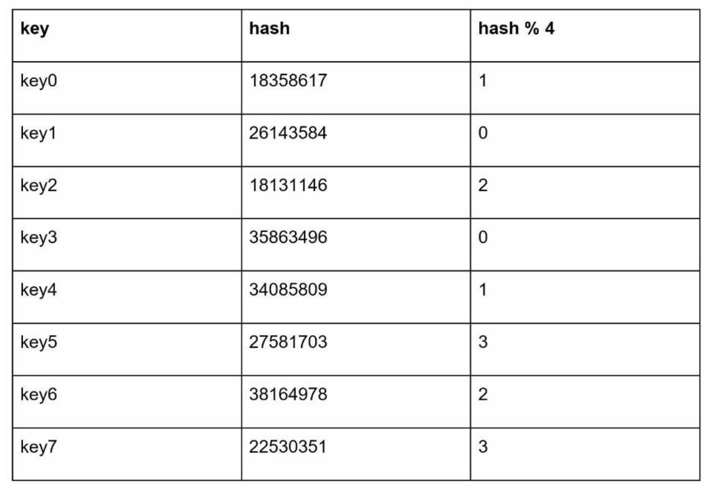

| English | Vietnamese |
|---------|------------|
| To fetch the server where a key is stored, we perform the modular operation f(key) % 4. | Để lấy máy chủ nơi một khóa được lưu trữ, chúng ta thực hiện phép toán chia lấy dư f(key) % 4. |
| For instance, hash(key0) % 4 = 1 means a client must contact server 1 to fetch the cached data. | Ví dụ, hash(key0) % 4 = 1 có nghĩa là một client phải liên hệ với máy chủ 1 để lấy dữ liệu trong cache. |
| Figure 5-1 shows the distribution of keys based on Table 5-1. | Hình 5-1 minh họa sự phân phối các khóa dựa trên Bảng 5-1. |

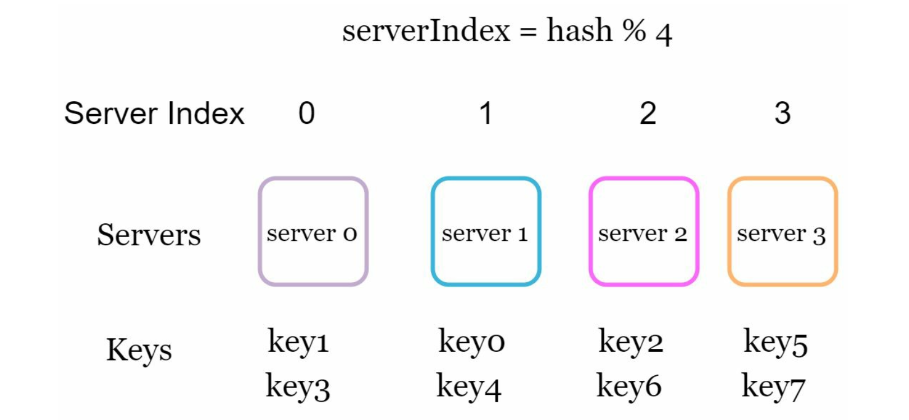

| English | Vietnamese |
|---------|------------|
| This approach works well when the size of the server pool is fixed, and the data distribution is even. | Cách tiếp cận này hoạt động tốt khi kích thước cụm máy chủ được cố định và dữ liệu được phân phối đồng đều. |
| However, problems arise when new servers are added, or existing servers are removed. | Tuy nhiên, vấn đề nảy sinh khi các máy chủ mới được thêm vào hoặc các máy chủ hiện tại bị gỡ bỏ. |
| For example, if server 1 goes offline, the size of the server pool becomes 3. | Ví dụ, nếu máy chủ 1 ngừng hoạt động, kích thước cụm máy chủ sẽ trở thành 3. |
| Using the same hash function, we get the same hash value for a key. | Sử dụng cùng một hàm băm, chúng ta nhận được cùng một giá trị băm cho một khóa. |
| But applying modular operation gives us different server indexes because the number of servers is reduced by 1. | Nhưng khi áp dụng phép chia lấy dư, chúng ta nhận được chỉ số máy chủ khác nhau vì số lượng máy chủ đã giảm đi 1. |
| We get the results as shown in Table 5-2 by applying hash % 3: | Chúng ta nhận được kết quả như trong Bảng 5-2 bằng cách áp dụng hash % 3: |

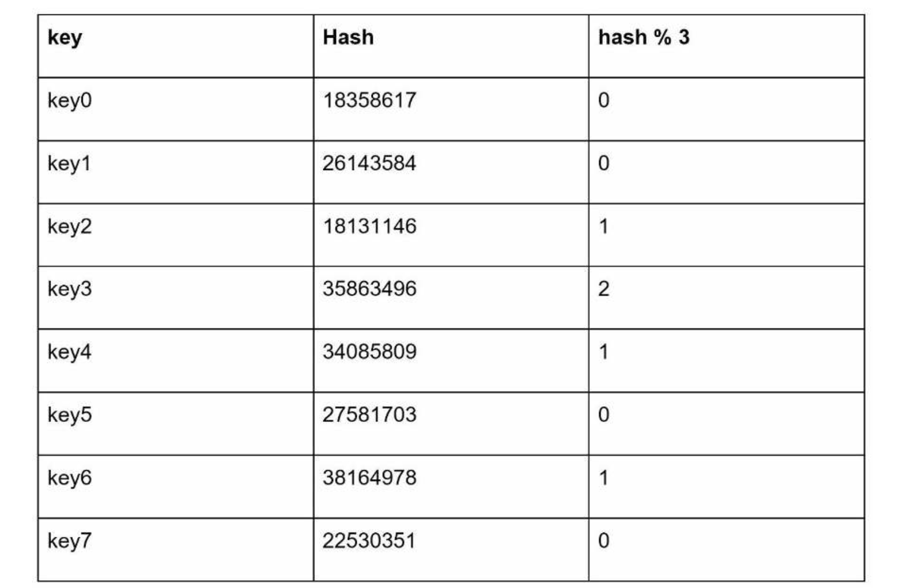

| English | Vietnamese |
|---------|------------|
| Figure 5-2 shows the new distribution of keys based on Table 5-2. | Hình 5-2 minh họa sự phân phối mới của các khóa dựa trên Bảng 5-2. |

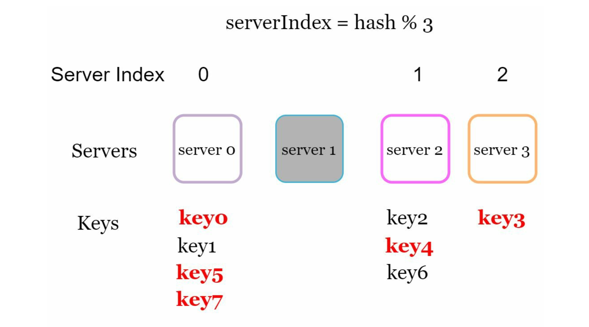

| English | Vietnamese |
|---------|------------|
| As shown in Figure 5-2, most keys are redistributed, not just the ones originally stored in the offline server (server 1). | Như thể hiện trong Hình 5-2, hầu hết các khóa đều được phân phối lại, không chỉ những khóa ban đầu được lưu trên máy chủ ngoại tuyến (máy chủ 1). |
| This means that when server 1 goes offline, most cache clients will connect to the wrong servers to fetch data. | Điều này có nghĩa là khi máy chủ 1 ngừng hoạt động, hầu hết các client cache sẽ kết nối đến sai máy chủ để lấy dữ liệu. |
| This causes a storm of cache misses. | Điều này gây ra một “cơn bão” cache miss. |
| Consistent hashing is an effective technique to mitigate this problem. | Hashing nhất quán (consistent hashing) là một kỹ thuật hiệu quả để giảm thiểu vấn đề này. |

| English | Vietnamese |
|---------|------------|
| Consistent hashing | Hashing nhất quán |
| Quoted from Wikipedia: "Consistent hashing is a special kind of hashing such that when a hash table is re-sized and consistent hashing is used, only k/n keys need to be remapped on average, where k is the number of keys, and n is the number of slots. In contrast, in most traditional hash tables, a change in the number of array slots causes nearly all keys to be remapped [1]”. | Trích từ Wikipedia: "Hashing nhất quán là một loại hashing đặc biệt sao cho khi một bảng băm được thay đổi kích thước và hashing nhất quán được sử dụng, trung bình chỉ cần ánh xạ lại k/n khóa, trong đó k là số khóa và n là số ô. Ngược lại, trong hầu hết các bảng băm truyền thống, việc thay đổi số lượng ô mảng sẽ khiến gần như tất cả các khóa phải được ánh xạ lại [1]". |
| Hash space and hash ring | Không gian băm và vòng băm |
| Now we understand the definition of consistent hashing, let us find out how it works. | Bây giờ chúng ta đã hiểu định nghĩa về hashing nhất quán, hãy tìm hiểu cách nó hoạt động. |
| Assume SHA-1 is used as the hash function f, and the output range of the hash function is: x0, x1, x2, x3, …, xn. | Giả sử SHA-1 được sử dụng làm hàm băm f, và miền giá trị đầu ra của hàm băm là: x0, x1, x2, x3, …, xn. |
| In cryptography, SHA-1’s hash space goes from 0 to 2^160 - 1. | Trong mật mã học, không gian băm của SHA-1 kéo dài từ 0 đến 2^160 - 1. |
| That means x0 corresponds to 0, xn corresponds to 2^160 – 1, and all the other hash values in the middle fall between 0 and 2^160 - 1. | Điều đó có nghĩa là x0 tương ứng với 0, xn tương ứng với 2^160 – 1, và tất cả các giá trị băm khác ở giữa nằm trong khoảng từ 0 đến 2^160 - 1. |
| Figure 5-3 shows the hash space. | Hình 5-3 minh họa không gian băm. |

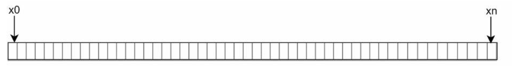

| English | Vietnamese |
|---------|------------|
| By collecting both ends, we get a hash ring as shown in Figure 5-4: | Bằng cách nối hai đầu lại, chúng ta có được một vòng băm như minh họa trong Hìn

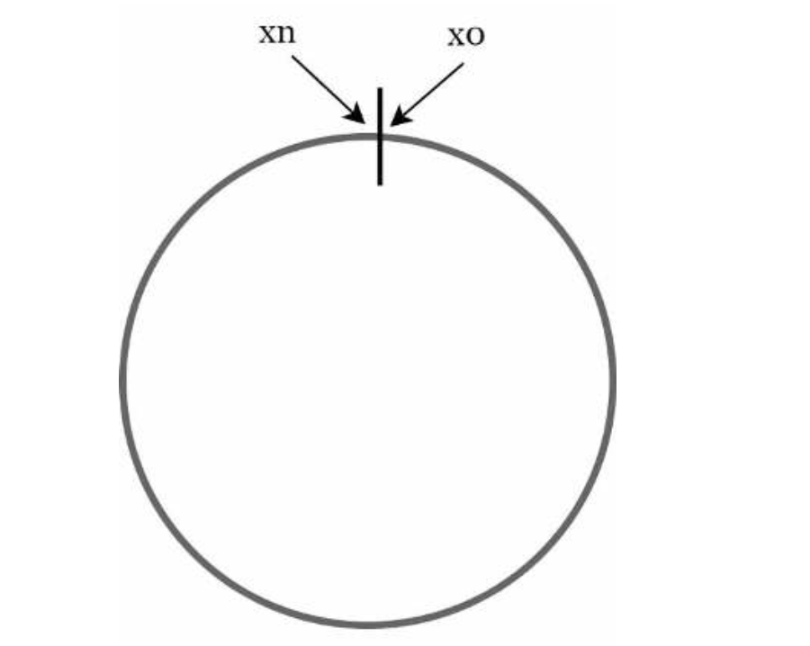

| English | Vietnamese |
|---------|------------|
| Hash servers | Băm máy chủ |
| Using the same hash function f, we map servers based on server IP or name onto the ring. | Sử dụng cùng một hàm băm f, chúng ta ánh xạ các máy chủ dựa trên IP hoặc tên máy chủ lên vòng băm. |
| Figure 5-5 shows that 4 servers are mapped on the hash ring. | Hình 5-5 cho thấy có 4 máy chủ được ánh xạ trên vòng băm. |

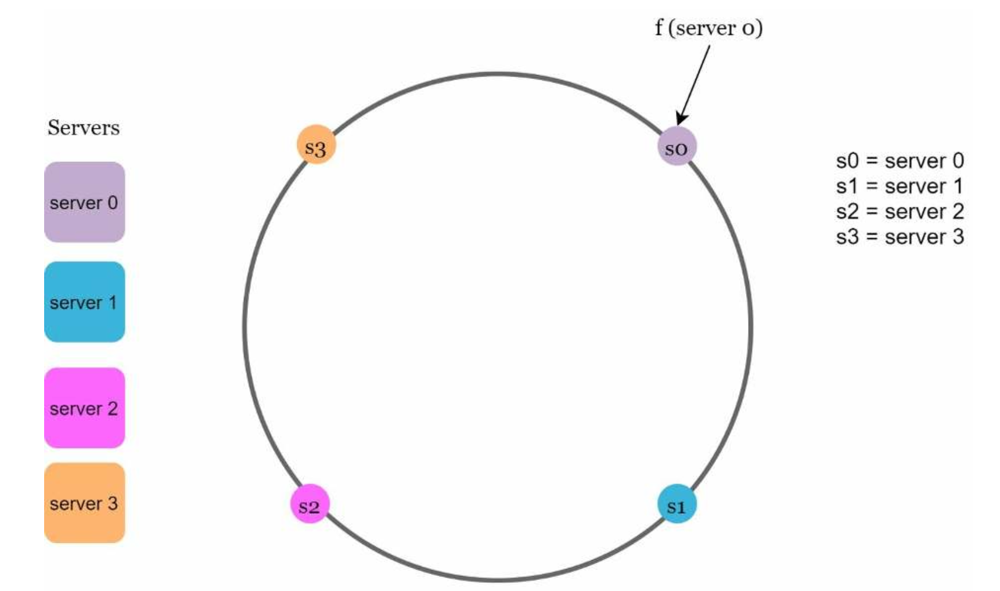

| English | Vietnamese |
|---------|------------|
| Hash keys | Băm các khóa |
| One thing worth mentioning is that hash function used here is different from the one in “the rehashing problem,” and there is no modular operation. | Một điều đáng chú ý là hàm băm được sử dụng ở đây khác với hàm trong “vấn đề tái băm,” và không có phép toán chia lấy dư. |
| As shown in Figure 5-6, 4 cache keys (key0, key1, key2, and key3) are hashed onto the hash ring. | Như thể hiện trong Hình 5-6, 4 khóa cache (key0, key1, key2 và key3) được băm lên vòng băm. |

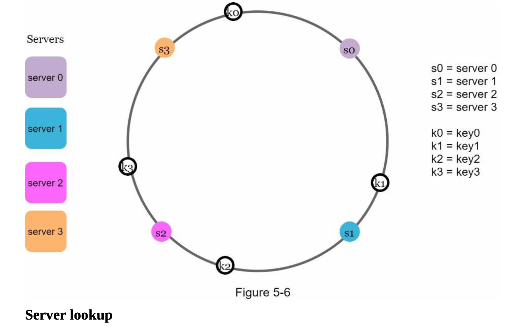

| English | Vietnamese |
|---------|------------|
| To determine which server a key is stored on, we go clockwise from the key position on the ring until a server is found. | Để xác định một khóa được lưu trữ trên máy chủ nào, chúng ta đi theo chiều kim đồng hồ từ vị trí của khóa trên vòng băm cho đến khi gặp một máy chủ. |
| Figure 5-7 explains this process. | Hình 5-7 giải thích quá trình này. |
| Going clockwise, key0 is stored on server 0; key1 is stored on server 1; key2 is stored on server 2 and key3 is stored on server 3. | Theo chiều kim đồng hồ, key0 được lưu trên máy chủ 0; key1 được lưu trên máy chủ 1; key2 được lưu trên máy chủ 2 và key3 được lưu trên máy chủ 3. |

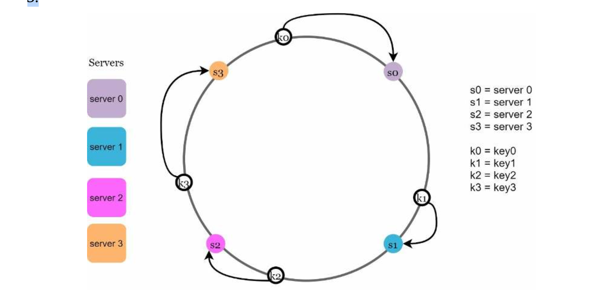

| English | Vietnamese |
|---------|------------|
| Add a server | Thêm một máy chủ |
| Using the logic described above, adding a new server will only require redistribution of a fraction of keys. | Theo logic đã mô tả ở trên, việc thêm một máy chủ mới chỉ yêu cầu phân phối lại một phần nhỏ các khóa. |
| In Figure 5-8, after a new server 4 is added, only key0 needs to be redistributed. k1, k2, and k3 remain on the same servers. | Trong Hình 5-8, sau khi thêm máy chủ 4, chỉ có key0 cần được phân phối lại. k1, k2 và k3 vẫn nằm trên cùng máy chủ như trước. |
| Let us take a close look at the logic. Before server 4 is added, key0 is stored on server 0. | Hãy xem xét kỹ logic này. Trước khi máy chủ 4 được thêm vào, key0 được lưu trên máy chủ 0. |
| Now, key0 will be stored on server 4 because server 4 is the first server it encounters by going clockwise from key0’s position on the ring. | Bây giờ, key0 sẽ được lưu trên máy chủ 4 vì máy chủ 4 là máy chủ đầu tiên mà nó gặp khi đi theo chiều kim đồng hồ từ vị trí của key0 trên vòng băm. |
| The other keys are not redistributed based on consistent hashing algorithm. | Các khóa khác không bị phân phối lại dựa trên thuật toán hashing nhất quán. |

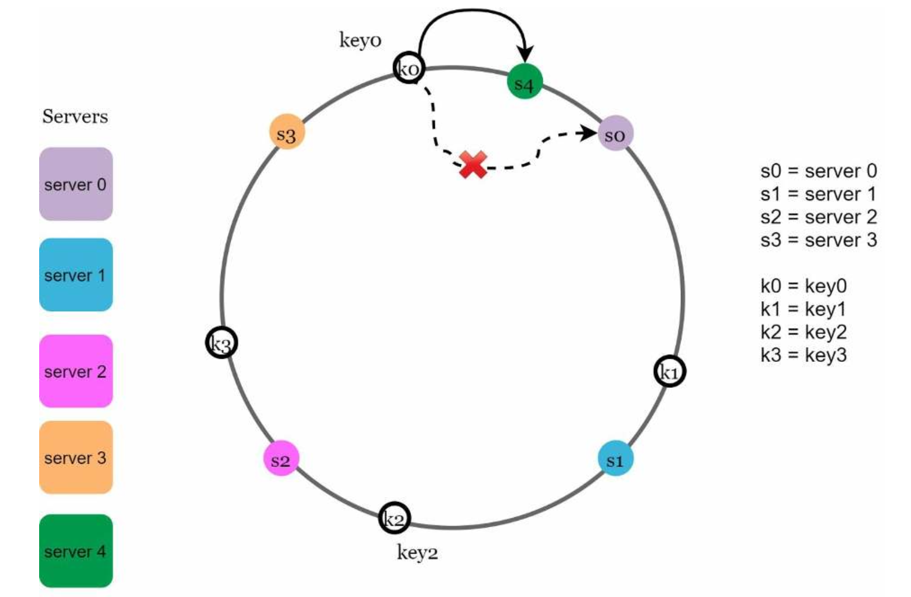

| English | Vietnamese |
|---------|------------|
| Remove a server | Gỡ bỏ một máy chủ |
| When a server is removed, only a small fraction of keys require redistribution with consistent hashing. | Khi một máy chủ bị gỡ bỏ, chỉ một phần nhỏ các khóa cần được phân phối lại với hashing nhất quán. |
| In Figure 5-9, when server 1 is removed, only key1 must be remapped to server 2. | Trong Hình 5-9, khi máy chủ 1 bị gỡ bỏ, chỉ có key1 phải được ánh xạ lại sang máy chủ 2. |
| The rest of the keys are unaffected. | Các khóa còn lại không bị ảnh hưởng. |

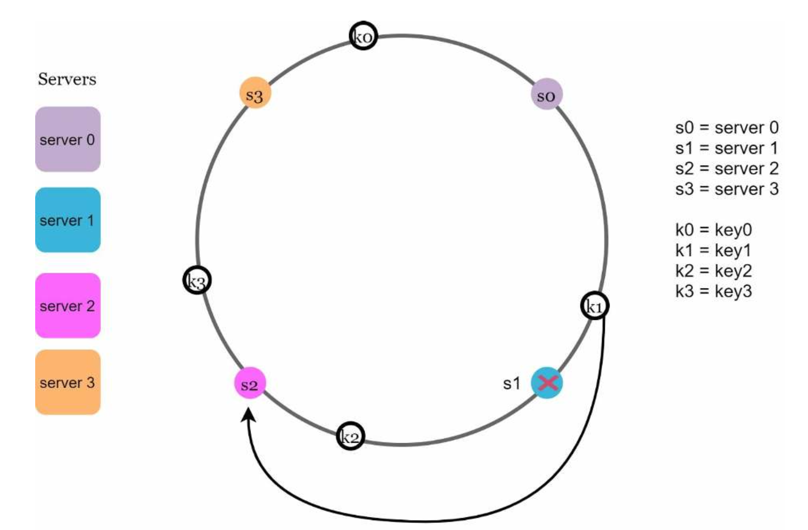

| English | Vietnamese |
|---------|------------|
| Two issues in the basic approach | Hai vấn đề trong cách tiếp cận cơ bản |
| The consistent hashing algorithm was introduced by Karger et al. at MIT [1]. | Thuật toán hashing nhất quán được giới thiệu bởi Karger và cộng sự tại MIT [1]. |
| The basic steps are: | Các bước cơ bản là: |
| • Map servers and keys on to the ring using a uniformly distributed hash function. | • Ánh xạ các máy chủ và khóa lên vòng băm bằng cách sử dụng hàm băm phân phối đồng đều. |
| • To find out which server a key is mapped to, go clockwise from the key position until the first server on the ring is found. | • Để tìm ra khóa được ánh xạ tới máy chủ nào, đi theo chiều kim đồng hồ từ vị trí của khóa cho đến khi gặp máy chủ đầu tiên trên vòng băm. |
| Two problems are identified with this approach. | Hai vấn đề được xác định với cách tiếp cận này. |
| First, it is impossible to keep the same size of partitions on the ring for all servers considering a server can be added or removed. | Thứ nhất, không thể giữ kích thước phân vùng trên vòng băm đồng nhất cho tất cả các máy chủ vì có thể thêm hoặc gỡ bỏ máy chủ. |
| A partition is the hash space between adjacent servers. | Một phân vùng là không gian băm giữa các máy chủ liền kề. |
| It is possible that the size of the partitions on the ring assigned to each server is very small or fairly large. | Kích thước các phân vùng trên vòng băm được gán cho mỗi máy chủ có thể rất nhỏ hoặc khá lớn. |
| In Figure 5-10, if s1 is removed, s2’s partition (highlighted with the bidirectional arrows) is twice as large as s0 and s3’s partition. | Trong Hình 5-10, nếu s1 bị gỡ bỏ, phân vùng của s2 (được đánh dấu bằng các mũi tên hai chiều) sẽ lớn gấp đôi so với phân vùng của s0 và s3. |

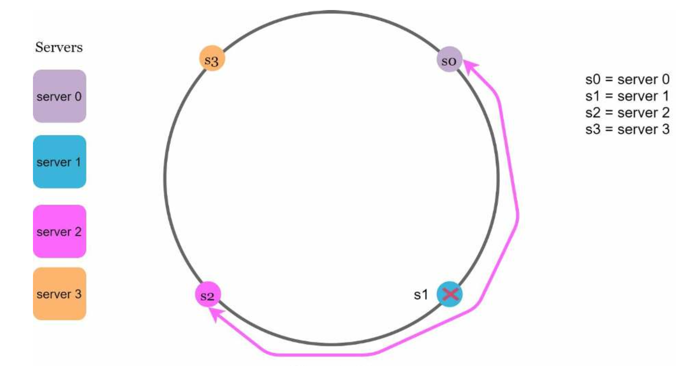

| English | Vietnamese |
|---------|------------|
| Second, it is possible to have a non-uniform key distribution on the ring. | Thứ hai, có thể xảy ra tình trạng phân phối khóa không đồng đều trên vòng băm. |
| For instance, if servers are mapped to positions listed in Figure 5-11, most of the keys are stored on server 2. | Ví dụ, nếu các máy chủ được ánh xạ đến các vị trí như trong Hình 5-11, hầu hết các khóa sẽ được lưu trên máy chủ 2. |
| However, server 1 and server 3 have no data. | Tuy nhiên, máy chủ 1 và máy chủ 3 không có dữ liệu nào. |

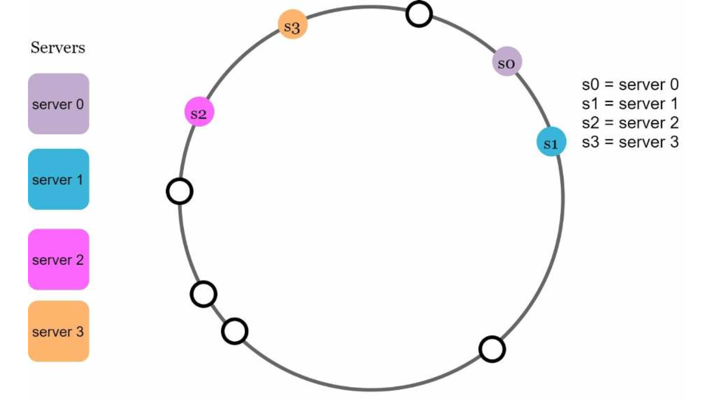

| English | Vietnamese |
|---------|------------|
| A technique called virtual nodes or replicas is used to solve these problems. | Một kỹ thuật gọi là nút ảo hoặc bản sao được sử dụng để giải quyết các vấn đề này. |
| Virtual nodes | Nút ảo |
| A virtual node refers to the real node, and each server is represented by multiple virtual nodes on the ring. | Một nút ảo tham chiếu đến nút thực, và mỗi máy chủ được biểu diễn bởi nhiều nút ảo trên vòng băm. |
| In Figure 5-12, both server 0 and server 1 have 3 virtual nodes. | Trong Hình 5-12, cả máy chủ 0 và máy chủ 1 đều có 3 nút ảo. |
| The 3 is arbitrarily chosen; and in real-world systems, the number of virtual nodes is much larger. | Con số 3 được chọn tùy ý; trong các hệ thống thực tế, số lượng nút ảo thường lớn hơn nhiều. |
| Instead of using s0, we have s0_0, s0_1, and s0_2 to represent server 0 on the ring. | Thay vì sử dụng s0, chúng ta có s0_0, s0_1 và s0_2 để biểu diễn máy chủ 0 trên vòng băm. |
| Similarly, s1_0, s1_1, and s1_2 represent server 1 on the ring. | Tương tự, s1_0, s1_1 và s1_2 biểu diễn máy chủ 1 trên vòng băm. |
| With virtual nodes, each server is responsible for multiple partitions. | Với các nút ảo, mỗi máy chủ chịu trách nhiệm cho nhiều phân vùng. |
| Partitions (edges) with label s0 are managed by server 0. | Các phân vùng (cạnh) có nhãn s0 được quản lý bởi máy chủ 0. |
| On the other hand, partitions with label s1 are managed by server 1. | Mặt khác, các phân vùng có nhãn s1 được quản lý bởi máy chủ 1. |

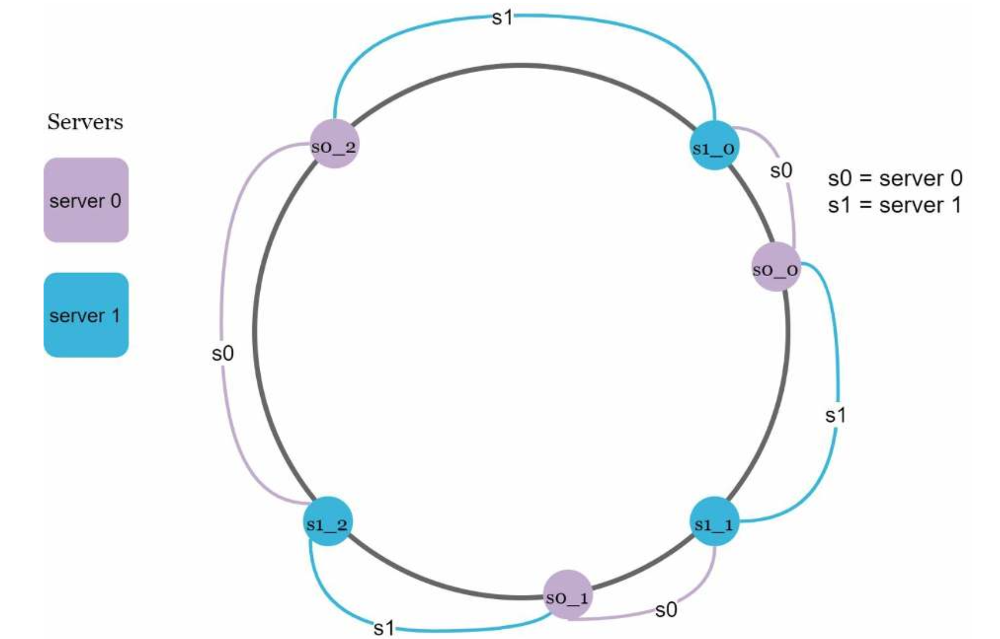

| English | Vietnamese |
|---------|------------|
| To find which server a key is stored on, we go clockwise from the key’s location and find the first virtual node encountered on the ring. | Để tìm xem một khóa được lưu trữ trên máy chủ nào, ta đi theo chiều kim đồng hồ từ vị trí của khóa và tìm nút ảo đầu tiên gặp trên vòng. |
| In Figure 5-13, to find out which server k0 is stored on, we go clockwise from k0’s location and find virtual node s1_1, which refers to server 1. | Trong Hình 5-13, để tìm xem khóa k0 được lưu trên máy chủ nào, ta đi theo chiều kim đồng hồ từ vị trí của k0 và tìm nút ảo s1_1, nút này tham chiếu đến máy chủ 1. |

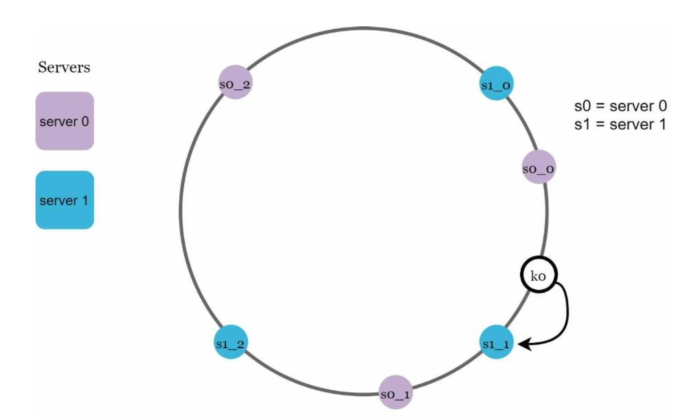

| English | Vietnamese |
|---------|------------|
| As the number of virtual nodes increases, the distribution of keys becomes more balanced. | Khi số lượng nút ảo tăng lên, việc phân phối các khóa trở nên cân bằng hơn. |
| This is because the standard deviation gets smaller with more virtual nodes, leading to balanced data distribution. | Điều này là do độ lệch chuẩn nhỏ hơn khi có nhiều nút ảo, dẫn đến phân phối dữ liệu cân bằng. |
| Standard deviation measures how data are spread out. | Độ lệch chuẩn đo lường mức độ phân tán của dữ liệu. |
| The outcome of an experiment carried out by online research [2] shows that with one or two hundred virtual nodes, the standard deviation is between 5% (200 virtual nodes) and 10% (100 virtual nodes) of the mean. | Kết quả của một thí nghiệm do nghiên cứu trực tuyến [2] thực hiện cho thấy với một hoặc hai trăm nút ảo, độ lệch chuẩn nằm trong khoảng 5% (200 nút ảo) và 10% (100 nút ảo) của giá trị trung bình. |
| The standard deviation will be smaller when we increase the number of virtual nodes. | Độ lệch chuẩn sẽ nhỏ hơn khi chúng ta tăng số lượng nút ảo. |
| However, more spaces are needed to store data about virtual nodes. | Tuy nhiên, cần nhiều không gian hơn để lưu trữ dữ liệu về các nút ảo. |
| This is a tradeoff, and we can tune the number of virtual nodes to fit our system requirements. | Đây là một sự đánh đổi, và chúng ta có thể điều chỉnh số lượng nút ảo để phù hợp với yêu cầu của hệ thống. |
| **Find affected keys** | **Tìm các khóa bị ảnh hưởng** |
| When a server is added or removed, a fraction of data needs to be redistributed. How can we find the affected range to redistribute the keys? | Khi một máy chủ được thêm hoặc gỡ bỏ, một phần dữ liệu cần được phân phối lại. Làm thế nào chúng ta có thể tìm phạm vi bị ảnh hưởng để phân phối lại các khóa? |
| In Figure 5-14, server 4 is added onto the ring. The affected range starts from s4 (newly added node) and moves anticlockwise around the ring until a server is found (s3). Thus, keys located between s3 and s4 need to be redistributed to s4. | Trong Hình 5-14, máy chủ 4 được thêm vào vòng. Phạm vi bị ảnh hưởng bắt đầu từ s4 (nút mới được thêm) và di chuyển ngược chiều kim đồng hồ quanh vòng cho đến khi gặp một máy chủ (s3). Do đó, các khóa nằm giữa s3 và s4 cần được phân phối lại cho s4. |

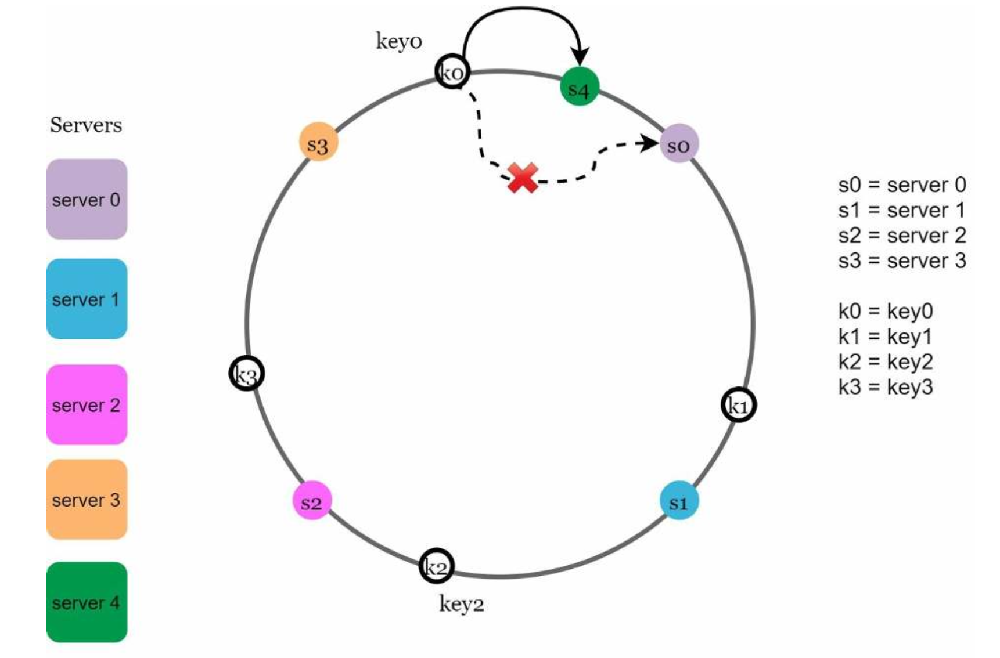

| English | Vietnamese |
|---------|------------|
| When a server (s1) is removed as shown in Figure 5-15, the affected range starts from s1 (removed node) and moves anticlockwise around the ring until a server is found (s0). Thus, keys located between s0 and s1 must be redistributed to s2. | Khi một máy chủ (s1) bị loại bỏ như minh họa trong Hình 5-15, phạm vi bị ảnh hưởng bắt đầu từ s1 (nút bị loại bỏ) và di chuyển ngược chiều kim đồng hồ quanh vòng cho đến khi tìm thấy một máy chủ (s0). Do đó, các khóa nằm giữa s0 và s1 phải được phân phối lại cho s2. |

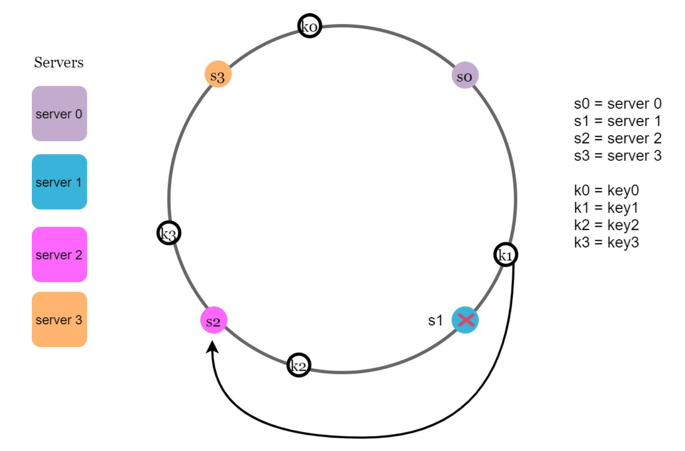

| English | Vietnamese |
|---------|------------|
| Wrap up | Tổng kết |
| In this chapter, we had an in-depth discussion about consistent hashing, including why it is needed and how it works. | Trong chương này, chúng ta đã thảo luận chi tiết về băm nhất quán (consistent hashing), bao gồm lý do tại sao nó cần thiết và cách nó hoạt động. |
| The benefits of consistent hashing include: | Các lợi ích của băm nhất quán bao gồm: |
| • Minimized keys are redistributed when servers are added or removed. | • Số lượng khóa cần phân phối lại được giảm thiểu khi thêm hoặc loại bỏ máy chủ. |
| • It is easy to scale horizontally because data are more evenly distributed. | • Dễ dàng mở rộng theo chiều ngang vì dữ liệu được phân phối đồng đều hơn. |
| • Mitigate hotspot key problem. Excessive access to a specific shard could cause server overload. Imagine data for Katy Perry, Justin Bieber, and Lady Gaga all end up on the same shard. Consistent hashing helps to mitigate the problem by distributing the data more evenly. | • Giảm thiểu vấn đề "điểm nóng" khóa. Việc truy cập quá mức vào một phân mảnh cụ thể có thể gây quá tải máy chủ. Hãy tưởng tượng dữ liệu của Katy Perry, Justin Bieber và Lady Gaga đều nằm trên cùng một phân mảnh. Băm nhất quán giúp giảm thiểu vấn đề này bằng cách phân phối dữ liệu đồng đều hơn. |
| Consistent hashing is widely used in real-world systems, including some notable ones: | Băm nhất quán được sử dụng rộng rãi trong các hệ thống thực tế, bao gồm một số hệ thống đáng chú ý: |
| • Partitioning component of Amazon’s Dynamo database [3] | • Thành phần phân vùng của cơ sở dữ liệu Dynamo của Amazon [3] |
| • Data partitioning across the cluster in Apache Cassandra [4] | • Phân vùng dữ liệu trên cụm trong Apache Cassandra [4] |
| • Discord chat application [5] | • Ứng dụng trò chuyện Discord [5] |
| • Akamai content delivery network [6] | • Mạng phân phối nội dung Akamai [6] |
| • Maglev network load balancer [7] | • Bộ cân bằng tải mạng Maglev [7] |
| Congratulations on getting this far! Now give yourself a pat on the back. Good job! | Chúc mừng bạn đã đi được đến đây! Hãy tự thưởng cho mình một lời khen. Làm rất tốt! |
