| English | Vietnamese |
|---------|------------|
| CHAPTER 6: DESIGN A KEY-VALUE STORE | CHƯƠNG 6: THIẾT KẾ KHOÁ-LƯU TRỮ DỮ LIỆU (KEY-VALUE STORE) |

| English | Vietnamese |
|---------|------------|
| A key-value store, also referred to as a key-value database, is a non-relational database. Each unique identifier is stored as a key with its associated value. This data pairing is known as a “key-value” pair. | Một khoá-lưu trữ dữ liệu (key-value store), còn được gọi là cơ sở dữ liệu key-value, là một cơ sở dữ liệu phi quan hệ. Mỗi định danh duy nhất được lưu dưới dạng một khoá với giá trị tương ứng. Cặp dữ liệu này được gọi là “cặp key-value”. |
| In a key-value pair, the key must be unique, and the value associated with the key can be accessed through the key. Keys can be plain text or hashed values. For performance reasons, a short key works better. | Trong một cặp key-value, khoá phải là duy nhất, và giá trị gắn với khoá có thể được truy cập thông qua khoá đó. Khoá có thể là văn bản thuần (plain text) hoặc giá trị băm (hashed). Vì lý do hiệu năng, khoá ngắn sẽ hoạt động tốt hơn. |
| What do keys look like? Here are a few examples: | Vậy các khoá trông như thế nào? Dưới đây là một vài ví dụ: |
| • Plain text key: “last_logged_in_at” | • Khoá văn bản thuần: “last_logged_in_at” |
| • Hashed key: 253DDEC4 | • Khoá băm: 253DDEC4 |
| The value in a key-value pair can be strings, lists, objects, etc. The value is usually treated as an opaque object in key-value stores, such as Amazon Dynamo [1], Memcached [2], Redis [3], etc. | Giá trị trong một cặp key-value có thể là chuỗi, danh sách, đối tượng, v.v. Thông thường, giá trị được coi là một đối tượng mờ (opaque object) trong các khoá-lưu trữ dữ liệu, chẳng hạn như Amazon Dynamo [1], Memcached [2], Redis [3], v.v. |
| Here is a data snippet in a key-value store: | Đây là một đoạn dữ liệu trong khoá-lưu trữ dữ liệu: |

| English | Vietnamese |
|---------|------------|
| In this chapter, you are asked to design a key-value store that supports the following operations: | Trong chương này, bạn được yêu cầu thiết kế một kho key-value hỗ trợ các thao tác sau: |
| - put(key, value) // insert “value” associated with “key” | - put(key, value) // chèn “value” liên kết với “key” |
| - get(key) // get “value” associated with “key” | - get(key) // lấy “value” liên kết với “key” |

| English | Vietnamese |
|---------|------------|
| Understand the problem and establish design scope | Hiểu vấn đề và xác lập phạm vi thiết kế |
| There is no perfect design. Each design achieves a specific balance regarding the tradeoffs of the read, write, and memory usage. | Không có thiết kế nào hoàn hảo. Mỗi thiết kế đạt được một sự cân bằng nhất định giữa các đánh đổi về đọc, ghi và sử dụng bộ nhớ. |
| Another tradeoff has to be made was between consistency and availability. | Một đánh đổi khác cần thực hiện là giữa tính nhất quán (consistency) và khả dụng (availability). |
| In this chapter, we design a key-value store that comprises of the following characteristics: | Trong chương này, chúng ta thiết kế một kho key-value với các đặc tính sau: |
| • The size of a key-value pair is small: less than 10 KB. | • Kích thước mỗi cặp key-value nhỏ: dưới 10 KB. |
| • Ability to store big data. | • Khả năng lưu trữ dữ liệu lớn. |
| • High availability: The system responds quickly, even during failures. | • Khả dụng cao: Hệ thống phản hồi nhanh, ngay cả khi xảy ra sự cố. |
| • High scalability: The system can be scaled to support large data set. | • Khả năng mở rộng cao: Có thể mở rộng để hỗ trợ tập dữ liệu lớn. |
| • Automatic scaling: The addition/deletion of servers should be automatic based on traffic. | • Tự động mở rộng: Việc thêm/xóa máy chủ phải tự động dựa trên lưu lượng. |
| • Tunable consistency. | • Tính nhất quán có thể điều chỉnh. |
| • Low latency. | • Độ trễ thấp. |

| English | Vietnamese |
|---------|------------|
| Single server key-value store | Kho lưu trữ key-value trên một máy chủ đơn |
| Developing a key-value store that resides in a single server is easy. An intuitive approach is to store key-value pairs in a hash table, which keeps everything in memory. | Việc phát triển một kho lưu trữ key-value chạy trên một máy chủ đơn là dễ dàng. Một cách tiếp cận trực quan là lưu trữ các cặp key-value trong một bảng băm (hash table), giữ tất cả trong bộ nhớ. |
| Even though memory access is fast, fitting everything in memory may be impossible due to the space constraint. | Mặc dù việc truy cập bộ nhớ rất nhanh, nhưng việc đưa tất cả dữ liệu vào bộ nhớ có thể là không khả thi do giới hạn dung lượng. |
| Two optimizations can be done to fit more data in a single server: | Có thể thực hiện hai tối ưu hóa để lưu trữ nhiều dữ liệu hơn trên một máy chủ đơn: |
| • Data compression | • Nén dữ liệu |
| • Store only frequently used data in memory and the rest on disk | • Chỉ lưu dữ liệu được sử dụng thường xuyên trong bộ nhớ và phần còn lại trên đĩa |
| Even with these optimizations, a single server can reach its capacity very quickly. | Ngay cả với những tối ưu hóa này, một máy chủ đơn vẫn có thể nhanh chóng đạt đến giới hạn dung lượng. |
| A distributed key-value store is required to support big data. | Cần một kho lưu trữ key-value phân tán để hỗ trợ dữ liệu lớn. |

| English | Vietnamese |
|---------|------------|
| **Distributed key-value store** | **Khoá-giá trị phân tán** |
| A distributed key-value store is also called a distributed hash table, which distributes key-value pairs across many servers. | Khoá-giá trị phân tán còn được gọi là bảng băm phân tán, nó phân phối các cặp khoá-giá trị qua nhiều máy chủ. |
| When designing a distributed system, it is important to understand CAP (Consistency, Availability, Partition Tolerance) theorem. | Khi thiết kế một hệ thống phân tán, việc hiểu định lý CAP (Tính nhất quán, Tính khả dụng, Dung sai phân vùng) là rất quan trọng. |
| **CAP theorem** | **Định lý CAP** |
| CAP theorem states it is impossible for a distributed system to simultaneously provide more than two of these three guarantees: consistency, availability, and partition tolerance. | Định lý CAP phát biểu rằng một hệ thống phân tán không thể đồng thời đảm bảo hơn hai trong ba yếu tố: tính nhất quán, tính khả dụng, và dung sai phân vùng. |
| **Consistency:** consistency means all clients see the same data at the same time no matter which node they connect to. | **Tính nhất quán:** nghĩa là tất cả các client nhìn thấy cùng một dữ liệu tại cùng một thời điểm, bất kể chúng kết nối đến node nào. |
| **Availability:** availability means any client which requests data gets a response even if some of the nodes are down. | **Tính khả dụng:** nghĩa là bất kỳ client nào yêu cầu dữ liệu đều nhận được phản hồi, ngay cả khi một số node bị hỏng. |
| **Partition Tolerance:** a partition indicates a communication break between two nodes. Partition tolerance means the system continues to operate despite network partitions. | **Dung sai phân vùng:** phân vùng ám chỉ sự gián đoạn trong giao tiếp giữa hai node. Dung sai phân vùng có nghĩa là hệ thống vẫn tiếp tục hoạt động bất chấp các phân vùng mạng. |
| CAP theorem states that one of the three properties must be sacrificed to support 2 of the 3 properties as shown in Figure 6-1. | Định lý CAP cho rằng một trong ba thuộc tính phải bị hy sinh để hỗ trợ 2 trong số 3 thuộc tính như minh hoạ trong Hình 6-1. |

| English | Vietnamese |
|---------|------------|
| Nowadays, key-value stores are classified based on the two CAP characteristics they support: | Ngày nay, các kho key-value được phân loại dựa trên hai đặc điểm CAP mà chúng hỗ trợ: |
| CP (consistency and partition tolerance) systems: a CP key-value store supports consistency and partition tolerance while sacrificing availability. | Hệ thống CP (tính nhất quán và khả năng chịu phân vùng): một kho key-value CP hỗ trợ tính nhất quán và khả năng chịu phân vùng, nhưng hy sinh tính khả dụng. |
| AP (availability and partition tolerance) systems: an AP key-value store supports availability and partition tolerance while sacrificing consistency. | Hệ thống AP (tính khả dụng và khả năng chịu phân vùng): một kho key-value AP hỗ trợ tính khả dụng và khả năng chịu phân vùng, nhưng hy sinh tính nhất quán. |
| CA (consistency and availability) systems: a CA key-value store supports consistency and availability while sacrificing partition tolerance. | Hệ thống CA (tính nhất quán và khả dụng): một kho key-value CA hỗ trợ tính nhất quán và khả dụng, nhưng hy sinh khả năng chịu phân vùng. |
| Since network failure is unavoidable, a distributed system must tolerate network partition. Thus, a CA system cannot exist in real-world applications. | Vì sự cố mạng là điều không thể tránh khỏi, một hệ thống phân tán phải có khả năng chịu phân vùng mạng. Do đó, hệ thống CA không thể tồn tại trong các ứng dụng thực tế. |
| What you read above is mostly the definition part. To make it easier to understand, let us take a look at some concrete examples. | Những gì bạn vừa đọc ở trên chủ yếu là phần định nghĩa. Để dễ hiểu hơn, chúng ta hãy cùng xem một số ví dụ cụ thể. |
| In distributed systems, data is usually replicated multiple times. Assume data are replicated on three replica nodes, n1, n2 and n3 as shown in Figure 6-2. | Trong các hệ thống phân tán, dữ liệu thường được nhân bản nhiều lần. Giả sử dữ liệu được nhân bản trên ba nút bản sao, n1, n2 và n3 như minh họa trong Hình 6-2. |
| Ideal situation | Tình huống lý tưởng |
| In the ideal world, network partition never occurs. Data written to n1 is automatically replicated to n2 and n3. Both consistency and availability are achieved. | Trong thế giới lý tưởng, sự phân vùng mạng không bao giờ xảy ra. Dữ liệu được ghi vào n1 sẽ tự động được nhân bản sang n2 và n3. Cả tính nhất quán và khả dụng đều được đảm bảo. |

| English | Vietnamese |
|---------|------------|
| Real-world distributed systems | Hệ thống phân tán trong thế giới thực |
| In a distributed system, partitions cannot be avoided, and when a partition occurs, we must choose between consistency and availability. | Trong một hệ thống phân tán, việc phân vùng không thể tránh khỏi, và khi phân vùng xảy ra, chúng ta phải chọn giữa tính nhất quán và tính khả dụng. |
| In Figure 6-3, n3 goes down and cannot communicate with n1 and n2. | Trong Hình 6-3, n3 bị ngừng hoạt động và không thể giao tiếp với n1 và n2. |
| If clients write data to n1 or n2, data cannot be propagated to n3. | Nếu client ghi dữ liệu vào n1 hoặc n2, dữ liệu không thể được lan truyền đến n3. |
| If data is written to n3 but not propagated to n1 and n2 yet, n1 and n2 would have stale data. | Nếu dữ liệu được ghi vào n3 nhưng chưa được lan truyền đến n1 và n2, thì n1 và n2 sẽ có dữ liệu cũ (không cập nhật). |

| English | Vietnamese |
|---------|------------|
| If we choose consistency over availability (CP system), we must block all write operations to n1 and n2 to avoid data inconsistency among these three servers, which makes the system unavailable. | Nếu chúng ta chọn tính nhất quán thay vì tính khả dụng (hệ thống CP), chúng ta phải chặn tất cả các thao tác ghi trên n1 và n2 để tránh tình trạng dữ liệu không nhất quán giữa ba máy chủ này, điều này khiến hệ thống không khả dụng. |
| Bank systems usually have extremely high consistent requirements. | Các hệ thống ngân hàng thường có yêu cầu cực kỳ cao về tính nhất quán. |
| For example, it is crucial for a bank system to display the most up-to-date balance info. | Ví dụ, điều quan trọng đối với một hệ thống ngân hàng là hiển thị thông tin số dư mới nhất. |
| If inconsistency occurs due to a network partition, the bank system returns an error before the inconsistency is resolved. | Nếu xảy ra tình trạng không nhất quán do phân vùng mạng, hệ thống ngân hàng sẽ trả về lỗi trước khi sự không nhất quán được xử lý. |
| However, if we choose availability over consistency (AP system), the system keeps accepting reads, even though it might return stale data. | Tuy nhiên, nếu chúng ta chọn tính khả dụng thay vì tính nhất quán (hệ thống AP), hệ thống sẽ tiếp tục chấp nhận các thao tác đọc, mặc dù có thể trả về dữ liệu cũ. |
| For writes, n1 and n2 will keep accepting writes, and data will be synced to n3 when the network partition is resolved. | Đối với ghi dữ liệu, n1 và n2 sẽ tiếp tục chấp nhận thao tác ghi, và dữ liệu sẽ được đồng bộ về n3 khi phân vùng mạng được giải quyết. |
| Choosing the right CAP guarantees that fit your use case is an important step in building a distributed key-value store. | Việc chọn các đảm bảo CAP phù hợp với trường hợp sử dụng của bạn là một bước quan trọng trong việc xây dựng hệ thống key-value store phân tán. |
| You can discuss this with your interviewer and design the system accordingly. | Bạn có thể thảo luận điều này với người phỏng vấn và thiết kế hệ thống phù hợp. |
| System components | Các thành phần hệ thống |
| In this section, we will discuss the following core components and techniques used to build a key-value store: | Trong phần này, chúng ta sẽ thảo luận về các thành phần cốt lõi và kỹ thuật được sử dụng để xây dựng một key-value store: |
| • Data partition | • Phân vùng dữ liệu |
| • Data replication | • Sao chép dữ liệu |
| • Consistency | • Tính nhất quán |
| • Inconsistency resolution | • Giải quyết không nhất quán |
| • Handling failures | • Xử lý lỗi |
| • System architecture diagram | • Sơ đồ kiến trúc hệ thống |
| • Write path | • Luồng ghi |
| • Read path | • Luồng đọc |
| The content below is largely based on three popular key-value store systems: Dynamo [4], Cassandra [5], and BigTable [6]. | Nội dung dưới đây chủ yếu dựa trên ba hệ thống key-value store phổ biến: Dynamo [4], Cassandra [5], và BigTable [6]. |
| Data partition | Phân vùng dữ liệu |
| For large applications, it is infeasible to fit the complete data set in a single server. | Đối với các ứng dụng lớn, việc lưu trữ toàn bộ tập dữ liệu trong một máy chủ là điều không khả thi. |
| The simplest way to accomplish this is to split the data into smaller partitions and store them in multiple servers. | Cách đơn giản nhất để thực hiện điều này là chia dữ liệu thành các phân vùng nhỏ hơn và lưu trữ chúng trong nhiều máy chủ. |
| There are two challenges while partitioning the data: | Có hai thách thức khi phân vùng dữ liệu: |
| • Distribute data across multiple servers evenly. | • Phân phối dữ liệu đồng đều trên nhiều máy chủ. |
| • Minimize data movement when nodes are added or removed. | • Giảm thiểu việc di chuyển dữ liệu khi các nút được thêm hoặc loại bỏ. |
| Consistent hashing discussed in Chapter 5 is a great technique to solve these problems. | Kỹ thuật băm nhất quán (consistent hashing) được thảo luận trong Chương 5 là một phương pháp tuyệt vời để giải quyết những vấn đề này. |
| Let us revisit how consistent hashing works at a high-level. | Hãy cùng xem lại cách thức hoạt động của kỹ thuật băm nhất quán ở mức khái quát. |
| • First, servers are placed on a hash ring. In Figure 6-4, eight servers, represented by s0, s1, …, s7, are placed on the hash ring. | • Trước tiên, các máy chủ được đặt trên một vòng băm. Trong Hình 6-4, tám máy chủ, được biểu diễn bởi s0, s1, …, s7, được đặt trên vòng băm. |
| • Next, a key is hashed onto the same ring, and it is stored on the first server encountered while moving in the clockwise direction. For instance, key0 is stored in s1 using this logic. | • Tiếp theo, một khóa (key) được băm lên cùng vòng, và nó sẽ được lưu trên máy chủ đầu tiên gặp phải khi di chuyển theo chiều kim đồng hồ. Ví dụ, key0 được lưu tại s1 theo logic này. |

| English | Vietnamese |
|---------|------------|
| Using consistent hashing to partition data has the following advantages: | Sử dụng băm nhất quán để phân vùng dữ liệu có những ưu điểm sau: |
| Automatic scaling: servers could be added and removed automatically depending on the load. | Tự động mở rộng: các máy chủ có thể được thêm hoặc loại bỏ tự động tùy theo tải. |
| Heterogeneity: the number of virtual nodes for a server is proportional to the server capacity. | Tính không đồng nhất: số lượng nút ảo cho một máy chủ tỷ lệ thuận với dung lượng của máy chủ đó. |
| For example, servers with higher capacity are assigned with more virtual nodes. | Ví dụ, các máy chủ có dung lượng cao hơn sẽ được gán nhiều nút ảo hơn. |
| Data replication | Sao chép dữ liệu |
| To achieve high availability and reliability, data must be replicated asynchronously over N servers, where N is a configurable parameter. | Để đạt được tính khả dụng và độ tin cậy cao, dữ liệu phải được sao chép bất đồng bộ trên N máy chủ, trong đó N là một tham số có thể cấu hình. |
| These N servers are chosen using the following logic: after a key is mapped to a position on the hash ring, walk clockwise from that position and choose the first N servers on the ring to store data copies. | Các máy chủ N này được chọn theo logic sau: sau khi một khóa được ánh xạ tới một vị trí trên vòng băm, di chuyển theo chiều kim đồng hồ từ vị trí đó và chọn N máy chủ đầu tiên trên vòng để lưu trữ các bản sao dữ liệu. |
| In Figure 6-5 (N = 3), key0 is replicated at s1, s2, and s3. | Trong Hình 6-5 (N = 3), key0 được sao chép tại s1, s2 và s3. |

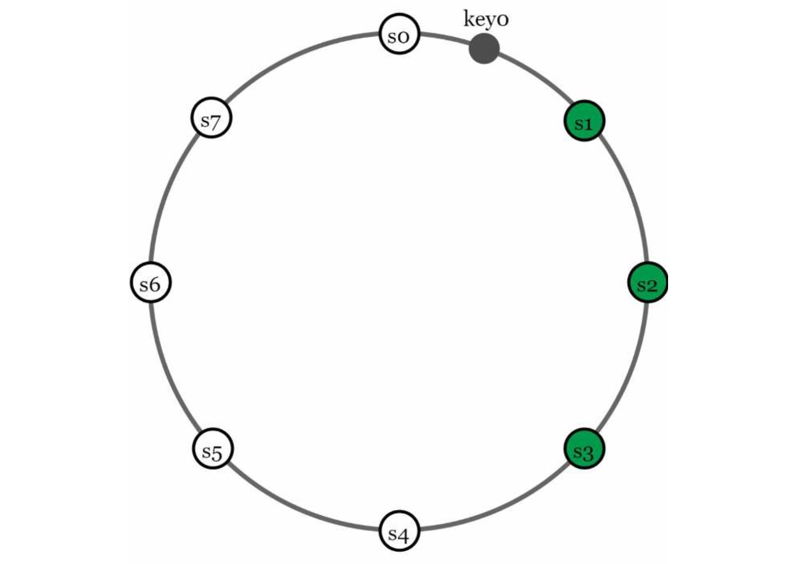

| English | Vietnamese |
|---------|------------|
| With virtual nodes, the first N nodes on the ring may be owned by fewer than N physical servers. | Với các nút ảo, N nút đầu tiên trên vòng có thể thuộc sở hữu của ít hơn N máy chủ vật lý. |
| To avoid this issue, we only choose unique servers while performing the clockwise walk logic. | Để tránh vấn đề này, chúng tôi chỉ chọn các máy chủ duy nhất trong khi thực hiện logic đi theo chiều kim đồng hồ. |
| Nodes in the same data center often fail at the same time due to power outages, network issues, natural disasters, etc. | Các nút trong cùng một trung tâm dữ liệu thường bị lỗi cùng lúc do mất điện, sự cố mạng, thiên tai, v.v. |
| For better reliability, replicas are placed in distinct data centers, and data centers are connected through high-speed networks. | Để tăng độ tin cậy, các bản sao được đặt ở các trung tâm dữ liệu khác nhau, và các trung tâm dữ liệu được kết nối với nhau thông qua mạng tốc độ cao. |

| English | Vietnamese |
|---------|------------|
| Consistency | Tính nhất quán |
| Since data is replicated at multiple nodes, it must be synchronized across replicas. | Vì dữ liệu được sao chép tại nhiều nút, nó phải được đồng bộ giữa các bản sao. |
| Quorum consensus can guarantee consistency for both read and write operations. | Sự đồng thuận quorum có thể đảm bảo tính nhất quán cho cả thao tác đọc và ghi. |
| Let us establish a few definitions first. | Hãy thiết lập một vài định nghĩa trước tiên. |
| N = The number of replicas | N = Số lượng bản sao |
| W = A write quorum of size W. For a write operation to be considered as successful, write operation must be acknowledged from W replicas. | W = Một quorum ghi có kích thước W. Để một thao tác ghi được coi là thành công, thao tác đó phải được xác nhận từ W bản sao. |
| R = A read quorum of size R. For a read operation to be considered as successful, read operation must wait for responses from at least R replicas. | R = Một quorum đọc có kích thước R. Để một thao tác đọc được coi là thành công, thao tác đó phải chờ phản hồi từ ít nhất R bản sao. |
| Consider the following example shown in Figure 6-6 with N = 3. | Xem xét ví dụ sau được minh họa trong Hình 6-6 với N = 3. |

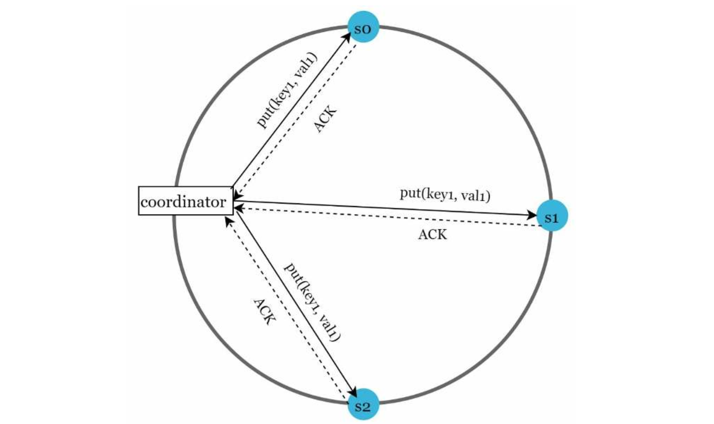

| English | Vietnamese |
|---------|------------|
| W = 1 does not mean data is written on one server. | W = 1 không có nghĩa là dữ liệu được ghi trên một máy chủ duy nhất. |
| For instance, with the configuration in Figure 6-6, data is replicated at s0, s1, and s2. | Ví dụ, với cấu hình trong Hình 6-6, dữ liệu được sao chép tại s0, s1 và s2. |
| W = 1 means that the coordinator must receive at least one acknowledgment before the write operation is considered as successful. | W = 1 có nghĩa là bộ điều phối (coordinator) phải nhận được ít nhất một xác nhận trước khi thao tác ghi được coi là thành công. |
| For instance, if we get an acknowledgment from s1, we no longer need to wait for acknowledgements from s0 and s2. | Ví dụ, nếu chúng ta nhận được xác nhận từ s1, thì không cần phải chờ thêm xác nhận từ s0 và s2. |
| A coordinator acts as a proxy between the client and the nodes. | Bộ điều phối hoạt động như một proxy giữa client và các nút. |
| The configuration of W, R and N is a typical tradeoff between latency and consistency. | Cấu hình của W, R và N là một sự đánh đổi điển hình giữa độ trễ và tính nhất quán. |
| If W = 1 or R = 1, an operation is returned quickly because a coordinator only needs to wait for a response from any of the replicas. | Nếu W = 1 hoặc R = 1, một thao tác sẽ được trả về nhanh chóng vì bộ điều phối chỉ cần chờ phản hồi từ bất kỳ bản sao nào. |
| If W or R > 1, the system offers better consistency; however, the query will be slower because the coordinator must wait for the response from the slowest replica. | Nếu W hoặc R > 1, hệ thống cung cấp tính nhất quán tốt hơn; tuy nhiên, truy vấn sẽ chậm hơn vì bộ điều phối phải chờ phản hồi từ bản sao chậm nhất. |
| If W + R > N, strong consistency is guaranteed because there must be at least one overlapping node that has the latest data to ensure consistency. | Nếu W + R > N, tính nhất quán mạnh được đảm bảo vì sẽ có ít nhất một nút trùng lặp chứa dữ liệu mới nhất để đảm bảo tính nhất quán. |
| How to configure N, W, and R to fit our use cases? Here are some of the possible setups: | Làm thế nào để cấu hình N, W và R phù hợp với trường hợp sử dụng của chúng ta? Sau đây là một số cấu hình có thể áp dụng: |
| If R = 1 and W = N, the system is optimized for a fast read. | Nếu R = 1 và W = N, hệ thống được tối ưu cho việc đọc nhanh. |
| If W = 1 and R = N, the system is optimized for fast write. | Nếu W = 1 và R = N, hệ thống được tối ưu cho việc ghi nhanh. |
| If W + R > N, strong consistency is guaranteed (Usually N = 3, W = R = 2). | Nếu W + R > N, tính nhất quán mạnh được đảm bảo (Thường thì N = 3, W = R = 2). |
| If W + R <= N, strong consistency is not guaranteed. | Nếu W + R <= N, tính nhất quán mạnh không được đảm bảo. |
| Depending on the requirement, we can tune the values of W, R, N to achieve the desired level of consistency. | Tùy theo yêu cầu, chúng ta có thể điều chỉnh giá trị của W, R, N để đạt mức độ nhất quán mong muốn. |
| Consistency models | Các mô hình tính nhất quán |
| Consistency model is other important factor to consider when designing a key-value store. | Mô hình tính nhất quán là một yếu tố quan trọng khác cần xem xét khi thiết kế một key-value store. |
| A consistency model defines the degree of data consistency, and a wide spectrum of possible consistency models exist: | Một mô hình tính nhất quán xác định mức độ nhất quán của dữ liệu, và có nhiều loại mô hình khác nhau tồn tại: |
| • Strong consistency: any read operation returns a value corresponding to the result of the most updated write data item. A client never sees out-of-date data. | • Tính nhất quán mạnh: bất kỳ thao tác đọc nào cũng trả về giá trị tương ứng với kết quả của lần ghi dữ liệu mới nhất. Client sẽ không bao giờ thấy dữ liệu lỗi thời. |
| • Weak consistency: subsequent read operations may not see the most updated value. | • Tính nhất quán yếu: các thao tác đọc tiếp theo có thể không nhìn thấy giá trị mới nhất. |
| • Eventual consistency: this is a specific form of weak consistency. Given enough time, all updates are propagated, and all replicas are consistent. | • Tính nhất quán cuối cùng: đây là một dạng cụ thể của tính nhất quán yếu. Khi có đủ thời gian, tất cả các bản cập nhật sẽ được truyền đi và tất cả các bản sao sẽ đồng nhất. |
| Strong consistency is usually achieved by forcing a replica not to accept new reads/writes until every replica has agreed on current write. | Tính nhất quán mạnh thường đạt được bằng cách buộc một bản sao không chấp nhận các thao tác đọc/ghi mới cho đến khi mọi bản sao đều đồng ý về lần ghi hiện tại. |
| This approach is not ideal for highly available systems because it could block new operations. | Cách tiếp cận này không lý tưởng cho các hệ thống có tính sẵn sàng cao vì nó có thể chặn các thao tác mới. |
| Dynamo and Cassandra adopt eventual consistency, which is our recommended consistency model for our key-value store. | Dynamo và Cassandra áp dụng mô hình nhất quán cuối cùng, đây cũng là mô hình được chúng tôi khuyến nghị cho key-value store. |
| From concurrent writes, eventual consistency allows inconsistent values to enter the system and force the client to read the values to reconcile. | Trong các lần ghi đồng thời, tính nhất quán cuối cùng cho phép các giá trị không nhất quán đi vào hệ thống và buộc client phải đọc các giá trị để hòa giải. |
| The next section explains how reconciliation works with versioning. | Phần tiếp theo sẽ giải thích cách hòa giải hoạt động với phiên bản hóa. |

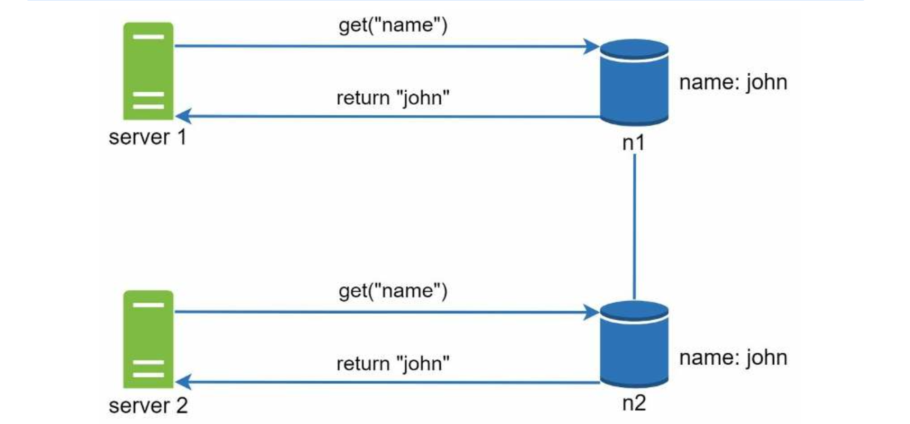

| English | Vietnamese |
|---------|------------|
| Next, server 1 changes the name to “johnSanFrancisco”, and server 2 changes the name to “johnNewYork” as shown in Figure 6-8. These two changes are performed simultaneously. Now, we have conflicting values, called versions v1 and v2. | Tiếp theo, máy chủ 1 thay đổi tên thành “johnSanFrancisco”, và máy chủ 2 thay đổi tên thành “johnNewYork” như minh họa trong Hình 6-8. Hai thay đổi này được thực hiện đồng thời. Bây giờ, chúng ta có các giá trị xung đột, được gọi là phiên bản v1 và v2. |

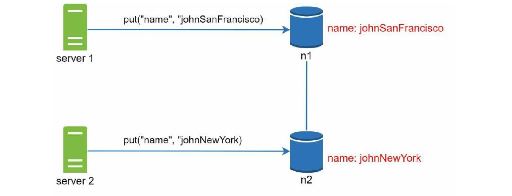

| English | Vietnamese |
|---------|------------|
| In this example, the original value could be ignored because the modifications were based on it.             | Trong ví dụ này, giá trị gốc có thể bị bỏ qua vì các thay đổi được dựa trên nó.                      |
| However, there is no clear way to resolve the conflict of the last two versions.                             | Tuy nhiên, không có cách rõ ràng nào để giải quyết xung đột của hai phiên bản cuối cùng.              |
| To resolve this issue, we need a versioning system that can detect conflicts and reconcile conflicts.         | Để giải quyết vấn đề này, chúng ta cần một hệ thống quản lý phiên bản có thể phát hiện và hòa giải xung đột. |
| A vector clock is a common technique to solve this problem.                                                  | Đồng hồ vector là một kỹ thuật phổ biến để giải quyết vấn đề này.                                     |
| Let us examine how vector clocks work.                                                                       | Hãy cùng tìm hiểu cách hoạt động của đồng hồ vector.                                                  |
| A vector clock is a [server, version] pair associated with a data item.                                       | Đồng hồ vector là một cặp [máy chủ, phiên bản] gắn với một mục dữ liệu.                               |
| It can be used to check if one version precedes, succeeds, or in conflict with others.                        | Nó có thể được sử dụng để kiểm tra một phiên bản có đi trước, kế tiếp hay xung đột với các phiên bản khác. |
| Assume a vector clock is represented by D([S1, v1], [S2, v2], …, [Sn, vn]), where D is a data item, v1 is a version counter, and s1 is a server number, etc. | Giả sử một đồng hồ vector được biểu diễn bởi D([S1, v1], [S2, v2], …, [Sn, vn]), trong đó D là một mục dữ liệu, v1 là bộ đếm phiên bản, và s1 là số hiệu máy chủ, v.v. |
| If data item D is written to server Si, the system must perform one of the following tasks.                   | Nếu mục dữ liệu D được ghi vào máy chủ Si, hệ thống phải thực hiện một trong các tác vụ sau.          |
| • Increment vi if [Si, vi] exists.                                                                           | • Tăng vi nếu [Si, vi] đã tồn tại.                                                                   |
| • Otherwise, create a new entry [Si, 1].                                                                     | • Nếu không, tạo một mục mới [Si, 1].                                                               |
| The above abstract logic is explained with a concrete example as shown in Figure 6-9.                        | Logic trừu tượng ở trên được giải thích bằng một ví dụ cụ thể như minh họa trong Hình 6-9.             |

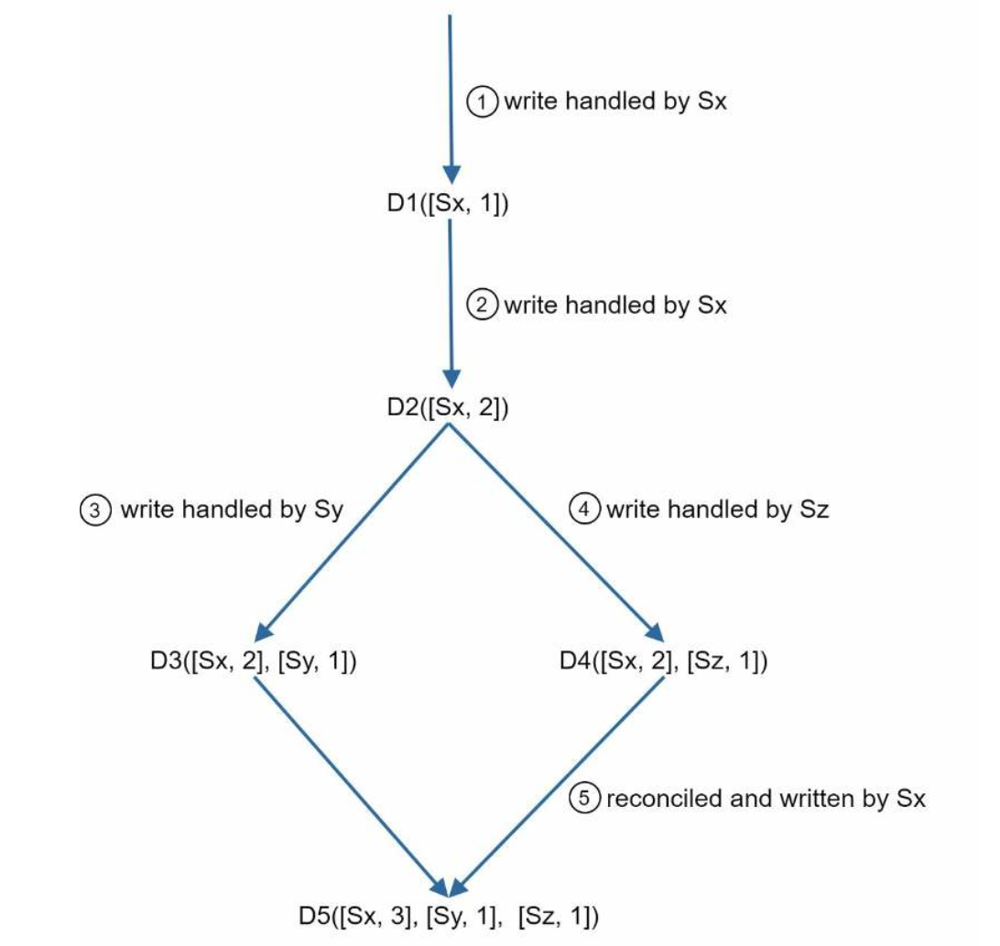

| English | Vietnamese |
|---------|------------|
| 1. A client writes a data item D1 to the system, and the write is handled by server Sx, which now has the vector clock D1[(Sx, 1)]. | 1. Một client ghi một mục dữ liệu D1 vào hệ thống, và việc ghi được xử lý bởi máy chủ Sx, hiện có đồng hồ vector D1[(Sx, 1)]. |
| 2. Another client reads the latest D1, updates it to D2, and writes it back. D2 descends from D1 so it overwrites D1. Assume the write is handled by the same server Sx, which now has vector clock D2([Sx, 2]). | 2. Một client khác đọc D1 mới nhất, cập nhật thành D2 và ghi lại. D2 kế thừa từ D1 nên ghi đè lên D1. Giả sử việc ghi được xử lý bởi cùng máy chủ Sx, hiện có đồng hồ vector D2([Sx, 2]). |
| 3. Another client reads the latest D2, updates it to D3, and writes it back. Assume the write is handled by server Sy, which now has vector clock D3([Sx, 2], [Sy, 1]). | 3. Một client khác đọc D2 mới nhất, cập nhật thành D3 và ghi lại. Giả sử việc ghi được xử lý bởi máy chủ Sy, hiện có đồng hồ vector D3([Sx, 2], [Sy, 1]). |
| 4. Another client reads the latest D2, updates it to D4, and writes it back. Assume the write is handled by server Sz, which now has D4([Sx, 2], [Sz, 1]). | 4. Một client khác đọc D2 mới nhất, cập nhật thành D4 và ghi lại. Giả sử việc ghi được xử lý bởi máy chủ Sz, hiện có đồng hồ vector D4([Sx, 2], [Sz, 1]). |
| 5. When another client reads D3 and D4, it discovers a conflict, which is caused by data item D2 being modified by both Sy and Sz. The conflict is resolved by the client and updated data is sent to the server. Assume the write is handled by Sx, which now has D5([Sx, 3], [Sy, 1], [Sz, 1]). We will explain how to detect conflict shortly. | 5. Khi một client khác đọc D3 và D4, nó phát hiện xung đột, do mục dữ liệu D2 bị cả Sy và Sz chỉnh sửa. Client giải quyết xung đột và gửi dữ liệu cập nhật đến máy chủ. Giả sử việc ghi được xử lý bởi Sx, hiện có đồng hồ vector D5([Sx, 3], [Sy, 1], [Sz, 1]). Chúng ta sẽ giải thích cách phát hiện xung đột ngay sau đây. |
| Using vector clocks, it is easy to tell that a version X is an ancestor (i.e. no conflict) of version Y if the version counters for each participant in the vector clock of Y is greater than or equal to the ones in version X. | Sử dụng đồng hồ vector, rất dễ nhận ra rằng một phiên bản X là tổ tiên (tức là không có xung đột) của phiên bản Y nếu các bộ đếm phiên bản của từng thành phần trong đồng hồ vector của Y lớn hơn hoặc bằng các bộ đếm trong X. |
| For example, the vector clock D([s0, 1], [s1, 1]) is an ancestor of D([s0, 1], [s1, 2]). Therefore, no conflict is recorded. | Ví dụ, đồng hồ vector D([s0, 1], [s1, 1]) là tổ tiên của D([s0, 1], [s1, 2]). Do đó, không có xung đột nào được ghi nhận. |
| Similarly, you can tell that a version X is a sibling (i.e., a conflict exists) of Y if there is any participant in Y's vector clock who has a counter that is less than its corresponding counter in X. | Tương tự, bạn có thể thấy rằng một phiên bản X là anh em (tức là tồn tại xung đột) với Y nếu có bất kỳ thành phần nào trong đồng hồ vector của Y có bộ đếm nhỏ hơn bộ đếm tương ứng trong X. |
| For example, the following two vector clocks indicate there is a conflict: D([s0, 1], [s1, 2]) and D([s0, 2], [s1, 1]). | Ví dụ, hai đồng hồ vector sau cho thấy có xung đột: D([s0, 1], [s1, 2]) và D([s0, 2], [s1, 1]). |
| Even though vector clocks can resolve conflicts, there are two notable downsides. | Mặc dù đồng hồ vector có thể giải quyết xung đột, nhưng có hai nhược điểm đáng chú ý. |
| First, vector clocks add complexity to the client because it needs to implement conflict resolution logic. | Thứ nhất, đồng hồ vector làm tăng độ phức tạp cho client vì nó cần triển khai logic giải quyết xung đột. |
| Second, the [server: version] pairs in the vector clock could grow rapidly. To fix this problem, we set a threshold for the length, and if it exceeds the limit, the oldest pairs are removed. | Thứ hai, các cặp [máy chủ: phiên bản] trong đồng hồ vector có thể tăng nhanh. Để khắc phục, ta đặt một ngưỡng cho độ dài, và nếu vượt quá giới hạn, các cặp cũ nhất sẽ bị loại bỏ. |
| This can lead to inefficiencies in reconciliation because the descendant relationship cannot be determined accurately. | Điều này có thể dẫn đến kém hiệu quả trong việc hòa giải vì quan hệ kế thừa không thể được xác định chính xác. |
| However, based on Dynamo paper [4], Amazon has not yet encountered this problem in production; therefore, it is probably an acceptable solution for most companies. | Tuy nhiên, theo bài báo Dynamo [4], Amazon chưa từng gặp vấn đề này trong môi trường sản xuất; do đó, đây có lẽ là giải pháp chấp nhận được với hầu hết các công ty. |
| Handling failures | Xử lý lỗi |
| As with any large system at scale, failures are not only inevitable but common. Handling failure scenarios is very important. | Như với bất kỳ hệ thống lớn nào ở quy mô lớn, sự cố không chỉ là điều tất yếu mà còn thường xuyên xảy ra. Xử lý các kịch bản lỗi là rất quan trọng. |
| In this section, we first introduce techniques to detect failures. Then, we go over common failure resolution strategies. | Trong phần này, trước tiên chúng ta giới thiệu các kỹ thuật phát hiện lỗi. Sau đó, chúng ta sẽ trình bày các chiến lược xử lý lỗi phổ biến. |
| Failure detection | Phát hiện lỗi |
| In a distributed system, it is insufficient to believe that a server is down because another server says so. | Trong một hệ thống phân tán, không đủ cơ sở để tin rằng một máy chủ bị ngừng chỉ vì một máy chủ khác nói vậy. |
| Usually, it requires at least two independent sources of information to mark a server down. | Thông thường, cần ít nhất hai nguồn thông tin độc lập để đánh dấu một máy chủ là ngừng hoạt động. |
| As shown in Figure 6-10, all-to-all multicasting is a straightforward solution. However, this is inefficient when many servers are in the system. | Như minh họa trong Hình 6-10, multicast toàn phần (all-to-all) là một giải pháp trực tiếp. Tuy nhiên, nó kém hiệu quả khi có nhiều máy chủ trong hệ thống. |

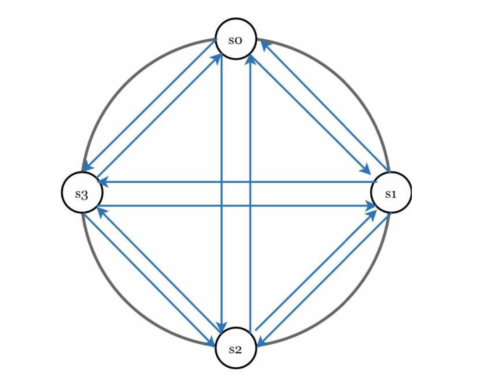

| English | Vietnamese |
|---------|------------|
| A better solution is to use decentralized failure detection methods like gossip protocol. | Một giải pháp tốt hơn là sử dụng các phương pháp phát hiện lỗi phi tập trung như giao thức gossip. |
| Gossip protocol works as follows: | Giao thức gossip hoạt động như sau: |
| • Each node maintains a node membership list, which contains member IDs and heartbeat counters. | • Mỗi nút duy trì một danh sách thành viên, trong đó chứa ID thành viên và bộ đếm nhịp tim. |
| • Each node periodically increments its heartbeat counter. | • Mỗi nút định kỳ tăng bộ đếm nhịp tim của mình. |
| • Each node periodically sends heartbeats to a set of random nodes, which in turn propagate to another set of nodes. | • Mỗi nút định kỳ gửi tín hiệu nhịp tim đến một tập hợp các nút ngẫu nhiên, sau đó các nút này tiếp tục lan truyền đến một tập hợp nút khác. |
| • Once nodes receive heartbeats, membership list is updated to the latest info. | • Khi các nút nhận được tín hiệu nhịp tim, danh sách thành viên sẽ được cập nhật với thông tin mới nhất. |
| • If the heartbeat has not increased for more than predefined periods, the member is considered as offline. | • Nếu nhịp tim không tăng trong nhiều khoảng thời gian được định sẵn, thành viên đó được coi là ngoại tuyến. |

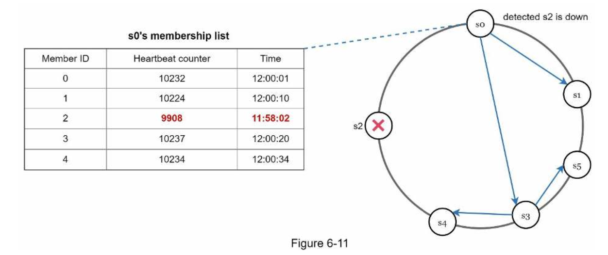

| English | Vietnamese |
|---------|------------|
| As shown in Figure 6-11: | Như thể hiện trong Hình 6-11: |
| • Node s0 maintains a node membership list shown on the left side. | • Nút s0 duy trì một danh sách thành viên nút được hiển thị ở phía bên trái. |
| • Node s0 notices that node s2’s (member ID = 2) heartbeat counter has not increased for a long time. | • Nút s0 nhận thấy rằng bộ đếm nhịp tim của nút s2 (ID thành viên = 2) đã không tăng trong một thời gian dài. |
| • Node s0 sends heartbeats that include s2’s info to a set of random nodes. Once other nodes confirm that s2’s heartbeat counter has not been updated for a long time, node s2 is marked down, and this information is propagated to other nodes. | • Nút s0 gửi nhịp tim chứa thông tin của s2 đến một tập hợp các nút ngẫu nhiên. Khi các nút khác xác nhận rằng bộ đếm nhịp tim của s2 đã không được cập nhật trong một thời gian dài, nút s2 được đánh dấu là ngừng hoạt động, và thông tin này được lan truyền đến các nút khác. |
| Handling temporary failures | Xử lý lỗi tạm thời |
| After failures have been detected through the gossip protocol, the system needs to deploy certain mechanisms to ensure availability. | Sau khi các lỗi được phát hiện thông qua giao thức gossip, hệ thống cần triển khai một số cơ chế để đảm bảo tính khả dụng. |
| In the strict quorum approach, read and write operations could be blocked as illustrated in the quorum consensus section. | Trong cách tiếp cận quorum nghiêm ngặt, các thao tác đọc và ghi có thể bị chặn như đã minh họa trong phần đồng thuận quorum. |
| A technique called “sloppy quorum” [4] is used to improve availability. | Một kỹ thuật gọi là “sloppy quorum” [4] được sử dụng để cải thiện tính khả dụng. |
| Instead of enforcing the quorum requirement, the system chooses the first W healthy servers for writes and first R healthy servers for reads on the hash ring. Offline servers are ignored. | Thay vì bắt buộc yêu cầu quorum, hệ thống sẽ chọn W máy chủ khỏe đầu tiên để ghi và R máy chủ khỏe đầu tiên để đọc trên vòng băm. Các máy chủ ngoại tuyến sẽ bị bỏ qua. |
| If a server is unavailable due to network or server failures, another server will process requests temporarily. | Nếu một máy chủ không khả dụng do lỗi mạng hoặc máy chủ, một máy chủ khác sẽ xử lý các yêu cầu tạm thời. |
| When the down server is up, changes will be pushed back to achieve data consistency. | Khi máy chủ bị ngừng hoạt động khôi phục, các thay đổi sẽ được đẩy ngược lại để đạt được tính nhất quán dữ liệu. |
| This process is called hinted handoff. | Quá trình này được gọi là “hinted handoff”. |
| Since s2 is unavailable in Figure 6-12, reads and writes will be handled by s3 temporarily. | Vì s2 không khả dụng trong Hình 6-12, các thao tác đọc và ghi sẽ được s3 xử lý tạm thời. |
| When s2 comes back online, s3 will hand the data back to s2. | Khi s2 trực tuyến trở lại, s3 sẽ chuyển dữ liệu trả lại cho s2. |

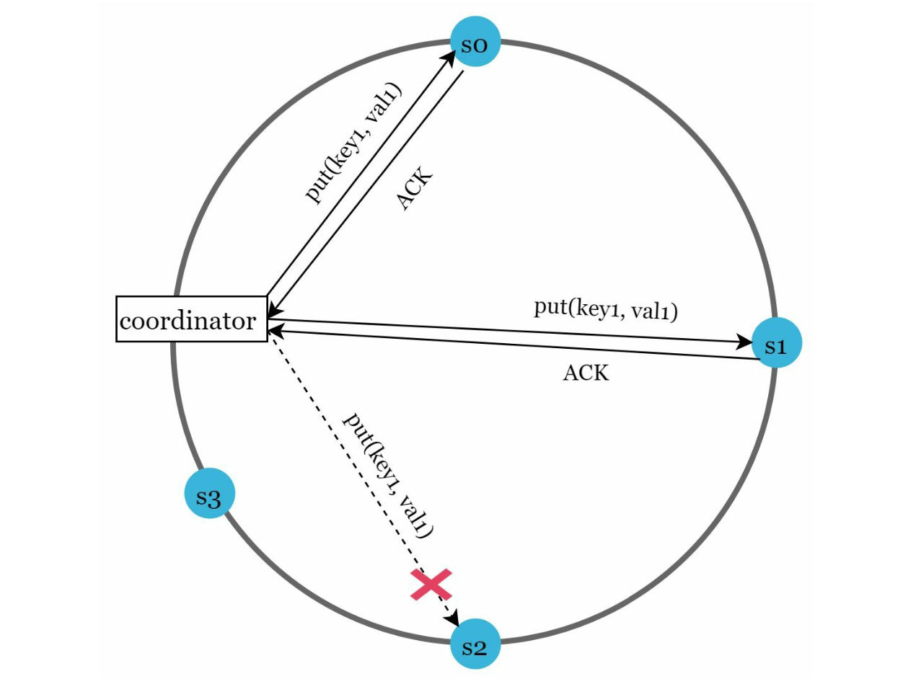

| English | Vietnamese |
|---------|------------|
| Handling permanent failures | Xử lý lỗi vĩnh viễn |
| Hinted handoff is used to handle temporary failures. What if a replica is permanently unavailable? | Hinted handoff được sử dụng để xử lý các lỗi tạm thời. Vậy nếu một bản sao vĩnh viễn không khả dụng thì sao? |
| To handle such a situation, we implement an anti-entropy protocol to keep replicas in sync. | Để xử lý tình huống như vậy, chúng ta triển khai giao thức anti-entropy để giữ cho các bản sao đồng bộ. |
| Anti-entropy involves comparing each piece of data on replicas and updating each replica to the newest version. | Anti-entropy bao gồm việc so sánh từng phần dữ liệu trên các bản sao và cập nhật mỗi bản sao lên phiên bản mới nhất. |
| A Merkle tree is used for inconsistency detection and minimizing the amount of data transferred. | Một cây Merkle được sử dụng để phát hiện sự không nhất quán và giảm thiểu lượng dữ liệu được truyền đi. |
| Quoted from Wikipedia [7]: “A hash tree or Merkle tree is a tree in which every non-leaf node is labeled with the hash of the labels or values (in case of leaves) of its child nodes. | Trích từ Wikipedia [7]: “Một cây băm hoặc cây Merkle là một cây trong đó mỗi nút không phải là lá được gắn nhãn bằng giá trị băm của các nhãn hoặc giá trị (trong trường hợp các lá) của các nút con của nó. |
| Hash trees allow efficient and secure verification of the contents of large data structures”. | Cây băm cho phép xác minh hiệu quả và an toàn nội dung của các cấu trúc dữ liệu lớn”. |
| Assuming key space is from 1 to 12, the following steps show how to build a Merkle tree. | Giả sử không gian khóa từ 1 đến 12, các bước sau đây cho thấy cách xây dựng một cây Merkle. |
| Highlighted boxes indicate inconsistency. | Các hộp được tô sáng cho thấy sự không nhất quán. |
| Step 1: Divide key space into buckets (4 in our example) as shown in Figure 6-13. | Bước 1: Chia không gian khóa thành các nhóm (4 trong ví dụ của chúng ta) như minh họa trong Hình 6-13. |
| A bucket is used as the root level node to maintain a limited depth of the tree. | Một nhóm được sử dụng như một nút cấp gốc để duy trì độ sâu giới hạn của cây. |

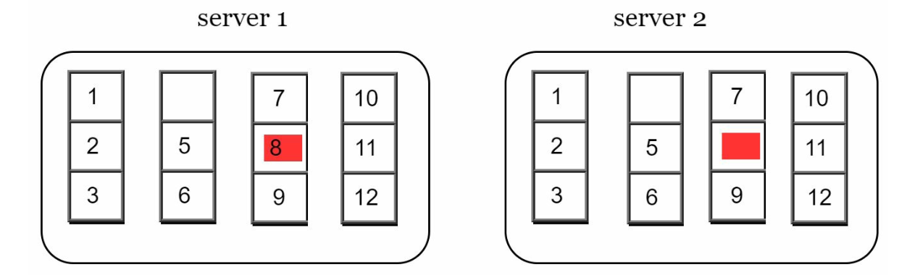

| English | Vietnamese |
|---------|------------|
| Step 2: Once the buckets are created, hash each key in a bucket using a uniform hashing method (Figure 6-14). | Bước 2: Sau khi các bucket được tạo, hãy băm từng khóa trong một bucket bằng một phương pháp băm đồng nhất (Hình 6-14). |

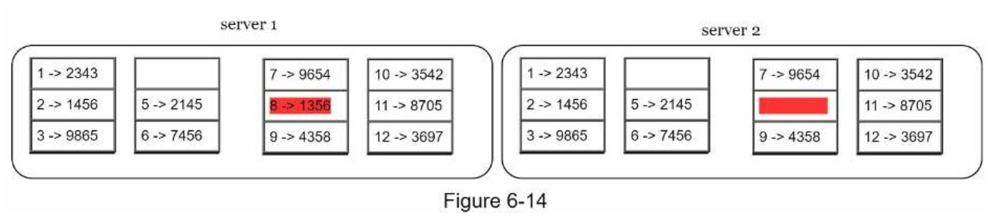

| English | Vietnamese |
|---------|------------|
| Step 3: Create a single hash node per bucket (Figure 6-15). | Bước 3: Tạo một nút băm duy nhất cho mỗi bucket (Hình 6-15). |

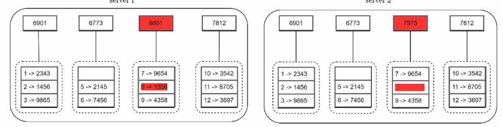

| English | Vietnamese |
|---------|------------|
| Step 4: Build the tree upwards till root by calculating hashes of children (Figure 6-16). | Bước 4: Xây dựng cây lên đến gốc bằng cách tính toán các hàm băm của các nút con (Hình 6-16). |

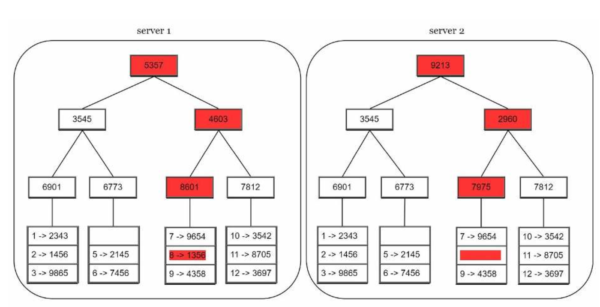

| English | Vietnamese |
|---------|------------|
| To compare two Merkle trees, start by comparing the root hashes. If root hashes match, both servers have the same data. If root hashes disagree, then the left child hashes are compared followed by right child hashes. You can traverse the tree to find which buckets are not synchronized and synchronize those buckets only. | Để so sánh hai cây Merkle, bắt đầu bằng cách so sánh các hàm băm gốc. Nếu các hàm băm gốc khớp nhau, cả hai máy chủ đều có cùng dữ liệu. Nếu các hàm băm gốc khác nhau, thì so sánh các hàm băm của nút con bên trái, sau đó là các nút con bên phải. Bạn có thể duyệt cây để tìm ra những bucket chưa được đồng bộ và chỉ đồng bộ những bucket đó. |
| Using Merkle trees, the amount of data needed to be synchronized is proportional to the differences between the two replicas, and not the amount of data they contain. In real-world systems, the bucket size is quite big. For instance, a possible configuration is one million buckets per one billion keys, so each bucket only contains 1000 keys. | Khi sử dụng cây Merkle, lượng dữ liệu cần đồng bộ tỷ lệ thuận với sự khác biệt giữa hai bản sao, chứ không phải với toàn bộ dữ liệu chúng chứa. Trong các hệ thống thực tế, kích thước bucket thường khá lớn. Ví dụ, một cấu hình khả thi là một triệu bucket cho một tỷ khóa, vì vậy mỗi bucket chỉ chứa 1000 khóa. |
| Handling data center outage | Xử lý sự cố trung tâm dữ liệu |
| Data center outage could happen due to power outage, network outage, natural disaster, etc. To build a system capable of handling data center outage, it is important to replicate data across multiple data centers. Even if a data center is completely offline, users can still access data through the other data centers. | Sự cố trung tâm dữ liệu có thể xảy ra do mất điện, mất kết nối mạng, thiên tai, v.v. Để xây dựng một hệ thống có khả năng xử lý sự cố trung tâm dữ liệu, việc sao chép dữ liệu trên nhiều trung tâm dữ liệu là rất quan trọng. Ngay cả khi một trung tâm dữ liệu bị ngừng hoạt động hoàn toàn, người dùng vẫn có thể truy cập dữ liệu thông qua các trung tâm dữ liệu khác. |

| English | Vietnamese |
|---------|------------|
| System architecture diagram | Sơ đồ kiến trúc hệ thống |
| Now that we have discussed different technical considerations in designing a key-value store, we can shift our focus on the architecture diagram, shown in Figure 6-17. | Bây giờ chúng ta đã thảo luận về các yếu tố kỹ thuật khác nhau trong việc thiết kế một khoá-giá trị, chúng ta có thể chuyển sự tập trung sang sơ đồ kiến trúc, được minh họa trong Hình 6-17. |

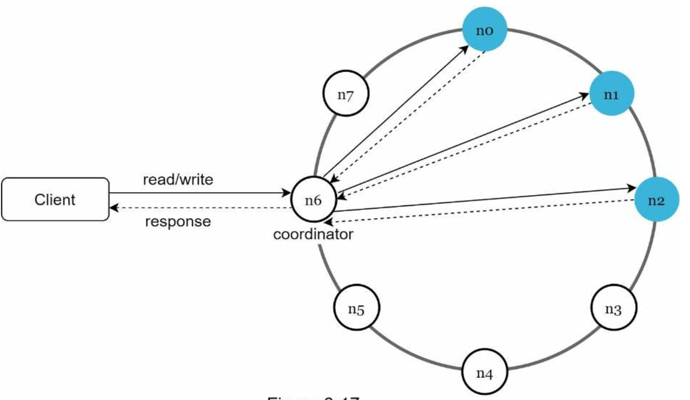

| English | Vietnamese |
|---------|------------|
| Main features of the architecture are listed as follows: | Các đặc điểm chính của kiến trúc được liệt kê như sau: |
| • Clients communicate with the key-value store through simple APIs: get(key) and put(key, value). | • Các client giao tiếp với khoá-giá trị thông qua các API đơn giản: get(key) và put(key, value). |
| • A coordinator is a node that acts as a proxy between the client and the key-value store. | • Bộ điều phối (coordinator) là một nút hoạt động như proxy giữa client và khoá-giá trị. |
| • Nodes are distributed on a ring using consistent hashing. | • Các nút được phân phối trên một vòng (ring) bằng cách sử dụng consistent hashing. |
| • The system is completely decentralized so adding and moving nodes can be automatic. | • Hệ thống hoàn toàn phi tập trung nên việc thêm hoặc di chuyển các nút có thể được thực hiện tự động. |
| • Data is replicated at multiple nodes. | • Dữ liệu được sao chép tại nhiều nút. |
| • There is no single point of failure as every node has the same set of responsibilities. | • Không có điểm lỗi đơn lẻ nào vì mỗi nút đều có cùng một tập trách nhiệm. |
| As the design is decentralized, each node performs many tasks as presented in Figure 6-18. | Vì thiết kế là phi tập trung, mỗi nút thực hiện nhiều tác vụ như được trình bày trong Hình 6-18. |

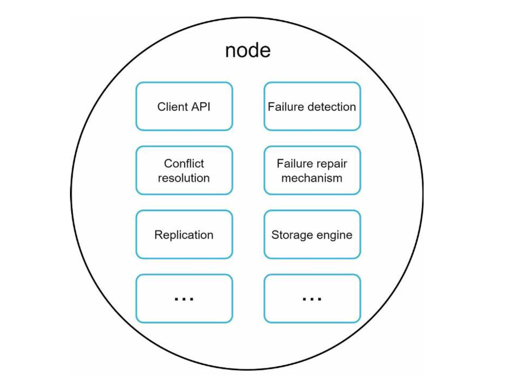

| English | Vietnamese |
|---------|------------|
| Write path | Đường ghi |
| Figure 6-19 explains what happens after a write request is directed to a specific node. | Hình 6-19 giải thích điều gì xảy ra sau khi một yêu cầu ghi được chuyển đến một nút cụ thể. |
| Please note the proposed designs for write/read paths are primarily based on the architecture of Cassandra [8]. | Xin lưu ý rằng các thiết kế được đề xuất cho đường ghi/đọc chủ yếu dựa trên kiến trúc của Cassandra [8]. |

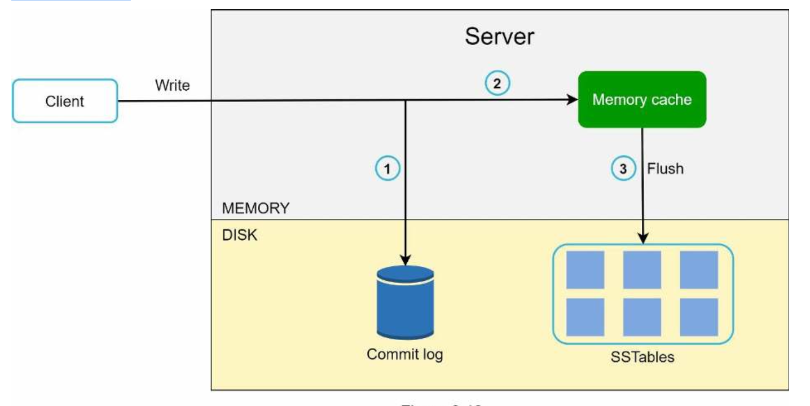

| English | Vietnamese |
|---------|------------|
| 1. The write request is persisted on a commit log file. | 1. Yêu cầu ghi được lưu trữ trong tệp commit log. |
| 2. Data is saved in the memory cache. | 2. Dữ liệu được lưu trong bộ nhớ đệm (memory cache). |
| 3. When the memory cache is full or reaches a predefined threshold, data is flushed to SSTable [9] on disk. | 3. Khi bộ nhớ đệm đầy hoặc đạt đến ngưỡng được xác định trước, dữ liệu sẽ được ghi ra SSTable [9] trên đĩa. |
| Note: A sorted-string table (SSTable) is a sorted list of <key, value> pairs. | Lưu ý: Bảng chuỗi sắp xếp (SSTable) là một danh sách <key, value> được sắp xếp. |
| For readers interested in learning more about SSTable, refer to the reference material [9]. | Đối với những độc giả quan tâm đến việc tìm hiểu thêm về SSTable, hãy tham khảo tài liệu tham chiếu [9]. |
| Read path | Đường đọc |
| After a read request is directed to a specific node, it first checks if data is in the memory cache. | Sau khi một yêu cầu đọc được chuyển đến một nút cụ thể, hệ thống sẽ kiểm tra trước xem dữ liệu có trong bộ nhớ đệm hay không. |
| If so, the data is returned to the client as shown in Figure 6-20. | Nếu có, dữ liệu sẽ được trả về cho client như minh họa trong Hình 6-20. |

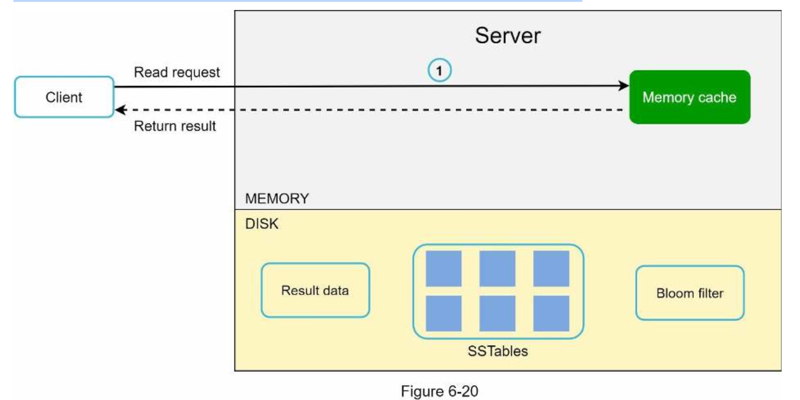

| English | Vietnamese |
|---------|------------|
| If the data is not in memory, it will be retrieved from the disk instead. | Nếu dữ liệu không có trong bộ nhớ, nó sẽ được truy xuất từ đĩa. |
| We need an efficient way to find out which SSTable contains the key. | Chúng ta cần một cách hiệu quả để tìm ra SSTable nào chứa khóa. |
| Bloom filter [10] is commonly used to solve this problem. | Bloom filter [10] thường được sử dụng để giải quyết vấn đề này. |
| The read path is shown in Figure 6-21 when data is not in memory. | Đường đọc được minh họa trong Hình 6-21 khi dữ liệu không có trong bộ nhớ. |

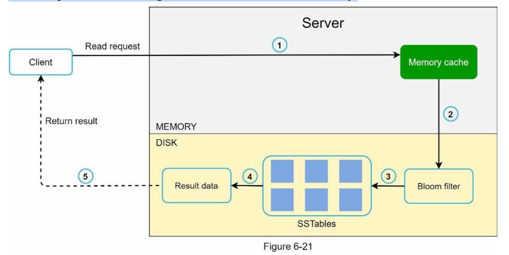

| English | Vietnamese |
|---------|------------|
| 1. The system first checks if data is in memory. If not, go to step 2. | 1. Hệ thống trước tiên kiểm tra dữ liệu có trong bộ nhớ hay không. Nếu không, chuyển sang bước 2. |
| 2. If data is not in memory, the system checks the bloom filter. | 2. Nếu dữ liệu không có trong bộ nhớ, hệ thống sẽ kiểm tra bloom filter. |
| 3. The bloom filter is used to figure out which SSTables might contain the key. | 3. Bloom filter được sử dụng để xác định SSTable nào có thể chứa khóa. |
| 4. SSTables return the result of the data set. | 4. Các SSTable trả về kết quả của tập dữ liệu. |
| 5. The result of the data set is returned to the client. | 5. Kết quả của tập dữ liệu được trả về cho client. |

| English | Vietnamese |
|---------|------------|
| Summary | Tóm tắt |
| This chapter covers many concepts and techniques. To refresh your memory, the following table summarizes features and corresponding techniques used for a distributed key-value store. | Chương này bao gồm nhiều khái niệm và kỹ thuật. Để giúp bạn ôn lại, bảng dưới đây tóm tắt các tính năng và các kỹ thuật tương ứng được sử dụng cho kho khóa-giá trị phân tán. |

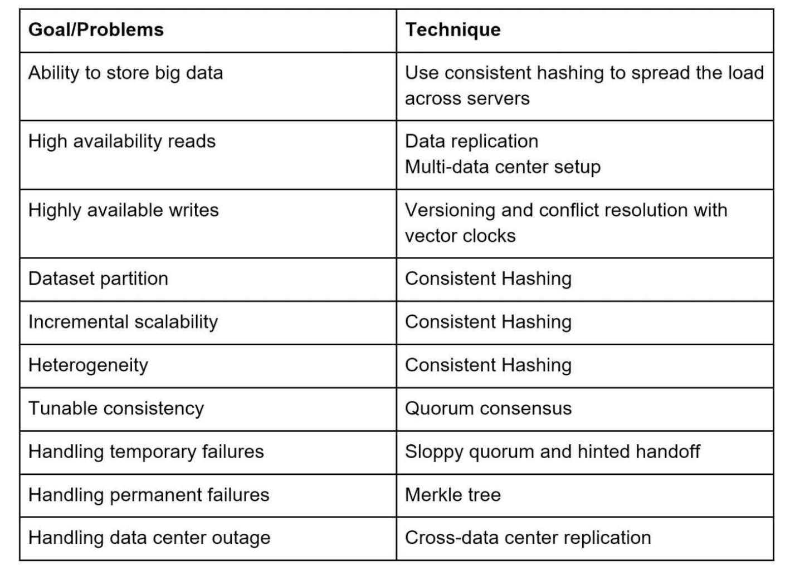

