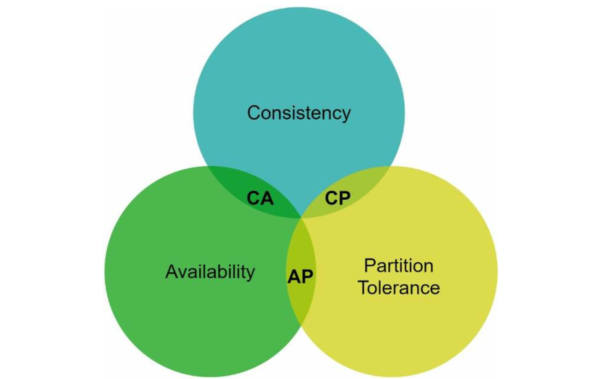

| English | Vietnamese |
|---------|------------|
| CHAPTER 6: DESIGN A KEY-VALUE STORE | CHƯƠNG 6: THIẾT KẾ KHOÁ-LƯU TRỮ DỮ LIỆU (KEY-VALUE STORE) |

| English | Vietnamese |
|---------|------------|
| A key-value store, also referred to as a key-value database, is a non-relational database. Each unique identifier is stored as a key with its associated value. This data pairing is known as a “key-value” pair. | Một khoá-lưu trữ dữ liệu (key-value store), còn được gọi là cơ sở dữ liệu key-value, là một cơ sở dữ liệu phi quan hệ. Mỗi định danh duy nhất được lưu dưới dạng một khoá với giá trị tương ứng. Cặp dữ liệu này được gọi là “cặp key-value”. |
| In a key-value pair, the key must be unique, and the value associated with the key can be accessed through the key. Keys can be plain text or hashed values. For performance reasons, a short key works better. | Trong một cặp key-value, khoá phải là duy nhất, và giá trị gắn với khoá có thể được truy cập thông qua khoá đó. Khoá có thể là văn bản thuần (plain text) hoặc giá trị băm (hashed). Vì lý do hiệu năng, khoá ngắn sẽ hoạt động tốt hơn. |
| What do keys look like? Here are a few examples: | Vậy các khoá trông như thế nào? Dưới đây là một vài ví dụ: |
| • Plain text key: “last_logged_in_at” | • Khoá văn bản thuần: “last_logged_in_at” |
| • Hashed key: 253DDEC4 | • Khoá băm: 253DDEC4 |
| The value in a key-value pair can be strings, lists, objects, etc. The value is usually treated as an opaque object in key-value stores, such as Amazon Dynamo [1], Memcached [2], Redis [3], etc. | Giá trị trong một cặp key-value có thể là chuỗi, danh sách, đối tượng, v.v. Thông thường, giá trị được coi là một đối tượng mờ (opaque object) trong các khoá-lưu trữ dữ liệu, chẳng hạn như Amazon Dynamo [1], Memcached [2], Redis [3], v.v. |
| Here is a data snippet in a key-value store: | Đây là một đoạn dữ liệu trong khoá-lưu trữ dữ liệu: |

| English | Vietnamese |
|---------|------------|
| In this chapter, you are asked to design a key-value store that supports the following operations: | Trong chương này, bạn được yêu cầu thiết kế một kho key-value hỗ trợ các thao tác sau: |
| - put(key, value) // insert “value” associated with “key” | - put(key, value) // chèn “value” liên kết với “key” |
| - get(key) // get “value” associated with “key” | - get(key) // lấy “value” liên kết với “key” |

| English | Vietnamese |
|---------|------------|
| Understand the problem and establish design scope | Hiểu vấn đề và xác lập phạm vi thiết kế |
| There is no perfect design. Each design achieves a specific balance regarding the tradeoffs of the read, write, and memory usage. | Không có thiết kế nào hoàn hảo. Mỗi thiết kế đạt được một sự cân bằng nhất định giữa các đánh đổi về đọc, ghi và sử dụng bộ nhớ. |
| Another tradeoff has to be made was between consistency and availability. | Một đánh đổi khác cần thực hiện là giữa tính nhất quán (consistency) và khả dụng (availability). |
| In this chapter, we design a key-value store that comprises of the following characteristics: | Trong chương này, chúng ta thiết kế một kho key-value với các đặc tính sau: |
| • The size of a key-value pair is small: less than 10 KB. | • Kích thước mỗi cặp key-value nhỏ: dưới 10 KB. |
| • Ability to store big data. | • Khả năng lưu trữ dữ liệu lớn. |
| • High availability: The system responds quickly, even during failures. | • Khả dụng cao: Hệ thống phản hồi nhanh, ngay cả khi xảy ra sự cố. |
| • High scalability: The system can be scaled to support large data set. | • Khả năng mở rộng cao: Có thể mở rộng để hỗ trợ tập dữ liệu lớn. |
| • Automatic scaling: The addition/deletion of servers should be automatic based on traffic. | • Tự động mở rộng: Việc thêm/xóa máy chủ phải tự động dựa trên lưu lượng. |
| • Tunable consistency. | • Tính nhất quán có thể điều chỉnh. |
| • Low latency. | • Độ trễ thấp. |

| English | Vietnamese |
|---------|------------|
| Single server key-value store | Kho lưu trữ key-value trên một máy chủ đơn |
| Developing a key-value store that resides in a single server is easy. An intuitive approach is to store key-value pairs in a hash table, which keeps everything in memory. | Việc phát triển một kho lưu trữ key-value chạy trên một máy chủ đơn là dễ dàng. Một cách tiếp cận trực quan là lưu trữ các cặp key-value trong một bảng băm (hash table), giữ tất cả trong bộ nhớ. |
| Even though memory access is fast, fitting everything in memory may be impossible due to the space constraint. | Mặc dù việc truy cập bộ nhớ rất nhanh, nhưng việc đưa tất cả dữ liệu vào bộ nhớ có thể là không khả thi do giới hạn dung lượng. |
| Two optimizations can be done to fit more data in a single server: | Có thể thực hiện hai tối ưu hóa để lưu trữ nhiều dữ liệu hơn trên một máy chủ đơn: |
| • Data compression | • Nén dữ liệu |
| • Store only frequently used data in memory and the rest on disk | • Chỉ lưu dữ liệu được sử dụng thường xuyên trong bộ nhớ và phần còn lại trên đĩa |
| Even with these optimizations, a single server can reach its capacity very quickly. | Ngay cả với những tối ưu hóa này, một máy chủ đơn vẫn có thể nhanh chóng đạt đến giới hạn dung lượng. |
| A distributed key-value store is required to support big data. | Cần một kho lưu trữ key-value phân tán để hỗ trợ dữ liệu lớn. |

| English | Vietnamese |
|---------|------------|
| **Distributed key-value store** | **Khoá-giá trị phân tán** |
| A distributed key-value store is also called a distributed hash table, which distributes key-value pairs across many servers. | Khoá-giá trị phân tán còn được gọi là bảng băm phân tán, nó phân phối các cặp khoá-giá trị qua nhiều máy chủ. |
| When designing a distributed system, it is important to understand CAP (Consistency, Availability, Partition Tolerance) theorem. | Khi thiết kế một hệ thống phân tán, việc hiểu định lý CAP (Tính nhất quán, Tính khả dụng, Dung sai phân vùng) là rất quan trọng. |
| **CAP theorem** | **Định lý CAP** |
| CAP theorem states it is impossible for a distributed system to simultaneously provide more than two of these three guarantees: consistency, availability, and partition tolerance. | Định lý CAP phát biểu rằng một hệ thống phân tán không thể đồng thời đảm bảo hơn hai trong ba yếu tố: tính nhất quán, tính khả dụng, và dung sai phân vùng. |
| **Consistency:** consistency means all clients see the same data at the same time no matter which node they connect to. | **Tính nhất quán:** nghĩa là tất cả các client nhìn thấy cùng một dữ liệu tại cùng một thời điểm, bất kể chúng kết nối đến node nào. |
| **Availability:** availability means any client which requests data gets a response even if some of the nodes are down. | **Tính khả dụng:** nghĩa là bất kỳ client nào yêu cầu dữ liệu đều nhận được phản hồi, ngay cả khi một số node bị hỏng. |
| **Partition Tolerance:** a partition indicates a communication break between two nodes. Partition tolerance means the system continues to operate despite network partitions. | **Dung sai phân vùng:** phân vùng ám chỉ sự gián đoạn trong giao tiếp giữa hai node. Dung sai phân vùng có nghĩa là hệ thống vẫn tiếp tục hoạt động bất chấp các phân vùng mạng. |
| CAP theorem states that one of the three properties must be sacrificed to support 2 of the 3 properties as shown in Figure 6-1. | Định lý CAP cho rằng một trong ba thuộc tính phải bị hy sinh để hỗ trợ 2 trong số 3 thuộc tính như minh hoạ trong Hình 6-1. |

| English | Vietnamese |
|---------|------------|
| Nowadays, key-value stores are classified based on the two CAP characteristics they support: | Ngày nay, các kho key-value được phân loại dựa trên hai đặc điểm CAP mà chúng hỗ trợ: |
| CP (consistency and partition tolerance) systems: a CP key-value store supports consistency and partition tolerance while sacrificing availability. | Hệ thống CP (tính nhất quán và khả năng chịu phân vùng): một kho key-value CP hỗ trợ tính nhất quán và khả năng chịu phân vùng, nhưng hy sinh tính khả dụng. |
| AP (availability and partition tolerance) systems: an AP key-value store supports availability and partition tolerance while sacrificing consistency. | Hệ thống AP (tính khả dụng và khả năng chịu phân vùng): một kho key-value AP hỗ trợ tính khả dụng và khả năng chịu phân vùng, nhưng hy sinh tính nhất quán. |
| CA (consistency and availability) systems: a CA key-value store supports consistency and availability while sacrificing partition tolerance. | Hệ thống CA (tính nhất quán và khả dụng): một kho key-value CA hỗ trợ tính nhất quán và khả dụng, nhưng hy sinh khả năng chịu phân vùng. |
| Since network failure is unavoidable, a distributed system must tolerate network partition. Thus, a CA system cannot exist in real-world applications. | Vì sự cố mạng là điều không thể tránh khỏi, một hệ thống phân tán phải có khả năng chịu phân vùng mạng. Do đó, hệ thống CA không thể tồn tại trong các ứng dụng thực tế. |
| What you read above is mostly the definition part. To make it easier to understand, let us take a look at some concrete examples. | Những gì bạn vừa đọc ở trên chủ yếu là phần định nghĩa. Để dễ hiểu hơn, chúng ta hãy cùng xem một số ví dụ cụ thể. |
| In distributed systems, data is usually replicated multiple times. Assume data are replicated on three replica nodes, n1, n2 and n3 as shown in Figure 6-2. | Trong các hệ thống phân tán, dữ liệu thường được nhân bản nhiều lần. Giả sử dữ liệu được nhân bản trên ba nút bản sao, n1, n2 và n3 như minh họa trong Hình 6-2. |
| Ideal situation | Tình huống lý tưởng |
| In the ideal world, network partition never occurs. Data written to n1 is automatically replicated to n2 and n3. Both consistency and availability are achieved. | Trong thế giới lý tưởng, sự phân vùng mạng không bao giờ xảy ra. Dữ liệu được ghi vào n1 sẽ tự động được nhân bản sang n2 và n3. Cả tính nhất quán và khả dụng đều được đảm bảo. |

| English | Vietnamese |
|---------|------------|
| Real-world distributed systems | Hệ thống phân tán trong thế giới thực |
| In a distributed system, partitions cannot be avoided, and when a partition occurs, we must choose between consistency and availability. | Trong một hệ thống phân tán, việc phân vùng không thể tránh khỏi, và khi phân vùng xảy ra, chúng ta phải chọn giữa tính nhất quán và tính khả dụng. |
| In Figure 6-3, n3 goes down and cannot communicate with n1 and n2. | Trong Hình 6-3, n3 bị ngừng hoạt động và không thể giao tiếp với n1 và n2. |
| If clients write data to n1 or n2, data cannot be propagated to n3. | Nếu client ghi dữ liệu vào n1 hoặc n2, dữ liệu không thể được lan truyền đến n3. |
| If data is written to n3 but not propagated to n1 and n2 yet, n1 and n2 would have stale data. | Nếu dữ liệu được ghi vào n3 nhưng chưa được lan truyền đến n1 và n2, thì n1 và n2 sẽ có dữ liệu cũ (không cập nhật). |

| English | Vietnamese |
|---------|------------|
| If we choose consistency over availability (CP system), we must block all write operations to n1 and n2 to avoid data inconsistency among these three servers, which makes the system unavailable. | Nếu chúng ta chọn tính nhất quán thay vì tính khả dụng (hệ thống CP), chúng ta phải chặn tất cả các thao tác ghi trên n1 và n2 để tránh tình trạng dữ liệu không nhất quán giữa ba máy chủ này, điều này khiến hệ thống không khả dụng. |
| Bank systems usually have extremely high consistent requirements. | Các hệ thống ngân hàng thường có yêu cầu cực kỳ cao về tính nhất quán. |
| For example, it is crucial for a bank system to display the most up-to-date balance info. | Ví dụ, điều quan trọng đối với một hệ thống ngân hàng là hiển thị thông tin số dư mới nhất. |
| If inconsistency occurs due to a network partition, the bank system returns an error before the inconsistency is resolved. | Nếu xảy ra tình trạng không nhất quán do phân vùng mạng, hệ thống ngân hàng sẽ trả về lỗi trước khi sự không nhất quán được xử lý. |
| However, if we choose availability over consistency (AP system), the system keeps accepting reads, even though it might return stale data. | Tuy nhiên, nếu chúng ta chọn tính khả dụng thay vì tính nhất quán (hệ thống AP), hệ thống sẽ tiếp tục chấp nhận các thao tác đọc, mặc dù có thể trả về dữ liệu cũ. |
| For writes, n1 and n2 will keep accepting writes, and data will be synced to n3 when the network partition is resolved. | Đối với ghi dữ liệu, n1 và n2 sẽ tiếp tục chấp nhận thao tác ghi, và dữ liệu sẽ được đồng bộ về n3 khi phân vùng mạng được giải quyết. |
| Choosing the right CAP guarantees that fit your use case is an important step in building a distributed key-value store. | Việc chọn các đảm bảo CAP phù hợp với trường hợp sử dụng của bạn là một bước quan trọng trong việc xây dựng hệ thống key-value store phân tán. |
| You can discuss this with your interviewer and design the system accordingly. | Bạn có thể thảo luận điều này với người phỏng vấn và thiết kế hệ thống phù hợp. |
| System components | Các thành phần hệ thống |
| In this section, we will discuss the following core components and techniques used to build a key-value store: | Trong phần này, chúng ta sẽ thảo luận về các thành phần cốt lõi và kỹ thuật được sử dụng để xây dựng một key-value store: |
| • Data partition | • Phân vùng dữ liệu |
| • Data replication | • Sao chép dữ liệu |
| • Consistency | • Tính nhất quán |
| • Inconsistency resolution | • Giải quyết không nhất quán |
| • Handling failures | • Xử lý lỗi |
| • System architecture diagram | • Sơ đồ kiến trúc hệ thống |
| • Write path | • Luồng ghi |
| • Read path | • Luồng đọc |
| The content below is largely based on three popular key-value store systems: Dynamo [4], Cassandra [5], and BigTable [6]. | Nội dung dưới đây chủ yếu dựa trên ba hệ thống key-value store phổ biến: Dynamo [4], Cassandra [5], và BigTable [6]. |
| Data partition | Phân vùng dữ liệu |
| For large applications, it is infeasible to fit the complete data set in a single server. | Đối với các ứng dụng lớn, việc lưu trữ toàn bộ tập dữ liệu trong một máy chủ là điều không khả thi. |
| The simplest way to accomplish this is to split the data into smaller partitions and store them in multiple servers. | Cách đơn giản nhất để thực hiện điều này là chia dữ liệu thành các phân vùng nhỏ hơn và lưu trữ chúng trong nhiều máy chủ. |
| There are two challenges while partitioning the data: | Có hai thách thức khi phân vùng dữ liệu: |
| • Distribute data across multiple servers evenly. | • Phân phối dữ liệu đồng đều trên nhiều máy chủ. |
| • Minimize data movement when nodes are added or removed. | • Giảm thiểu việc di chuyển dữ liệu khi các nút được thêm hoặc loại bỏ. |
| Consistent hashing discussed in Chapter 5 is a great technique to solve these problems. | Kỹ thuật băm nhất quán (consistent hashing) được thảo luận trong Chương 5 là một phương pháp tuyệt vời để giải quyết những vấn đề này. |
| Let us revisit how consistent hashing works at a high-level. | Hãy cùng xem lại cách thức hoạt động của kỹ thuật băm nhất quán ở mức khái quát. |
| • First, servers are placed on a hash ring. In Figure 6-4, eight servers, represented by s0, s1, …, s7, are placed on the hash ring. | • Trước tiên, các máy chủ được đặt trên một vòng băm. Trong Hình 6-4, tám máy chủ, được biểu diễn bởi s0, s1, …, s7, được đặt trên vòng băm. |
| • Next, a key is hashed onto the same ring, and it is stored on the first server encountered while moving in the clockwise direction. For instance, key0 is stored in s1 using this logic. | • Tiếp theo, một khóa (key) được băm lên cùng vòng, và nó sẽ được lưu trên máy chủ đầu tiên gặp phải khi di chuyển theo chiều kim đồng hồ. Ví dụ, key0 được lưu tại s1 theo logic này. |

| English | Vietnamese |
|---------|------------|
| Using consistent hashing to partition data has the following advantages: | Sử dụng băm nhất quán để phân vùng dữ liệu có những ưu điểm sau: |
| Automatic scaling: servers could be added and removed automatically depending on the load. | Tự động mở rộng: các máy chủ có thể được thêm hoặc loại bỏ tự động tùy theo tải. |
| Heterogeneity: the number of virtual nodes for a server is proportional to the server capacity. | Tính không đồng nhất: số lượng nút ảo cho một máy chủ tỷ lệ thuận với dung lượng của máy chủ đó. |
| For example, servers with higher capacity are assigned with more virtual nodes. | Ví dụ, các máy chủ có dung lượng cao hơn sẽ được gán nhiều nút ảo hơn. |
| Data replication | Sao chép dữ liệu |
| To achieve high availability and reliability, data must be replicated asynchronously over N servers, where N is a configurable parameter. | Để đạt được tính khả dụng và độ tin cậy cao, dữ liệu phải được sao chép bất đồng bộ trên N máy chủ, trong đó N là một tham số có thể cấu hình. |
| These N servers are chosen using the following logic: after a key is mapped to a position on the hash ring, walk clockwise from that position and choose the first N servers on the ring to store data copies. | Các máy chủ N này được chọn theo logic sau: sau khi một khóa được ánh xạ tới một vị trí trên vòng băm, di chuyển theo chiều kim đồng hồ từ vị trí đó và chọn N máy chủ đầu tiên trên vòng để lưu trữ các bản sao dữ liệu. |
| In Figure 6-5 (N = 3), key0 is replicated at s1, s2, and s3. | Trong Hình 6-5 (N = 3), key0 được sao chép tại s1, s2 và s3. |
