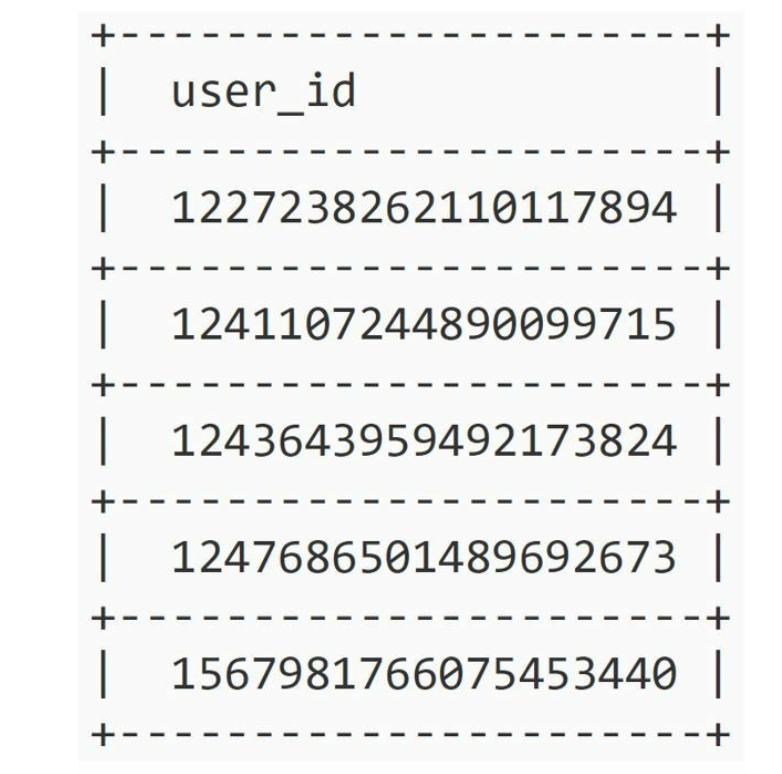

| English | Vietnamese |
|---------|------------|
| CHAPTER 7: DESIGN A UNIQUE ID GENERATOR IN DISTRIBUTED SYSTEMS | CHƯƠNG 7: THIẾT KẾ BỘ SINH ID DUY NHẤT TRONG HỆ THỐNG PHÂN TÁN |

| English | Vietnamese |
|---------|------------|
| Step 1 - Understand the problem and establish design scope | Bước 1 - Hiểu vấn đề và xác định phạm vi thiết kế |
| Asking clarification questions is the first step to tackle any system design interview question. | Đặt câu hỏi làm rõ là bước đầu tiên để giải quyết bất kỳ câu hỏi phỏng vấn thiết kế hệ thống nào. |
| Here is an example of candidate-interviewer interaction: | Đây là một ví dụ về cuộc trao đổi giữa ứng viên và người phỏng vấn: |
| Candidate: What are the characteristics of unique IDs? | Ứng viên: Đặc điểm của các ID duy nhất là gì? |
| Interviewer: IDs must be unique and sortable. | Người phỏng vấn: ID phải duy nhất và có thể sắp xếp được. |
| Candidate: For each new record, does ID increment by 1? | Ứng viên: Với mỗi bản ghi mới, ID có tăng thêm 1 không? |
| Interviewer: The ID increments by time but not necessarily only increments by 1. IDs created in the evening are larger than those created in the morning on the same day. | Người phỏng vấn: ID tăng theo thời gian nhưng không nhất thiết chỉ tăng thêm 1. Các ID được tạo vào buổi tối sẽ lớn hơn các ID được tạo vào buổi sáng cùng ngày. |
| Candidate: Do IDs only contain numerical values? | Ứng viên: ID chỉ chứa giá trị số phải không? |
| Interviewer: Yes, that is correct. | Người phỏng vấn: Đúng vậy. |
| Candidate: What is the ID length requirement? | Ứng viên: Yêu cầu về độ dài ID là gì? |
| Interviewer: IDs should fit into 64-bit. | Người phỏng vấn: ID phải vừa trong 64-bit. |
| Candidate: What is the scale of the system? | Ứng viên: Quy mô của hệ thống là bao nhiêu? |
| Interviewer: The system should be able to generate 10,000 IDs per second. | Người phỏng vấn: Hệ thống phải có khả năng tạo ra 10.000 ID mỗi giây. |
| Above are some of the sample questions that you can ask your interviewer. It is important to understand the requirements and clarify ambiguities. | Trên đây là một số câu hỏi mẫu mà bạn có thể hỏi người phỏng vấn. Việc hiểu rõ các yêu cầu và làm sáng tỏ những điểm mơ hồ là rất quan trọng. |
| For this interview question, the requirements are listed as follows: | Với câu hỏi phỏng vấn này, các yêu cầu được liệt kê như sau: |
| • IDs must be unique. | • ID phải duy nhất. |
| • IDs are numerical values only. | • ID chỉ chứa giá trị số. |
| • IDs fit into 64-bit. | • ID vừa trong 64-bit. |
| • IDs are ordered by date. | • ID được sắp xếp theo ngày tháng. |
| • Ability to generate over 10,000 unique IDs per second. | • Khả năng tạo ra hơn 10.000 ID duy nhất mỗi giây. |

| English | Vietnamese |
|---------|------------|
| This approach uses the databases’ auto_increment feature. Instead of increasing the next ID by 1, we increase it by k, where k is the number of database servers in use. | Cách tiếp cận này sử dụng tính năng auto_increment của cơ sở dữ liệu. Thay vì tăng ID tiếp theo lên 1, chúng ta tăng nó lên k, trong đó k là số lượng máy chủ cơ sở dữ liệu được sử dụng. |
| As illustrated in Figure 7-2, next ID to be generated is equal to the previous ID in the same server plus 2. | Như minh họa trong Hình 7-2, ID tiếp theo được tạo ra bằng với ID trước đó trên cùng một máy chủ cộng thêm 2. |
| This solves some scalability issues because IDs can scale with the number of database servers. | Điều này giải quyết một số vấn đề về khả năng mở rộng vì các ID có thể mở rộng theo số lượng máy chủ cơ sở dữ liệu. |
| However, this strategy has some major drawbacks: | Tuy nhiên, chiến lược này có một số nhược điểm lớn: |
| • Hard to scale with multiple data centers | • Khó mở rộng với nhiều trung tâm dữ liệu |
| • IDs do not go up with time across multiple servers. | • ID không tăng theo thời gian trên nhiều máy chủ. |
| • It does not scale well when a server is added or removed. | • Nó không mở rộng tốt khi một máy chủ được thêm hoặc gỡ bỏ. |
| UUID | UUID |
| A UUID is another easy way to obtain unique IDs. UUID is a 128-bit number used to identify information in computer systems. | UUID là một cách khác đơn giản để có được các ID duy nhất. UUID là một số 128-bit được sử dụng để nhận diện thông tin trong các hệ thống máy tính. |
| UUID has a very low probability of getting collusion. | UUID có xác suất trùng lặp rất thấp. |
| Quoted from Wikipedia, “after generating 1 billion UUIDs every second for approximately 100 years would the probability of creating a single duplicate reach 50%”. | Trích dẫn từ Wikipedia, “sau khi tạo ra 1 tỷ UUID mỗi giây trong khoảng 100 năm thì xác suất tạo ra một bản trùng lặp duy nhất mới đạt 50%”. |
| Here is an example of UUID: 09c93e62-50b4-468d-bf8a-c07e1040bfb2. | Đây là một ví dụ về UUID: 09c93e62-50b4-468d-bf8a-c07e1040bfb2. |
| UUIDs can be generated independently without coordination between servers. | UUID có thể được tạo ra độc lập mà không cần phối hợp giữa các máy chủ. |
| Figure 7-3 presents the UUIDs design. | Hình 7-3 trình bày thiết kế của UUID. |

| English | Vietnamese |
|---------|------------|
| In this design, each web server contains an ID generator, and a web server is responsible for generating IDs independently. | Trong thiết kế này, mỗi máy chủ web chứa một bộ tạo ID và một máy chủ web chịu trách nhiệm tạo ID một cách độc lập. |
| Pros: | Ưu điểm: |
| • Generating UUID is simple. No coordination between servers is needed so there will not be any synchronization issues. | • Việc tạo UUID rất đơn giản. Không cần phối hợp giữa các máy chủ nên sẽ không có vấn đề đồng bộ. |
| • The system is easy to scale because each web server is responsible for generating IDs they consume. ID generator can easily scale with web servers. | • Hệ thống dễ mở rộng vì mỗi máy chủ web chịu trách nhiệm tạo ID mà nó sử dụng. Bộ tạo ID có thể dễ dàng mở rộng cùng với các máy chủ web. |
| Cons: | Nhược điểm: |
| • IDs are 128 bits long, but our requirement is 64 bits. | • ID dài 128 bit, nhưng yêu cầu của chúng ta là 64 bit. |
| • IDs do not go up with time. | • ID không tăng theo thời gian. |
| • IDs could be non-numeric. | • ID có thể không phải là số. |
| Ticket Server | Máy chủ cấp vé |
| Ticket servers are another interesting way to generate unique IDs. Flicker developed ticket servers to generate distributed primary keys [2]. It is worth mentioning how the system works. | Máy chủ cấp vé là một cách thú vị khác để tạo ID duy nhất. Flicker đã phát triển các máy chủ cấp vé để tạo khóa chính phân tán [2]. Đáng để đề cập cách hệ thống hoạt động. |

| English | Vietnamese |
|---------|------------|
| The idea is to use a centralized auto_increment feature in a single database server (Ticket Server). To learn more about this, refer to flicker’s engineering blog article [2]. | Ý tưởng là sử dụng tính năng auto_increment tập trung trong một máy chủ cơ sở dữ liệu duy nhất (Ticket Server). Để tìm hiểu thêm về điều này, hãy tham khảo bài viết trên blog kỹ thuật của Flickr [2]. |
| Pros: | Ưu điểm: |
| • Numeric IDs. | • ID dạng số. |
| • It is easy to implement, and it works for small to medium-scale applications. | • Dễ triển khai và hoạt động tốt cho các ứng dụng nhỏ đến trung bình. |
| Cons: | Nhược điểm: |
| • Single point of failure. Single ticket server means if the ticket server goes down, all systems that depend on it will face issues. | • Điểm lỗi duy nhất. Một ticket server duy nhất có nghĩa là nếu ticket server gặp sự cố, tất cả hệ thống phụ thuộc vào nó sẽ bị ảnh hưởng. |
| • To avoid a single point of failure, we can set up multiple ticket servers. However, this will introduce new challenges such as data synchronization. | • Để tránh điểm lỗi duy nhất, ta có thể thiết lập nhiều ticket server. Tuy nhiên, điều này sẽ tạo ra những thách thức mới như đồng bộ dữ liệu. |
| Twitter snowflake approach | Phương pháp Snowflake của Twitter |
| Approaches mentioned above give us some ideas about how different ID generation systems work. However, none of them meet our specific requirements; thus, we need another approach. | Các phương pháp được đề cập ở trên cho chúng ta một số ý tưởng về cách các hệ thống tạo ID khác nhau hoạt động. Tuy nhiên, không phương pháp nào đáp ứng các yêu cầu cụ thể của chúng ta; do đó, cần một cách tiếp cận khác. |
| Twitter’s unique ID generation system called “snowflake” [3] is inspiring and can satisfy our requirements. | Hệ thống tạo ID độc đáo của Twitter gọi là “snowflake” [3] là nguồn cảm hứng và có thể đáp ứng các yêu cầu của chúng ta. |
| Divide and conquer is our friend. Instead of generating an ID directly, we divide an ID into different sections. Figure 7-5 shows the layout of a 64-bit ID. | Chia để trị là bạn đồng hành của chúng ta. Thay vì tạo ID trực tiếp, ta chia ID thành nhiều phần khác nhau. Hình 7-5 minh họa bố cục của một ID 64-bit. |

| English | Vietnamese |
|---------|------------|
| Sign bit: 1 bit. It will always be 0. This is reserved for future uses. It can potentially be used to distinguish between signed and unsigned numbers. | Bit dấu: 1 bit. Luôn luôn bằng 0. Được dành cho các mục đích sử dụng trong tương lai. Nó có thể được dùng để phân biệt giữa số có dấu và không dấu. |
| Timestamp: 41 bits. Milliseconds since the epoch or custom epoch. We use Twitter snowflake default epoch 1288834974657, equivalent to Nov 04, 2010, 01:42:54 UTC. | Dấu thời gian: 41 bit. Tính bằng mili-giây kể từ epoch hoặc epoch tùy chỉnh. Chúng tôi sử dụng epoch mặc định của Twitter Snowflake là 1288834974657, tương ứng với 04/11/2010, 01:42:54 UTC. |
| Datacenter ID: 5 bits, which gives us 2 ^ 5 = 32 datacenters. | ID trung tâm dữ liệu: 5 bit, cho phép có 2 ^ 5 = 32 trung tâm dữ liệu. |
| Machine ID: 5 bits, which gives us 2 ^ 5 = 32 machines per datacenter. | ID máy: 5 bit, cho phép có 2 ^ 5 = 32 máy cho mỗi trung tâm dữ liệu. |
| Sequence number: 12 bits. For every ID generated on that machine/process, the sequence number is incremented by 1. The number is reset to 0 every millisecond. | Số thứ tự: 12 bit. Với mỗi ID được tạo trên máy/tiến trình đó, số thứ tự sẽ tăng thêm 1. Con số này được đặt lại về 0 sau mỗi mili-giây. |
| Step 3 - Design deep dive | Bước 3 - Phân tích thiết kế chi tiết |
| In the high-level design, we discussed various options to design a unique ID generator in distributed systems. We settle on an approach that is based on the Twitter snowflake ID generator. Let us dive deep into the design. To refresh our memory, the design diagram is relisted below. | Trong thiết kế cấp cao, chúng tôi đã thảo luận nhiều lựa chọn để thiết kế bộ tạo ID duy nhất trong hệ thống phân tán. Cuối cùng, chúng tôi chọn cách tiếp cận dựa trên bộ tạo ID Twitter Snowflake. Hãy cùng phân tích chi tiết thiết kế. Để gợi nhớ lại, sơ đồ thiết kế được liệt kê lại dưới đây. |

| English | Vietnamese |
|---------|------------|
| Datacenter IDs and machine IDs are chosen at the startup time, generally fixed once the system is up running. | ID trung tâm dữ liệu và ID máy được chọn khi khởi động, thường được cố định sau khi hệ thống đã chạy. |
| Any changes in datacenter IDs and machine IDs require careful review since an accidental change in those values can lead to ID conflicts. | Bất kỳ thay đổi nào trong ID trung tâm dữ liệu và ID máy đều cần được xem xét cẩn thận vì thay đổi nhầm có thể dẫn đến xung đột ID. |
| Timestamp and sequence numbers are generated when the ID generator is running. | Dấu thời gian và số thứ tự được tạo ra khi bộ tạo ID đang chạy. |
| Timestamp | Dấu thời gian |
| The most important 41 bits make up the timestamp section. | 41 bit quan trọng nhất tạo thành phần dấu thời gian. |
| As timestamps grow with time, IDs are sortable by time. | Khi dấu thời gian tăng theo thời gian, các ID có thể được sắp xếp theo thời gian. |
| Figure 7-7 shows an example of how binary representation is converted to UTC. | Hình 7-7 cho thấy ví dụ về cách biểu diễn nhị phân được chuyển đổi sang UTC. |
| You can also convert UTC back to binary representation using a similar method. | Bạn cũng có thể chuyển đổi UTC trở lại dạng nhị phân bằng phương pháp tương tự. |

| English | Vietnamese |
|---------|------------|
| The maximum timestamp that can be represented in 41 bits is 2 ^ 41 - 1 = 2199023255551 milliseconds (ms), which gives us: ~ 69 years = 2199023255551 ms / 1000 seconds / 365 days / 24 hours/ 3600 seconds. | Dấu thời gian tối đa có thể được biểu diễn trong 41 bit là 2 ^ 41 - 1 = 2199023255551 mili giây (ms), tương đương với khoảng 69 năm = 2199023255551 ms / 1000 giây / 365 ngày / 24 giờ / 3600 giây. |
| This means the ID generator will work for 69 years and having a custom epoch time close to today’s date delays the overflow time. | Điều này có nghĩa là bộ tạo ID sẽ hoạt động trong 69 năm và việc chọn một mốc thời gian (epoch) gần với ngày hiện tại sẽ trì hoãn thời điểm tràn số. |
| After 69 years, we will need a new epoch time or adopt other techniques to migrate IDs. | Sau 69 năm, chúng ta sẽ cần một mốc epoch mới hoặc áp dụng các kỹ thuật khác để di chuyển các ID. |
| Sequence number | Số thứ tự |
| Sequence number is 12 bits, which give us 2 ^ 12 = 4096 combinations. | Số thứ tự có 12 bit, tương ứng với 2 ^ 12 = 4096 tổ hợp. |
| This field is 0 unless more than one ID is generated in a millisecond on the same server. | Trường này bằng 0 trừ khi có nhiều hơn một ID được tạo ra trong cùng một mili giây trên cùng một máy chủ. |
| In theory, a machine can support a maximum of 4096 new IDs per millisecond. | Về lý thuyết, một máy có thể hỗ trợ tối đa 4096 ID mới mỗi mili giây. |

| English | Vietnamese |
|---------|------------|
| Step 4 - Wrap up | Bước 4 - Tổng kết |
| In this chapter, we discussed different approaches to design a unique ID generator: multi-master replication, UUID, ticket server, and Twitter snowflake-like unique ID generator. We settle on snowflake as it supports all our use cases and is scalable in a distributed environment. | Trong chương này, chúng ta đã thảo luận các cách tiếp cận khác nhau để thiết kế bộ tạo ID duy nhất: nhân bản đa chủ, UUID, máy chủ cấp phát vé, và bộ tạo ID dạng Snowflake của Twitter. Chúng ta chọn Snowflake vì nó hỗ trợ tất cả các trường hợp sử dụng và có khả năng mở rộng trong môi trường phân tán. |
| If there is extra time at the end of the interview, here are a few additional talking points: | Nếu còn thời gian ở cuối buổi phỏng vấn, dưới đây là một vài điểm bổ sung có thể thảo luận: |
| • Clock synchronization. In our design, we assume ID generation servers have the same clock. This assumption might not be true when a server is running on multiple cores. The same challenge exists in multi-machine scenarios. Solutions to clock synchronization are out of the scope of this book; however, it is important to understand the problem exists. Network Time Protocol is the most popular solution to this problem. For interested readers, refer to the reference material [4]. | • Đồng bộ đồng hồ. Trong thiết kế của chúng ta, giả định rằng các máy chủ tạo ID có cùng đồng hồ. Giả định này có thể không đúng khi một máy chủ chạy trên nhiều lõi. Thách thức tương tự cũng tồn tại trong các tình huống đa máy. Giải pháp đồng bộ đồng hồ nằm ngoài phạm vi của cuốn sách này; tuy nhiên, điều quan trọng là cần hiểu vấn đề này tồn tại. Network Time Protocol là giải pháp phổ biến nhất cho vấn đề này. Độc giả quan tâm có thể tham khảo tài liệu tham khảo [4]. |
| • Section length tuning. For example, fewer sequence numbers but more timestamp bits are effective for low concurrency and long-term applications. | • Điều chỉnh độ dài các phần. Ví dụ, ít số thứ tự hơn nhưng nhiều bit dấu thời gian hơn sẽ hiệu quả cho các ứng dụng có mức độ đồng thời thấp và dài hạn. |
| • High availability. Since an ID generator is a mission-critical system, it must be highly available. | • Tính khả dụng cao. Vì bộ tạo ID là một hệ thống quan trọng, nó phải có khả năng sẵn sàng cao. |
| Congratulations on getting this far! Now give yourself a pat on the back. Good job! | Chúc mừng bạn đã đi đến đây! Hãy tự thưởng cho mình một lời khen. Làm tốt lắm! |
