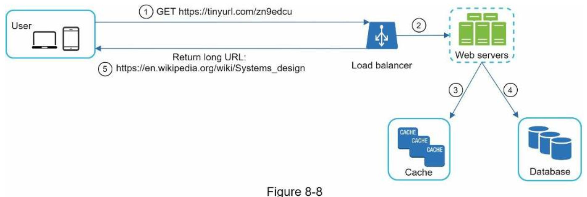

| English | Vietnamese |
|---------|------------|
| CHAPTER 8: DESIGN A URL SHORTENER | CHƯƠNG 8: THIẾT KẾ HỆ THỐNG RÚT GỌN URL |

| English | Vietnamese |
|---------|------------|
| In this chapter, we will tackle an interesting and classic system design interview question: designing a URL shortening service like tinyurl. | Trong chương này, chúng ta sẽ giải quyết một câu hỏi kinh điển và thú vị trong phỏng vấn thiết kế hệ thống: thiết kế một dịch vụ rút gọn URL như tinyurl. |

| English | Vietnamese |
|---------|------------|
| Step 1 - Understand the problem and establish design scope | Bước 1 - Hiểu vấn đề và xác định phạm vi thiết kế |
| System design interview questions are intentionally left open-ended. To design a well-crafted system, it is critical to ask clarification questions. | Các câu hỏi phỏng vấn thiết kế hệ thống thường được cố ý để mở. Để thiết kế một hệ thống tốt, việc đặt câu hỏi làm rõ là rất quan trọng. |
| Candidate: Can you give an example of how a URL shortener work? | Ứng viên: Bạn có thể cho ví dụ về cách một hệ thống rút gọn URL hoạt động không? |
| Interviewer: Assume URL https://www.systeminterview.com/q=chatsystem&c=loggedin&v=v3&l=long is the original URL. Your service creates an alias with shorter length: https://tinyurl.com/ y7keocwj. If you click the alias, it redirects you to the original URL. | Người phỏng vấn: Giả sử URL https://www.systeminterview.com/q=chatsystem&c=loggedin&v=v3&l=long là URL gốc. Dịch vụ của bạn tạo một bí danh ngắn hơn: https://tinyurl.com/ y7keocwj. Khi nhấp vào bí danh, hệ thống sẽ chuyển hướng về URL gốc. |
| Candidate: What is the traffic volume? | Ứng viên: Lưu lượng truy cập là bao nhiêu? |
| Interviewer: 100 million URLs are generated per day. | Người phỏng vấn: 100 triệu URL được tạo mỗi ngày. |
| Candidate: How long is the shortened URL? | Ứng viên: URL rút gọn dài bao nhiêu? |
| Interviewer: As short as possible. | Người phỏng vấn: Ngắn nhất có thể. |
| Candidate: What characters are allowed in the shortened URL? | Ứng viên: Những ký tự nào được phép trong URL rút gọn? |
| Interviewer: Shortened URL can be a combination of numbers (0-9) and characters (a-z, A-Z). | Người phỏng vấn: URL rút gọn có thể là tổ hợp của số (0-9) và chữ cái (a-z, A-Z). |
| Candidate: Can shortened URLs be deleted or updated? | Ứng viên: URL rút gọn có thể bị xóa hoặc cập nhật không? |
| Interviewer: For simplicity, let us assume shortened URLs cannot be deleted or updated. | Người phỏng vấn: Để đơn giản, giả sử URL rút gọn không thể bị xóa hoặc cập nhật. |
| Here are the basic use cases: | Dưới đây là các trường hợp sử dụng cơ bản: |
| 1.URL shortening: given a long URL => return a much shorter URL | 1. Rút gọn URL: cho một URL dài ⇒ trả về một URL ngắn hơn nhiều |
| 2.URL redirecting: given a shorter URL => redirect to the original URL | 2. Chuyển hướng URL: cho một URL ngắn ⇒ chuyển hướng đến URL gốc |
| 3.High availability, scalability, and fault tolerance considerations | 3. Cân nhắc về tính sẵn sàng cao, khả năng mở rộng và chịu lỗi |
| Back of the envelope estimation | Ước tính sơ bộ |
| • Write operation: 100 million URLs are generated per day. | • Ghi: 100 triệu URL được tạo mỗi ngày. |
| • Write operation per second: 100 million / 24 /3600 = 1160 | • Lượt ghi mỗi giây: 100 triệu / 24 / 3600 = 1160 |
| • Read operation: Assuming ratio of read operation to write operation is 10:1, read operation per second: 1160 * 10 = 11,600 | • Đọc: Giả sử tỷ lệ đọc/ghi là 10:1, lượt đọc mỗi giây: 1160 * 10 = 11.600 |
| • Assuming the URL shortener service will run for 10 years, this means we must support 100 million * 365 * 10 = 365 billion records. | • Giả sử dịch vụ rút gọn URL chạy trong 10 năm, chúng ta phải hỗ trợ 100 triệu * 365 * 10 = 365 tỷ bản ghi. |
| • Assume average URL length is 100. | • Giả sử độ dài URL trung bình là 100. |
| • Storage requirement over 10 years: 365 billion * 100 bytes * 10 years = 365 TB | • Nhu cầu lưu trữ trong 10 năm: 365 tỷ * 100 byte * 10 năm = 365 TB |
| It is important for you to walk through the assumptions and calculations with your interviewer so that both of you are on the same page. | Điều quan trọng là bạn cần trình bày các giả định và phép tính với người phỏng vấn để cả hai cùng hiểu thống nhất. |
| English | Vietnamese |
|---------|------------|
| Step 2 - Propose high-level design and get buy-in | Bước 2 - Đề xuất thiết kế cấp cao và nhận sự đồng thuận |
| In this section, we discuss the API endpoints, URL redirecting, and URL shortening flows. | Trong phần này, chúng ta sẽ thảo luận về các điểm cuối API, chuyển hướng URL và luồng rút gọn URL. |
| API Endpoints | Các điểm cuối API |
| API endpoints facilitate the communication between clients and servers. We will design the APIs REST-style. If you are unfamiliar with restful API, you can consult external materials, such as the one in the reference material [1]. A URL shortener primary needs two API endpoints. | Các điểm cuối API hỗ trợ giao tiếp giữa client và server. Chúng ta sẽ thiết kế API theo kiểu REST. Nếu bạn chưa quen với RESTful API, bạn có thể tham khảo tài liệu bên ngoài, chẳng hạn như tài liệu tham khảo [1]. Một dịch vụ rút gọn URL chủ yếu cần hai điểm cuối API. |
| 1. URL shortening. To create a new short URL, a client sends a POST request, which contains one parameter: the original long URL. The API looks like this: | 1. Rút gọn URL. Để tạo một URL ngắn mới, client gửi một yêu cầu POST, trong đó có một tham số: URL gốc dài. API trông như sau: |
| POST api/v1/data/shorten | POST api/v1/data/shorten |
| • request parameter: {longUrl: longURLString} | • tham số yêu cầu: {longUrl: longURLString} |
| • return shortURL | • trả về shortURL |
| 2. URL redirecting. To redirect a short URL to the corresponding long URL, a client sends a GET request. The API looks like this: | 2. Chuyển hướng URL. Để chuyển hướng từ một URL ngắn đến URL dài tương ứng, client gửi một yêu cầu GET. API trông như sau: |
| GET api/v1/shortUrl | GET api/v1/shortUrl |
| • Return longURL for HTTP redirection | • Trả về longURL để chuyển hướng HTTP |
| URL redirecting | Chuyển hướng URL |
| Figure 8-1 shows what happens when you enter a tinyurl onto the browser. Once the server receives a tinyurl request, it changes the short URL to the long URL with 301 redirect. | Hình 8-1 cho thấy điều gì xảy ra khi bạn nhập một tinyurl vào trình duyệt. Khi server nhận được yêu cầu tinyurl, nó sẽ chuyển đổi URL ngắn sang URL dài bằng cách dùng 301 redirect. |

| English | Vietnamese |
|---------|------------|
| The detailed communication between clients and servers is shown in Figure 8-2. | Giao tiếp chi tiết giữa client và server được thể hiện trong Hình 8-2. |

| English | Vietnamese |
|---------|------------|
| One thing worth discussing here is 301 redirect vs 302 redirect. | Một điều đáng bàn ở đây là chuyển hướng 301 so với 302. |
| 301 redirect. A 301 redirect shows that the requested URL is “permanently” moved to the long URL. Since it is permanently redirected, the browser caches the response, and subsequent requests for the same URL will not be sent to the URL shortening service. Instead, requests are redirected to the long URL server directly. | Chuyển hướng 301. Chuyển hướng 301 cho thấy URL được yêu cầu đã bị “di chuyển vĩnh viễn” đến URL dài. Vì là chuyển hướng vĩnh viễn, trình duyệt sẽ lưu vào bộ nhớ đệm phản hồi, và các yêu cầu tiếp theo cho cùng URL sẽ không được gửi đến dịch vụ rút gọn URL. Thay vào đó, các yêu cầu sẽ được chuyển hướng trực tiếp đến server của URL dài. |
| 302 redirect. A 302 redirect means that the URL is “temporarily” moved to the long URL, meaning that subsequent requests for the same URL will be sent to the URL shortening service first. Then, they are redirected to the long URL server. | Chuyển hướng 302. Chuyển hướng 302 có nghĩa là URL được “di chuyển tạm thời” đến URL dài, có nghĩa là các yêu cầu tiếp theo cho cùng URL sẽ được gửi đến dịch vụ rút gọn URL trước. Sau đó, chúng được chuyển hướng đến server của URL dài. |
| Each redirection method has its pros and cons. If the priority is to reduce the server load, using 301 redirect makes sense as only the first request of the same URL is sent to URL shortening servers. However, if analytics is important, 302 redirect is a better choice as it can track click rate and source of the click more easily. | Mỗi phương pháp chuyển hướng đều có ưu nhược điểm. Nếu ưu tiên là giảm tải server, sử dụng chuyển hướng 301 là hợp lý vì chỉ yêu cầu đầu tiên của cùng một URL được gửi đến server rút gọn URL. Tuy nhiên, nếu phân tích dữ liệu quan trọng, chuyển hướng 302 là lựa chọn tốt hơn vì có thể theo dõi tỉ lệ nhấp và nguồn nhấp dễ dàng hơn. |
| The most intuitive way to implement URL redirecting is to use hash tables. Assuming the hash table stores <shortURL, longURL> pairs, URL redirecting can be implemented by the following: | Cách trực quan nhất để thực hiện chuyển hướng URL là sử dụng bảng băm. Giả sử bảng băm lưu trữ các cặp <shortURL, longURL>, chuyển hướng URL có thể được thực hiện như sau: |
| Get longURL: longURL = hashTable.get(shortURL) | Lấy longURL: longURL = hashTable.get(shortURL) |
| Once you get the longURL, perform the URL redirect. | Khi bạn có được longURL, thực hiện chuyển hướng URL. |
| URL shortening | Rút gọn URL |
| Let us assume the short URL looks like this: www.tinyurl.com/{hashValue}. To support the URL shortening use case, we must find a hash function fx that maps a long URL to the hashValue, as shown in Figure 8-3. | Giả sử URL rút gọn trông như sau: www.tinyurl.com/{hashValue}. Để hỗ trợ trường hợp sử dụng rút gọn URL, chúng ta phải tìm một hàm băm fx ánh xạ URL dài thành hashValue, như thể hiện trong Hình 8-3. |

| English | Vietnamese |
|---------|------------|
| The hash function must satisfy the following requirements: | Hàm băm phải thỏa mãn các yêu cầu sau: |
| Each longURL must be hashed to one hashValue. | Mỗi longURL phải được băm thành một hashValue duy nhất. |
| Each hashValue can be mapped back to the longURL. | Mỗi hashValue có thể được ánh xạ trở lại longURL. |
| Detailed design for the hash function is discussed in deep dive. | Thiết kế chi tiết của hàm băm được thảo luận trong phần phân tích sâu. |

| English | Vietnamese |
|---------|------------|
| Step 3 - Design deep dive | Bước 3 - Phân tích thiết kế chi tiết |
| Up until now, we have discussed the high-level design of URL shortening and URL redirecting. | Cho đến nay, chúng ta đã thảo luận về thiết kế tổng thể của việc rút gọn URL và chuyển hướng URL. |
| In this section, we dive deep into the following: data model, hash function, URL shortening and URL redirecting. | Trong phần này, chúng ta sẽ phân tích chi tiết các nội dung sau: mô hình dữ liệu, hàm băm, rút gọn URL và chuyển hướng URL. |
| Data model | Mô hình dữ liệu |
| In the high-level design, everything is stored in a hash table. | Trong thiết kế tổng thể, mọi thứ được lưu trữ trong một bảng băm. |
| This is a good starting point; however, this approach is not feasible for real-world systems as memory resources are limited and expensive. | Đây là điểm khởi đầu tốt; tuy nhiên, cách tiếp cận này không khả thi trong hệ thống thực tế vì bộ nhớ hạn chế và tốn kém. |
| A better option is to store <shortURL, longURL> mapping in a relational database. | Một lựa chọn tốt hơn là lưu ánh xạ <shortURL, longURL> trong cơ sở dữ liệu quan hệ. |
| Figure 8-4 shows a simple database table design. | Hình 8-4 minh họa thiết kế bảng cơ sở dữ liệu đơn giản. |
| The simplified version of the table contains 3 columns: id, shortURL, longURL. | Phiên bản đơn giản của bảng chứa 3 cột: id, shortURL, longURL. |

| English | Vietnamese |
|---------|------------|
| Hash function | Hàm băm |
| Hash function is used to hash a long URL to a short URL, also known as hashValue. | Hàm băm được sử dụng để băm một URL dài thành URL ngắn, còn được gọi là hashValue. |
| Hash value length | Độ dài giá trị băm |
| The hashValue consists of characters from [0-9, a-z, A-Z], containing 10 + 26 + 26 = 62 possible characters. | hashValue bao gồm các ký tự từ [0-9, a-z, A-Z], tổng cộng 10 + 26 + 26 = 62 ký tự có thể. |
| To figure out the length of hashValue, find the smallest n such that 62^n ≥ 365 billion. | Để xác định độ dài của hashValue, tìm số n nhỏ nhất sao cho 62^n ≥ 365 tỷ. |
| The system must support up to 365 billion URLs based on the back of the envelope estimation. | Hệ thống phải hỗ trợ lên đến 365 tỷ URL dựa trên ước tính sơ bộ. |
| Table 8-1 shows the length of hashValue and the corresponding maximal number of URLs it can support. | Bảng 8-1 minh họa độ dài của hashValue và số lượng URL tối đa mà nó có thể hỗ trợ. |

| English | Vietnamese |
|---------|------------|
| When n = 7, 62 ^ n = ~3.5 trillion, 3.5 trillion is more than enough to hold 365 billion URLs, so the length of hashValue is 7. | Khi n = 7, 62 ^ n = ~3,5 nghìn tỷ, 3,5 nghìn tỷ là quá đủ để chứa 365 tỷ URL, do đó độ dài của hashValue là 7. |
| We will explore two types of hash functions for a URL shortener. | Chúng ta sẽ tìm hiểu hai loại hàm băm cho dịch vụ rút gọn URL. |
| The first one is “hash + collision resolution”, and the second one is “base 62 conversion.” | Loại đầu tiên là “băm + xử lý va chạm”, và loại thứ hai là “chuyển đổi cơ số 62”. |
| Let us look at them one by one. | Hãy xem từng loại một. |
| Hash + collision resolution | Băm + xử lý va chạm |
| To shorten a long URL, we should implement a hash function that hashes a long URL to a 7-character string. | Để rút gọn một URL dài, chúng ta nên triển khai một hàm băm băm URL dài thành chuỗi 7 ký tự. |
| A straightforward solution is to use well-known hash functions like CRC32, MD5, or SHA-1. | Một giải pháp đơn giản là sử dụng các hàm băm nổi tiếng như CRC32, MD5 hoặc SHA-1. |
| The following table compares the hash results after applying different hash functions on this URL: https://en.wikipedia.org/wiki/Systems_design. | Bảng dưới đây so sánh kết quả băm sau khi áp dụng các hàm băm khác nhau trên URL này: https://en.wikipedia.org/wiki/Systems_design. |

| English | Vietnamese |
|---------|------------|
| As shown in Table 8-2, even the shortest hash value (from CRC32) is too long (more than 7 characters). | Như được hiển thị trong Bảng 8-2, ngay cả giá trị băm ngắn nhất (từ CRC32) cũng quá dài (hơn 7 ký tự). |
| How can we make it shorter? | Làm thế nào để rút ngắn nó? |
| The first approach is to collect the first 7 characters of a hash value; however, this method can lead to hash collisions. | Cách tiếp cận đầu tiên là lấy 7 ký tự đầu tiên của giá trị băm; tuy nhiên, phương pháp này có thể dẫn đến va chạm băm. |
| To resolve hash collisions, we can recursively append a new predefined string until no more collision is discovered. | Để giải quyết va chạm băm, chúng ta có thể đệ quy thêm một chuỗi định trước mới cho đến khi không còn va chạm nào được phát hiện. |
| This process is explained in Figure 8-5. | Quá trình này được giải thích trong Hình 8-5. |

| English | Vietnamese |
|---------|------------|
| This method can eliminate collision; however, it is expensive to query the database to check if a shortURL exists for every request. | Phương pháp này có thể loại bỏ va chạm; tuy nhiên, việc truy vấn cơ sở dữ liệu để kiểm tra shortURL tồn tại cho mỗi yêu cầu là tốn kém. |
| A technique called bloom filters [2] can improve performance. | Một kỹ thuật gọi là bloom filter [2] có thể cải thiện hiệu suất. |
| A bloom filter is a space-efficient probabilistic technique to test if an element is a member of a set. | Bloom filter là một kỹ thuật xác suất tiết kiệm không gian để kiểm tra xem một phần tử có thuộc một tập hợp hay không. |
| Refer to the reference material [2] for more details. | Tham khảo tài liệu [2] để biết thêm chi tiết. |
| Base conversion is another approach commonly used for URL shorteners. | Chuyển đổi cơ số là một phương pháp khác thường được sử dụng cho dịch vụ rút gọn URL. |
| Base conversion helps to convert the same number between its different number representation systems. | Chuyển đổi cơ số giúp chuyển đổi cùng một số giữa các hệ thống biểu diễn số khác nhau. |
| Base 62 conversion is used as there are 62 possible characters for hashValue. | Chuyển đổi cơ số 62 được sử dụng vì có 62 ký tự có thể dùng cho hashValue. |
| Let us use an example to explain how the conversion works: convert 1115710 to base 62 representation (1115710 represents 11157 in a base 10 system). | Hãy dùng một ví dụ để giải thích cách chuyển đổi hoạt động: chuyển 1115710 sang biểu diễn cơ số 62 (1115710 đại diện cho 11157 trong hệ cơ số 10). |
| From its name, base 62 is a way of using 62 characters for encoding. | Theo tên gọi, cơ số 62 là cách sử dụng 62 ký tự để mã hóa. |
| The mappings are: 0-0, ..., 9-9, 10-a, 11-b, ..., 35-z, 36-A, ..., 61-Z, where ‘a’ stands for 10, ‘Z’ stands for 61, etc. | Bản đồ ký tự là: 0-0, ..., 9-9, 10-a, 11-b, ..., 35-z, 36-A, ..., 61-Z, trong đó ‘a’ đại diện cho 10, ‘Z’ đại diện cho 61, v.v. |
| 1115710 = 2 x 62² + 55 x 62¹ + 59 x 62⁰ = [2, 55, 59] -> [2, T, X] in base 62 representation. | 1115710 = 2 x 62² + 55 x 62¹ + 59 x 62⁰ = [2, 55, 59] -> [2, T, X] trong biểu diễn cơ số 62. |
| Figure 8-6 shows the conversion process. | Hình 8-6 minh họa quá trình chuyển đổi. |

| English | Vietnamese |
|---------|------------|
| Thus, the short URL is https://tinyurl.com/2TX | Do đó, URL rút gọn là https://tinyurl.com/2TX |
| Comparison of the two approaches | So sánh hai phương pháp |
| Table 8-3 shows the differences of the two approaches. | Bảng 8-3 trình bày sự khác biệt của hai phương pháp. |

| English | Vietnamese |
|---------|------------|
| URL shortening deep dive | Phân tích chi tiết về rút gọn URL |
| As one of the core pieces of the system, we want the URL shortening flow to be logically simple and functional. | Là một trong những phần cốt lõi của hệ thống, chúng ta muốn luồng rút gọn URL vừa đơn giản về mặt logic vừa hoạt động hiệu quả. |
| Base 62 conversion is used in our design. | Phương pháp chuyển đổi Base 62 được sử dụng trong thiết kế của chúng tôi. |
| We build the following diagram (Figure 8-7) to demonstrate the flow. | Chúng tôi xây dựng sơ đồ sau (Hình 8-7) để minh họa luồng hoạt động. |

| English | Vietnamese |
|---------|------------|
| 1. longURL is the input. | 1. longURL là đầu vào. |
| 2. The system checks if the longURL is in the database. | 2. Hệ thống kiểm tra xem longURL có trong cơ sở dữ liệu hay không. |
| 3. If it is, it means the longURL was converted to shortURL before. In this case, fetch the shortURL from the database and return it to the client. | 3. Nếu có, điều đó có nghĩa là longURL đã được chuyển thành shortURL trước đó. Trong trường hợp này, lấy shortURL từ cơ sở dữ liệu và trả về cho client. |
| 4. If not, the longURL is new. A new unique ID (primary key) is generated by the unique ID generator. | 4. Nếu không, longURL là mới. Một ID duy nhất mới (khóa chính) được tạo bởi bộ sinh ID duy nhất. |
| 5. Convert the ID to shortURL with base 62 conversion. | 5. Chuyển ID thành shortURL bằng phương pháp chuyển đổi Base 62. |
| 6. Create a new database row with the ID, shortURL, and longURL. | 6. Tạo một hàng mới trong cơ sở dữ liệu với ID, shortURL và longURL. |
| Example: | Ví dụ: |
| - Input longURL: https://en.wikipedia.org/wiki/Systems_design | - longURL đầu vào: https://en.wikipedia.org/wiki/Systems_design |
| - Unique ID generator returns ID: 2009215674938 | - Bộ sinh ID duy nhất trả về ID: 2009215674938 |
| - Convert ID to shortURL: “zn9edcu” | - Chuyển ID thành shortURL: “zn9edcu” |
| - Save ID, shortURL, and longURL to database (Table 8-4) | - Lưu ID, shortURL và longURL vào cơ sở dữ liệu (Bảng 8-4) |

| English | Vietnamese |
|---------|------------|
| The distributed unique ID generator is worth mentioning. Its primary function is to generate globally unique IDs, which are used for creating shortURLs. | Bộ sinh ID duy nhất phân tán đáng được nhắc đến. Chức năng chính của nó là tạo ra các ID duy nhất toàn cầu, được sử dụng để tạo shortURL. |
| In a highly distributed environment, implementing a unique ID generator is challenging. | Trong môi trường phân tán cao, việc triển khai bộ sinh ID duy nhất là thách thức. |
| Luckily, we have already discussed a few solutions in “Chapter 7: Design A Unique ID Generator in Distributed Systems”. | May mắn thay, chúng ta đã thảo luận một số giải pháp trong “Chương 7: Thiết kế bộ sinh ID duy nhất trong hệ thống phân tán”. |
| You can refer back to it to refresh your memory. | Bạn có thể tham khảo lại để làm mới kiến thức. |
| URL redirecting deep dive | Đi sâu vào thiết kế URL redirecting |
| Figure 8-8 shows the detailed design of the URL redirecting. | Hình 8-8 minh họa thiết kế chi tiết của URL redirecting. |
| As there are more reads than writes, <shortURL, longURL> mapping is stored in a cache to improve performance. | Do số lần đọc nhiều hơn số lần ghi, ánh xạ <shortURL, longURL> được lưu trong bộ nhớ đệm để cải thiện hiệu suất. |

| English | Vietnamese |
|---------|------------|
| The flow of URL redirecting is summarized as follows: | Luồng URL redirecting được tóm tắt như sau: |
| 1. A user clicks a short URL link: https://tinyurl.com/zn9edcu | 1. Người dùng nhấp vào liên kết short URL: https://tinyurl.com/zn9edcu |
| 2. The load balancer forwards the request to web servers. | 2. Bộ cân bằng tải chuyển tiếp yêu cầu đến các máy chủ web. |
| 3. If a shortURL is already in the cache, return the longURL directly. | 3. Nếu shortURL đã có trong bộ nhớ đệm, trả về longURL trực tiếp. |
| 4. If a shortURL is not in the cache, fetch the longURL from the database. If it is not in the database, it is likely a user entered an invalid shortURL. | 4. Nếu shortURL chưa có trong bộ nhớ đệm, truy xuất longURL từ cơ sở dữ liệu. Nếu không có trong cơ sở dữ liệu, có khả năng người dùng nhập shortURL không hợp lệ. |
| 5. The longURL is returned to the user. | 5. LongURL được trả về cho người dùng. |
| Step 4 - Wrap up | Bước 4 - Kết luận |
| In this chapter, we talked about the API design, data model, hash function, URL shortening, and URL redirecting. | Trong chương này, chúng ta đã thảo luận về thiết kế API, mô hình dữ liệu, hàm băm, URL shortening và URL redirecting. |
| If there is extra time at the end of the interview, here are a few additional talking points. | Nếu còn thời gian ở cuối buổi phỏng vấn, đây là một số điểm thảo luận bổ sung. |
| Rate limiter: A potential security problem we could face is that malicious users send an overwhelmingly large number of URL shortening requests. Rate limiter helps to filter out requests based on IP address or other filtering rules. If you want to refresh your memory about rate limiting, refer to “Chapter 4: Design a rate limiter”. | Rate limiter: Một vấn đề bảo mật tiềm ẩn là người dùng độc hại gửi quá nhiều yêu cầu rút gọn URL. Rate limiter giúp lọc yêu cầu dựa trên địa chỉ IP hoặc các quy tắc lọc khác. Nếu bạn muốn làm mới kiến thức về giới hạn tốc độ, tham khảo “Chương 4: Thiết kế rate limiter”. |
| Web server scaling: Since the web tier is stateless, it is easy to scale the web tier by adding or removing web servers. | Mở rộng máy chủ web: Vì tầng web không trạng thái, việc mở rộng tầng web bằng cách thêm hoặc loại bỏ máy chủ web trở nên dễ dàng. |
| Database scaling: Database replication and sharding are common techniques. | Mở rộng cơ sở dữ liệu: Sao chép cơ sở dữ liệu và phân mảnh là các kỹ thuật phổ biến. |
| Analytics: Data is increasingly important for business success. Integrating an analytics solution to the URL shortener could help to answer important questions like how many people click on a link? When do they click the link? etc. | Phân tích dữ liệu: Dữ liệu ngày càng quan trọng đối với thành công của doanh nghiệp. Tích hợp giải pháp phân tích vào URL shortener có thể giúp trả lời các câu hỏi quan trọng như bao nhiêu người nhấp vào liên kết? Khi nào họ nhấp vào liên kết? v.v. |
| Availability, consistency, and reliability. These concepts are at the core of any large system’s success. We discussed them in detail in Chapter 1, please refresh your memory on these topics. | Khả dụng, nhất quán và độ tin cậy. Những khái niệm này là cốt lõi cho thành công của bất kỳ hệ thống lớn nào. Chúng ta đã thảo luận chi tiết trong Chương 1, vui lòng làm mới kiến thức về các chủ đề này. |
| Congratulations on getting this far! Now give yourself a pat on the back. Good job! | Chúc mừng bạn đã đi được đến đây! Hãy tự vỗ vai mình. Làm tốt lắm! |
