| English | Vietnamese |
|---------|------------|
| CHAPTER 9: DESIGN A WEB CRAWLER | CHƯƠNG 9: THIẾT KẾ MỘT TRÌNH THU THẬP DỮ LIỆU WEB |

| English | Vietnamese |
|---------|------------|
| In this chapter, we focus on web crawler design: an interesting and classic system design interview question. | Trong chương này, chúng ta tập trung vào thiết kế trình thu thập dữ liệu web: một câu hỏi phỏng vấn thiết kế hệ thống thú vị và kinh điển. |
| A web crawler is known as a robot or spider. It is widely used by search engines to discover new or updated content on the web. | Trình thu thập dữ liệu web còn được gọi là robot hoặc nhện. Nó được các công cụ tìm kiếm sử dụng rộng rãi để khám phá nội dung mới hoặc đã được cập nhật trên web. |
| Content can be a web page, an image, a video, a PDF file, etc.                              | Nội dung có thể là một trang web, một hình ảnh, một video, một tệp PDF, v.v.                       |
| A web crawler starts by collecting a few web pages and then follows links on those pages to collect new content. | Trình thu thập dữ liệu web bắt đầu bằng việc thu thập một vài trang web và sau đó theo các liên kết trên những trang đó để thu thập nội dung mới. |
| Figure 9-1 shows a visual example of the crawl process.                                     | Hình 9-1 minh họa một ví dụ trực quan về quá trình thu thập dữ liệu.                                |

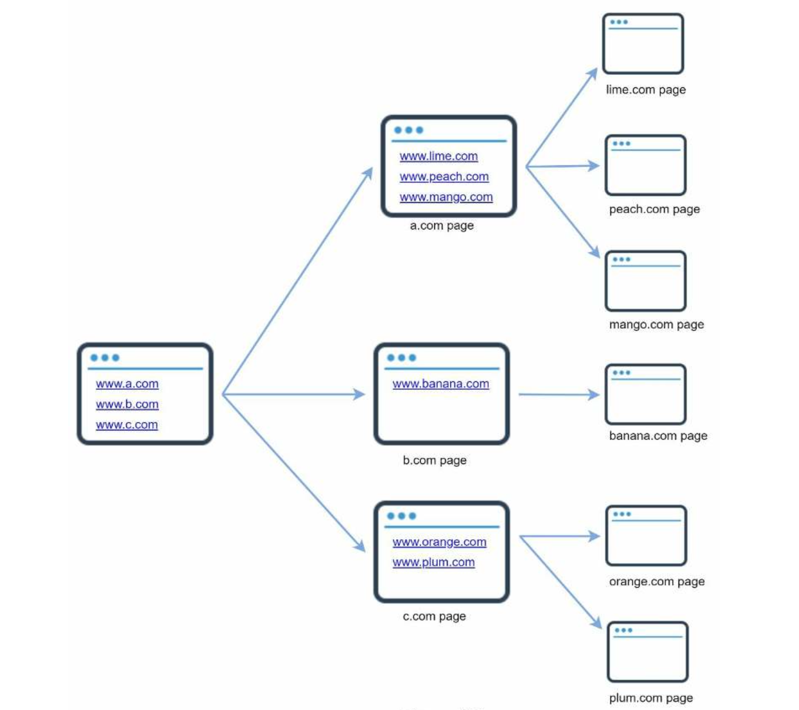

| English | Vietnamese |
|---------|------------|
| A crawler is used for many purposes: | Một trình thu thập dữ liệu (crawler) được sử dụng cho nhiều mục đích: |
| • Search engine indexing: This is the most common use case. A crawler collects web pages to create a local index for search engines. For example, Googlebot is the web crawler behind the Google search engine. | • Lập chỉ mục công cụ tìm kiếm: Đây là trường hợp sử dụng phổ biến nhất. Một crawler thu thập các trang web để tạo chỉ mục cục bộ cho công cụ tìm kiếm. Ví dụ: Googlebot là trình thu thập dữ liệu của công cụ tìm kiếm Google. |
| • Web archiving: This is the process of collecting information from the web to preserve data for future uses. For instance, many national libraries run crawlers to archive web sites. Notable examples are the US Library of Congress [1] and the EU web archive [2]. | • Lưu trữ web: Đây là quá trình thu thập thông tin từ web để lưu giữ dữ liệu cho các mục đích trong tương lai. Ví dụ: nhiều thư viện quốc gia vận hành crawler để lưu trữ các trang web. Các ví dụ nổi bật là Thư viện Quốc hội Mỹ [1] và kho lưu trữ web của EU [2]. |
| • Web mining: The explosive growth of the web presents an unprecedented opportunity for data mining. Web mining helps to discover useful knowledge from the internet. For example, top financial firms use crawlers to download shareholder meetings and annual reports to learn key company initiatives. | • Khai phá web: Sự bùng nổ của web mang đến một cơ hội chưa từng có cho khai phá dữ liệu. Khai phá web giúp khám phá những kiến thức hữu ích từ internet. Ví dụ: các công ty tài chính hàng đầu sử dụng crawler để tải về biên bản họp cổ đông và báo cáo thường niên nhằm tìm hiểu các sáng kiến quan trọng của công ty. |
| • Web monitoring. The crawlers help to monitor copyright and trademark infringements over the Internet. For example, Digimarc [3] utilizes crawlers to discover pirated works and reports. | • Giám sát web: Các crawler giúp theo dõi vi phạm bản quyền và nhãn hiệu trên Internet. Ví dụ: Digimarc [3] sử dụng crawler để phát hiện và báo cáo các tác phẩm vi phạm bản quyền. |
| The complexity of developing a web crawler depends on the scale we intend to support. | Độ phức tạp của việc phát triển một crawler phụ thuộc vào quy mô mà chúng ta muốn hỗ trợ. |
| It could be either a small school project, which takes only a few hours to complete or a gigantic project that requires continuous improvement from a dedicated engineering team. | Nó có thể chỉ là một dự án nhỏ ở trường học, chỉ mất vài giờ để hoàn thành hoặc cũng có thể là một dự án khổng lồ đòi hỏi sự cải tiến liên tục từ một nhóm kỹ sư chuyên trách. |
| Thus, we will explore the scale and features to support below. | Vì vậy, chúng ta sẽ khám phá quy mô và các tính năng cần hỗ trợ bên dưới. |
| English | Vietnamese |
|---------|------------|
| Step 1 - Understand the problem and establish design scope | Bước 1 - Hiểu vấn đề và xác định phạm vi thiết kế |
| The basic algorithm of a web crawler is simple: | Thuật toán cơ bản của một trình thu thập dữ liệu (web crawler) khá đơn giản: |
| 1. Given a set of URLs, download all the web pages addressed by the URLs. | 1. Với một tập hợp các URL, tải xuống tất cả các trang web được chỉ định bởi các URL đó. |
| 2. Extract URLs from these web pages | 2. Trích xuất các URL từ các trang web này. |
| 3. Add new URLs to the list of URLs to be downloaded. Repeat these 3 steps. | 3. Thêm các URL mới vào danh sách cần tải xuống. Lặp lại 3 bước này. |
| Does a web crawler work truly as simple as this basic algorithm? Not exactly. | Liệu một crawler có thực sự hoạt động đơn giản như thuật toán cơ bản này không? Không hẳn. |
| Designing a vastly scalable web crawler is an extremely complex task. | Việc thiết kế một crawler có khả năng mở rộng lớn là một nhiệm vụ cực kỳ phức tạp. |
| It is unlikely for anyone to design a massive web crawler within the interview duration. | Khó có khả năng ai đó có thể thiết kế một crawler quy mô lớn trong thời gian phỏng vấn. |
| Before jumping into the design, we must ask questions to understand the requirements and establish design scope: | Trước khi bắt tay vào thiết kế, chúng ta phải đặt câu hỏi để hiểu yêu cầu và xác định phạm vi thiết kế: |
| Candidate: What is the main purpose of the crawler? Is it used for search engine indexing, data mining, or something else? | Ứng viên: Mục đích chính của crawler là gì? Nó được sử dụng để lập chỉ mục công cụ tìm kiếm, khai phá dữ liệu, hay mục đích khác? |
| Interviewer: Search engine indexing. | Người phỏng vấn: Lập chỉ mục công cụ tìm kiếm. |
| Candidate: How many web pages does the web crawler collect per month? | Ứng viên: Mỗi tháng crawler sẽ thu thập bao nhiêu trang web? |
| Interviewer: 1 billion pages. | Người phỏng vấn: 1 tỷ trang. |
| Candidate: What content types are included? HTML only or other content types such as PDFs and images as well? | Ứng viên: Bao gồm những loại nội dung nào? Chỉ HTML hay cả PDF, hình ảnh, v.v.? |
| Interviewer: HTML only. | Người phỏng vấn: Chỉ HTML. |
| Candidate: Shall we consider newly added or edited web pages? | Ứng viên: Có cần xem xét các trang web mới thêm hoặc chỉnh sửa không? |
| Interviewer: Yes, we should consider the newly added or edited web pages. | Người phỏng vấn: Có, chúng ta cần xem xét các trang mới thêm hoặc chỉnh sửa. |
| Candidate: Do we need to store HTML pages crawled from the web? | Ứng viên: Chúng ta có cần lưu trữ các trang HTML được thu thập từ web không? |
| Interviewer: Yes, up to 5 years | Người phỏng vấn: Có, lưu trữ đến 5 năm. |
| Candidate: How do we handle web pages with duplicate content? | Ứng viên: Làm thế nào để xử lý các trang web có nội dung trùng lặp? |
| Interviewer: Pages with duplicate content should be ignored. | Người phỏng vấn: Các trang có nội dung trùng lặp sẽ bị bỏ qua. |
| Above are some of the sample questions that you can ask your interviewer. | Trên đây là một số câu hỏi mẫu mà bạn có thể hỏi người phỏng vấn. |
| It is important to understand the requirements and clarify ambiguities. | Việc hiểu rõ yêu cầu và làm sáng tỏ những điểm mơ hồ là rất quan trọng. |
| Even if you are asked to design a straightforward product like a web crawler, you and your interviewer might not have the same assumptions. | Ngay cả khi bạn được yêu cầu thiết kế một sản phẩm đơn giản như web crawler, bạn và người phỏng vấn có thể có những giả định khác nhau. |
| Beside functionalities to clarify with your interviewer, it is also important to note down the following characteristics of a good web crawler: | Ngoài việc làm rõ các chức năng với người phỏng vấn, cũng cần ghi nhớ những đặc điểm sau của một web crawler tốt: |
| • Scalability: The web is very large. There are billions of web pages out there. Web crawling should be extremely efficient using parallelization. | • Khả năng mở rộng: Web rất lớn, có hàng tỷ trang web. Quá trình crawling cần cực kỳ hiệu quả nhờ khả năng song song hóa. |
| • Robustness: The web is full of traps. Bad HTML, unresponsive servers, crashes, malicious links, etc. are all common. The crawler must handle all those edge cases. | • Độ ổn định: Web đầy rẫy những cạm bẫy. HTML lỗi, máy chủ không phản hồi, sự cố, liên kết độc hại, v.v. đều phổ biến. Crawler phải xử lý được tất cả các trường hợp này. |
| • Politeness: The crawler should not make too many requests to a website within a short time interval. | • Lịch sự: Crawler không nên gửi quá nhiều yêu cầu đến một trang web trong khoảng thời gian ngắn. |
| • Extensibility: The system is flexible so that minimal changes are needed to support new content types. For example, if we want to crawl image files in the future, we should not need to redesign the entire system. | • Khả năng mở rộng: Hệ thống phải linh hoạt để chỉ cần thay đổi tối thiểu khi hỗ trợ loại nội dung mới. Ví dụ, nếu muốn thu thập ảnh trong tương lai, chúng ta không nên phải thiết kế lại toàn bộ hệ thống. |
| Back of the envelope estimation | Ước lượng sơ bộ |
| The following estimations are based on many assumptions, and it is important to communicate with the interviewer to be on the same page. | Các ước lượng sau dựa trên nhiều giả định, và cần trao đổi rõ với người phỏng vấn để thống nhất. |
| English | Vietnamese |
|---------|------------|
| Step 2 - Propose high-level design and get buy-in | Bước 2 - Đề xuất thiết kế cấp cao và nhận sự đồng thuận |
| Once the requirements are clear, we move on to the high-level design. Inspired by previous studies on web crawling [4] [5], we propose a high-level design as shown in Figure 9-2. | Khi các yêu cầu đã rõ ràng, chúng ta chuyển sang thiết kế cấp cao. Lấy cảm hứng từ các nghiên cứu trước đây về web crawling [4] [5], chúng tôi đề xuất một thiết kế cấp cao như được minh họa trong Hình 9-2. |

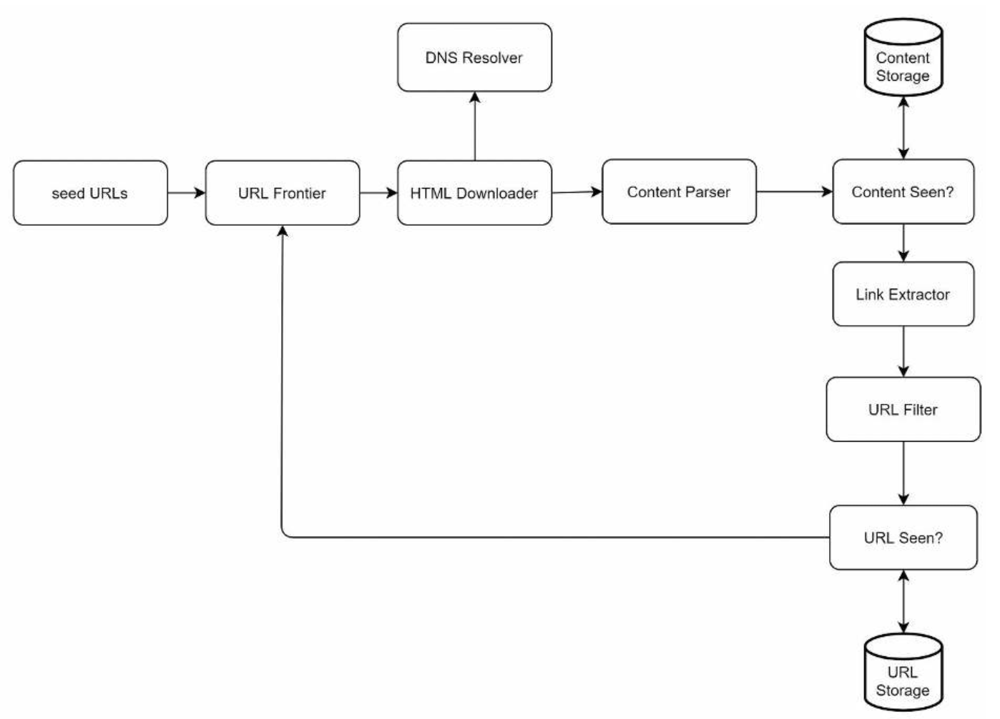

| English | Vietnamese |
|---------|------------|
| First, we explore each design component to understand their functionalities. | Trước tiên, chúng ta khám phá từng thành phần thiết kế để hiểu các chức năng của chúng. |
| Then, we examine the crawler workflow step-by-step. | Sau đó, chúng ta xem xét quy trình làm việc của crawler từng bước một. |
| Seed URLs | URL hạt giống (Seed URLs) |
| A web crawler uses seed URLs as a starting point for the crawl process. | Một trình thu thập dữ liệu sử dụng các URL hạt giống làm điểm bắt đầu cho quá trình thu thập. |
| For example, to crawl all web pages from a university’s website, an intuitive way to select seed URLs is to use the university’s domain name. | Ví dụ, để thu thập tất cả các trang web của một trường đại học, một cách trực quan để chọn URL hạt giống là sử dụng tên miền của trường. |
| To crawl the entire web, we need to be creative in selecting seed URLs. | Để thu thập toàn bộ web, chúng ta cần sáng tạo trong việc chọn các URL hạt giống. |
| A good seed URL serves as a good starting point that a crawler can utilize to traverse as many links as possible. | Một URL hạt giống tốt đóng vai trò điểm xuất phát để crawler có thể đi qua càng nhiều liên kết càng tốt. |
| The general strategy is to divide the entire URL space into smaller ones. | Chiến lược chung là chia không gian URL tổng thể thành các phần nhỏ hơn. |
| The first proposed approach is based on locality as different countries may have different popular websites. | Cách tiếp cận đầu tiên dựa trên tính địa phương vì các quốc gia khác nhau có thể có những trang web phổ biến khác nhau. |
| Another way is to choose seed URLs based on topics; for example, we can divide URL space into shopping, sports, healthcare, etc. | Một cách khác là chọn URL hạt giống theo chủ đề; ví dụ, chúng ta có thể chia không gian URL thành mua sắm, thể thao, chăm sóc sức khỏe, v.v. |
| Seed URL selection is an open-ended question. | Việc lựa chọn URL hạt giống là một câu hỏi mở. |
| You are not expected to give the perfect answer. | Bạn không cần đưa ra câu trả lời hoàn hảo. |
| Just think out loud. | Hãy suy nghĩ thành tiếng. |
| URL Frontier | URL Frontier |
| Most modern web crawlers split the crawl state into two: to be downloaded and already downloaded. | Hầu hết các crawler hiện đại tách trạng thái thu thập thành hai loại: cần tải xuống và đã tải xuống. |
| The component that stores URLs to be downloaded is called the URL Frontier. | Thành phần lưu trữ các URL cần tải xuống được gọi là URL Frontier. |
| You can refer to this as a First-in-First-out (FIFO) queue. | Bạn có thể coi đây là một hàng đợi vào trước ra trước (FIFO). |
| For detailed information about the URL Frontier, refer to the deep dive. | Để biết thông tin chi tiết về URL Frontier, hãy tham khảo phần phân tích chuyên sâu. |
| English | Vietnamese |
|---------|------------|
| **HTML Downloader** | **Trình tải HTML** |
| The HTML downloader downloads web pages from the internet. Those URLs are provided by the URL Frontier. | Trình tải HTML tải các trang web từ Internet. Các URL này được cung cấp bởi URL Frontier. |
| **DNS Resolver** | **Bộ phân giải DNS** |
| To download a web page, a URL must be translated into an IP address. The HTML Downloader calls the DNS Resolver to get the corresponding IP address for the URL. | Để tải một trang web, URL phải được dịch sang địa chỉ IP. Trình tải HTML gọi đến Bộ phân giải DNS để lấy địa chỉ IP tương ứng cho URL đó. |
| For instance, URL www.wikipedia.org is converted to IP address 198.35.26.96 as of 3/5/2019. | Ví dụ, URL www.wikipedia.org được chuyển thành địa chỉ IP 198.35.26.96 kể từ ngày 3/5/2019. |
| **Content Parser** | **Bộ phân tích nội dung** |
| After a web page is downloaded, it must be parsed and validated because malformed web pages could provoke problems and waste storage space. | Sau khi một trang web được tải về, nó phải được phân tích và xác thực vì các trang web bị lỗi có thể gây ra sự cố và lãng phí dung lượng lưu trữ. |
| Implementing a content parser in a crawl server will slow down the crawling process. Thus, the content parser is a separate component. | Việc triển khai bộ phân tích nội dung trong máy chủ thu thập dữ liệu sẽ làm chậm quá trình thu thập. Do đó, bộ phân tích nội dung là một thành phần riêng biệt. |
| **Content Seen?** | **Đã thấy nội dung?** |
| Online research reveals that 29% of the web pages are duplicated contents, which may cause the same content to be stored multiple times. | Nghiên cứu trực tuyến cho thấy 29% các trang web có nội dung trùng lặp, điều này có thể dẫn đến cùng một nội dung được lưu nhiều lần. |
| We introduce the “Content Seen?” data structure to eliminate data redundancy and shorten processing time. | Chúng tôi giới thiệu cấu trúc dữ liệu “Đã thấy nội dung?” để loại bỏ sự dư thừa dữ liệu và rút ngắn thời gian xử lý. |
| It helps to detect new content previously stored in the system. | Nó giúp phát hiện nội dung mới đã được lưu trong hệ thống. |
| To compare two HTML documents, we can compare them character by character. However, this method is slow and time-consuming, especially when billions of web pages are involved. | Để so sánh hai tài liệu HTML, chúng ta có thể so sánh từng ký tự. Tuy nhiên, phương pháp này chậm và tốn nhiều thời gian, đặc biệt khi liên quan đến hàng tỷ trang web. |
| An efficient way to accomplish this task is to compare the hash values of the two web pages. | Một cách hiệu quả để thực hiện nhiệm vụ này là so sánh giá trị băm của hai trang web. |
| **Content Storage** | **Kho lưu trữ nội dung** |
| It is a storage system for storing HTML content. The choice of storage system depends on factors such as data type, data size, access frequency, life span, etc. Both disk and memory are used. | Đây là hệ thống lưu trữ để lưu trữ nội dung HTML. Việc lựa chọn hệ thống lưu trữ phụ thuộc vào các yếu tố như loại dữ liệu, kích thước dữ liệu, tần suất truy cập, vòng đời, v.v. Cả ổ đĩa và bộ nhớ đều được sử dụng. |
| Most of the content is stored on disk because the data set is too big to fit in memory. | Hầu hết nội dung được lưu trên ổ đĩa vì tập dữ liệu quá lớn để chứa trong bộ nhớ. |
| Popular content is kept in memory to reduce latency. | Nội dung phổ biến được lưu trong bộ nhớ để giảm độ trễ. |
| **URL Extractor** | **Bộ trích xuất URL** |
| URL Extractor parses and extracts links from HTML pages. | Bộ trích xuất URL phân tích và trích xuất các liên kết từ các trang HTML. |
| Relative paths are converted to absolute URLs by adding the “https://en.wikipedia.org” prefix. | Các đường dẫn tương đối được chuyển đổi thành URL tuyệt đối bằng cách thêm tiền tố “https://en.wikipedia.org”. |

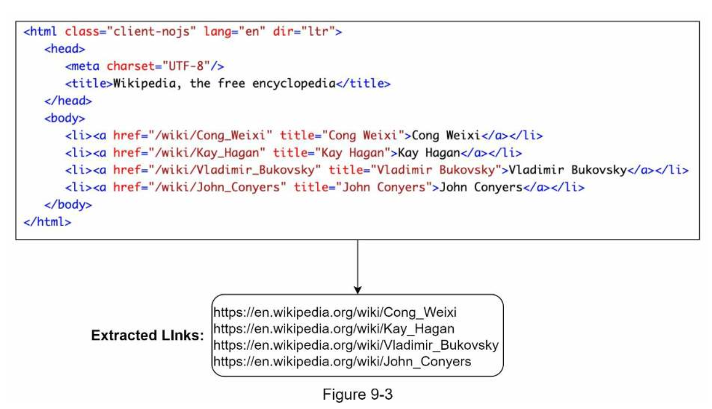
| English | Vietnamese |
|---------|------------|
| URL Filter | Bộ lọc URL |
| The URL filter excludes certain content types, file extensions, error links and URLs in “blacklisted” sites. | Bộ lọc URL loại trừ một số loại nội dung, phần mở rộng tệp, các liên kết lỗi và các URL thuộc các trang web trong “danh sách đen”. |
| URL Seen? | Đã thấy URL? |
| “URL Seen?” is a data structure that keeps track of URLs that are visited before or already in the Frontier. | “Đã thấy URL?” là một cấu trúc dữ liệu dùng để theo dõi các URL đã được truy cập trước đó hoặc đã nằm trong Frontier. |
| “URL Seen?” helps to avoid adding the same URL multiple times as this can increase server load and cause potential infinite loops. | “Đã thấy URL?” giúp tránh thêm cùng một URL nhiều lần vì điều đó có thể làm tăng tải máy chủ và gây ra các vòng lặp vô hạn tiềm ẩn. |
| Bloom filter and hash table are common techniques to implement the “URL Seen?” component. We will not cover the detailed implementation of the bloom filter and hash table here. For more information, refer to the reference materials [4] [8]. | Bộ lọc Bloom và bảng băm là các kỹ thuật phổ biến để triển khai thành phần “Đã thấy URL?”. Chúng tôi sẽ không trình bày chi tiết cách triển khai bộ lọc Bloom và bảng băm ở đây. Để biết thêm thông tin, hãy tham khảo tài liệu tham khảo [4] [8]. |
| URL Storage | Kho lưu trữ URL |
| URL Storage stores already visited URLs. | Kho lưu trữ URL lưu các URL đã được truy cập. |
| So far, we have discussed every system component. Next, we put them together to explain the workflow. | Cho đến nay, chúng ta đã thảo luận mọi thành phần của hệ thống. Tiếp theo, chúng ta ghép chúng lại để giải thích quy trình làm việc. |
| Web crawler workflow | Quy trình làm việc của web crawler |
| To better explain the workflow step-by-step, sequence numbers are added in the design diagram as shown in Figure 9-4. | Để giải thích rõ hơn quy trình theo từng bước, các số thứ tự được thêm vào sơ đồ thiết kế như trong Hình 9-4. |

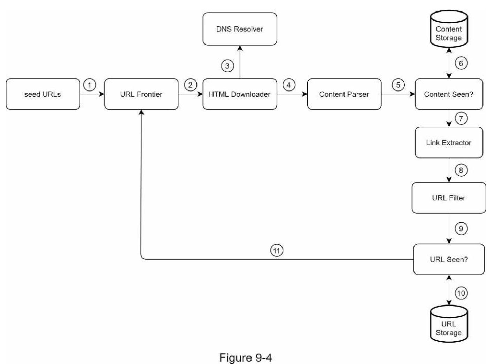

| English | Vietnamese |
|---------|------------|
| Step 1: Add seed URLs to the URL Frontier | Bước 1: Thêm các URL khởi tạo vào URL Frontier |
| Step 2: HTML Downloader fetches a list of URLs from URL Frontier. | Bước 2: HTML Downloader lấy danh sách URL từ URL Frontier. |
| Step 3: HTML Downloader gets IP addresses of URLs from DNS resolver and starts downloading. | Bước 3: HTML Downloader lấy địa chỉ IP của các URL từ DNS resolver và bắt đầu tải xuống. |
| Step 4: Content Parser parses HTML pages and checks if pages are malformed. | Bước 4: Content Parser phân tích các trang HTML và kiểm tra xem các trang có bị lỗi định dạng không. |
| Step 5: After content is parsed and validated, it is passed to the “Content Seen?” component. | Bước 5: Sau khi nội dung được phân tích và xác thực, nó được chuyển tới thành phần “Content Seen?”. |
| Step 6: “Content Seen” component checks if a HTML page is already in the storage. | Bước 6: Thành phần “Content Seen” kiểm tra xem một trang HTML đã có trong kho lưu trữ chưa. |
| • If it is in the storage, this means the same content in a different URL has already been processed. In this case, the HTML page is discarded. | • Nếu đã có trong kho lưu trữ, nghĩa là cùng một nội dung tại một URL khác đã được xử lý. Trong trường hợp này, trang HTML bị loại bỏ. |
| • If it is not in the storage, the system has not processed the same content before. The content is passed to Link Extractor. | • Nếu chưa có trong kho lưu trữ, hệ thống chưa xử lý nội dung này trước đó. Nội dung được chuyển tới Link Extractor. |
| Step 7: Link extractor extracts links from HTML pages. | Bước 7: Link Extractor trích xuất các liên kết từ các trang HTML. |
| Step 8: Extracted links are passed to the URL filter. | Bước 8: Các liên kết đã trích xuất được chuyển tới URL filter. |
| Step 9: After links are filtered, they are passed to the “URL Seen?” component. | Bước 9: Sau khi các liên kết được lọc, chúng được chuyển tới thành phần “URL Seen?”. |
| Step 10: “URL Seen” component checks if a URL is already in the storage, if yes, it is processed before, and nothing needs to be done. | Bước 10: Thành phần “URL Seen” kiểm tra xem một URL đã có trong kho lưu trữ chưa, nếu có nghĩa là đã xử lý rồi, và không cần làm gì thêm. |
| Step 11: If a URL has not been processed before, it is added to the URL Frontier. | Bước 11: Nếu một URL chưa từng được xử lý, nó sẽ được thêm vào URL Frontier. |
| English | Vietnamese |
|---------|------------|
| Step 3 - Design deep dive | Bước 3 - Đi sâu vào thiết kế |
| Up until now, we have discussed the high-level design. Next, we will discuss the most important building components and techniques in depth: | Cho đến nay, chúng ta đã thảo luận về thiết kế cấp cao. Tiếp theo, chúng ta sẽ đi sâu vào các thành phần và kỹ thuật quan trọng nhất: |
| • Depth-first search (DFS) vs Breadth-first search (BFS) | • Duyệt theo chiều sâu (DFS) so với Duyệt theo chiều rộng (BFS) |
| • URL frontier | • URL Frontier |
| • HTML Downloader | • Trình tải HTML |
| • Robustness | • Độ ổn định |
| • Extensibility | • Khả năng mở rộng |
| • Detect and avoid problematic content | • Phát hiện và tránh nội dung có vấn đề |
| DFS vs BFS | DFS và BFS |
| You can think of the web as a directed graph where web pages serve as nodes and hyperlinks (URLs) as edges. | Bạn có thể coi web là một đồ thị có hướng, trong đó các trang web là các nút và các siêu liên kết (URL) là các cạnh. |
| The crawl process can be seen as traversing a directed graph from one web page to others. | Quá trình thu thập dữ liệu có thể được xem như việc duyệt một đồ thị có hướng từ trang này sang các trang khác. |
| Two common graph traversal algorithms are DFS and BFS. However, DFS is usually not a good choice because the depth of DFS can be very deep. | Hai thuật toán duyệt đồ thị phổ biến là DFS và BFS. Tuy nhiên, DFS thường không phải lựa chọn tốt vì độ sâu của DFS có thể rất lớn. |
| BFS is commonly used by web crawlers and is implemented by a first-in-first-out (FIFO) queue. | BFS thường được các crawler sử dụng và được triển khai bằng hàng đợi vào trước ra trước (FIFO). |
| In a FIFO queue, URLs are dequeued in the order they are enqueued. However, this implementation has two problems: | Trong hàng đợi FIFO, các URL được lấy ra theo thứ tự chúng được đưa vào. Tuy nhiên, cách triển khai này có hai vấn đề: |
| • Most links from the same web page are linked back to the same host. In Figure 9-5, all the links in wikipedia.com are internal links, making the crawler busy processing URLs from the same host (wikipedia.com). When the crawler tries to download web pages in parallel, Wikipedia servers will be flooded with requests. This is considered as “impolite”. | • Phần lớn các liên kết từ cùng một trang trỏ về cùng một máy chủ. Trong Hình 9-5, tất cả liên kết trong wikipedia.com là liên kết nội bộ, khiến crawler bận xử lý URL từ cùng một host (wikipedia.com). Khi crawler cố gắng tải các trang song song, máy chủ Wikipedia sẽ bị “ngập” yêu cầu. Điều này bị coi là “thiếu lịch sự”. |

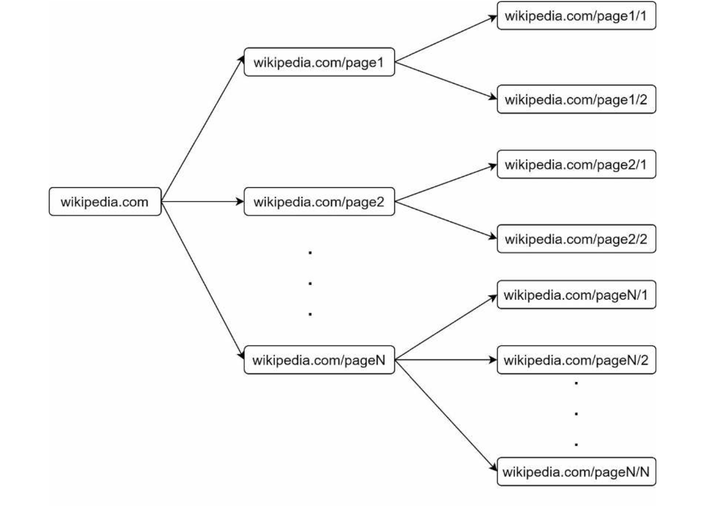

| English | Vietnamese |
|---------|------------|
| Standard BFS does not take the priority of a URL into consideration. The web is large and not every page has the same level of quality and importance. Therefore, we may want to prioritize URLs according to their page ranks, web traffic, update frequency, etc. | BFS tiêu chuẩn không xét đến mức độ ưu tiên của một URL. Web thì rất lớn và không phải trang nào cũng có cùng chất lượng và mức độ quan trọng. Do đó, chúng ta có thể muốn ưu tiên các URL dựa trên xếp hạng trang, lưu lượng truy cập, tần suất cập nhật, v.v. |
| URL frontier helps to address these problems. A URL frontier is a data structure that stores URLs to be downloaded. The URL frontier is an important component to ensure politeness, URL prioritization, and freshness. A few noteworthy papers on URL frontier are mentioned in the reference materials [5] [9]. The findings from these papers are as follows: | Hàng đợi URL giúp giải quyết những vấn đề này. Một hàng đợi URL là một cấu trúc dữ liệu dùng để lưu trữ các URL cần tải về. Hàng đợi URL là một thành phần quan trọng để đảm bảo tính lịch sự, ưu tiên URL và độ mới. Một vài nghiên cứu đáng chú ý về hàng đợi URL được đề cập trong tài liệu tham khảo [5] [9]. Các phát hiện từ những nghiên cứu này như sau: |
| Politeness | Tính lịch sự |
| Generally, a web crawler should avoid sending too many requests to the same hosting server within a short period. Sending too many requests is considered as “impolite” or even treated as denial-of-service (DOS) attack. For example, without any constraint, the crawler can send thousands of requests every second to the same website. This can overwhelm the web servers. | Nói chung, một web crawler nên tránh gửi quá nhiều yêu cầu đến cùng một máy chủ trong một khoảng thời gian ngắn. Gửi quá nhiều yêu cầu được coi là “không lịch sự” hoặc thậm chí bị xem như một cuộc tấn công từ chối dịch vụ (DOS). Ví dụ, nếu không có ràng buộc nào, crawler có thể gửi hàng nghìn yêu cầu mỗi giây đến cùng một website. Điều này có thể làm quá tải các máy chủ web. |
| The general idea of enforcing politeness is to download one page at a time from the same host. A delay can be added between two download tasks. The politeness constraint is implemented by maintain a mapping from website hostnames to download (worker) threads. Each downloader thread has a separate FIFO queue and only downloads URLs obtained from that queue. Figure 9-6 shows the design that manages politeness. | Ý tưởng chung để thực thi tính lịch sự là chỉ tải xuống một trang tại một thời điểm từ cùng một host. Có thể thêm độ trễ giữa hai tác vụ tải xuống. Ràng buộc lịch sự được thực hiện bằng cách duy trì ánh xạ từ hostname của website đến các luồng tải xuống (worker). Mỗi luồng tải xuống có một hàng đợi FIFO riêng và chỉ tải xuống các URL lấy từ hàng đợi đó. Hình 9-6 cho thấy thiết kế quản lý tính lịch sự. |

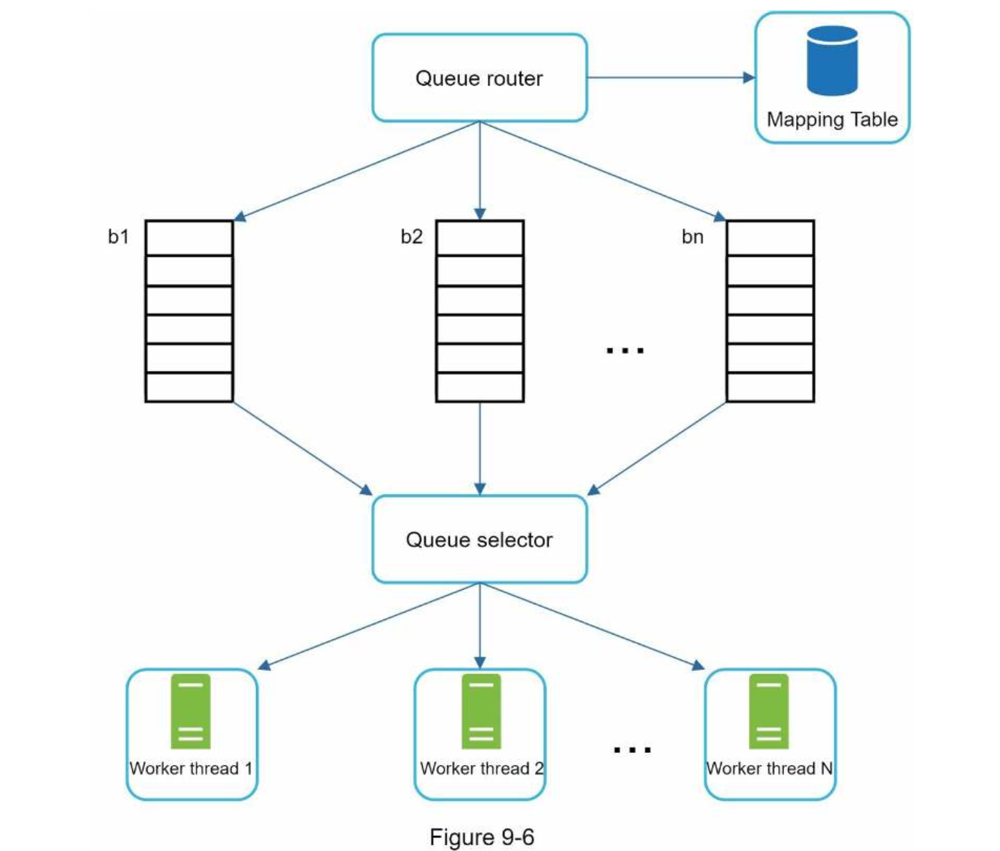

| English | Vietnamese |
|---------|------------|
| • Queue router: It ensures that each queue (b1, b2, … bn) only contains URLs from the same host. | • Bộ định tuyến hàng đợi: Nó đảm bảo rằng mỗi hàng đợi (b1, b2, … bn) chỉ chứa các URL từ cùng một máy chủ. |
| • Mapping table: It maps each host to a queue. | • Bảng ánh xạ: Nó ánh xạ mỗi máy chủ tới một hàng đợi.|

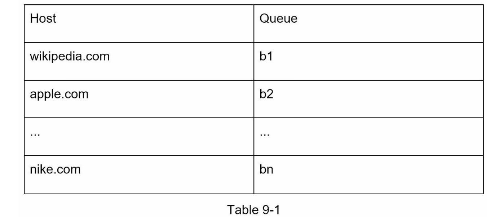

| English | Vietnamese |
|---------|------------|
| • FIFO queues b1, b2 to bn: Each queue contains URLs from the same host. | • Các hàng đợi FIFO b1, b2 đến bn: Mỗi hàng đợi chứa các URL từ cùng một máy chủ. |
| • Queue selector: Each worker thread is mapped to a FIFO queue, and it only downloads URLs from that queue. The queue selection logic is done by the Queue selector. | • Bộ chọn hàng đợi: Mỗi luồng công nhân được ánh xạ tới một hàng đợi FIFO và nó chỉ tải xuống các URL từ hàng đợi đó. Logic lựa chọn hàng đợi được thực hiện bởi Bộ chọn hàng đợi. |
| • Worker thread 1 to N. A worker thread downloads web pages one by one from the same host. A delay can be added between two download tasks. | • Luồng công nhân từ 1 đến N. Một luồng công nhân tải xuống các trang web lần lượt từ cùng một máy chủ. Có thể thêm độ trễ giữa hai tác vụ tải xuống. |
| Priority | Ưu tiên |
| A random post from a discussion forum about Apple products carries very different weight than posts on the Apple home page. Even though they both have the “Apple” keyword, it is sensible for a crawler to crawl the Apple home page first. | Một bài đăng ngẫu nhiên từ diễn đàn thảo luận về sản phẩm Apple có trọng số rất khác so với các bài đăng trên trang chủ của Apple. Mặc dù cả hai đều có từ khóa “Apple”, nhưng hợp lý hơn khi trình thu thập dữ liệu nên thu thập trang chủ Apple trước. |
| We prioritize URLs based on usefulness, which can be measured by PageRank [10], website traffic, update frequency, etc. “Prioritizer” is the component that handles URL prioritization. | Chúng tôi ưu tiên các URL dựa trên mức độ hữu ích, có thể đo lường bằng PageRank [10], lưu lượng truy cập website, tần suất cập nhật, v.v. “Bộ ưu tiên” là thành phần xử lý việc ưu tiên URL. |
| Refer to the reference materials [5] [10] for in-depth information about this concept. | Tham khảo các tài liệu [5] [10] để có thông tin chi tiết hơn về khái niệm này. |
| Figure 9-7 shows the design that manages URL priority. | Hình 9-7 minh họa thiết kế quản lý mức độ ưu tiên của URL. |

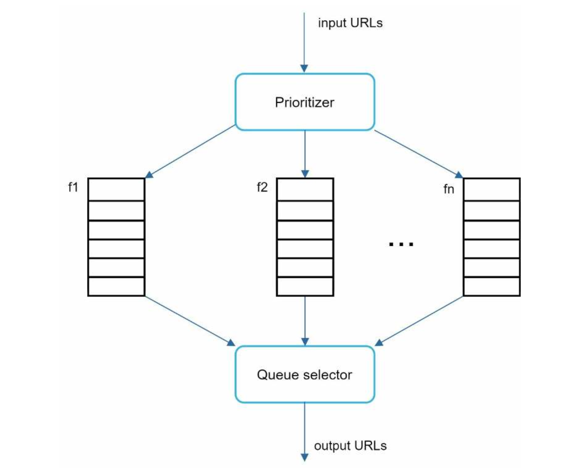

| English | Vietnamese |
|---------|------------|
| • Prioritizer: It takes URLs as input and computes the priorities. | • Trình ưu tiên: Nó nhận các URL làm đầu vào và tính toán mức độ ưu tiên. |
| • Queue f1 to fn: Each queue has an assigned priority. Queues with high priority are selected with higher probability. | • Hàng đợi f1 đến fn: Mỗi hàng đợi có một mức độ ưu tiên được gán sẵn. Các hàng đợi có độ ưu tiên cao sẽ được chọn với xác suất cao hơn. |
| • Queue selector: Randomly choose a queue with a bias towards queues with higher priority. | • Bộ chọn hàng đợi: Chọn ngẫu nhiên một hàng đợi nhưng thiên về các hàng đợi có độ ưu tiên cao hơn. |
| Figure 9-8 presents the URL frontier design, and it contains two modules: | Hình 9-8 trình bày thiết kế biên URL, và nó bao gồm hai mô-đun: |
| • Front queues: manage prioritization | • Hàng đợi phía trước: quản lý việc ưu tiên |
| • Back queues: manage politeness | • Hàng đợi phía sau: quản lý sự lịch sự (politeness) |

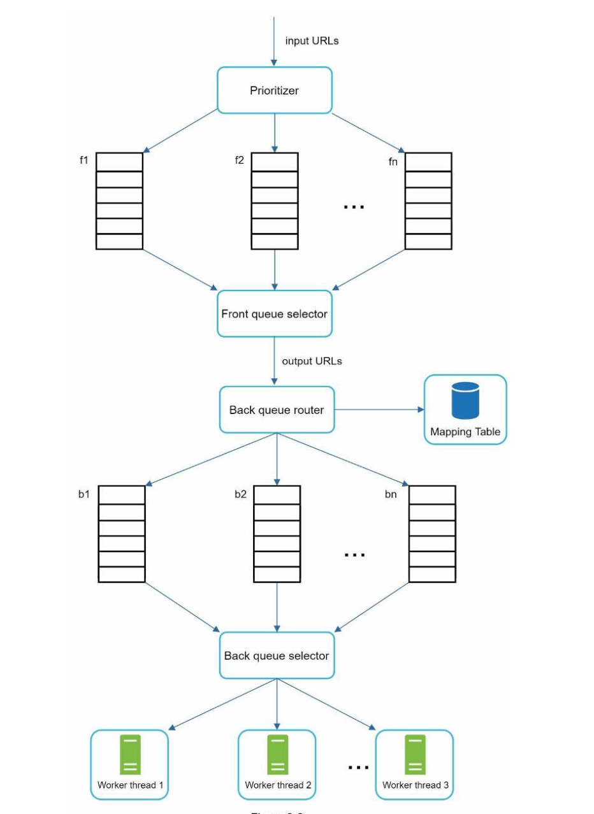

| English | Vietnamese |
|---------|------------|
| Freshness | Độ mới (Freshness) |
| Web pages are constantly being added, deleted, and edited. A web crawler must periodically recrawl downloaded pages to keep our data set fresh. Recrawl all the URLs is time-consuming and resource intensive. Few strategies to optimize freshness are listed as follows: | Các trang web liên tục được thêm mới, xóa bỏ và chỉnh sửa. Một trình thu thập dữ liệu web (crawler) phải định kỳ thu thập lại các trang đã tải xuống để giữ cho tập dữ liệu luôn mới. Việc thu thập lại tất cả các URL tốn nhiều thời gian và tài nguyên. Một số chiến lược để tối ưu độ mới được liệt kê như sau: |
| • Recrawl based on web pages’ update history. | • Thu thập lại dựa trên lịch sử cập nhật của các trang web. |
| • Prioritize URLs and recrawl important pages first and more frequently. | • Ưu tiên các URL và thu thập lại các trang quan trọng trước và thường xuyên hơn. |
| Storage for URL Frontier | Lưu trữ cho Biên URL (URL Frontier) |
| In real-world crawl for search engines, the number of URLs in the frontier could be hundreds of millions [4]. Putting everything in memory is neither durable nor scalable. Keeping everything in the disk is undesirable neither because the disk is slow; and it can easily become a bottleneck for the crawl. | Trong việc thu thập dữ liệu thực tế cho công cụ tìm kiếm, số lượng URL trong biên có thể lên tới hàng trăm triệu [4]. Đưa tất cả vào bộ nhớ không bền vững cũng không khả thi để mở rộng. Giữ tất cả trên đĩa cũng không mong muốn vì đĩa chậm và dễ trở thành nút thắt cổ chai cho quá trình thu thập. |
| We adopted a hybrid approach. The majority of URLs are stored on disk, so the storage space is not a problem. To reduce the cost of reading from the disk and writing to the disk, we maintain buffers in memory for enqueue/dequeue operations. Data in the buffer is periodically written to the disk. | Chúng tôi áp dụng cách tiếp cận lai. Phần lớn các URL được lưu trữ trên đĩa, nên không gặp vấn đề về dung lượng lưu trữ. Để giảm chi phí đọc và ghi từ đĩa, chúng tôi duy trì các bộ đệm trong bộ nhớ cho các thao tác enqueue/dequeue. Dữ liệu trong bộ đệm được ghi xuống đĩa theo định kỳ. |
| HTML Downloader | Trình tải HTML (HTML Downloader) |
| The HTML Downloader downloads web pages from the internet using the HTTP protocol. Before discussing the HTML Downloader, we look at Robots Exclusion Protocol first. | Trình tải HTML tải xuống các trang web từ Internet bằng giao thức HTTP. Trước khi thảo luận về HTML Downloader, chúng ta hãy xem xét Giao thức loại trừ Robots (Robots Exclusion Protocol). |
| Robots.txt | Robots.txt |
| Robots.txt, called Robots Exclusion Protocol, is a standard used by websites to communicate with crawlers. It specifies what pages crawlers are allowed to download. Before attempting to crawl a web site, a crawler should check its corresponding robots.txt first and follow its rules. | Robots.txt, còn gọi là Giao thức loại trừ Robots, là một tiêu chuẩn được các trang web sử dụng để giao tiếp với các crawler. Nó quy định những trang nào được phép tải xuống. Trước khi cố gắng thu thập dữ liệu một trang web, crawler cần kiểm tra file robots.txt tương ứng và tuân theo các quy tắc của nó. |
| To avoid repeat downloads of robots.txt file, we cache the results of the file. The file is downloaded and saved to cache periodically. | Để tránh tải lại nhiều lần tệp robots.txt, chúng tôi lưu trữ kết quả vào bộ nhớ đệm. Tệp này được tải xuống và lưu vào cache định kỳ. |
| Here is a piece of robots.txt file taken from https://www.amazon.com/robots.txt. Some of the directories like creatorhub are disallowed for Google bot. | Đây là một đoạn tệp robots.txt lấy từ https://www.amazon.com/robots.txt. Một số thư mục như creatorhub bị từ chối cho Google bot. |
| User-agent: Googlebot | User-agent: Googlebot |
| Disallow: /creatorhub/* | Disallow: /creatorhub/* |
| Disallow: /rss/people/*/reviews | Disallow: /rss/people/*/reviews |
| Disallow: /gp/pdp/rss/*/reviews | Disallow: /gp/pdp/rss/*/reviews |
| Disallow: /gp/cdp/member-reviews/ | Disallow: /gp/cdp/member-reviews/ |
| Disallow: /gp/aw/cr/ | Disallow: /gp/aw/cr/ |
| Besides robots.txt, performance optimization is another important concept we will cover for the HTML downloader. | Ngoài robots.txt, tối ưu hóa hiệu suất là một khái niệm quan trọng khác mà chúng ta sẽ đề cập cho HTML Downloader. |
| Performance optimization | Tối ưu hóa hiệu suất |
| Below is a list of performance optimizations for HTML downloader. | Dưới đây là danh sách các kỹ thuật tối ưu hóa hiệu suất cho HTML Downloader. |
| 1. Distributed crawl | 1. Thu thập phân tán |
| To achieve high performance, crawl jobs are distributed into multiple servers, and each server runs multiple threads. The URL space is partitioned into smaller pieces; so, each downloader is responsible for a subset of the URLs. Figure 9-9 shows an example of a distributed crawl. | Để đạt hiệu suất cao, các tác vụ thu thập được phân phối cho nhiều máy chủ, và mỗi máy chủ chạy nhiều luồng. Không gian URL được chia thành các phần nhỏ hơn; do đó, mỗi downloader chịu trách nhiệm cho một tập con của các URL. Hình 9-9 minh họa

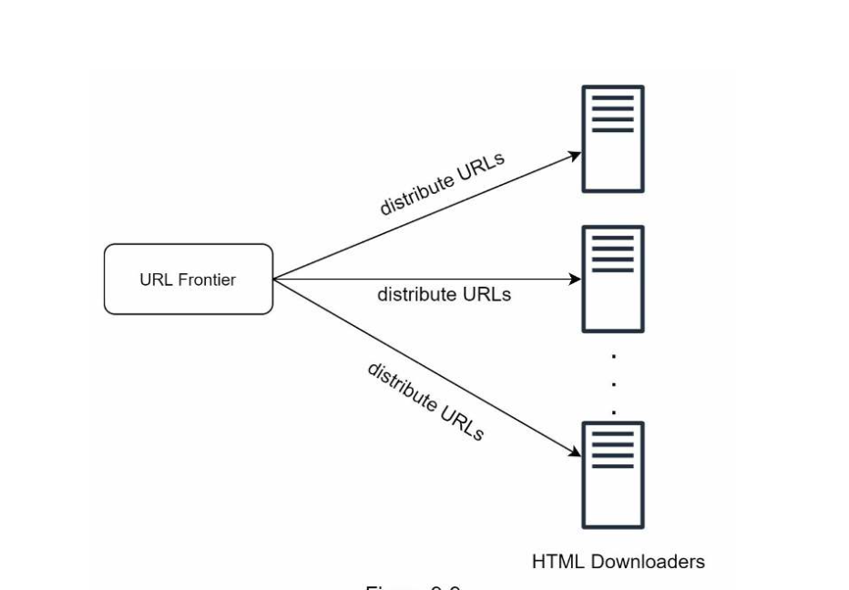

| English | Vietnamese |
|---------|------------|
| 2. Cache DNS Resolver | 2. Bộ nhớ đệm Bộ phân giải DNS |
| DNS Resolver is a bottleneck for crawlers because DNS requests might take time due to the synchronous nature of many DNS interfaces. | Bộ phân giải DNS là một điểm nghẽn cho các trình thu thập dữ liệu vì các yêu cầu DNS có thể mất thời gian do tính chất đồng bộ của nhiều giao diện DNS. |
| DNS response time ranges from 10ms to 200ms. | Thời gian phản hồi DNS dao động từ 10ms đến 200ms. |
| Once a request to DNS is carried out by a crawler thread, other threads are blocked until the first request is completed. | Khi một yêu cầu DNS được thực hiện bởi một luồng thu thập dữ liệu, các luồng khác sẽ bị chặn cho đến khi yêu cầu đầu tiên hoàn tất. |
| Maintaining our DNS cache to avoid calling DNS frequently is an effective technique for speed optimization. | Duy trì bộ nhớ đệm DNS để tránh gọi DNS thường xuyên là một kỹ thuật hiệu quả để tối ưu hóa tốc độ. |
| Our DNS cache keeps the domain name to IP address mapping and is updated periodically by cron jobs. | Bộ nhớ đệm DNS của chúng tôi lưu trữ ánh xạ từ tên miền sang địa chỉ IP và được cập nhật định kỳ bởi các cron jobs. |
| 3. Locality | 3. Tính địa phương |
| Distribute crawl servers geographically. | Phân phối các máy chủ thu thập dữ liệu theo vị trí địa lý. |
| When crawl servers are closer to website hosts, crawlers experience faster download time. | Khi các máy chủ thu thập dữ liệu gần với máy chủ website, quá trình tải xuống sẽ nhanh hơn. |
| Design locality applies to most of the system components: crawl servers, cache, queue, storage, etc. | Thiết kế tính địa phương áp dụng cho hầu hết các thành phần hệ thống: máy chủ thu thập dữ liệu, bộ nhớ đệm, hàng đợi, lưu trữ, v.v. |
| 4. Short timeout | 4. Giới hạn thời gian ngắn |
| Some web servers respond slowly or may not respond at all. | Một số máy chủ web phản hồi chậm hoặc có thể không phản hồi. |
| To avoid long wait time, a maximal wait time is specified. | Để tránh thời gian chờ lâu, một giới hạn thời gian tối đa được chỉ định. |
| If a host does not respond within a predefined time, the crawler will stop the job and crawl some other pages. | Nếu một máy chủ không phản hồi trong thời gian định trước, trình thu thập dữ liệu sẽ dừng công việc và thu thập các trang khác. |
| Robustness | Độ bền vững |
| Besides performance optimization, robustness is also an important consideration. | Ngoài việc tối ưu hóa hiệu suất, độ bền vững cũng là một yếu tố quan trọng cần xem xét. |
| We present a few approaches to improve the system robustness: | Chúng tôi trình bày một số cách tiếp cận để cải thiện độ bền vững của hệ thống: |
| • Consistent hashing: This helps to distribute loads among downloaders. | • Băm nhất quán: Điều này giúp phân phối tải giữa các trình tải xuống. |
| A new downloader server can be added or removed using consistent hashing. | Một máy chủ tải xuống mới có thể được thêm hoặc gỡ bỏ bằng cách sử dụng băm nhất quán. |
| Refer to Chapter 5: Design consistent hashing for more details. | Tham khảo Chương 5: Thiết kế băm nhất quán để biết thêm chi tiết. |
| • Save crawl states and data: To guard against failures, crawl states and data are written to a storage system. | • Lưu trạng thái và dữ liệu thu thập: Để chống lại sự cố, trạng thái và dữ liệu thu thập được ghi vào hệ thống lưu trữ. |
| A disrupted crawl can be restarted easily by loading saved states and data. | Một quá trình thu thập bị gián đoạn có thể được khởi động lại dễ dàng bằng cách tải các trạng thái và dữ liệu đã lưu. |
| • Exception handling: Errors are inevitable and common in a large-scale system. | • Xử lý ngoại lệ: Lỗi là điều không thể tránh khỏi và phổ biến trong một hệ thống quy mô lớn. |
| The crawler must handle exceptions gracefully without crashing the system. | Trình thu thập dữ liệu phải xử lý ngoại lệ một cách khéo léo mà không làm sập hệ thống. |
| • Data validation: This is an important measure to prevent system errors. | • Xác thực dữ liệu: Đây là một biện pháp quan trọng để ngăn ngừa lỗi hệ thống. |
| Extensibility | Khả năng mở rộng |
| As almost every system evolves, one of the design goals is to make the system flexible enough to support new content types. | Vì hầu hết các hệ thống đều phát triển, một trong những mục tiêu thiết kế là làm cho hệ thống đủ linh hoạt để hỗ trợ các loại nội dung mới. |
| The crawler can be extended by plugging in new modules. | Trình thu thập dữ liệu có thể được mở rộng bằng cách thêm các mô-đun mới. |
| Figure 9-10 shows how to add new modules. | Hình 9-10 minh họa cách thêm các mô-đun mới. |

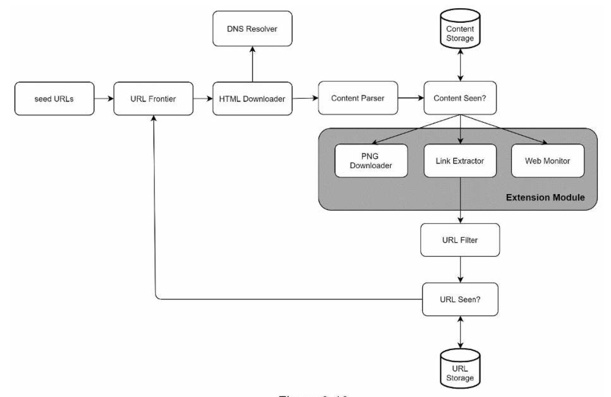

| English | Vietnamese |
|---------|------------|
| PNG Downloader module is plugged-in to download PNG files. | Mô-đun PNG Downloader được cài đặt để tải xuống các tệp PNG. |
| Web Monitor module is added to monitor the web and prevent copyright and trademark infringements. | Mô-đun Web Monitor được thêm vào để giám sát web và ngăn chặn vi phạm bản quyền và nhãn hiệu. |
| Detect and avoid problematic content | Phát hiện và tránh nội dung có vấn đề |
| This section discusses the detection and prevention of redundant, meaningless, or harmful content. | Phần này thảo luận về việc phát hiện và ngăn chặn nội dung dư thừa, vô nghĩa hoặc có hại. |
| 1. Redundant content | 1. Nội dung dư thừa |
| As discussed previously, nearly 30% of the web pages are duplicates. Hashes or checksums help to detect duplication [11]. | Như đã thảo luận trước đó, gần 30% trang web là bản sao. Hashes hoặc checksums giúp phát hiện trùng lặp [11]. |
| 2. Spider traps | 2. Bẫy spider |
| A spider trap is a web page that causes a crawler in an infinite loop. For instance, an infinite deep directory structure is listed as follows: | Bẫy spider là một trang web khiến crawler rơi vào vòng lặp vô hạn. Ví dụ, một cấu trúc thư mục lặp vô hạn như sau: |
| www.spidertrapexample.com/foo/bar/foo/bar/foo/bar/… | www.spidertrapexample.com/foo/bar/foo/bar/foo/bar/… |
| Such spider traps can be avoided by setting a maximal length for URLs. However, no one-size-fits-all solution exists to detect spider traps. | Những bẫy spider như vậy có thể tránh bằng cách đặt độ dài tối đa cho URL. Tuy nhiên, không có giải pháp chung cho tất cả để phát hiện bẫy spider. |
| Websites containing spider traps are easy to identify due to an unusually large number of web pages discovered on such websites. | Các trang web chứa bẫy spider có thể dễ dàng được xác định do số lượng trang web được phát hiện bất thường lớn. |
| It is hard to develop automatic algorithms to avoid spider traps; however, a user can manually verify and identify a spider trap, and either exclude those websites from the crawler or apply some customized URL filters. | Khó phát triển thuật toán tự động để tránh bẫy spider; tuy nhiên, người dùng có thể thủ công xác minh và nhận diện bẫy spider, rồi loại trừ các trang web đó khỏi crawler hoặc áp dụng một số bộ lọc URL tùy chỉnh. |
| 3. Data noise | 3. Nhiễu dữ liệu |
| Some of the contents have little or no value, such as advertisements, code snippets, spam URLs, etc. | Một số nội dung có ít hoặc không có giá trị, chẳng hạn như quảng cáo, đoạn mã, URL spam, v.v. |
| Those contents are not useful for crawlers and should be excluded if possible. | Những nội dung đó không hữu ích cho crawler và nên được loại trừ nếu có thể. |
| English | Vietnamese |
|---------|------------|
| Step 4 - Wrap up | Bước 4 - Tổng kết |
| In this chapter, we first discussed the characteristics of a good crawler: scalability, politeness, extensibility, and robustness. Then, we proposed a design and discussed key components. | Trong chương này, trước tiên chúng ta đã thảo luận về các đặc điểm của một trình thu thập dữ liệu (crawler) tốt: khả năng mở rộng, sự lịch sự, khả năng mở rộng chức năng và tính mạnh mẽ. Sau đó, chúng ta đã đề xuất một thiết kế và thảo luận các thành phần chính. |
| Building a scalable web crawler is not a trivial task because the web is enormously large and full of traps. | Xây dựng một trình thu thập dữ liệu web có khả năng mở rộng không phải là một nhiệm vụ đơn giản vì web cực kỳ lớn và đầy rẫy những cạm bẫy. |
| Even though we have covered many topics, we still miss many relevant talking points: | Mặc dù chúng ta đã đề cập đến nhiều chủ đề, nhưng vẫn còn bỏ sót nhiều điểm quan trọng liên quan: |
| • Server-side rendering: Numerous websites use scripts like JavaScript, AJAX, etc to generate links on the fly. If we download and parse web pages directly, we will not be able to retrieve dynamically generated links. To solve this problem, we perform server-side rendering (also called dynamic rendering) first before parsing a page [12]. | • Kết xuất phía máy chủ (Server-side rendering): Nhiều trang web sử dụng các script như JavaScript, AJAX, v.v. để tạo liên kết động. Nếu chúng ta tải xuống và phân tích các trang web trực tiếp, sẽ không thể lấy được các liên kết được tạo động. Để giải quyết vấn đề này, chúng ta thực hiện kết xuất phía máy chủ (còn gọi là kết xuất động) trước khi phân tích một trang [12]. |
| • Filter out unwanted pages: With finite storage capacity and crawl resources, an anti-spam component is beneficial in filtering out low quality and spam pages [13] [14]. | • Lọc bỏ các trang không mong muốn: Với dung lượng lưu trữ và tài nguyên thu thập dữ liệu có hạn, một thành phần chống spam sẽ hữu ích trong việc lọc bỏ các trang chất lượng thấp và spam [13] [14]. |
| • Database replication and sharding: Techniques like replication and sharding are used to improve the data layer availability, scalability, and reliability. | • Sao chép và phân mảnh cơ sở dữ liệu: Các kỹ thuật như sao chép (replication) và phân mảnh (sharding) được sử dụng để cải thiện khả năng sẵn sàng, khả năng mở rộng và độ tin cậy của tầng dữ liệu. |
| • Horizontal scaling: For large scale crawl, hundreds or even thousands of servers are needed to perform download tasks. The key is to keep servers stateless. | • Mở rộng theo chiều ngang (Horizontal scaling): Đối với thu thập dữ liệu quy mô lớn, cần hàng trăm hoặc thậm chí hàng nghìn máy chủ để thực hiện các tác vụ tải xuống. Điều quan trọng là giữ cho các máy chủ không lưu trạng thái (stateless). |
| • Availability, consistency, and reliability: These concepts are at the core of any large system’s success. We discussed these concepts in detail in Chapter 1. Refresh your memory on these topics. | • Khả dụng, nhất quán và độ tin cậy: Đây là những khái niệm cốt lõi cho sự thành công của bất kỳ hệ thống lớn nào. Chúng ta đã thảo luận chi tiết về những khái niệm này trong Chương 1. Hãy ôn lại những nội dung đó. |
| • Analytics: Collecting and analyzing data are important parts of any system because data is key ingredient for fine-tuning. | • Phân tích (Analytics): Việc thu thập và phân tích dữ liệu là những phần quan trọng của bất kỳ hệ thống nào vì dữ liệu là thành phần then chốt để tinh chỉnh hệ thống. |
| Congratulations on getting this far! Now give yourself a pat on the back. Good job! | Chúc mừng bạn đã đi đến bước này! Hãy tự thưởng cho mình một lời khen. Làm tốt lắm! |
